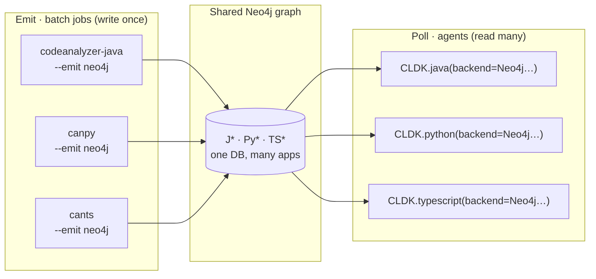

import { Tabs, TabItem, Steps, Aside, LinkCard, CardGrid, Badge } from "@astrojs/starlight/components";

In the [default workflow](/quickstart/), CLDK runs the analysis in-process: you point `CLDK.java(...)` at a project, the backend parses it, and the typed models live in memory for the lifetime of that object. That is the right model for a single project on a single machine.

It does not fit a fleet. When you have hundreds of repositories across several languages, and agents that need to answer structural questions about any of them at any time, re-analyzing on every request is wasteful, and holding every project in memory is impossible.

CLDK supports a second model for exactly this case. **Analysis and querying are split into two phases that scale independently:**

1. **Emit** — each `codeanalyzer-*` backend projects its analysis into a **Neo4j property graph** instead of a JSON file. This is the expensive, batchable step; run it once per project (and incrementally thereafter), wherever you have compute.
2. **Poll** — the CLDK SDK connects to that graph as a **read-only Cypher client**. No source is parsed at query time; the `analysis` object answers from the graph. This is the cheap, horizontally-scalable step that your agents run.

Because every language's graph shares one database, agents get **multi-lingual, multi-project program analysis** behind the same `analysis` API they already use.



<Aside type="tip" title="Where this runs">
The two phases are independent processes. The emit jobs typically run on a schedule (a CI pipeline or a Kubernetes `CronJob`); the agents run as long-lived services that only read. See [Deploy on Kubernetes](/at-scale/kubernetes/) for a concrete topology, with Odoo as the worked example.
</Aside>

## One graph, every language, every project

Each backend writes a **namespaced** label set so multiple languages share a single database without collisions. Java labels are `J*` / `J_*`, Python `Py*` / `PY_*`, TypeScript `TS*` / `TS_*`:

| Language | App anchor | Module node | Symbol node (merge label) | Call edge |
| --- | --- | --- | --- | --- |
| Java | `:JApplication` | `:JCompilationUnit` | `:JSymbol` → `:JType` / `:JCallable` | `:J_CALLS` |
| Python | `:PyApplication` | `:PyModule` | `:PySymbol` → `:PyClass` / `:PyCallable` / `:PyExternal` | `:PY_CALLS` |
| TypeScript | `:TSApplication` | `:TSModule` | `:TSSymbol` → `:TSClass` … `:TSExternal` | `:TS_CALLS` |

Within a language, **multiple projects** coexist too. Every node is scoped to an application anchor identified by its `--app-name`, so one database can hold `payments-service`, `web-frontend`, and `billing-core` side by side. On the read side, `application_name` selects which one a query sees.

<Aside type="note" title="Languages supported">
The Neo4j emit/poll path is implemented for **Java, Python, and TypeScript**. C is analyzed in-process only — it has no Neo4j backend.
</Aside>

## Phase 1 — Emit a graph

Every backend takes the same `--emit neo4j` flag. With `--neo4j-uri` set it pushes to a live database over Bolt; without it, it writes a self-contained `graph.cypher` snapshot you can load with `cypher-shell`. Connection settings also read the `NEO4J_URI`, `NEO4J_USERNAME`, `NEO4J_PASSWORD`, and `NEO4J_DATABASE` environment variables; an explicit flag wins over the environment.

<Tabs syncKey="lang">
  <TabItem label="Java">
    ```bash title="Java → Neo4j (live Bolt push)"
    # -a 2 includes call edges (:J_CALLS); -a 1 is symbol table only.
    codeanalyzer -i ./payments-service -a 2 --emit neo4j \
      --app-name payments-service \
      --neo4j-uri bolt://localhost:7687 \
      --neo4j-user neo4j --neo4j-password "$NEO4J_PASSWORD"
    ```

    ```bash title="Java → graph.cypher snapshot (no live DB)"
    codeanalyzer -i ./payments-service -a 2 --emit neo4j -o ./out
    cypher-shell -u neo4j -p "$NEO4J_PASSWORD" < ./out/graph.cypher
    ```
  </TabItem>
  <TabItem label="Python">
    ```bash title="Python → Neo4j (live Bolt push)"
    canpy -i ./billing-core --emit neo4j \
      --app-name billing-core \
      --neo4j-uri bolt://localhost:7687 \
      --neo4j-user neo4j --neo4j-password "$NEO4J_PASSWORD"
    ```

    ```bash title="Python → graph.cypher snapshot"
    canpy -i ./billing-core --emit neo4j -o ./out   # -> ./out/graph.cypher
    cypher-shell -u neo4j -p "$NEO4J_PASSWORD" < ./out/graph.cypher
    ```
  </TabItem>
  <TabItem label="TypeScript">
    ```bash title="TypeScript → Neo4j (live Bolt push)"
    cants -i ./web-frontend -a 2 --emit neo4j \
      --app-name web-frontend \
      --neo4j-uri bolt://localhost:7687 \
      --neo4j-user neo4j --neo4j-password "$NEO4J_PASSWORD"
    ```

    ```bash title="TypeScript → graph.cypher snapshot"
    cants -i ./web-frontend -a 2 --emit neo4j -o ./out   # -> ./out/graph.cypher
    cypher-shell -u neo4j -p "$NEO4J_PASSWORD" < ./out/graph.cypher
    ```
  </TabItem>
</Tabs>

### Writes are idempotent and incremental

Re-running a job is safe and cheap, which is what makes a scheduled fleet practical:

- **Idempotent** — both writers create the schema constraints and indexes first, then upsert with `MERGE` (never blind `CREATE`). Re-emitting the same project produces the same graph.
- **Incremental** — a live Bolt push diffs each module against the graph by content hash and rewrites **only what changed**. On a full run, modules whose source file disappeared are pruned, scoped to that application's anchor so a shared database stays consistent.
- **Index-backed** — constraints exist before any `MERGE`, so every upsert is an index seek rather than a scan, even as the database grows.

### A versioned schema contract

Each backend can emit its graph schema as a machine-readable, version-stamped contract with `--emit schema` (no project needed). The `schema_version` is also stamped on every graph's `:*Application` node, so a consumer can check compatibility before querying.

```bash title="Export the schema contract"
codeanalyzer --emit schema -o ./out   # -> ./out/schema.neo4j.json
canpy        --emit schema -o ./out   # -> ./out/schema.json
cants        --emit schema -o ./out   # -> ./out/schema.json
```

## Phase 2 — Poll the graph

On the read side, nothing about the `analysis` API changes. You pass a `Neo4jConnectionConfig` as `backend=` and the SDK selects the read-only Cypher backend by config type. `project_path` is **optional** in this mode (no source is read); `application_name` selects which project in the database the queries see.

<Tabs syncKey="lang">
  <TabItem label="Java">
    ```python title="Query a Java graph"
    from cldk import CLDK
    from cldk.analysis.commons.backend_config import Neo4jConnectionConfig

    analysis = CLDK.java(
        backend=Neo4jConnectionConfig(
            uri="bolt://neo4j:7687",
            username="reader",          # read-only credentials are enough
            password="…",
            application_name="payments-service",
        ),
    )

    classes = analysis.get_classes()      # -> dict[str, JType], straight from the graph
    cg = analysis.get_call_graph()        # -> networkx.DiGraph
    ```
  </TabItem>
  <TabItem label="Python">
    ```python title="Query a Python graph"
    from cldk import CLDK
    from cldk.analysis.commons.backend_config import Neo4jConnectionConfig

    analysis = CLDK.python(
        backend=Neo4jConnectionConfig(
            uri="bolt://neo4j:7687",
            username="reader",
            password="…",
            application_name="billing-core",
        ),
    )

    callers = analysis.get_callers("billing_core.invoice.Invoice", "finalize")
    ```
  </TabItem>
  <TabItem label="TypeScript">
    ```python title="Query a TypeScript graph"
    from cldk import CLDK
    from cldk.analysis.commons.backend_config import Neo4jConnectionConfig

    analysis = CLDK.typescript(
        backend=Neo4jConnectionConfig(
            uri="bolt://neo4j:7687",
            username="reader",
            password="…",
            application_name="web-frontend",
        ),
    )

    cg = analysis.get_call_graph()        # -> networkx.DiGraph
    ```
  </TabItem>
</Tabs>

The Neo4j backends (`JNeo4jBackend`, `PyNeo4jBackend`, `TSNeo4jBackend`) expose the **same method surface** as the in-process backends, so existing query code is a drop-in: only the `backend=` argument changes.

<Steps>
1. Install the optional driver: `pip install cldk[neo4j]` (it pulls `neo4j>=5.14`). The driver is an extra, not a core dependency.
2. Point `Neo4jConnectionConfig.uri` at your Bolt endpoint and set `application_name` to the project you want to query.
3. Call the usual `get_classes`, `get_call_graph`, `get_callers`, `get_callees`, and related methods. The graph answers; no source is parsed.
</Steps>

<Aside type="caution" title="What “at scale” does and doesn’t mean here">
Scale here comes from **architecture**, not tuning knobs: idempotent index-backed `MERGE`, content-hash incrementality, and the freedom to fan emit jobs out horizontally. The writers do **not** expose a configurable batch size or `PERIODIC COMMIT`, and a **targeted run** (`--target-files`) skips orphan pruning, so deleted files are only cleaned up on a full run. Plan your jobs as periodic full runs with incremental pushes in between.
</Aside>

## See also

<CardGrid>
  <LinkCard title="Deploy on Kubernetes" href="/at-scale/kubernetes/" description="A Job/CronJob emit topology and the Odoo multi-lingual walkthrough." />
  <LinkCard title="codeanalyzer-java" href="/backends/codeanalyzer-java/" description="The backend that emits the J* graph." />
  <LinkCard title="codeanalyzer-python" href="/backends/codeanalyzer-python/" description="The backend that emits the Py* graph." />
  <LinkCard title="codeanalyzer-ts" href="/backends/codeanalyzer-ts/" description="The backend that emits the TS* graph." />
</CardGrid>
