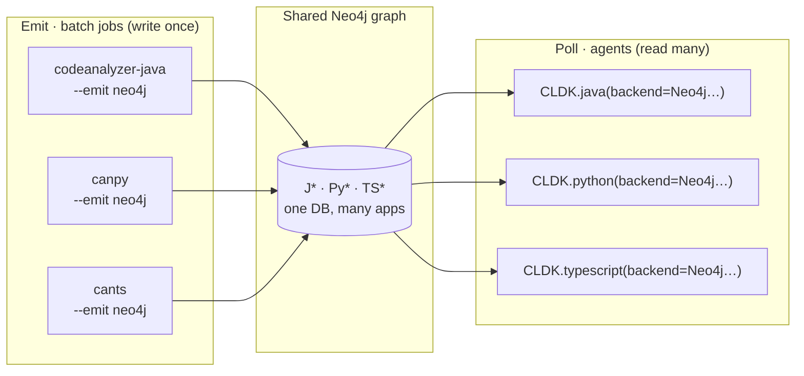

import { Tabs, TabItem, Steps, Aside, LinkCard, CardGrid } from "@astrojs/starlight/components";

In the [default workflow](/quickstart/), CLDK runs the analysis in-process. You point `CLDK.java(...)` at a project. The backend parses it, and the typed models stay in memory for the life of that object. This model is correct for a single project on a single machine.

It does not fit a fleet. A fleet has hundreds of repositories in several languages, and agents that answer structural questions about any of them at any time. A new analysis on every request wastes work. Every project in memory at once is impossible.

CLDK has a second model for this case. **It splits analysis and querying into two phases that scale independently:**

1. **Emit.** Each `codeanalyzer-*` backend projects its analysis into a **Neo4j property graph** instead of a JSON file. This step is expensive, and you can batch it. Run it once for each project. Then run it incrementally, wherever you have compute.
2. **Poll.** The CLDK SDK connects to that graph as a **read-only Cypher client**. It parses no source at query time. The `analysis` object answers from the graph. This step is cheap, it scales horizontally, and your agents run it.

Every language shares one database. Agents therefore get **multi-lingual, multi-project program analysis** behind the same `analysis` API that they already use.



<Aside type="tip" title="Where this runs">
The two phases are independent processes. The emit jobs usually run on a schedule, in a CI pipeline or a Kubernetes `CronJob`. The agents run as long-lived services that only read. See [Deploy on Kubernetes](/at-scale/kubernetes/) for a concrete topology, with Odoo as the worked example.
</Aside>

## One graph, every language, every project

Each backend writes a **namespaced** label set so multiple languages share a single database without collisions. Java labels are `J*` and `J_*`. Python labels are `Py*` and `PY_*`. TypeScript labels are `TS*` and `TS_*`, plus a few unprefixed labels (`CanNode`, `Application`, `Artifact`, `Package`, and `ConfigKey`):

| Language | App anchor | Module node | Symbol node (merge label) | Call edge |
| --- | --- | --- | --- | --- |
| Java | `:JApplication` | `:JCompilationUnit` | `:JSymbol` → `:JType` / `:JCallable` | `:J_CALLS` |
| Python | `:PyApplication` | `:PyModule` | `:PySymbol` → `:PyClass` / `:PyCallable` / `:PyExternal` | `:PY_CALLS` |
| TypeScript | `:TSApplication` | `:TSModule` | `:CanNode` → `:TSClass` / `:TSCallable` / `:TSExternal` | `:TS_CALLS` |

Within a language, **multiple projects** also coexist. Each backend scopes every node to an application anchor, which `--app-name` identifies. One database can therefore hold `payments-service`, `web-frontend`, and `billing-core` side by side. On the read side, `application_name` selects the one that a query sees.

**External (phantom) nodes.** The Python and TypeScript graphs add `:PyExternal` and `:TSExternal` nodes for call targets *outside* the analyzed app. These targets are third-party libraries, the standard library, and Node built-ins. Call edges therefore never dangle.

External nodes carry no `_module`, and they are shared, not owned by one app. A query can therefore see that an app calls `os.path.join` or `node:crypto.createHash`, even though those are not part of its source.

<Aside type="note" title="Languages supported">
The Neo4j emit and poll path works for **Java, Python, and TypeScript**.
</Aside>

## Phase 1 — Emit a graph

Every backend takes the same `--emit neo4j` flag. `cants` rejects an `-a` value above 1 together with `--emit neo4j`, because it always projects the graph at full depth. If you set `--neo4j-uri`, the backend pushes to a live database over Bolt. If you do not, it writes a self-contained `graph.cypher` snapshot that you load with `cypher-shell`.

The two modes differ in more than destination. The live Bolt push is content-hash incremental: it rewrites only the changed modules, and it prunes orphans on a full run. The `graph.cypher` snapshot erases and rebuilds the whole subgraph of that application every time you apply it.

The backend also reads the connection values from the `NEO4J_URI`, `NEO4J_USERNAME`, `NEO4J_PASSWORD`, and `NEO4J_DATABASE` environment variables. An explicit flag wins over the environment.

<Tabs syncKey="lang">
  <TabItem label="Java">
    ```bash title="Java → Neo4j (live Bolt push)"
    # -a 2 includes call edges (:J_CALLS); -a 1 is symbol table only.
    canjv -i ./payments-service -a 2 --emit neo4j \
      --app-name payments-service \
      --neo4j-uri bolt://localhost:7687 \
      --neo4j-user neo4j --neo4j-password "$NEO4J_PASSWORD"
    ```

    ```bash title="Java → graph.cypher snapshot (no live DB)"
    canjv -i ./payments-service -a 2 --emit neo4j -o ./out
    cypher-shell -u neo4j -p "$NEO4J_PASSWORD" < ./out/graph.cypher
    ```
  </TabItem>
  <TabItem label="Python">
    ```bash title="Python → Neo4j (live Bolt push)"
    canpy -i ./billing-core --emit neo4j \
      --app-name billing-core \
      --neo4j-uri bolt://localhost:7687 \
      --neo4j-user neo4j --neo4j-password "$NEO4J_PASSWORD"
    ```

    ```bash title="Python → graph.cypher snapshot"
    canpy -i ./billing-core --emit neo4j -o ./out   # -> ./out/graph.cypher
    cypher-shell -u neo4j -p "$NEO4J_PASSWORD" < ./out/graph.cypher
    ```
  </TabItem>
  <TabItem label="TypeScript">
    ```bash title="TypeScript → Neo4j (live Bolt push)"
    cants -i ./web-frontend --emit neo4j \
      --app-name web-frontend \
      --neo4j-uri bolt://localhost:7687 \
      --neo4j-user neo4j --neo4j-password "$NEO4J_PASSWORD"
    ```

    ```bash title="TypeScript → graph.cypher snapshot"
    cants -i ./web-frontend --emit neo4j -o ./out   # -> ./out/graph.cypher
    cypher-shell -u neo4j -p "$NEO4J_PASSWORD" < ./out/graph.cypher
    ```
  </TabItem>
</Tabs>

### Writes are idempotent and incremental

A repeated job is safe and cheap. This is what makes a scheduled fleet practical:

- **Idempotent.** Both writers create the schema constraints and indexes first, then upsert with `MERGE`, never a blind `CREATE`. The same project always produces the same graph.
- **Incremental.** A live Bolt push diffs each module against the graph by content hash. It rewrites **only what changed**. On a full run, it prunes the modules whose source file is gone. The Python writer scopes this prune to the anchor of the application, so other apps in a shared database are safe. The TypeScript writer scopes its prune to the `can://<app>/` prefix of the application, and it prunes only on a full run with `--eager`. The Java writer prunes any compilation unit that is absent from the current run, for every app. On a shared instance, give each Java application its own Neo4j database, so a full run for app B never removes app A.
- **Index-backed.** Constraints exist before any `MERGE`, so every upsert is an index seek, not a scan, even as the database grows.

### A versioned schema contract

Each backend can emit its graph schema as a machine-readable, version-stamped contract with `--emit schema`. This command needs no project. Each backend also stamps `schema_version` on the `:*Application` node of every graph. A consumer can therefore make sure that the schema is compatible before it queries.

Read it back for each application with `MATCH (a:JApplication {name: $app}) RETURN a.schema_version`. Use `:PyApplication` or `:TSApplication` for the other languages. Each backend versions its schema on its own, so pin the contract that you generated against. Do not assume one shared version.

```bash title="Export the schema contract"
codeanalyzer --emit schema -o ./out   # -> ./out/schema.neo4j.json
canpy        --emit schema -o ./out   # -> ./out/schema.json
cants        --emit schema -o ./out   # -> ./out/schema.json
```

## Phase 2 — Poll the graph

On the read side, nothing about the `analysis` API changes. You pass a `Neo4jConnectionConfig` as `backend=`, and the SDK selects the read-only Cypher backend by configuration type. `project_path` is **optional** in this mode, because CLDK reads no source. `application_name` selects the project in the database that the queries see.

<Tabs syncKey="lang">
  <TabItem label="Java">
    ```python title="Query a Java graph"
    from cldk import CLDK
    from cldk.analysis.commons.backend_config import Neo4jConnectionConfig

    analysis = CLDK.java(
        backend=Neo4jConnectionConfig(
            uri="bolt://neo4j:7687",
            username="reader",          # read-only credentials are enough
            password="…",
            application_name="payments-service",
        ),
    )

    classes = analysis.get_classes()      # -> dict[str, JType], straight from the graph
    cg = analysis.get_call_graph()        # -> networkx.DiGraph
    ```
  </TabItem>
  <TabItem label="Python">
    ```python title="Query a Python graph"
    from cldk import CLDK
    from cldk.analysis.commons.backend_config import Neo4jConnectionConfig

    analysis = CLDK.python(
        backend=Neo4jConnectionConfig(
            uri="bolt://neo4j:7687",
            username="reader",
            password="…",
            application_name="billing-core",
        ),
    )

    callers = analysis.get_callers("billing_core.invoice.Invoice", "finalize")
    ```
  </TabItem>
  <TabItem label="TypeScript">
    ```python title="Query a TypeScript graph"
    from cldk import CLDK
    from cldk.analysis.commons.backend_config import Neo4jConnectionConfig

    analysis = CLDK.typescript(
        backend=Neo4jConnectionConfig(
            uri="bolt://neo4j:7687",
            username="reader",
            password="…",
            application_name="web-frontend",
        ),
    )

    cg = analysis.get_call_graph()        # -> networkx.DiGraph
    ```
  </TabItem>
</Tabs>

The Neo4j backends (`JNeo4jBackend`, `PyNeo4jBackend`, `TSNeo4jBackend`) give you the **same method surface** as the in-process backends, with a few documented exceptions. For example, `get_all_comments` and `get_comment_in_file` raise on the Java Neo4j backend, because the graph holds one docstring per declaration and no file-level comments. Most existing query code works without a change. Only the `backend=` argument changes.

<Steps>
1. Install the optional driver: `pip install cldk[neo4j]`. It installs `neo4j>=5.14`. The driver is an extra, not a core dependency.
2. Point `Neo4jConnectionConfig.uri` at your Bolt endpoint and set `application_name` to the project you want to query.
3. Call the usual `get_classes`, `get_call_graph`, `get_callers`, `get_callees`, and related methods. The graph answers, and CLDK parses no source.
</Steps>

## Query the graph directly with Cypher

The `analysis` API covers the common structural questions. The graph is also a full Neo4j property graph. An agent can reach anything that the API does not model with raw Cypher over the same Bolt endpoint. The label namespacing is the query contract. Scope by the `:*Application` anchor and the language prefix.

**Discover what a shared database holds.** The SDK expects you to know the `application_name` first. The Neo4j backends raise an error when it is missing, and they have no enumeration method. An inventory is therefore its own Cypher query:

```cypher
MATCH (a)
WHERE a:JApplication OR a:PyApplication OR a:TSApplication
RETURN labels(a)[0] AS language, a.name AS app, a.schema_version
```

**Full-text code search.** Every backend creates a Neo4j full-text index over the `code` and `docstring` of each callable. Each language names its index differently: `j_code_fts`, `py_code_fts`, and `ts_code_fts`. The CLDK API does not wrap it, so reach it over Bolt:

```cypher
CALL db.index.fulltext.queryNodes('py_code_fts', 'jwt OR authenticate') YIELD node, score
RETURN node.signature, score ORDER BY score DESC LIMIT 20
```

**Java entry points and CRUD.** The Java `analysis` object answers `get_entry_point_methods()` from the graph with no new parse. The CRUD accessors (`get_all_crud_operations()` and its create, read, update, and delete variants) raise at 2.0.0-rc.7. The SDK reads no CRUD operations from codeanalyzer-java 3.0.1 or newer. See the [Java API reference](/reference/python-api/java/).

<Aside type="caution" title="What at-scale means here">
Scale here comes from **architecture**, not from tuning knobs. The parts are an idempotent index-backed `MERGE`, content-hash incrementality, and emit jobs that you can run in parallel. The writers do **not** have a configurable batch size or `PERIODIC COMMIT`. A **targeted run** (`--target-files` on Java and TypeScript, `--file-name` on `canpy`) skips orphan pruning, so only a full run removes deleted files. The TypeScript writer also needs `--eager` on that full run. Plan your jobs as periodic full runs, with incremental pushes between them.
</Aside>

## See also

<CardGrid>
  <LinkCard title="Deploy on Kubernetes" href="/at-scale/kubernetes/" description="A Job/CronJob emit topology and the Odoo multi-lingual walkthrough." />
  <LinkCard title="codeanalyzer-java" href="/backends/codeanalyzer-java/" description="The backend that emits the J* graph." />
  <LinkCard title="codeanalyzer-python" href="/backends/codeanalyzer-python/" description="The backend that emits the Py* graph." />
  <LinkCard title="codeanalyzer-ts" href="/backends/codeanalyzer-ts/" description="The backend that emits the TS* graph." />
</CardGrid>
