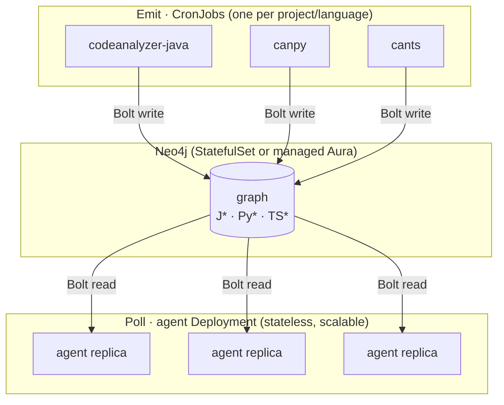

import { Tabs, TabItem, Steps, Aside, LinkCard, CardGrid } from "@astrojs/starlight/components";

The [emit/poll split](/at-scale/) maps cleanly onto Kubernetes. The expensive analysis becomes scheduled batch work, the database is a stateful service, and the agents are stateless readers that scale on demand.



Three roles:

- **Neo4j.** One database for the whole fleet. Run it as a `StatefulSet` with a `PersistentVolumeClaim`, or point at a managed instance such as Neo4j Aura. The emit jobs need write credentials. The agents need only read credentials.
- **Emit `CronJob`s.** One for each project, and one for each language in that project. They run on a schedule, push incrementally over Bolt, and exit. Writes are idempotent, so a missed run or a repeated run is harmless.
- **Agent `Deployment`.** Long-lived pods that build `analysis` objects against the graph with `Neo4jConnectionConfig`. They hold no analysis state, so you scale them horizontally like any other web service.

<Aside type="tip" title="Why CronJobs, not a sidecar">
The point is to keep analysis out of the request path. A model that analyzes again for each request cannot scale. A model that reads a precomputed graph can. Emit on a schedule, or start a job from CI on merge. Keep the read replicas thin.
</Aside>

<Aside type="tip" title="Eyeball the graph">
The emit step produces a real property graph. Point Neo4j Browser or Bloom at the same Bolt endpoint with read-only credentials to see the result. Scope to one app, for example: `MATCH (a:JApplication {name: 'payments-service'})-[:J_HAS_UNIT]->(:JCompilationUnit)-[:J_DECLARES_TYPE]->(t:JType) RETURN * LIMIT 50`.
</Aside>

## The emit CronJob

Each backend ships as a self-contained binary: `canjv` for Java, `canpy` for Python, and `cants` for TypeScript. An emit job is therefore a container with the binary, the source checkout, and the Neo4j connection in its environment. The backend reads the connection values from `NEO4J_URI`, `NEO4J_USERNAME`, and `NEO4J_PASSWORD`, so the command line carries no secrets.

```yaml title="emit-cronjob.yaml"
apiVersion: batch/v1
kind: CronJob
metadata:
  name: emit-billing-core
spec:
  schedule: "0 * * * *"            # hourly; incremental pushes are cheap
  concurrencyPolicy: Forbid
  jobTemplate:
    spec:
      template:
        spec:
          restartPolicy: Never
          containers:
            - name: canpy
              image: ghcr.io/your-org/cldk-emit-python:latest
              args:
                - canpy
                - -i
                - /src/billing-core
                - --emit
                - neo4j
                - --app-name
                - billing-core
              env:
                - name: NEO4J_URI
                  value: bolt://neo4j.cldk.svc.cluster.local:7687
                - name: NEO4J_USERNAME
                  value: writer
                - name: NEO4J_PASSWORD
                  valueFrom:
                    secretKeyRef:
                      name: neo4j-credentials
                      key: writer-password
              volumeMounts:
                - name: src
                  mountPath: /src
          volumes:
            - name: src                # a checkout sidecar, PVC, or initContainer git clone
              emptyDir: {}
```

Change the image and `args` for each language. Java uses `canjv -i /src/payments-service -a 2 --emit neo4j --app-name payments-service`. TypeScript uses `cants -i /src/web-frontend --emit neo4j --app-name web-frontend`. Point every job at the **same** `NEO4J_URI`. The `J*`, `Py*`, and `TS*` namespacing keeps them apart.

## The agent Deployment

The agents read with a read-only credential. You build the object the same way as in the [poll examples](/at-scale/#phase-2--poll-the-graph). Only two details are specific to Kubernetes: the URI is the in-cluster Neo4j `Service`, and the password comes from a `Secret`.

```python title="agent.py — constructed once per request handler"
import os
from cldk import CLDK
from cldk.analysis.commons.backend_config import Neo4jConnectionConfig

def analysis_for(app_name: str):
    return CLDK.python(
        backend=Neo4jConnectionConfig(
            uri=os.environ["NEO4J_URI"],
            username=os.environ["NEO4J_USERNAME"],   # reader
            password=os.environ["NEO4J_PASSWORD"],
            application_name=app_name,
        ),
    )
```

CLDK parses no source at query time, so an agent pod starts at once and answers from the graph. Scale the `replicas` of the `Deployment` to match the query load. The Neo4j connection pool and your read-replica topology absorb the load.

## Walkthrough: Odoo, end to end

[Odoo](https://github.com/odoo/odoo) is a good stress test for multi-project analysis at scale. It is large, and it is split into **hundreds of addon modules**, all Python. A real fleet rarely stops at one language. This walkthrough therefore pairs the Python addons of Odoo with a **TypeScript service** in the same graph, and queries both through one API.

<Aside type="note" title="Illustrative">
The commands below are real, and you can copy them. The counts and timings are typical of a large multi-module codebase. They make the workflow concrete, but they are illustrative, not measured.
</Aside>

<Aside type="note" title="The Odoo frontend is JavaScript, not TypeScript">
The Odoo web layer (OWL) is JavaScript with JSDoc. `cants` also analyzes JavaScript sources (`.js`, `.jsx`, `.mjs`, and `.cjs`), so it can analyze `web/static/src` in Odoo. This walkthrough needs a real TypeScript project as its second application. The TypeScript half of this walkthrough therefore uses a separate TypeScript service in the same fleet.
</Aside>

### 1. Emit both languages into one graph

Run one Python job over the Odoo addons and one TypeScript job over the storefront service. They use different `--app-name` values, so both land in the same database as separate application anchors. The namespaced labels keep the Python and TypeScript graphs apart, and an agent can query either one.

<Tabs syncKey="lang">
  <TabItem label="Python (Odoo addons)">
    ```bash title="canpy over the Odoo addons"
    canpy -i ./odoo/addons --emit neo4j \
      --app-name odoo \
      --neo4j-uri bolt://neo4j:7687 \
      --neo4j-user writer --neo4j-password "$NEO4J_PASSWORD"
    # -> writes :PyApplication {name: "odoo"} and its :PyModule / :PySymbol graph
    # -> ~hundreds of modules; subsequent runs only rewrite changed files
    ```
  </TabItem>
  <TabItem label="TypeScript (storefront service)">
    ```bash title="cants over a TypeScript service"
    cants -i ./storefront/src -a 2 --emit neo4j \
      --app-name storefront \
      --neo4j-uri bolt://neo4j:7687 \
      --neo4j-user writer --neo4j-password "$NEO4J_PASSWORD"
    # -> writes :TSApplication {name: "storefront"} and its :TSModule / :CanNode graph
    ```
  </TabItem>
</Tabs>

In a cluster these are two `CronJob`s on the same schedule. After the first full run, each later run is an incremental Bolt push. It rewrites only the modules whose content hash changed. The Python and TypeScript writers scope their prunes to the application anchor, so the two apps never touch each other. Keep two Java apps in separate databases (see the [prune note](/at-scale/#writes-are-idempotent-and-incremental)).

### 2. Query across modules and languages

An agent answers structural questions without a read of either source tree. Build one analysis for each app, anchored to its own `application_name`:

```python title="cross-module, cross-language query against the shared graph"
from cldk import CLDK
from cldk.analysis.commons.backend_config import Neo4jConnectionConfig

def connect(factory, app):
    return factory(
        backend=Neo4jConnectionConfig(
            uri="bolt://neo4j:7687",
            username="reader",
            password="…",
            application_name=app,
        ),
    )

py = connect(CLDK.python, "odoo")            # the Odoo addons graph
ts = connect(CLDK.typescript, "storefront")  # the TypeScript service graph

# "Which callables across all addons reach SaleOrder.action_confirm?"
# Signatures are rooted at the emit -i directory (./odoo/addons), so no "odoo.addons." prefix.
callers = py.get_callers("sale.models.sale_order.SaleOrder", "action_confirm")
# -> callers spread across the sale, stock, and account addons — one query, no per-addon parsing

# The same agent inspects the TypeScript service's call graph through the same API.
storefront_cg = ts.get_call_graph()   # -> networkx.DiGraph
```

The first query touched modules from several addons in one call. The agent then reached a second language through the same `analysis` vocabulary. This is the multi-lingual, multi-project result. A new analysis of these projects for every such question is not practical. A read of a precomputed graph is constant work.

<Aside type="caution" title="Operational notes">
Schedule the emit jobs as periodic **full** runs. A full run prunes the modules whose files were deleted. For `cants`, add `--eager` to the full run, because the TypeScript writer prunes only on an eager full run. Use the targeted-run flag of the backend (`--file-name <path>` for `canpy`, `--target-files <paths>` for `codeanalyzer` and `cants`) only for fast mid-cycle refreshes, because targeted runs skip orphan pruning. Give the agents a **read-only** Neo4j role. Keep the write credentials on the CronJobs alone.
</Aside>

## See also

<CardGrid>
  <LinkCard title="Analysis at scale" href="/at-scale/" description="The emit/poll architecture and the shared-graph schema." />
  <LinkCard title="Backends overview" href="/backends/" description="The codeanalyzer-* backends that emit the graph." />
  <LinkCard title="Cheat sheet" href="/resources/cheatsheet/" description="Backend-selection and method reference at a glance." />
</CardGrid>
