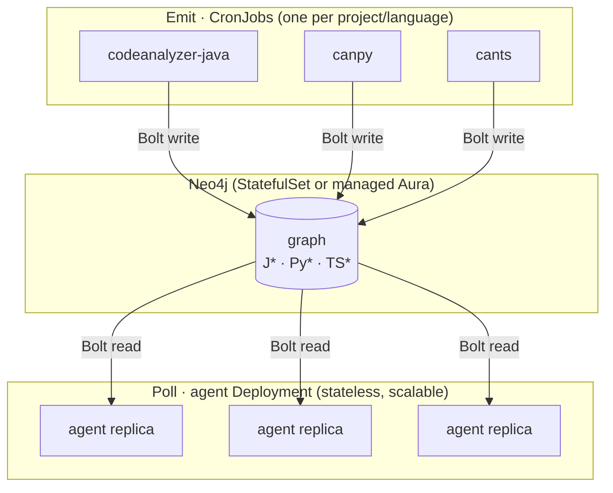

import { Tabs, TabItem, Steps, Aside, LinkCard, CardGrid } from "@astrojs/starlight/components";

The [emit/poll split](/at-scale/) maps cleanly onto Kubernetes. The expensive analysis becomes scheduled batch work, the database is a stateful service, and the agents are stateless readers that scale on demand.



Three roles:

- **Neo4j** — one database for the whole fleet. Run it as a `StatefulSet` with a `PersistentVolumeClaim`, or point at a managed instance (Neo4j Aura). The emit jobs need write credentials; the agents need only read credentials.
- **Emit `CronJob`s** — one per project (and per language within a project). They run on a schedule, push incrementally over Bolt, and exit. Because writes are idempotent, a missed or repeated run is harmless.
- **Agent `Deployment`** — long-lived pods that construct `analysis` objects against the graph with `Neo4jConnectionConfig`. They hold no analysis state, so you scale them horizontally like any other web service.

<Aside type="tip" title="Why CronJobs, not a sidecar">
Keeping analysis out of the request path is the point. A model that re-analyzes per request can't scale; one that reads a precomputed graph can. Emit on a schedule (or trigger a job from CI on merge), and let the read replicas stay thin.
</Aside>

<Aside type="tip" title="Eyeball the graph">
Because the emit step produces a real property graph, you can point Neo4j Browser (or Bloom) at the same Bolt endpoint with read-only credentials to see what landed. Scope to one app and run, e.g., `MATCH (a:JApplication {name: 'payments-service'})-[:J_HAS_UNIT]->(:JCompilationUnit)-[:J_DECLARES_TYPE]->(t:JType) RETURN * LIMIT 50`.
</Aside>

## The emit CronJob

Each backend ships as a self-contained binary (`codeanalyzer` for Java, `canpy` for Python, `cants` for TypeScript), so an emit job is a container that has the binary, the source checkout, and the Neo4j connection in its environment. Connection settings are read from `NEO4J_URI`, `NEO4J_USERNAME`, and `NEO4J_PASSWORD`, so the command line carries no secrets.

```yaml title="emit-cronjob.yaml"
apiVersion: batch/v1
kind: CronJob
metadata:
  name: emit-billing-core
spec:
  schedule: "0 * * * *"            # hourly; incremental pushes are cheap
  concurrencyPolicy: Forbid
  jobTemplate:
    spec:
      template:
        spec:
          restartPolicy: Never
          containers:
            - name: canpy
              image: ghcr.io/your-org/cldk-emit-python:latest
              args:
                - canpy
                - -i
                - /src/billing-core
                - --emit
                - neo4j
                - --app-name
                - billing-core
              env:
                - name: NEO4J_URI
                  value: bolt://neo4j.cldk.svc.cluster.local:7687
                - name: NEO4J_USERNAME
                  value: writer
                - name: NEO4J_PASSWORD
                  valueFrom:
                    secretKeyRef:
                      name: neo4j-credentials
                      key: writer-password
              volumeMounts:
                - name: src
                  mountPath: /src
          volumes:
            - name: src                # a checkout sidecar, PVC, or initContainer git clone
              emptyDir: {}
```

Swap the image and `args` per language — `codeanalyzer -i /src/payments-service -a 2 --emit neo4j --app-name payments-service` for Java, `cants -i /src/web-frontend -a 2 --emit neo4j --app-name web-frontend` for TypeScript. Point every job at the **same** `NEO4J_URI`; the `J*` / `Py*` / `TS*` namespacing keeps them from colliding.

## The agent Deployment

The agents read with a credential scoped to read-only. Construction is identical to the [poll examples](/at-scale/#phase-2--poll-the-graph) — the only Kubernetes-specific detail is that the URI is the in-cluster Neo4j `Service` and the password comes from a `Secret`.

```python title="agent.py — constructed once per request handler"
import os
from cldk import CLDK
from cldk.analysis.commons.backend_config import Neo4jConnectionConfig

def analysis_for(app_name: str):
    return CLDK.python(
        backend=Neo4jConnectionConfig(
            uri=os.environ["NEO4J_URI"],
            username=os.environ["NEO4J_USERNAME"],   # reader
            password=os.environ["NEO4J_PASSWORD"],
            application_name=app_name,
        ),
    )
```

Because no source is parsed at query time, an agent pod starts instantly and answers from the graph. Scale the `Deployment`'s `replicas` to match query load; Neo4j's connection pool and your read-replica topology absorb the fan-out.

## Walkthrough: Odoo, end to end

[Odoo](https://github.com/odoo/odoo) is a good stress test for multi-project analysis at scale: it is large and split into **hundreds of addon modules**, all Python. A real fleet rarely stops at one language, though, so we pair Odoo's Python addons with a **TypeScript service** in the same graph and query both through one API.

<Aside type="note" title="Illustrative">
The commands below are real and copy-pasteable; the counts and timings are representative of a large multi-module codebase, shown to make the workflow concrete. They are illustrative, not measured.
</Aside>

<Aside type="note" title="Odoo's frontend is JavaScript, not TypeScript">
Odoo's web layer (OWL) is JavaScript with JSDoc. `cants` discovers only `.ts`/`.tsx`/`.mts`/`.cts` sources, so it does not analyze Odoo's `web/static/src` today (`allowJs` only resolves `.js` files referenced *from* a TypeScript entry point). The TypeScript half of this walkthrough therefore uses a separate TypeScript service in the same fleet.
</Aside>

### 1. Emit both languages into one graph

Run one Python job over Odoo's addons and one TypeScript job over the storefront service. They use distinct `--app-name`s, so both land in the same database as separate application anchors — the namespaced labels keep the Python and TypeScript graphs from colliding, and an agent can query either.

<Tabs syncKey="lang">
  <TabItem label="Python (Odoo addons)">
    ```bash title="canpy over the Odoo addons"
    canpy -i ./odoo/addons --emit neo4j \
      --app-name odoo \
      --neo4j-uri bolt://neo4j:7687 \
      --neo4j-user writer --neo4j-password "$NEO4J_PASSWORD"
    # -> writes :PyApplication {name: "odoo"} and its :PyModule / :PySymbol graph
    # -> ~hundreds of modules; subsequent runs only rewrite changed files
    ```
  </TabItem>
  <TabItem label="TypeScript (storefront service)">
    ```bash title="cants over a TypeScript service"
    cants -i ./storefront/src -a 2 --emit neo4j \
      --app-name storefront \
      --neo4j-uri bolt://neo4j:7687 \
      --neo4j-user writer --neo4j-password "$NEO4J_PASSWORD"
    # -> writes :TSApplication {name: "storefront"} and its :TSModule / :TSSymbol graph
    ```
  </TabItem>
</Tabs>

In a cluster these are two `CronJob`s on the same schedule. After the first full run, each subsequent run is an incremental Bolt push: only modules whose content hash changed are rewritten. The two apps are different languages, so their full-run prunes never touch each other; keep two same-language apps in separate databases (see the [prune note](/at-scale/#writes-are-idempotent-and-incremental)).

### 2. Query across modules and languages

An agent now answers structural questions without touching either source tree. Construct one analysis per app, each anchored to its own `application_name`:

```python title="cross-module, cross-language query against the shared graph"
from cldk import CLDK
from cldk.analysis.commons.backend_config import Neo4jConnectionConfig

def connect(factory, app):
    return factory(
        backend=Neo4jConnectionConfig(
            uri="bolt://neo4j:7687",
            username="reader",
            password="…",
            application_name=app,
        ),
    )

py = connect(CLDK.python, "odoo")            # the Odoo addons graph
ts = connect(CLDK.typescript, "storefront")  # the TypeScript service graph

# "Which callables across all addons reach SaleOrder.action_confirm?"
# Signatures are rooted at the emit -i directory (./odoo/addons), so no "odoo.addons." prefix.
callers = py.get_callers("sale.models.sale_order.SaleOrder", "action_confirm")
# -> callers spread across the sale, stock, and account addons — one query, no per-addon parsing

# The same agent inspects the TypeScript service's call graph through the same API.
storefront_cg = ts.get_call_graph()   # -> networkx.DiGraph
```

The first query touched modules from several addons in a single call, and the agent reached a second language through the same `analysis` vocabulary — the multi-lingual, multi-project payoff. Re-analyzing these projects from scratch on every such question would be untenable; reading a precomputed graph is constant work.

<Aside type="caution" title="Operational notes">
Schedule the emit jobs as periodic **full** runs (a full run prunes modules whose files were deleted); use the backend's targeted-run flag (`--file-name <path>` for `canpy`, `--target-files <paths…>` for `codeanalyzer` and `cants`) only for fast mid-cycle refreshes, since targeted runs skip orphan pruning. Give the agents a **read-only** Neo4j role, and keep write credentials on the CronJobs alone.
</Aside>

## See also

<CardGrid>
  <LinkCard title="Analysis at scale" href="/at-scale/" description="The emit/poll architecture and the shared-graph schema." />
  <LinkCard title="Backends overview" href="/backends/" description="The codeanalyzer-* analyzers that emit the graph." />
  <LinkCard title="Cheat sheet" href="/resources/cheatsheet/" description="Backend-selection and method reference at a glance." />
</CardGrid>
