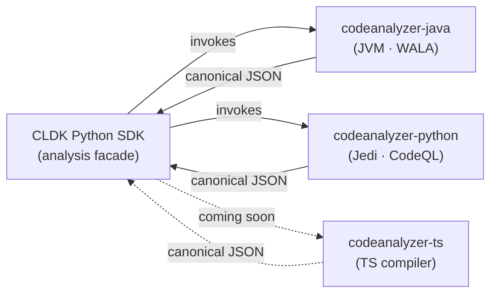

import { CardGrid, LinkCard, Aside } from "@astrojs/starlight/components";

The Python SDK you call is deliberately thin. The heavy lifting (parsing source, resolving symbols, building call graphs) happens in a family of **standalone language analyzers**, one per language, collectively the `codeanalyzer-*` backends. Each one emits the same shape of typed JSON, and the SDK facade deserializes it into the models you query.

This separation is what lets one `analysis` API span languages: the facade never parses code itself, it shells out to the right backend, then maps the backend's JSON onto typed models (`JApplication`, `PyModule`, …). Add a backend that speaks the canonical JSON and the SDK can analyze a new language with almost no new frontend logic: see [Add a language backend](/contributing/add-language-backend/).

<Aside type="note" title="You usually don't run these directly">
The SDK manages the backend for you: auto-downloading the Java JAR, provisioning the Python analyzer in a virtualenv. These pages are for when you want to understand (or contribute to) what's happening underneath.
</Aside>

## The backends

<CardGrid>
  <LinkCard title="codeanalyzer-java" description="The most complete backend: WALA + Javaparser, producing symbol tables, call graphs, hierarchy, and CRUD analysis." href="/backends/codeanalyzer-java/" />
  <LinkCard title="codeanalyzer-python" description="Jedi-based semantic analysis with optional CodeQL call-graph augmentation; ships the canonical Py* schema." href="/backends/codeanalyzer-python/" />
  <LinkCard title="codeanalyzer-ts" description="The TypeScript analyzer: the backend exists today; Python SDK support is on the way." href="/backends/codeanalyzer-ts/" />
</CardGrid>
