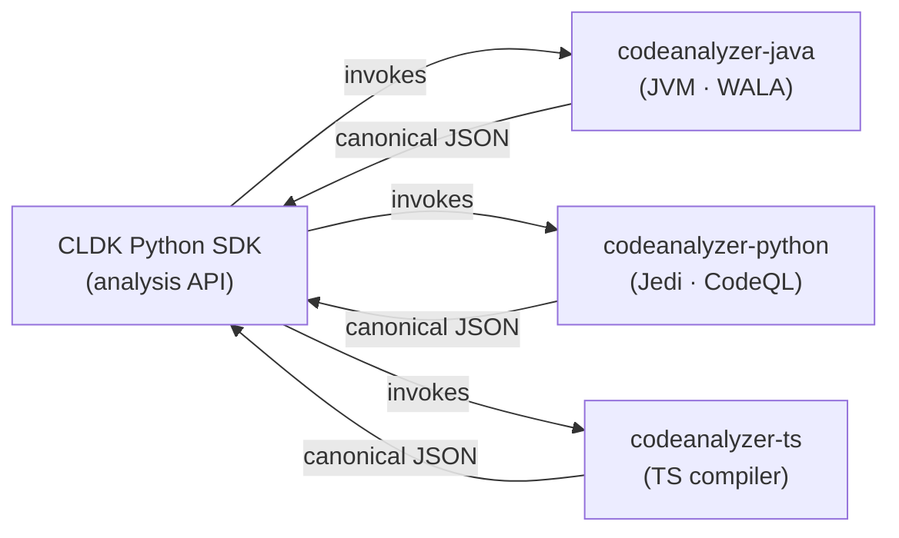

import { Badge, CardGrid, LinkCard, Aside } from "@astrojs/starlight/components";

**Standalone language backends** parse the source, resolve the symbols, and build the call graph. There is one backend for each language, and one more for infrastructure-as-code. Together they are the `codeanalyzer-*` tools. Each backend writes typed JSON. The SDK reads that JSON and builds models that you can query.

This split lets one `analysis` API cover many languages. The SDK does not parse code itself. It runs the correct backend. Then it maps the backend JSON onto typed models (`JApplication`, `PyModule`, and others).

A new backend that writes the canonical JSON makes its language available to the SDK. Only the bindings remain. See [Add a language backend](/contributing/add-language-backend/).

<Aside type="note" title="Backends are managed by the SDK">
The SDK manages the backend for you. Each `codeanalyzer-*` binary ships inside its PyPI package. The Java backend needs no JVM and runs with `python -m codeanalyzer_java`. The TypeScript binary ships in `codeanalyzer-typescript`. CLDK installs the Python backend into a virtualenv. You do not download a JAR or set `analysis_backend_path`.

These pages document the backend layer for readers who want to understand it or add to it.
</Aside>

This is the **backend** layer. For the SDKs that consume it, see the [SDKs overview](/reference/sdks/).

## Maturity tiers

<Badge text="Mature" variant="success" /> production-ready &nbsp;·&nbsp; <Badge text="Beta" variant="caution" /> stable core, gaps remain &nbsp;·&nbsp; <Badge text="Medium" variant="tip" /> usable, gaps remain &nbsp;·&nbsp; <Badge text="Help wanted" variant="danger" /> contributors wanted &nbsp;·&nbsp; <Badge text="Stub" variant="default" /> not started

## Backends

The `codeanalyzer-*` tools parse a language. Then they write the canonical symbol-table and call-graph schema that every frontend reads.

| Language | Backend | Maturity |
| --- | --- | --- |
| **Java** | [codeanalyzer-java](/backends/codeanalyzer-java/) | <Badge text="Mature" variant="success" /> |
| **Python** | [codeanalyzer-python](/backends/codeanalyzer-python/) | <Badge text="Mature" variant="success" /> |
| **TypeScript** | [codeanalyzer-ts](/backends/codeanalyzer-ts/) | <Badge text="Beta" variant="caution" /> |
| **JavaScript** | via [codeanalyzer-ts](/backends/codeanalyzer-ts/) | <Badge text="Medium" variant="tip" /> |
| **IaC (Helm)** | [codeanalyzer-iac](/backends/codeanalyzer-iac/) | <Badge text="Beta" variant="caution" /> |
| **Go** | Not started | <Badge text="Help wanted" variant="danger" /> <Badge text="Stub" variant="default" /> |
| **Rust** | Not started | <Badge text="Help wanted" variant="danger" /> <Badge text="Stub" variant="default" /> |
| **C** | Not started | <Badge text="Help wanted" variant="danger" /> <Badge text="Stub" variant="default" /> |
| **C++** | Not started | <Badge text="Help wanted" variant="danger" /> <Badge text="Stub" variant="default" /> |
| **C#** | Not started | <Badge text="Help wanted" variant="danger" /> <Badge text="Stub" variant="default" /> |

## Built backends

<CardGrid>
  <LinkCard title="codeanalyzer-python" description="Jedi-based semantic analysis with optional CodeQL call-graph augmentation. Writes the canonical Py* schema." href="/backends/codeanalyzer-python/" />
  <LinkCard title="codeanalyzer-java" description="WALA and Javaparser. Produces symbol tables, call graphs, type hierarchy, and CRUD analysis." href="/backends/codeanalyzer-java/" />
  <LinkCard title="codeanalyzer-ts" description="Beta. The TypeScript and TSX backend. It writes the canonical symbol-table and call-graph schema. Entrypoint detection is not complete." href="/backends/codeanalyzer-ts/" />
  <LinkCard title="codeanalyzer-iac" description="Beta. The infrastructure-as-code backend. It turns Helm charts into the canonical schema v2 IaC model, as JSON or a Neo4j graph." href="/backends/codeanalyzer-iac/" />
  <LinkCard title="Add a backend" description="Help wanted. Go, Rust, C, C++, and C# do not exist yet. A backend that writes the canonical JSON makes that language available to every SDK." href="/contributing/add-language-backend/" />
</CardGrid>
