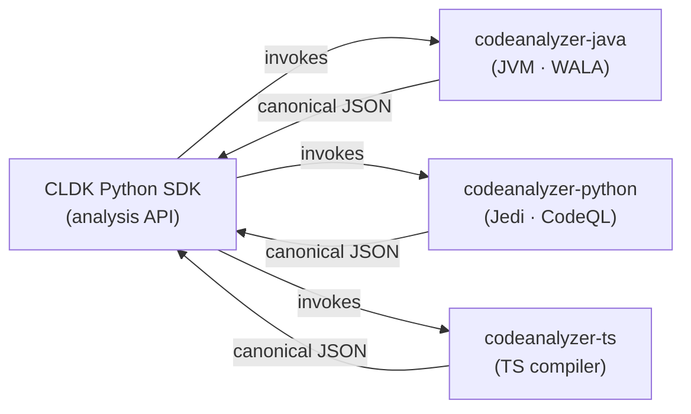

import { Badge, CardGrid, LinkCard, Aside } from "@astrojs/starlight/components";

Source parsing, symbol resolution, and call-graph construction are performed by **standalone language analyzers**, one per language, collectively the `codeanalyzer-*` backends. Each backend emits typed JSON, and the SDK deserializes it into queryable models.

This separation lets a single `analysis` API span languages. The SDK does not parse code itself; it invokes the appropriate backend, then maps the backend JSON onto typed models (`JApplication`, `PyModule`, and others). A backend that emits the canonical JSON makes its language available to the SDK with only binding work required. See [Add a language backend](/contributing/add-language-backend/).

<Aside type="note" title="Backends are managed by the SDK">
The SDK manages the backend automatically: each `codeanalyzer-*` backend binary ships with its packaged PyPI dependency (the JVM-free Java backend runs via `python -m codeanalyzer_java`; the TypeScript binary ships in `codeanalyzer-typescript`), and the Python analyzer is provisioned in a virtualenv. There is no separate JAR download or `analysis_backend_path` override. These pages document the backend layer for readers who want to understand or contribute to it.
</Aside>

This is the **backend** layer. For the SDKs that consume it, see the [SDKs overview](/reference/sdks/).

## Maturity tiers

<Badge text="Mature" variant="success" /> production-ready &nbsp;·&nbsp; <Badge text="Medium" variant="tip" /> usable, gaps remain &nbsp;·&nbsp; <Badge text="Help wanted" variant="danger" /> contributors wanted &nbsp;·&nbsp; <Badge text="Stub" variant="default" /> not started

## Backends (analyzers)

The `codeanalyzer-*` tools parse a language and serialize the canonical symbol-table and call-graph schema that every frontend reads.

| Language | Analyzer | Maturity |
| --- | --- | --- |
| **Java** | [codeanalyzer-java](/backends/codeanalyzer-java/) | <Badge text="Mature" variant="success" /> |
| **Python** | [codeanalyzer-python](/backends/codeanalyzer-python/) | <Badge text="Mature" variant="success" /> |
| **TypeScript** | [codeanalyzer-ts](/backends/codeanalyzer-ts/) | <Badge text="Mature" variant="success" /> |
| **JavaScript** | via [codeanalyzer-ts](/backends/codeanalyzer-ts/) | <Badge text="Medium" variant="tip" /> |
| **Go** | Not started | <Badge text="Help wanted" variant="danger" /> <Badge text="Stub" variant="default" /> |
| **Rust** | Not started | <Badge text="Help wanted" variant="danger" /> <Badge text="Stub" variant="default" /> |
| **C** | Not started | <Badge text="Help wanted" variant="danger" /> <Badge text="Stub" variant="default" /> |
| **C++** | Not started | <Badge text="Help wanted" variant="danger" /> <Badge text="Stub" variant="default" /> |
| **C#** | Not started | <Badge text="Help wanted" variant="danger" /> <Badge text="Stub" variant="default" /> |

## Built backends

<CardGrid>
  <LinkCard title="codeanalyzer-python" description="Jedi-based semantic analysis with optional CodeQL call-graph augmentation; emits the canonical Py* schema." href="/backends/codeanalyzer-python/" />
  <LinkCard title="codeanalyzer-java" description="WALA and Javaparser; produces symbol tables, call graphs, type hierarchy, and CRUD analysis." href="/backends/codeanalyzer-java/" />
  <LinkCard title="codeanalyzer-ts" description="Stable. The TypeScript/TSX analyzer, emitting the canonical symbol-table and call-graph schema." href="/backends/codeanalyzer-ts/" />
  <LinkCard title="Add a backend" description="Help wanted. Go, Rust, C, C++, and C# are not yet built. A backend that emits the canonical JSON makes that language available to every SDK." href="/contributing/add-language-backend/" />
</CardGrid>
