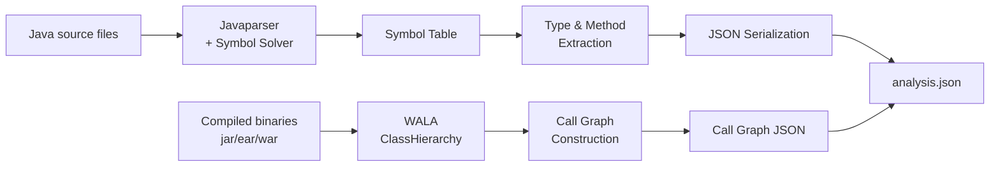

import { Tabs, TabItem, Steps, Aside, LinkCard, CardGrid, FileTree, Badge } from "@astrojs/starlight/components";

The **codeanalyzer-java** backend is the JVM-based static analysis engine for Java in the CLDK Python SDK. It uses WALA (T.J. Watson Libraries for Analysis) for semantic analysis and Javaparser for syntactic extraction. It writes one JSON schema, and the Python SDK deserializes that schema into typed models.

## Overview

codeanalyzer-java is a **standalone JAR tool**. It takes a Java project, or a source string, and writes a JSON graph that contains:

- **Symbol table**: All types (classes, interfaces, enums, records), their fields, methods/constructors, and imports
- **Call graph** (optional, at analysis level 2): Edges between callers and callees, computed by the interprocedural analysis of WALA
- **Type hierarchy**: Extends/implements relationships, nested types, parent-child relationships
- **CRUD operations**: Database access patterns (INSERT, SELECT, UPDATE, DELETE) in enterprise code
- **Comments and Javadoc**: Extracted and positioned for each entity
- **Entry points**: Main methods and framework-identified entry points (REST endpoints, Struts actions)

The Python SDK runs this backend, parses the JSON, and wraps it in `JavaAnalysis`. You therefore work with an `analysis` object, not with the backend. The backend is a JVM-free binary. It ships inside the packaged `codeanalyzer-java` PyPI dependency and runs with `python -m codeanalyzer_java`. There is no separate JAR download and no `analysis_backend_path` override.

## Architecture

### Analysis pipeline

The backend has these stages:



**Key stages:**

1. **Javaparser + Symbol Solver**: Parses `.java` source into an AST, resolves types against available libraries
2. **Symbol Table Extraction**: Walks the AST to collect classes, methods, fields, comments, imports
3. **WALA Analysis** (level 2+): Builds class hierarchy and interprocedural call graph from compiled binaries or sources
4. **JSON Export**: Serializes all entities into the canonical shape (symbol table + call graph edges)

### Package structure

```
com.ibm.cldk
├── CodeAnalyzer.java              # CLI entry point, orchestrates analysis
├── SymbolTable.java               # Javaparser-based symbol extraction
├── SystemDependencyGraph.java     # WALA-based call graph construction
├── entities/                       # Output data model classes
│   ├── JavaCompilationUnit.java   # A single .java file: types + imports
│   ├── Type.java                  # Class/interface/enum/record
│   ├── Callable.java              # Method/constructor
│   ├── Field.java                 # Member field
│   ├── Comment.java               # Javadoc/inline comment
│   ├── Import.java                # Import declaration
│   ├── CallableVertex.java        # Call graph node (method)
│   ├── CRUDOperation.java         # Database operation marker
│   └── ...
├── javaee/                        # Framework-specific finders
│   ├── EntrypointsFinderFactory   # Detects main, REST, Struts entry points
│   ├── CRUDFinderFactory          # JDBC/JPA/Hibernate CRUD detection
│   └── spring/, struts/, ...      # Framework integrations
└── utils/
    ├── BuildProject.java          # Maven/Gradle build invocation
    ├── ScopeUtils.java            # WALA scope setup
    └── AnalysisUtils.java         # Helpers for type resolution
```

**Core dependencies:**

- **WALA 1.6.7**: Interprocedural call graph, class hierarchy, points-to analysis
- **Javaparser**: Source code parsing, type resolution
- **Picocli**: Command-line interface
- **Gson**: JSON serialization

## Output schema

The backend outputs a consolidated JSON with this structure:

```json
{
  "version": "2.3.7",
  "symbol_table": {
    "/absolute/path/to/File.java": {
      "filePath": "/absolute/path/to/File.java",
      "packageName": "com.example",
      "comments": [ ... ],
      "imports": [ ... ],
      "typeDeclarations": {
        "ClassName": { ... }
      }
    }
  },
  "call_graph": [ ... ]
}
```

### Symbol table structure

#### Compilation unit (JavaCompilationUnit)

A single `.java` source file:

```typescript
{
  filePath: string                           // Absolute path
  packageName: string                        // Package declaration
  comments: JComment[]                       // File-level comments
  imports: JImport[]                         // All import declarations
  typeDeclarations: {
    [typeName: string]: JType               // Map of top-level types
  }
  isModified?: boolean                       // Flag for incremental updates
}
```

#### Type (JType)

A class, interface, enum, or record:

```typescript
{
  isClassOrInterfaceDeclaration: boolean
  isEnumDeclaration: boolean
  isAnnotationDeclaration: boolean
  isRecordDeclaration: boolean
  isInterface: boolean
  isNestedType: boolean
  isInnerClass: boolean
  isLocalClass: boolean
  
  modifiers: string[]                        // "public", "abstract", etc.
  annotations: string[]                      // "@Override", "@Deprecated", etc.
  
  extendsList: string[]                      // Superclass names (fully qualified)
  implementsList: string[]                   // Interface names
  parentType: string | null                  // For nested/inner types
  nestedTypeDeclarations: string[]          // Names of inner types
  
  fieldDeclarations: JField[]                // All fields
  callableDeclarations: {
    [signature: string]: JCallable          // Methods + constructors
  }
  enumConstants: JEnumConstant[]            // For enums
  recordComponents: JRecordComponent[]      // For records
  initializationBlocks: JInitializationBlock[]
  comments: JComment[]
  
  isEntrypointClass: boolean                // true for main(String[]) classes
}
```

#### Callable (JCallable)

A method or constructor:

```typescript
{
  signature: string                          // "methodName(Type1, Type2)"
  declaration: string                        // Full declaration with modifiers
  
  modifiers: string[]                        // "public", "static", "final", etc.
  annotations: string[]
  returnType: string | null                  // null for constructors
  thrownExceptions: string[]
  
  parameters: JCallableParameter[]           // Method parameters
  comments: JComment[]
  
  code: string                               // Method body source
  filePath: string
  startLine: number                          // Location in source
  endLine: number
  codeStartLine: number                      // Where body starts
  
  callSites: JCallSite[]                    // Calls made within this method
  referencedTypes: string[]                  // Types referenced in body
  accessedFields: string[]                   // Fields read/written
  variableDeclarations: JVariableDeclaration[]
  
  crudOperations: JCRUDOperation[]           // DB operations detected
  crudQueries: JCRUDQuery[]
  
  cyclomaticComplexity: number
  isConstructor: boolean
  isImplicit: boolean                        // Generated (e.g., default constructor)
  isEntrypoint: boolean                      // main or framework entry point
}
```

#### Call graph edges

At analysis level 2, a `call_graph` array of edges:

```typescript
{
  source: {                                  // Caller
    filePath: string
    typeDeclaration: string
    signature: string
    callableDeclaration: string
  }
  target: {                                  // Callee
    filePath: string
    typeDeclaration: string
    signature: string
    callableDeclaration: string
  }
  type: string                               // "CALL" | "INVOKE_SPECIAL", etc.
  weight: string                             // Call count (usually "1")
}
```

### Comment (JComment)

```typescript
{
  content: string                            // Comment text
  startLine: number
  endLine: number
  startColumn: number
  endColumn: number
  isJavadoc: boolean                         // true for /** ... */
}
```

### Import (JImport)

```typescript
{
  path: string                               // Fully qualified name or wildcard
  isStatic: boolean
  isWildcard: boolean                        // true for "import ....*"
}
```

## CLI interface

Run the jar with `java -jar codeanalyzer-*.jar` and these options:

### Usage

```
Usage: java -jar codeanalyzer.jar [-hvV] [--no-build] [-a=<analysisLevel>] 
           [-b=<build>] [-i=<input>] [-o=<output>] [-s=<sourceAnalysis>]

Convert a Java project into a system dependency graph.

  -i, --input=<input>              Path to the project root directory.
  -s, --source-analysis=<sourceAnalysis>
                                   Analyze a single string of java source code
                                   instead of the project.
  -o, --output=<output>            Destination directory to save the output
                                   graphs. By default, the SDG formatted as a
                                   JSON will be printed to the console.
  -b, --build-cmd=<build>          Custom build command. Defaults to auto build.
      --no-build                   Do not build your application. Use this option
                                   if you have already built your application.
  -a, --analysis-level=<analysisLevel>
                                   Level of analysis to perform. Options: 1
                                   (for just symbol table) or 2 (for call graph).
                                   Default: 1
  -v, --verbose                    Print logs to console.
  -t, --target-files=<targetFiles>
                                   For each file, perform source analysis on
                                   top of existing analysis.json
  -h, --help                       Show this help message and exit.
  -V, --version                    Print version information and exit.
```

### Key parameters

| Flag | Purpose | Example |
|------|---------|---------|
| `-i, --input` | Project root directory | `-i /path/to/commons-cli` |
| `-s, --source-analysis` | Single Java source string (no project needed) | `-s "public class Test {}"` |
| `-o, --output` | Output directory for `analysis.json` | `-o ./analysis_output` |
| `-a, --analysis-level` | `1` (symbol table only) or `2` (+ call graph) | `-a 2` |
| `-b, --build-cmd` | Custom build command (Maven/Gradle) | `-b "mvn clean install"` |
| `--no-build` | Skip the build. Use pre-compiled binaries | `--no-build` |
| `-v, --verbose` | Print debug logs | `-v` |
| `-t, --target-files` | Incremental analysis on specific files | `-t src/Main.java src/Helper.java` |

### Examples

**Analyze a project at symbol-table level (local files only):**

```bash
java -jar codeanalyzer-2.3.7.jar \
  -i /path/to/commons-cli \
  -a 1 \
  -o ./output
```

**Full analysis with call graph (build is automatic by default):**

```bash
java -jar codeanalyzer-2.3.7.jar \
  -i /path/to/commons-cli \
  -a 2 \
  -o ./output \
  -v
```

**Analyze a single source string (no build):**

```bash
java -jar codeanalyzer-2.3.7.jar \
  -s "public class HelloWorld { public static void main(String[] args) {} }" \
  -a 1
```

**Incremental analysis on specific files:**

```bash
java -jar codeanalyzer-2.3.7.jar \
  -i /path/to/commons-cli \
  -t src/main/java/org/apache/commons/cli/Option.java \
  -o ./output
```

## How the Python SDK uses it

The Python SDK (`JavaAnalysis`) runs the backend for you:

1. **Backend discovery**: The JVM-free backend ships with the packaged `codeanalyzer-java` PyPI dependency and runs with `python -m codeanalyzer_java`. There is no `analysis_backend_path` override.
2. **Invocation**: Calls the backend with `-i <project> -a <level> -o <cache_dir>` (or reads from stdout)
3. **JSON parsing**: Deserializes the output into Pydantic models such as `JApplication`, `JType`, and `JCallable`
4. **Facade**: Wraps the models in `JavaAnalysis`, which gives you query methods such as `get_classes()`, `get_call_graph()`, and `get_callers()`

```python
from cldk import CLDK
from cldk.analysis import AnalysisLevel

# Behind the scenes:
# 1. CLDK.java(...) selects the codeanalyzer-java backend (default CodeAnalyzerConfig)
# 2. Runs the packaged backend: python -m codeanalyzer_java -i commons-cli -a 2 -o <cache_dir>
# 3. Parses JSON -> JApplication (symbol_table + call_graph)
# 4. Returns JavaAnalysis

analysis = CLDK.java(
    project_path="commons-cli",
    analysis_level=AnalysisLevel.call_graph,
)
```

The `CLDK(language="java").analysis(...)` form still works, but it is **deprecated**. Use the `CLDK.java(...)` factory shown above. The `from cldk import CLDK` import does not change.

To control where analysis artifacts are cached, pass a backend config:

```python
from cldk import CLDK
from cldk.analysis import AnalysisLevel
from cldk.analysis.commons.backend_config import CodeAnalyzerConfig

analysis = CLDK.java(
    project_path="my_project",
    analysis_level=AnalysisLevel.call_graph,
    backend=CodeAnalyzerConfig(cache_dir="/tmp/analysis-cache"),
)
```

### Keyword arguments

`CLDK.java(...)` accepts `project_path`, `analysis_level`, `target_files`, and `eager`. The **type** of the `backend=` config selects the backend. For Java the only backend is the in-memory codeanalyzer (`CodeAnalyzerConfig`), so omit `backend=` for the default. Pass `backend=CodeAnalyzerConfig(cache_dir=...)` only to change where artifacts are cached. Caching is **on by default**. The cache root defaults to `<project>/.codeanalyzer`, and artifacts go under a language-keyed subdirectory (`<cache_dir>/java/`).

Java also accepts `source_code=...` for a single Java source string, but this argument is **deprecated**. Use `project_path` instead.

```python
analysis = CLDK.java(source_code="public class Test {}")  # deprecated; prefer project_path
```

Import the config objects from:

```python
from cldk.analysis.commons.backend_config import CodeAnalyzerConfig
```

## Building & testing

To build codeanalyzer-java from source:

<Steps>

1. **Clone the repository**
   ```bash
   git clone https://github.com/IBM/codeanalyzer-java
   cd codeanalyzer-java
   ```

2. **Install Java 11+**
   ```bash
   sdk install java 17.0.10-sem  # Or your preferred JDK
   ```

3. **Build the JAR**
   ```bash
   ./gradlew fatJar
   # Output: build/libs/codeanalyzer-2.3.7.jar
   ```

4. **Test on a sample project**
   ```bash
   java -jar build/libs/codeanalyzer-2.3.7.jar \
     -i src/test/resources/test-applications/call-graph-test \
     -a 2 -v
   ```

</Steps>

<Aside type="note" title="Native compilation">
GraalVM can also build a native binary (`./gradlew nativeCompile`). The JAR is the standard distribution, because the SDK expects a JVM.
</Aside>

## Schema stability

The JSON schema from codeanalyzer-java is **versioned**. Each output includes a `version` field, for example `"2.3.7"`. The Pydantic models of the Python SDK (`JApplication`, `JType`, and others) are locked to a compatible schema version. If the versions do not match, the SDK logs a warning or an error.

If you integrate codeanalyzer-java directly instead of through the Python SDK, make sure that the consumer can handle the schema for the version in use.

## Troubleshooting

| Symptom | Cause | Fix |
|---------|-------|-----|
| `java: command not found` | No JDK on PATH | Install Java 11+, add to PATH |
| `Cannot find symbol type X` | Missing library dependencies | Use `--no-build` for pre-compiled code. Make sure that dependencies are on the classpath |
| `analysis.json is corrupt` | Incomplete write or killed process | Make sure that there is disk space. Run the analysis again |
| `symbol table uses legacy import schema` | Running old JAR against new analysis.json | Regenerate with latest JAR (v2.3.7+) |
| `WALA call graph is empty` | No entry point found for analysis | Make sure that the project has a `main(String[])` method, or that frameworks are detected |

## References

- **Source repository:** [IBM/codeanalyzer-java](https://github.com/IBM/codeanalyzer-java)
- **WALA documentation:** [watson.ibm.com/wala](https://wala.dev/)
- **Javaparser:** [javaparser.org](https://javaparser.org/)
- **Related:** [codeanalyzer-python](/backends/codeanalyzer-python/), [codeanalyzer-ts](/backends/codeanalyzer-ts/)
- **How to:** [Add a language backend](/contributing/add-language-backend/)

---

To report a limitation, open an [issue](https://github.com/IBM/codeanalyzer-java/issues) with details. See [Contributing](/contributing/) for how to extend the backend.
