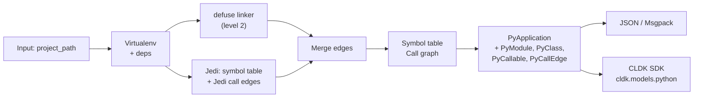

import { Tabs, TabItem, Steps, Aside, LinkCard, CardGrid, FileTree, Badge } from "@astrojs/starlight/components";

The **codeanalyzer-python** backend is the Python backend behind `PythonAnalysis` in CLDK. It runs **Jedi** for symbol resolution and the level-1 call graph. At level 2, a **defuse linker** adds call edges through local def-use chains. Levels 3 and 4 build the dataflow graphs from the standard `ast` module. The output is the canonical schema v2 `Analysis` envelope with a `PyApplication` inside. The schema ships with the backend, and the CLDK Python SDK re-exports it.

## Overview

`codeanalyzer-python` is a standalone static analysis library on PyPI. The CLDK SDK pins it as a dependency and imports it in-process. It converts a Python project into a queryable symbol table, call graph, and dataflow graphs.

The backend produces:
- **Symbol table**: All modules, classes, methods, functions, imports, parameters, and docstrings in typed `PyModule` objects.
- **Call graph**: Inter- and intra-procedural call edges (`PyCallEdge`). Jedi gives the level-1 edges. At level 2, the defuse linker adds edges, and each edge records its provenance in `prov` (`jedi` or `defuse`).
- **Class hierarchies**: Base classes, inheritance chains, and method overrides.
- **Entrypoints**: Framework entry points such as Flask, FastAPI, and Django routes, Celery tasks, and Click or Typer commands. Each `PyEntrypoint` is attached to its callable.

## Architecture



## Key modules

- **`codeanalyzer.core:Codeanalyzer`**: Orchestrates the analysis pipeline, manages the virtualenv and the cache, and runs the semantic passes.
- **`codeanalyzer.syntactic_analysis:SymbolTableBuilder`**: Parses Python source with the standard `ast` module and Jedi, and extracts modules, classes, methods, and call sites.
- **`codeanalyzer.semantic_analysis.call_graph`**: Converts the persisted `PyCallEdge` list into a `networkx.DiGraph` for in-process queries, and back.
- **`codeanalyzer.semantic_analysis.defuse_linker`**: Resolves level-2 call sites through local def-use chains and module-scope bindings.
- **`codeanalyzer.schema:py_schema`**: Defines all Pydantic models: `PyModule`, `PyClass`, `PyCallable`, `PyCallEdge`, `PyApplication`, and others.

## Schema: the Py* models

The file `codeanalyzer/schema/py_schema.py` defines all models, and the CLDK SDK re-exports them at `cldk.models.python`:

### Core application model

**`PyApplication`**: The application node. The root of every run is the `Analysis` envelope (`schema_version`, `language`, `max_level`, `analyzer`), and its `application` field holds the `PyApplication`.
```python
class PyApplication(BaseModel):
    symbol_table: Dict[str, PyModule]  # file_path → PyModule
    call_graph: List[PyCallEdge] = []  # edges with source → target signature
```

### Symbol table

**`PyModule`**: Represents one `.py` file.
```python
class PyModule(BaseModel):
    file_path: str
    module_name: str
    imports: List[PyImport] = []
    comments: List[PyComment] = []
    classes: Dict[str, PyClass] = {}         # class_name → PyClass
    functions: Dict[str, PyCallable] = {}    # function_name → PyCallable
    variables: List[PyVariableDeclaration] = []
    content_hash: Optional[str] = None       # for cache invalidation
    last_modified: Optional[float] = None
    file_size: Optional[int] = None
```

**`PyClass`**: A class definition.
```python
class PyClass(BaseModel):
    name: str
    signature: str  # e.g., "my_pkg.module.ClassName"
    comments: List[PyComment] = []
    code: str | None = None
    base_classes: List[str] = []  # parent signatures
    methods: Dict[str, PyCallable] = {}           # method_name → PyCallable
    attributes: Dict[str, PyClassAttribute] = {}  # attr_name → attribute
    inner_classes: Dict[str, "PyClass"] = {}
    start_line: int
    end_line: int
```

**`PyCallable`**: A function or method.
```python
class PyCallable(BaseModel):
    name: str
    path: str
    signature: str  # e.g., "my_pkg.module.ClassName.method_name"
    comments: List[PyComment] = []
    decorators: List[str] = []
    parameters: List[PyCallableParameter] = []
    return_type: Optional[str] = None
    code: str | None = None  # source code of the callable
    start_line: int
    end_line: int
    code_start_line: int
    accessed_symbols: List[PySymbol] = []      # local variable / import refs
    call_sites: List[PyCallsite] = []          # calls made within this callable
    inner_callables: Dict[str, "PyCallable"] = {}
    inner_classes: Dict[str, "PyClass"] = {}
    local_variables: List[PyVariableDeclaration] = []
    cyclomatic_complexity: int = 0
```

**`PyCallsite`**: A single call inside a callable.
```python
class PyCallsite(BaseModel):
    method_name: str
    receiver_expr: Optional[str] = None          # "obj" in obj.method()
    receiver_type: Optional[str] = None
    argument_types: List[str] = []
    return_type: Optional[str] = None
    callee_signature: Optional[str] = None       # resolved target (if found)
    is_constructor_call: bool = False
    start_line: int
    start_column: int
    end_line: int
    end_column: int
```

### Call graph

**`PyCallEdge`**: A directed edge in the call graph.
```python
class PyCallEdge(BaseModel):
    source: str  # caller PyCallable.signature
    target: str  # callee PyCallable.signature
    type: Literal["CALL_DEP"] = "CALL_DEP"
    weight: int = 1
    provenance: List[Literal["jedi", "codeql", "joern"]] = []
```

### Supporting models

**`PyImport`**: An import statement.
```python
class PyImport(BaseModel):
    module: str      # "os", "flask", "my_pkg.utils"
    name: str        # "path", "Flask", "helper"
    alias: Optional[str] = None
    start_line: int
    end_line: int
    start_column: int
    end_column: int
```

**`PyComment`**: A comment or docstring.
```python
class PyComment(BaseModel):
    content: str
    start_line: int
    end_line: int
    start_column: int
    end_column: int
    is_docstring: bool = False
```

All Py* models support:
- Pydantic **v1 and v2** compatibility, built into `codeanalyzer.schema.py_schema`. The CLDK SDK itself needs Pydantic 2.
- **Builder pattern**: `PyModule.builder().module_name("x").types({...}).build()`.
- **Serialization**: `model_dump_json()`. JSON is the single wire format.

## CLI interface

`pip install codeanalyzer-python` installs the `canpy` command-line tool:

```bash
canpy --input /path/to/my_pkg [OPTIONS]
```

`codeanalyzer` is a deprecated alias for backwards compatibility. It prints a deprecation warning to stderr and delegates to `canpy`. Use `canpy`.

<Aside type="note">
The CLI is for backend developers and direct analysis runs. CLDK SDK users reach the backend through `CLDK.python(...)`, which runs the analysis in-process.
</Aside>

### Flags

| Option | Short | Type | Default | Description |
| --- | --- | --- | --- | --- |
| `--input` | `-i` | PATH | Required, except with `--emit schema` | Project root directory to analyze |
| `--output` | `-o` | PATH | None | Write `analysis.json` to this directory (stdout if None) |
| `--emit` | | `json \| neo4j \| schema` | json | Output target: `json` (analysis.json), `neo4j` (`graph.cypher`, or a live Bolt push with `--neo4j-uri`), or `schema` (Neo4j schema contract, which needs no input) |
| `--app-name` | | str | input dir name | Application name for the graph `:PyApplication` anchor |
| `--neo4j-uri` | | str | None (`NEO4J_URI`) | Push the graph to a live Neo4j over Bolt (incremental). Omit it to write `graph.cypher` |
| `--neo4j-user` | | str | neo4j (`NEO4J_USERNAME`) | Neo4j username |
| `--neo4j-password` | | str | neo4j (`NEO4J_PASSWORD`) | Neo4j password (use the env var) |
| `--neo4j-database` | | str | server default (`NEO4J_DATABASE`) | Neo4j database name |
| `--analysis-level` | `-a` | 1-4 | 1 | Analysis depth. `1` symbol table and Jedi call graph. `2` adds defuse-linker call edges. `3` adds CFG, CDG, and DDG per callable. `4` adds the interprocedural SDG |
| `--graph-field-depth` | | int | 3 | Level 3 only. Access-path depth bound for the DDG |
| `--no-venv` / `--venv` | | bool | venv | Skip the virtualenv, and resolve imports against the ambient Python environment |
| `--ray` / `--no-ray` | | bool | false | Enable Ray for distributed analysis |
| `--eager` / `--lazy` | | bool | lazy | Force rebuild cache (eager) or reuse cached results (lazy) |
| `--cache-dir` | `-c` | PATH | `.codeanalyzer` in input dir | Where to store the virtualenv and the analysis cache |
| `--keep-cache` / `--clear-cache` | | bool | keep | Retain cache after analysis (default) or remove it |
| `--skip-tests` / `--include-tests` | | bool | skip | Exclude or include `test_*.py` files, `*_test.py` files, and `tests` directories |
| `--file-name` | | PATH | None | Analyze only a single file (relative to input dir) |
| `-v` | | count | 0 | Verbosity: `-v`, `-vv`, `-vvv` for debug/trace |

### Examples

**Basic symbol table analysis:**
```bash
canpy -i ./my_pkg
```
The command writes `analysis.json` to stdout with the symbol table and the Jedi call graph.

**With level-2 call edges:**
```bash
canpy -i ./my_pkg -a 2
```
Level 2 adds the defuse-linker edges to the Jedi edges. Each edge records its provenance in `prov`.

**With Ray distributed analysis:**
```bash
canpy -i ./my_pkg --ray
```
The command runs the analysis in parallel on Ray across the available cores.

**Save to a file:**
```bash
canpy -i ./my_pkg -o ./results
```
The command writes `results/analysis.json`.

**Custom cache, eager rebuild:**
```bash
canpy -i ./my_pkg --cache-dir /tmp/analysis-cache --eager
```
The command rebuilds the virtualenv and the analysis cache in `/tmp/analysis-cache/.codeanalyzer`.

**Single file:**
```bash
canpy -i ./my_pkg --file-name src/handlers.py
```
The command analyzes only `src/handlers.py`.

## How the SDK consumes it

A call to `CLDK.python(project_path="my_pkg")` in the Python SDK proceeds as follows:

1. **Import**: `codeanalyzer-python` is a pinned dependency of `cldk`, and the SDK imports it in the same process. The backend creates a virtualenv for the dependencies of the analyzed project under `<cache_dir>/python/.codeanalyzer/<project name>/virtualenv`.

2. **Run**: The SDK builds an `AnalysisOptions` object with the analysis level, `rebuild_analysis`, `using_ray`, and `cache_dir`. Then it calls `Codeanalyzer(options).analyze()` in the same process. The SDK runs no `canpy` subprocess and reads no stdout.

3. **Schema re-export**: `cldk.models.python` re-exports `PyApplication`, `PyModule`, `PyClass`, `PyCallable`, and other Py* types directly from `codeanalyzer.schema.py_schema`. There is therefore one source of truth.

4. **In-memory analysis object**: The SDK passes the parsed `PyApplication` to `PythonAnalysis`, which wraps it with these methods:
   - `get_symbol_table() → Dict[str, PyModule]`
   - `get_classes() → Dict[str, PyClass]`
   - `get_call_graph() → networkx.DiGraph`
   - `get_callers(target_class_name, target_method_declaration) → Dict`
   - `get_callees(source_class_name, source_method_declaration) → Dict`

<Tabs syncKey="lang">
  <TabItem label="Direct SDK usage">
```python
from cldk import CLDK
from cldk.analysis import AnalysisLevel
from cldk.analysis.commons.backend_config import PyCodeAnalyzerConfig

analysis = CLDK.python(
    project_path="my_pkg",
    analysis_level=AnalysisLevel.call_graph,
    backend=PyCodeAnalyzerConfig(use_ray=True),  # optional; parallel analysis with Ray
)

# Query the symbol table
modules = analysis.get_symbol_table()
classes = analysis.get_classes()

# Compute reachability
call_graph = analysis.get_call_graph()
import networkx as nx
is_reachable = nx.has_path(call_graph, "my_pkg.main", "my_pkg.unsafe_sink")

# Find callers
callers = analysis.get_callers("my_pkg.MyClass", "process")
```
  </TabItem>
  <TabItem label="CLI directly">
```bash
canpy -i ./my_pkg --codeql --output ./results --format json
cat results/analysis.json | jq '.symbol_table | keys'
```
  </TabItem>
</Tabs>

### Choosing a backend

The **type** of the `backend=` configuration that you pass to `CLDK.python(...)` selects the backend:

- **In-memory codeanalyzer** (default): omit `backend=`, or pass `backend=PyCodeAnalyzerConfig(...)`. The Python-only knob `use_ray=...` lives on this configuration, as does `cache_dir=...`.
- **Read-only Neo4j**: pass `backend=Neo4jConnectionConfig(...)` to query a graph populated out of band. CLDK runs no local analysis.

```python
from cldk import CLDK
from cldk.analysis.commons.backend_config import (
    PyCodeAnalyzerConfig,
    Neo4jConnectionConfig,
)

# In-memory backend with Ray + custom cache directory
analysis = CLDK.python(
    project_path="my_pkg",
    backend=PyCodeAnalyzerConfig(
        use_ray=True,
        use_ray=True,
        cache_dir="/tmp/analysis-cache",
    ),
)

# Read-only Neo4j backend
analysis = CLDK.python(
    project_path="my_pkg",
    backend=Neo4jConnectionConfig(
        uri="bolt://localhost:7687",
        username="neo4j",
        password="neo4j",
        database=None,
        application_name="my_pkg",
    ),
)
```

Import `Neo4jConnectionConfig` from `cldk.analysis.commons.backend_config`, or from `cldk.analysis.python.neo4j`.

<Aside type="tip" title="Where the graph comes from">
The read-only backend queries a graph that codeanalyzer-python populates with `canpy --emit neo4j`. Emit the graph once, then serve many agents from it. This is the [analysis-at-scale](/at-scale/) workflow.
</Aside>

`CLDK.python(...)` accepts the `project_path`, `analysis_level`, `target_files`, and `eager` keyword arguments. The `CLDK(language="python").analysis(...)` form is **deprecated**. Use `CLDK.python(...)`. The `from cldk import CLDK` import is the same for both forms.

### Caching and virtualenv management

- **Cache location**: One language-keyed `cache_dir` (default: `<project_dir>/.codeanalyzer`). Python artifacts live under `<cache_dir>/python/`. Set it with `backend=PyCodeAnalyzerConfig(cache_dir=...)`.
- **Virtualenv**: The backend creates it under the cache directory. It installs dependencies from `requirements.txt`, `pyproject.toml`, `setup.py`, and `Pipfile`.
- **Analysis cache**: Indexed by file content hash. Unchanged files reuse cached results.
- **Dataflow levels**: Levels 3 and 4 run in-process from the standard `ast` module. The backend downloads no analysis tool.

To force a clean rebuild, pass `eager=True` to `CLDK.python(...)`, or `--eager` on the CLI. You can also remove the cache directory.

## Troubleshooting

| Symptom | Cause | Fix |
| --- | --- | --- |
| `Missing option '-i' / '--input'` | `canpy` ran without a project path | Pass `-i <project>`. Only `--emit schema` needs no input |
| `codeanalyzer-python supports only a single target file; using the first.` | More than one entry in `target_files` | Pass one file, or run a full analysis |
| `get_callers` returns an empty `caller_details` list | The analysis was built at `symbol_table` level | Build again with `analysis_level=AnalysisLevel.call_graph` |

## Design principles

- **One schema**: The CLI, the SDK, and the consuming code all use the same `PyApplication` schema. All Py* types are Pydantic models, and JSON is the single wire format.
- **Semantic over syntactic**: Jedi resolves symbols and types, so queries operate on the resolved program rather than raw tokens.
- **Levels are additive**: Level 1 carries the Jedi edges. Level 2 adds the defuse-linker edges at more analysis time. Pass `-a 2`, or `analysis_level=AnalysisLevel.call_graph`, when you need those edges.
- **Queryable interface**: Reachability is a `networkx` query. API methods give you the callers and callees over the analyzed project.

## See also

<CardGrid>
  <LinkCard title="Python API reference" href="/reference/python-api/" description="Query PythonAnalysis and the typed models." />
  <LinkCard title="COCOA" href="/cocoa/" description="A Code Context Agent plugin that uses call graphs for reachability and impact." />
  <LinkCard title="Contributing guide" href="/contributing/" description="Extend the Python backend or add support for new languages." />
</CardGrid>
