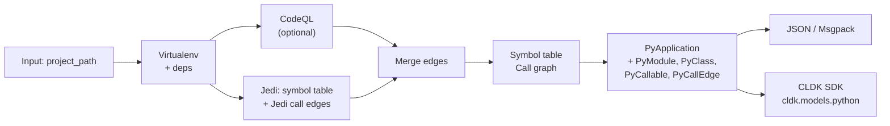

import { Tabs, TabItem, Steps, Aside, LinkCard, CardGrid, FileTree, Badge } from "@astrojs/starlight/components";

The Python analysis backend is the engine that powers `PythonAnalysis` in CLDK. It runs **Jedi** for semantic code understanding, optional **CodeQL** for enhanced call-graph resolution, and **Tree-sitter** for fast syntactic parsing, all producing a single canonical `PyApplication` schema that ships with the backend and is re-exported by the CLDK Python SDK.

## What it is

`codeanalyzer-python` is a standalone static analysis library (published to PyPI as `codeanalyzer-python`) that the SDK auto-manages in a virtualenv. Rather than crawling files with token-heavy LLM calls, agents query the analyzed program directly: call graphs become `networkx` graph lookups, reachability becomes a path query, and callers/callees are deterministic.

The backend produces:
- **Symbol table**: All modules, classes, methods, functions, imports, parameters, and docstrings in typed `PyModule` objects.
- **Call graph**: Inter- and intra-procedural call edges (`PyCallEdge`), with Jedi-based baseline and optional CodeQL augmentation merging resolved callees from both engines.
- **Class hierarchies**: Base classes, inheritance chains, and method overrides.
- **Entrypoints**: Framework-detected entry points (Flask routes, Celery tasks, Django views, gRPC servicers, etc.) linked to their callables.

## Architecture



## Key modules

- **`codeanalyzer.core:Codeanalyzer`**: Orchestrates the analysis pipeline, manages virtualenv setup, caching, and invokes semantic passes.
- **`codeanalyzer.syntactic_analysis:SymbolTableBuilder`**: Parses Python source via Tree-sitter and Jedi to extract modules, classes, methods, and call sites.
- **`codeanalyzer.semantic_analysis.call_graph`**: Builds inter-procedural call graphs using Jedi's resolution; merges CodeQL edges when enabled.
- **`codeanalyzer.semantic_analysis.codeql`**: Optional CodeQL integration for resolving dynamic calls, third-party dispatch, and RPC targets.
- **`codeanalyzer.schema:py_schema`**: Defines all Pydantic models: `PyModule`, `PyClass`, `PyCallable`, `PyCallEdge`, `PyApplication`, and others.

## Schema: the Py* models

All models are defined in `/codeanalyzer/schema/py_schema.py` and re-exported in the CLDK SDK at `cldk.models.python`:

### Core application model

**`PyApplication`**: The root output of every analysis run.
```python
class PyApplication(BaseModel):
    symbol_table: Dict[str, PyModule]  # file_path → PyModule
    call_graph: List[PyCallEdge] = []  # edges with source → target signature
```

### Symbol table

**`PyModule`**: Represents one `.py` file.
```python
class PyModule(BaseModel):
    file_path: str
    module_name: str
    imports: List[PyImport] = []
    comments: List[PyComment] = []
    classes: Dict[str, PyClass] = {}         # class_name → PyClass
    functions: Dict[str, PyCallable] = {}    # function_name → PyCallable
    variables: List[PyVariableDeclaration] = []
    content_hash: Optional[str] = None       # for cache invalidation
    last_modified: Optional[float] = None
    file_size: Optional[int] = None
```

**`PyClass`**: A class definition.
```python
class PyClass(BaseModel):
    name: str
    signature: str  # e.g., "my_pkg.module.ClassName"
    comments: List[PyComment] = []
    code: str | None = None
    base_classes: List[str] = []  # parent signatures
    methods: Dict[str, PyCallable] = {}           # method_name → PyCallable
    attributes: Dict[str, PyClassAttribute] = {}  # attr_name → attribute
    inner_classes: Dict[str, "PyClass"] = {}
    start_line: int
    end_line: int
```

**`PyCallable`**: A function or method.
```python
class PyCallable(BaseModel):
    name: str
    path: str
    signature: str  # e.g., "my_pkg.module.ClassName.method_name"
    comments: List[PyComment] = []
    decorators: List[str] = []
    parameters: List[PyCallableParameter] = []
    return_type: Optional[str] = None
    code: str | None = None  # source code of the callable
    start_line: int
    end_line: int
    code_start_line: int
    accessed_symbols: List[PySymbol] = []      # local variable / import refs
    call_sites: List[PyCallsite] = []          # who does this call?
    inner_callables: Dict[str, "PyCallable"] = {}
    inner_classes: Dict[str, "PyClass"] = {}
    local_variables: List[PyVariableDeclaration] = []
    cyclomatic_complexity: int = 0
```

**`PyCallsite`**: A single call inside a callable.
```python
class PyCallsite(BaseModel):
    method_name: str
    receiver_expr: Optional[str] = None          # "obj" in obj.method()
    receiver_type: Optional[str] = None
    argument_types: List[str] = []
    return_type: Optional[str] = None
    callee_signature: Optional[str] = None       # resolved target (if found)
    is_constructor_call: bool = False
    start_line: int
    start_column: int
    end_line: int
    end_column: int
```

### Call graph

**`PyCallEdge`**: A directed edge in the call graph.
```python
class PyCallEdge(BaseModel):
    source: str  # caller PyCallable.signature
    target: str  # callee PyCallable.signature
    type: Literal["CALL_DEP"] = "CALL_DEP"
    weight: int = 1
    provenance: List[Literal["jedi", "codeql", "joern"]] = []
```

### Supporting models

**`PyImport`**: An import statement.
```python
class PyImport(BaseModel):
    module: str      # "os", "flask", "my_pkg.utils"
    name: str        # "path", "Flask", "helper"
    alias: Optional[str] = None
    start_line: int
    end_line: int
    start_column: int
    end_column: int
```

**`PyComment`**: A comment or docstring.
```python
class PyComment(BaseModel):
    content: str
    start_line: int
    end_line: int
    start_column: int
    end_column: int
    is_docstring: bool = False
```

All Py* models support:
- Pydantic **v1 and v2** compatibility via `cldk.models.python`.
- **Builder pattern**: `PyModule.builder().module_name("x").classes({...}).build()`.
- **Serialization**: `to_msgpack_bytes()`, `from_msgpack_bytes()`, `model_dump_json()`.

## CLI interface

The backend ships a command-line tool `codeanalyzer`, installed by `pip install codeanalyzer-python`:

```bash
codeanalyzer --input /path/to/my_pkg [OPTIONS]
```

<Aside type="note">
The CLI is primarily for backend developers and direct analysis runs. CLDK SDK users invoke the backend indirectly through `CLDK(language="python").analysis(...)`, which auto-manages the virtualenv and invokes the CLI internally.
</Aside>

### Options

| Option | Short | Type | Default | Description |
| --- | --- | --- | --- | --- |
| `--input` | `-i` | PATH | Required | Project root directory to analyze |
| `--output` | `-o` | PATH | None | Save `analysis.json` or `analysis.msgpack` to this directory (stdout if None) |
| `--format` | `-f` | `json \| msgpack` | json | Output serialization format |
| `--codeql` / `--no-codeql` | | bool | false | Enable CodeQL-based call-graph augmentation (experimental) |
| `--ray` / `--no-ray` | | bool | false | Enable Ray for distributed analysis |
| `--eager` / `--lazy` | | bool | lazy | Force rebuild cache (eager) or reuse cached results (lazy) |
| `--cache-dir` | `-c` | PATH | `.codeanalyzer` in input dir | Where to store virtualenv, CodeQL DB, analysis cache |
| `--keep-cache` / `--clear-cache` | | bool | keep | Retain cache after analysis (default) or remove it |
| `--skip-tests` / `--include-tests` | | bool | skip | Exclude or include `test_*.py` / `*_test.py` files |
| `--file-name` | | PATH | None | Analyze only a single file (relative to input dir) |
| `-v` | | count | 0 | Verbosity: `-v`, `-vv`, `-vvv` for debug/trace |

### Examples

**Basic symbol table analysis:**
```bash
codeanalyzer -i ./my_pkg
```
Outputs `analysis.json` to stdout (symbol table + Jedi call graph).

**With CodeQL augmentation:**
```bash
codeanalyzer -i ./my_pkg --codeql
```
Merges Jedi edges with CodeQL-resolved edges; note that CodeQL integration is experimental and may take longer.

**With Ray distributed analysis:**
```bash
codeanalyzer -i ./my_pkg --ray
```
Enables Ray for parallel processing across available cores.

**Save to file in msgpack format:**
```bash
codeanalyzer -i ./my_pkg -o ./results --format msgpack
```
Saves compressed `analysis.msgpack` with 30–50% of JSON size.

**Custom cache, eager rebuild:**
```bash
codeanalyzer -i ./my_pkg --cache-dir /tmp/analysis-cache --eager
```
Rebuilds virtualenv and analysis cache from scratch, storing in `/tmp/analysis-cache/.codeanalyzer`.

**Single file:**
```bash
codeanalyzer -i ./my_pkg --file-name src/handlers.py
```
Analyzes only `src/handlers.py`.

## How the SDK consumes it

When you call `CLDK(language="python").analysis(project_path="my_pkg")` in the Python SDK:

1. **Virtualenv provisioning**: CLDK detects or installs `codeanalyzer-python` into a managed virtualenv in the cache directory (default: `<project_dir>/.codeanalyzer/venv`).

2. **CLI invocation**: The SDK constructs a `codeanalyzer` command with options (`--codeql`, `--eager`, `--cache-dir`, etc.) and runs it as a subprocess. Stdout is parsed as `analysis.json`.

3. **Schema re-export**: `cldk.models.python` re-exports `PyApplication`, `PyModule`, `PyClass`, `PyCallable`, and other Py* types directly from `codeanalyzer.schema.py_schema`, ensuring a single source of truth.

4. **In-memory facade**: The parsed `PyApplication` is passed to `PythonAnalysis`, which wraps it with convenience methods:
   - `get_symbol_table() → Dict[str, PyModule]`
   - `get_classes() → Dict[str, PyClass]`
   - `get_call_graph() → networkx.DiGraph`
   - `get_callers(target_class, target_method) → List[Tuple[str, PyCallable]]`
   - `get_callees(source_callable) → List[PyCallable]`

<Tabs syncKey="lang">
  <TabItem label="Direct SDK usage">
```python
from cldk import CLDK
from cldk.analysis import AnalysisLevel

analysis = CLDK(language="python").analysis(
    project_path="my_pkg",
    analysis_level=AnalysisLevel.call_graph,
    use_codeql=True,  # optional; merges CodeQL edges
)

# Query the symbol table
modules = analysis.get_symbol_table()
classes = analysis.get_classes()

# Compute reachability
call_graph = analysis.get_call_graph()
import networkx as nx
is_reachable = nx.has_path(call_graph, "my_pkg.main", "my_pkg.unsafe_sink")

# Find callers
callers = analysis.get_callers("my_pkg.MyClass", "process")
```
  </TabItem>
  <TabItem label="CLI directly">
```bash
codeanalyzer -i ./my_pkg --codeql --output ./results --format json
cat results/analysis.json | jq '.symbol_table | keys'
```
  </TabItem>
</Tabs>

### Caching and virtualenv management

- **Cache location**: Stored in `cache_dir/.codeanalyzer/` (default: `<project_dir>/.codeanalyzer/`).
- **Virtualenv**: Auto-created at `.codeanalyzer/<project_name>/virtualenv/`. The backend installs dependencies from `requirements.txt`, `pyproject.toml`, `setup.py`, `Pipfile`, etc.
- **Analysis cache**: Indexed by file content hash; unchanged files reuse cached results.
- **CodeQL database**: Stored in `.codeanalyzer/codeql/` if `--codeql` is enabled; downloaded on first use.

To force a clean rebuild, pass `--eager` (or `eager_analysis=True` in the SDK), or delete the cache directory.

## Design principles

- **One facade, one schema**: The same `PyApplication` schema is used everywhere: CLI, SDK, and agent code. All Py* types are Pydantic models with JSON/msgpack serialization.
- **Semantic over syntactic**: Jedi resolves symbols and types; you query the program, not parse tokens.
- **Optional CodeQL**: Jedi alone covers 80–90% of call edges. CodeQL augments dynamic/RPC calls but costs extra analysis time. Enable it when you need comprehensive coverage.
- **Agents query instead of crawl**: Reachability is a networkx query, callers are a dict lookup, and every claim is grounded in ground truth. No tokens wasted on approximation.

## Next steps

<CardGrid>
  <LinkCard title="Python API reference" href="/reference/python-api/" description="Query the PythonAnalysis facade and typed models." />
  <LinkCard title="cocoa" href="/cocoa/" description="A Code Context Agent plugin using call graphs for reachability and impact." />
  <LinkCard title="Contributing guide" href="/contributing/" description="Extend the Python backend or add support for new languages." />
</CardGrid>
