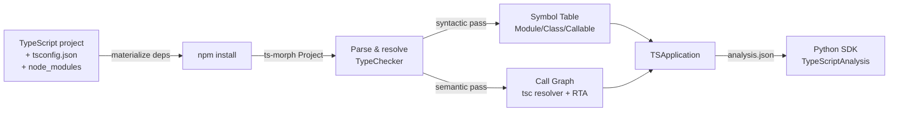

import { Tabs, TabItem, Steps, Aside, LinkCard, CardGrid, FileTree, Badge } from "@astrojs/starlight/components";

The **codeanalyzer-ts** backend analyzes TypeScript and TSX codebases and emits the canonical CLDK `analysis.json`: the same symbol-table and call-graph schema that the Python and Java analyses produce. It is a standalone binary that integrates with the CLDK Python SDK.

## Architecture

codeanalyzer-ts uses **ts-morph** (the TypeScript compiler API) to parse and resolve a TypeScript project in a single pass. The same `TypeChecker` instance that builds the symbol table resolves call targets, so the call-graph derivation reuses that resolution and is precise.



### Materialization
Before it parses, the backend runs `npm install` to make sure that `node_modules` is present, so the TypeChecker can resolve types. If `node_modules` is already prepared, skip this step with `--no-build`.

### Symbol table (Level 1 default)
The backend walks the ts-morph AST and indexes all declarations into a flat `symbol_table`. Declarations include classes, methods, interfaces, enums, type aliases, namespaces, and functions. The backend keys the table by project-relative file paths.

### Call graph
The ts-morph TypeChecker resolves each call site to its declared-type target, which is exact for static dispatch. The backend then adds RTA-style subtype expansion. Polymorphic calls on interface or abstract receivers also emit edges to every instantiated concrete override. Provenance: `tsc`.

<Aside type="note" title="Edge provenance">
Each call-graph edge carries a `prov` list. `tsc` marks an edge that the type checker resolved. `defuse` marks an edge that the def-use linker resolved. `import` marks a phantom edge to an imported library target.
</Aside>

The call graph maintains the no-dangling-edges invariant: every edge endpoint is a real `Callable.signature`.

## Install

The `cants` CLI is available from **PyPI** and **Homebrew**. Both distribute a prebuilt, self-contained binary for the target platform. You need neither Bun nor Node to run it.

<Tabs>
  <TabItem label="pip">
    ```bash
    pip install codeanalyzer-typescript
    cants --help
    ```
  </TabItem>
  <TabItem label="Homebrew">
    ```bash
    brew install codellm-devkit/homebrew-tap/codeanalyzer-typescript
    cants --help
    ```
  </TabItem>
</Tabs>

The CLDK Python SDK depends on the PyPI package `codeanalyzer-typescript` to find this backend. The package exposes `bin_path()`, which returns the path to the bundled binary. There is no `analysis_backend_path` argument. To change the binary out of band, for example to a locally built `cants`, set the `$CODEANALYZER_TS_BIN` environment variable to its path. This is the only override.

<Aside type="note">
The distributable is named **`codeanalyzer-typescript`** (the PyPI package and the Homebrew formula), but the command it installs on `PATH` is **`cants`**, the binary name of the backend. Run `cants`, not `codeanalyzer-typescript`.
</Aside>

### Build from source

To develop the backend, you need **Bun** 1.0 or later. The backend also needs **npm** on `PATH` when it analyzes a project, because it runs `npm install` there. Build it with these commands:

```bash
cd codeanalyzer-ts
bun install
bun run build    # → dist/cants (standalone binary)
```

Or run from source without compilation:
```bash
bun run src/index.ts -i <project>
```

## CLI

The backend accepts these command-line flags:

```bash
cants -i <path> [options]
```

| Option | Description |
|--------|-------------|
| `-i, --input <path>` | Project root to analyze **(required)** |
| `-o, --output <dir>` | Write `analysis.json` to this directory. Omit it to emit compact JSON to stdout (used by the SDK) |
| `-a, --analysis-level <n>` | `1` = symbol table (default). `2` = adds the resolver call graph. `3` = adds intraprocedural dataflow (CFG, CDG, DDG). `4` = adds the interprocedural SDG |
| `-t, --target-files <paths...>` | Restrict analysis to specific files (for incremental builds) |
| `--skip-tests` / `--include-tests` | Skip or include test files (default: skip) |
| `--eager` / `--lazy` | Force a clean rebuild, or reuse the cache (default: reuse) |
| `--no-build` | Skip `npm install`. Assume that `node_modules` is prepared |
| `--no-phantoms` | Disable phantom (external) nodes for library imports |
| `-c, --cache-dir <dir>` | Cache directory (default: `<input>/.codeanalyzer`) |
| `-v, --verbose` | Increase verbosity. Repeatable, for example `-vv` |
| `--emit <target>` | Output target: `json` (default), `neo4j` (a `graph.cypher` script, or a live push with `--neo4j-uri`), or `schema` (the Neo4j schema contract, no `-i` needed) |
| `--app-name <name>` | Application name for the graph anchor (default: the input directory name) |
| `--neo4j-uri <uri>` | Push the graph to a live Neo4j over Bolt. Also read from `NEO4J_URI` |
| `--neo4j-user`, `--neo4j-password`, `--neo4j-database` | Connection details. Also read from `NEO4J_USERNAME`, `NEO4J_PASSWORD`, and `NEO4J_DATABASE` |
| `-j, --jobs <n>` | Worker parallelism for the level-3 graphs (default: sequential) |
| `--entrypoint-rules <yaml...>` | Extra entrypoint rule files, merged with the shipped set |

The backend writes all diagnostics to stderr. Stdout carries only JSON, unless you give `-o`.

## Output schema

The backend emits `analysis.json` as an envelope. The `application` object inside it holds the symbol table and the graphs:

```json
{
  "schema_version": "2.0.0",
  "language": "typescript",
  "max_level": 2,
  "analyzer": { "name": "codeanalyzer-typescript", "version": "1.6.0" },
  "application": {
    "id": "can://my_app",
    "kind": "application",
    "symbol_table": {
      "src/index.ts": { ... },
      "src/services/user.ts": { ... }
    },
    "call_graph": [
      { "src": "can://my_app/typescript/src/index.ts/main", "dst": "can://my_app/typescript/src/services/user.ts/UserService/getUser", "prov": ["tsc"], "weight": 1 }
    ],
    "external_symbols": {
      "can://my_app/@external/express/get": { "id": "can://my_app/@external/express/get", "kind": "external", "module": "express", "name": "get" }
    },
    "entrypoint_report": { ... }
  }
}
```

### Symbol table

The `symbol_table` is a dictionary. It maps project-relative file paths to `TSModule` objects. On the wire, each module holds `id`, `span`, `source`, `imports`, `exports`, `comments`, `types`, `functions`, `fields`, `is_tsx`, and `is_declaration_file`. The Python SDK adds `classes`, `interfaces`, `enums`, `type_aliases`, `namespaces`, and `variables` as views over `types` and `fields`. Each module therefore exposes:

- **`imports`** and **`exports`**: statement-level detail (module specifier, binding name, type-only markers)
- **`classes`**, **`interfaces`**, **`enums`**, **`type_aliases`**: top-level named types, each with its own structure
- **`functions`**: module-level functions
- **`namespaces`**: recursive containers (same shape as modules)
- **`variables`**: module-scope declarations
- **`comments`**: all JSDoc and inline comments
- **`is_tsx`**, **`is_declaration_file`**: file metadata flags

#### Module, Class, and Callable structure

<Tabs syncKey="entity">
  <TabItem label="Class">
**`TSClass`** represents a single class declaration:
```ts
{
  name: "UserService",
  signature: "src/services/user.UserService",      // stable ID
  comments: [ ... ],
  decorators: [ ... ],                             // @Injectable, @Entity, etc.
  base_classes: [ ... ],                           // extends + implements (mixed)
  implements_types: [ ... ],                       // just interfaces
  type_parameters: [ ... ],                        // <T, U extends Base>
  methods: {
    "getUser": { ... },                            // TSCallable
    "saveUser": { ... }
  },
  attributes: {
    "logger": { type: "Logger", is_readonly: true }
  },
  is_abstract: false,
  is_exported: true,
  is_ambient: false,
  start_line: 10,
  end_line: 45
}
```
  </TabItem>
  <TabItem label="Callable">
**`TSCallable`** represents a function, method, constructor, arrow, or accessor:
```ts
{
  name: "getUser",
  signature: "src/services/user.UserService.getUser",
  kind: "method",                                  // function | method | constructor | getter | setter | arrow | function_expression
  accessibility: "public",                         // public | private | protected | null
  is_static: false,
  is_async: true,
  is_abstract: false,
  is_optional: false,
  is_readonly: false,
  is_exported: false,
  is_ambient: false,
  is_implicit: false,
  parameters: [
    {
      name: "id",
      type: "string",
      is_optional: false,
      is_rest: false,
      decorators: [ ... ]
    }
  ],
  type_parameters: [ ... ],
  return_type: "Promise<User>",
  code: "async getUser(id: string) { ... }",
  call_sites: [
    {
      method_name: "fetchById",
      receiver_type: "Database",
      callee_signature: "src/db.Database.fetchById",
      is_optional_chain: false,
      start_line: 20
    }
  ],
  cyclomatic_complexity: 3,
  is_entrypoint: false,
  accessed_symbols: [ ... ],
  local_variables: [ ... ],
  inner_callables: { },
  inner_classes: { }
}
```
  </TabItem>
  <TabItem label="Interface/Enum/TypeAlias">
**`TSInterface`** for abstract contracts:
```ts
{
  name: "Logger",
  signature: "src/logger.Logger",
  methods: { ... },                                // bodiless signatures
  properties: { ... },
  call_signatures: [ ... ],                        // raw text of call/construct signatures
  index_signatures: [ ... ],
  base_classes: [ ... ]                            // extended interfaces
}
```

**`TSEnum`** for enumerations:
```ts
{
  name: "Status",
  signature: "src/types.Status",
  members: [
    { name: "Active", value: "1" },
    { name: "Inactive", value: "2" }
  ],
  is_const: false
}
```

**`TSTypeAlias`** for type definitions:
```ts
{
  name: "UserId",
  signature: "src/types.UserId",
  aliased_type: "number & { readonly __brand: unique symbol }",
  type_parameters: [ ... ]
}
```
  </TabItem>
</Tabs>

### Call graph

The `call_graph` is an array of `TSCallGraphEdge` records in identity-only form. Each edge holds the `can://` ids of the caller and the callee. Each id resolves to a symbol-table node or to an external node (never dangling):

```ts
{
  src: "can://my_app/typescript/src/services/user.ts/UserService/getUser",
  dst: "can://my_app/typescript/src/db.ts/Database/fetchById",
  prov: ["tsc"],                                  // tsc | defuse | import
  weight: 1
}
```

### External symbols (phantom nodes)

When the backend finds a call to an imported library function, it creates a **phantom node** (a `TSExternalNode`). The call-graph edge then resolves to a defined endpoint. The `external_symbols` map uses the node id as its key:

```ts
{
  id: "can://my_app/@external/express/get",
  kind: "external",
  module: "express",
  name: "get"
}
```

Disable phantoms with `--no-phantoms` to restrict the graph to internal nodes only.

## TypeScript-native features

TypeScript includes several language-specific constructs that codeanalyzer-ts models as first-class entities:

| Feature | Support | Details |
|---------|---------|---------|
| **Interfaces** | Full | Separate `interfaces{}` collection. You query it separately from classes |
| **Type aliases** | Full | `TSTypeAlias` with aliased type text and type parameters |
| **Enums** | Full | Discriminated collection. Members with computed or literal values |
| **Namespaces** | Full | Recursive containers. Same structure as modules |
| **Type parameters** | Full | `<T, U extends Base = Default>` structured on classes, callables, aliases |
| **Decorators** | Structured | `name`, `qualified_name`, `positional_arguments[]`, `keyword_arguments{}` (for framework entrypoint detection) |
| **Modifiers** | Typed fields | `accessibility`, `is_static`, `is_async`, `is_readonly`, `is_abstract`, `is_optional`, `is_ambient` |
| **Overload signatures** | Full | `overload_signatures[]` on the implementation callable |
| **JSX** | Tracked | `is_tsx` flag on modules |
| **Declaration files** | Tracked | `is_declaration_file` flag, useful for filters |

## Python SDK integration

The `CLDK.typescript(...)` factory analyzes TypeScript projects through the same `CLDK` analysis API as Python and Java:

```python
from cldk import CLDK
from cldk.analysis import AnalysisLevel

analysis = CLDK.typescript(
    project_path="/path/to/ts/project",
    analysis_level=AnalysisLevel.call_graph,
)

# Standard analysis methods:
print(analysis.get_classes())      # Dict[str, TSClass]
graph = analysis.get_call_graph()  # networkx.DiGraph
```

The `CLDK(language="typescript").analysis(...)` form is **deprecated**. Use `CLDK.typescript(...)`. The import is `from cldk import CLDK` in both forms.

### Select a backend

`CLDK.typescript(...)` accepts the `project_path`, `analysis_level`, `target_files`, and `eager` keyword arguments. The **type** of the `backend=` configuration object selects the backend:

- **In-process codeanalyzer** (default): omit `backend=`, or pass `backend=CodeAnalyzerConfig(cache_dir=...)` to set where the backend caches artifacts.
- **Read-only Neo4j**: pass `backend=Neo4jConnectionConfig(...)` to query a graph populated out of band.

```python
from cldk import CLDK
from cldk.analysis.commons.backend_config import (
    CodeAnalyzerConfig,
    Neo4jConnectionConfig,
)

# In-memory backend with a custom cache directory
analysis = CLDK.typescript(
    project_path="/path/to/ts/project",
    backend=CodeAnalyzerConfig(cache_dir="/tmp/analysis-cache"),
)

# Read-only Neo4j backend
analysis = CLDK.typescript(
    project_path="/path/to/ts/project",
    backend=Neo4jConnectionConfig(
        uri="bolt://localhost:7687",
        username="neo4j",
        password="neo4j",
        database=None,
        application_name="my_project",
    ),
)
```

Import `Neo4jConnectionConfig` from `cldk.analysis.commons.backend_config`, or from `cldk.analysis.typescript.neo4j`.

<Aside type="tip" title="Where the graph comes from">
The read-only backend queries a graph that codeanalyzer-ts populates with `cants --emit neo4j`. Emit the graph once, then serve many agents from it. This is the [analysis-at-scale](/at-scale/) workflow.
</Aside>

## Schema invariants

All signatures follow one canonical `signatureOf()` rule: **project-relative file path (without extension) + dot-separated members**. For example:

- Module-level function: `src/index.getConfig`
- Method: `src/services/user.UserService.getUser`
- Constructor: `src/models/User.User.constructor`
- Namespace member: `src/api.v1.ApiRouter.get`

This rule makes sure that every call-graph edge points to a real symbol-table entry.

## Caching and incremental analysis

The backend keeps a cache under one language-keyed `cache_dir` (default: `<project>/.codeanalyzer`). TypeScript artifacts live under `<cache_dir>/typescript/`, stamped with the backend version. Caching is **on by default**. From the SDK, set the cache root with `backend=CodeAnalyzerConfig(cache_dir=...)`. On the CLI, use `-c <dir>`. These events invalidate the cache:
- Analyzer version change
- Any source file modification (content hash mismatch)
- `--eager` flag (forces clean rebuild)

Use `--lazy` (default) to reuse the cache. Use `--target-files <list>` to update only specific files.

## Performance notes

- **Symbol table build**: O(n) in source lines. The ts-morph parse is linear
- **Call graph build**: O(c) in call sites. The checker resolution is constant-time for each site
- **Dataflow (levels 3 and 4)**: opt-in with `-a 3` or `-a 4`. `-j <n>` runs the level-3 extraction on parallel workers, and its output is byte-identical to a sequential run

For large projects (more than 100k lines), analysis takes seconds to tens of seconds.

## Troubleshooting

| Symptom | Cause | Fix |
| --- | --- | --- |
| `codeanalyzer-typescript binary not found` | `$CODEANALYZER_TS_BIN` is unset and the package is missing | Run `pip install codeanalyzer-typescript`, or set `$CODEANALYZER_TS_BIN` |
| `--analysis-level does not apply to --emit neo4j` | `-a` was passed with `--emit neo4j` | Remove `-a`. The graph is always projected at full depth |
| `--graphs requires --analysis-level 3 or 4` | `--graphs` was passed at level 1 or 2 | Pass `-a 3` or `-a 4` |

## Current maturity

codeanalyzer-ts is **beta**. The symbol table and call graph are stable, and you can query them through the Python SDK. Entrypoint detection and the level 3 and 4 dataflow graphs are also available.

- **Symbol table**: Stable. The backend supports all TypeScript node kinds
- **Call graph**: Stable. The tsc resolution and the RTA expansion are proven correct
- **Python SDK integration**: Available with `CLDK.typescript(...)`, for the in-process and read-only Neo4j backends
- **Neo4j graph output**: Available with `--emit neo4j` and `--emit schema` (see [Analysis at scale](/at-scale/))
- **Entrypoint detection**: Available. The backend stamps `entrypoints` and `is_entrypoint` on matched callables and classes, and writes an `entrypoint_report`. Query it with `get_entrypoints()`, `get_entrypoint_classes()`, and `get_entrypoint_coverage()`. Add rules with `--entrypoint-rules <yaml...>`
- **Dataflow (levels 3 and 4)**: Available with `-a 3` and `-a 4`. The Python SDK queries them with `get_cfg`, `get_ddg`, `slice_backward`, and `taint`

## See also

<CardGrid>
  <LinkCard title="What is CLDK?" href="/what-is-cldk/" description="A single analysis API across supported languages." />
  <LinkCard title="Quickstart" href="/quickstart/" description="Run CLDK on a first project." />
  <LinkCard title="TypeScript examples" href="/examples/typescript/" description="Worked examples on a sample TypeScript project." />
  <LinkCard title="JavaScript examples" href="/examples/javascript/" description="The same backend on a plain JavaScript project." />
  <LinkCard title="Backends overview" href="/backends/" description="All CLDK analysis backends." />
  <LinkCard title="Contributing: Add a language" href="/contributing/add-language-backend/" description="Scaffold a new backend such as codeanalyzer-ts." />
</CardGrid>
