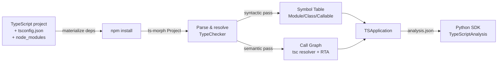

import { Tabs, TabItem, Steps, Aside, LinkCard, CardGrid, FileTree, Badge } from "@astrojs/starlight/components";

The **codeanalyzer-ts** backend analyzes TypeScript and TSX codebases and emits the canonical CLDK `analysis.json`: the same symbol-table and call-graph schema that the Python and Java analyses produce. It is a standalone binary that integrates with the CLDK Python SDK.

## Architecture

codeanalyzer-ts uses **ts-morph** (the TypeScript compiler API) to parse and resolve a TypeScript project in a single pass. The same `TypeChecker` instance that builds the symbol table resolves call targets, so the call-graph derivation reuses that resolution and is precise.



### Materialization
Before it parses, the analyzer makes sure that `node_modules` is present, with `npm install`, so the TypeChecker can resolve types. If `node_modules` is already prepared, skip this step with `--no-build`.

### Symbol table (Level 1 default)
Walks the ts-morph AST and indexes all declarations (classes, methods, interfaces, enums, type aliases, namespaces, functions) into a flat `symbol_table` keyed by project-relative file paths.

### Call graph
The ts-morph TypeChecker resolves each call site to its declared-type target, which is exact for static dispatch. It then adds RTA-style subtype expansion: polymorphic calls on interface or abstract receivers also emit edges to every instantiated concrete override. Provenance: `tsc`.

<Aside type="tip" title="Experimental: dataflow enrichment">
An experimental, opt-in pass uses [**Jelly**](https://github.com/cs-au-dk/jelly), a flow-based call-graph analyzer for JavaScript and TypeScript. It resolves the higher-order, callback, and dynamic-dispatch edges that the type checker misses. Select it with `--call-graph-provider jelly`, or `both` to compare against the `tsc` resolver. `tsc` stays the default. Jelly ships inside the `cants` binary, so you install nothing extra.
</Aside>

The call graph maintains the no-dangling-edges invariant: every edge endpoint is a real `Callable.signature`.

## Installing

The `cants` CLI is available from **PyPI** and **Homebrew**. Both distribute a prebuilt, self-contained binary for the target platform. You need neither Bun nor Node to run it.

<Tabs>
  <TabItem label="pip">
    ```bash
    pip install codeanalyzer-typescript
    cants --help
    ```
  </TabItem>
  <TabItem label="Homebrew">
    ```bash
    brew install codellm-devkit/homebrew-tap/codeanalyzer-typescript
    cants --help
    ```
  </TabItem>
</Tabs>

The CLDK Python SDK depends on the PyPI package `codeanalyzer-typescript` to find this backend. The package exposes `bin_path()`, which returns the path to the bundled binary. There is no `analysis_backend_path` argument. To change the binary out of band, for example to a locally built `cants`, set the `$CODEANALYZER_TS_BIN` environment variable to its path. This is the only override.

<Aside type="note">
The distributable is named **`codeanalyzer-typescript`** (the PyPI package and the Homebrew formula), but the command it installs on `PATH` is **`cants`**, the binary name of the analyzer. Run `cants`, not `codeanalyzer-typescript`.
</Aside>

### Building from source

To develop the analyzer, build it with **bun** 1.3 or later. Node 20 or later also runs it from source. **npm** must be on `PATH` to install dependencies:

```bash
cd codeanalyzer-ts
bun install
bun run build    # → dist/cants (standalone binary)
```

Or run from source without compilation:
```bash
bun run src/index.ts -i <project>
```

## CLI

The analyzer accepts these command-line options:

```bash
cants -i <path> [options]
```

| Option | Description |
|--------|-------------|
| `-i, --input <path>` | Project root to analyze **(required)** |
| `-o, --output <dir>` | Write `analysis.json` to this directory. Omit it to emit compact JSON to stdout (used by the SDK) |
| `-f, --format <fmt>` | Output format: `json` or `msgpack` (default: `json`) |
| `-a, --analysis-level <n>` | `1` = symbol table, tsc resolver call graph, and RTA (default). `2` = call graph |
| `-t, --target-files <paths...>` | Restrict analysis to specific files (for incremental builds) |
| `--skip-tests` / `--include-tests` | Skip or include test files (default: skip) |
| `--eager` / `--lazy` | Force a clean rebuild, or reuse the cache (default: reuse) |
| `--no-build` | Skip `npm install`. Assume that `node_modules` is prepared |
| `--no-phantoms` | Disable phantom (external) nodes for library imports |
| `-c, --cache-dir <dir>` | Cache directory (default: `<input>/.codeanalyzer`) |
| `-v` | Increase verbosity. Repeatable, for example `-vv` |

The analyzer writes all diagnostics to stderr. Stdout carries only JSON, unless you give `-o`.

## Output schema

The backend emits `analysis.json` containing a `TSApplication` with three top-level keys:

```json
{
  "symbol_table": {
    "src/index.ts": { ... },
    "src/services/user.ts": { ... }
  },
  "call_graph": [
    { "source": "src/index.main", "target": "src/services/user.UserService.getUser", ... }
  ],
  "external_symbols": {
    "express.Router.get": { "name": "get", "module": "express", ... }
  },
  "entrypoints": {}
}
```

### Symbol table

The `symbol_table` is a dictionary. It maps project-relative file paths to `TSModule` objects. Each module contains:

- **`imports`** and **`exports`**: statement-level detail (module specifier, binding name, type-only markers)
- **`classes`**, **`interfaces`**, **`enums`**, **`type_aliases`**: top-level named types, each with its own structure
- **`functions`**: module-level functions
- **`namespaces`**: recursive containers (same shape as modules)
- **`variables`**: module-scope declarations
- **`comments`**: all JSDoc and inline comments
- **`is_tsx`**, **`is_declaration_file`**: file metadata flags

#### Module, Class, and Callable structure

<Tabs syncKey="entity">
  <TabItem label="Class">
**`TSClass`** represents a single class declaration:
```ts
{
  name: "UserService",
  signature: "src/services/user.UserService",      // stable ID
  comments: [ ... ],
  decorators: [ ... ],                             // @Injectable, @Entity, etc.
  base_classes: [ ... ],                           // extends + implements (mixed)
  implements_types: [ ... ],                       // just interfaces
  type_parameters: [ ... ],                        // <T, U extends Base>
  methods: {
    "getUser": { ... },                            // TSCallable
    "saveUser": { ... }
  },
  attributes: {
    "logger": { type: "Logger", is_readonly: true }
  },
  is_abstract: false,
  is_exported: true,
  is_ambient: false,
  start_line: 10,
  end_line: 45
}
```
  </TabItem>
  <TabItem label="Callable">
**`TSCallable`** represents a function, method, constructor, arrow, or accessor:
```ts
{
  name: "getUser",
  signature: "src/services/user.UserService.getUser",
  kind: "method",                                  // function | method | constructor | getter | setter | arrow | function_expression
  accessibility: "public",                         // public | private | protected | null
  is_static: false,
  is_async: true,
  is_abstract: false,
  is_optional: false,
  is_readonly: false,
  is_exported: false,
  is_ambient: false,
  is_implicit: false,
  parameters: [
    {
      name: "id",
      type: "string",
      is_optional: false,
      is_rest: false,
      decorators: [ ... ]
    }
  ],
  type_parameters: [ ... ],
  return_type: "Promise<User>",
  code: "async getUser(id: string) { ... }",
  call_sites: [
    {
      method_name: "fetchById",
      receiver_type: "Database",
      callee_signature: "src/db.Database.fetchById",
      is_optional_chain: false,
      start_line: 20
    }
  ],
  cyclomatic_complexity: 3,
  is_entrypoint: false,
  accessed_symbols: [ ... ],
  local_variables: [ ... ],
  inner_callables: { },
  inner_classes: { }
}
```
  </TabItem>
  <TabItem label="Interface/Enum/TypeAlias">
**`TSInterface`** for abstract contracts:
```ts
{
  name: "Logger",
  signature: "src/logger.Logger",
  methods: { ... },                                // bodiless signatures
  properties: { ... },
  call_signatures: [ ... ],                        // raw text of call/construct signatures
  index_signatures: [ ... ],
  base_classes: [ ... ]                            // extended interfaces
}
```

**`TSEnum`** for enumerations:
```ts
{
  name: "Status",
  signature: "src/types.Status",
  members: [
    { name: "Active", value: "1" },
    { name: "Inactive", value: "2" }
  ],
  is_const: false
}
```

**`TSTypeAlias`** for type definitions:
```ts
{
  name: "UserId",
  signature: "src/types.UserId",
  aliased_type: "number & { readonly __brand: unique symbol }",
  type_parameters: [ ... ]
}
```
  </TabItem>
</Tabs>

### Call graph

The `call_graph` is an array of edges (`TSCallEdge`) in identity-only form: each edge records the exact signatures of caller and callee (never dangling):

```ts
{
  source: "src/services/user.UserService.getUser",
  target: "src/db.Database.fetchById",
  type: "CALL_DEP",
  weight: 1,
  provenance: ["tsc"],                            // "tsc" by default; "jelly" with --call-graph-provider jelly|both (experimental)
  tags: { "ts.dispatch": "rta" }                  // RTA subtype expansion tag
}
```

### External symbols (phantom nodes)

When the analyzer encounters a call to an imported library function, it creates a **phantom node** (a synthetic `TSExternalSymbol`) so the call-graph edge resolves to a defined endpoint:

```ts
{
  signature: "express.Router.get",
  name: "get",
  module: "express",
  kind: "function",
  is_external: true
}
```

Disable phantoms with `--no-phantoms` to restrict the graph to internal nodes only.

## TypeScript-native features

TypeScript includes several language-specific constructs that codeanalyzer-ts models as first-class entities:

| Feature | Support | Details |
|---------|---------|---------|
| **Interfaces** | Full | Separate `interfaces{}` collection. You query it separately from classes |
| **Type aliases** | Full | `TSTypeAlias` with aliased type text and type parameters |
| **Enums** | Full | Discriminated collection. Members with computed or literal values |
| **Namespaces** | Full | Recursive containers. Same structure as modules |
| **Type parameters** | Full | `<T, U extends Base = Default>` structured on classes, callables, aliases |
| **Decorators** | Structured | `name`, `qualified_name`, `positional_arguments[]`, `keyword_arguments{}` (for framework entrypoint detection) |
| **Modifiers** | Typed fields | `accessibility`, `is_static`, `is_async`, `is_readonly`, `is_abstract`, `is_optional`, `is_ambient` |
| **Overload signatures** | Full | `overload_signatures[]` on the implementation callable |
| **JSX** | Tracked | `is_tsx` flag on modules |
| **Declaration files** | Tracked | `is_declaration_file` flag, useful for filters |

## Python SDK integration

The `CLDK.typescript(...)` factory analyzes TypeScript projects through the same `CLDK` analysis API as Python and Java:

```python
from cldk import CLDK
from cldk.analysis import AnalysisLevel

analysis = CLDK.typescript(
    project_path="/path/to/ts/project",
    analysis_level=AnalysisLevel.call_graph,
)

# Standard analysis methods:
print(analysis.get_classes())      # Dict[str, TSClass]
graph = analysis.get_call_graph()  # networkx.DiGraph
```

The `CLDK(language="typescript").analysis(...)` form still works, but it is **deprecated**. Use `CLDK.typescript(...)`. The `from cldk import CLDK` import does not change.

### Choosing a backend

`CLDK.typescript(...)` accepts the `project_path`, `analysis_level`, `target_files`, and `eager` keyword arguments. The **type** of the `backend=` config selects the backend:

- **In-memory codeanalyzer** (default): omit `backend=`, or pass `backend=CodeAnalyzerConfig(cache_dir=...)` to override where artifacts are cached.
- **Read-only Neo4j**: pass `backend=Neo4jConnectionConfig(...)` to query a graph populated out of band.

```python
from cldk import CLDK
from cldk.analysis.commons.backend_config import (
    CodeAnalyzerConfig,
    Neo4jConnectionConfig,
)

# In-memory backend with a custom cache directory
analysis = CLDK.typescript(
    project_path="/path/to/ts/project",
    backend=CodeAnalyzerConfig(cache_dir="/tmp/analysis-cache"),
)

# Read-only Neo4j backend
analysis = CLDK.typescript(
    project_path="/path/to/ts/project",
    backend=Neo4jConnectionConfig(
        uri="bolt://localhost:7687",
        username="neo4j",
        password="neo4j",
        database=None,
        application_name="my_project",
    ),
)
```

Import `Neo4jConnectionConfig` from `cldk.analysis.commons.backend_config`, or from `cldk.analysis.typescript.neo4j`.

<Aside type="tip" title="Where the graph comes from">
The read-only backend queries a graph that codeanalyzer-ts populates with `cants --emit neo4j`. Run the analysis as a scheduled job, then serve agents from the shared graph. This is the [analysis-at-scale](/at-scale/) workflow.
</Aside>

## Schema invariants

All signatures follow one canonical `signatureOf()` rule: **project-relative file path (without extension) + dot-separated members**. For example:

- Module-level function: `src/index.getConfig`
- Method: `src/services/user.UserService.getUser`
- Constructor: `src/models/User.User.constructor`
- Namespace member: `src/api.v1.ApiRouter.get`

This rule makes sure that every call-graph edge points to a real symbol-table entry.

## Caching and incremental analysis

The analyzer keeps a cache under one language-keyed `cache_dir` (default: `<project>/.codeanalyzer`). TypeScript artifacts live under `<cache_dir>/typescript/`, stamped with the analyzer version. Caching is **on by default**. From the SDK, set the cache root with `backend=CodeAnalyzerConfig(cache_dir=...)`. On the CLI, use `-c <dir>`. These events invalidate the cache:
- Analyzer version change
- Any source file modification (content hash mismatch)
- `--eager` flag (forces clean rebuild)

Use `--lazy` (default) to reuse the cache, or `--target-files <list>` to update only specific files.

## Performance notes

- **Symbol table build**: O(n) in source lines. The ts-morph parse is linear
- **Call graph build**: O(c) in call sites. The checker resolution is constant-time for each site
- **Dataflow enrichment (experimental, Jelly)**: opt-in with `--call-graph-provider jelly`, or `both` to compare against `tsc`. It adds a separate whole-program Jelly pass, so the cost depends on the Jelly analysis time

For large projects (more than 100k lines), analysis takes seconds to tens of seconds.

## Current maturity

codeanalyzer-ts is **beta**. The symbol table and call graph are stable, and you can query them through the Python SDK. Entrypoint detection is not built yet.

- **Symbol table**: Stable. All TypeScript node kinds are supported
- **Call graph**: Stable. The tsc resolution and the RTA expansion are proven correct
- **Python SDK integration**: Available with `CLDK.typescript(...)`, for the in-process and read-only Neo4j backends
- **Neo4j graph output**: Available with `--emit neo4j` and `--emit schema` (see [Analysis at scale](/at-scale/))
- **Entrypoint detection**: Not built. `get_entry_point_methods()` and `get_service_entry_point_methods()` raise `NotImplementedError`, and the backend emits an empty `entrypoints` array
- **Dataflow enrichment (Jelly)**: Experimental. `--call-graph-provider jelly` exists, but `tsc` stays the default

## See also

<CardGrid>
  <LinkCard title="What is CLDK?" href="/what-is-cldk/" description="A single analysis API across supported languages." />
  <LinkCard title="Quickstart" href="/quickstart/" description="Run CLDK on a first project." />
  <LinkCard title="Backends overview" href="/backends/" description="All CLDK analysis backends." />
  <LinkCard title="Contributing: Add a language" href="/contributing/add-language-backend/" description="Scaffold a new backend such as codeanalyzer-ts." />
</CardGrid>
