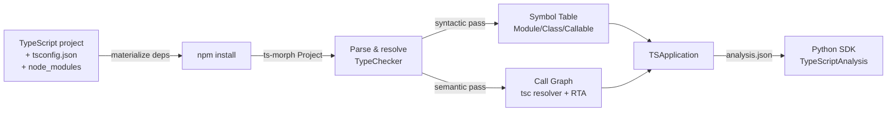

import { Tabs, TabItem, Steps, Aside, LinkCard, CardGrid, FileTree, Badge } from "@astrojs/starlight/components";

The **codeanalyzer-ts** backend analyzes TypeScript and TSX codebases and emits the canonical CLDK `analysis.json`: the same symbol-table and call-graph schema that Python and Java analyses produce. It is a standalone binary that plugs into the CLDK Python SDK.

## Architecture

codeanalyzer-ts uses **ts-morph** (the TypeScript compiler API) to parse and resolve a TypeScript project in a single pass. The same `TypeChecker` instance that builds the symbol table also resolves call targets, making the call-graph derivation cheap and precise.



### Materialization
Before parsing, the analyzer ensures `node_modules` is present (via `npm install`) so the TypeChecker can resolve types. Omit this with `--no-build` if you have a prepared `node_modules`.

### Symbol table (Level 1 default)
Walks the ts-morph AST and indexes all declarations (classes, methods, interfaces, enums, type aliases, namespaces, functions) into a flat `symbol_table` keyed by project-relative file paths.

### Call graph
ts-morph's TypeChecker resolves each call site to its declared-type target (exact for static dispatch), plus RTA-style subtype expansion: polymorphic calls on interface/abstract receivers also emit edges to every instantiated concrete override. Provenance: `tsc`.

<Aside type="tip" title="Planned: dataflow enrichment">
A future enrichment pass will add the dynamic-dispatch and dataflow edges the type checker cannot reach, using [**Jelly**](https://github.com/cs-au-dk/jelly) (a static call-graph analyzer for JavaScript/TypeScript). It is not yet implemented; the analyzer accepts `-a 2` today but produces the same call graph as `-a 1`.
</Aside>

The call graph maintains the no-dangling-edges invariant: every edge endpoint is a real `Callable.signature`.

## Installing

The fastest way to get the `cants` CLI is from **PyPI** or **Homebrew**. Both ship a prebuilt, self-contained binary for your platform — no Bun or Node is needed to *run* it:

<Tabs>
  <TabItem label="pip">
    ```bash
    pip install codeanalyzer-typescript
    cants --help
    ```
  </TabItem>
  <TabItem label="Homebrew">
    ```bash
    brew install codellm-devkit/homebrew-tap/codeanalyzer-typescript
    cants --help
    ```
  </TabItem>
</Tabs>

The PyPI package `codeanalyzer-typescript` is also what the CLDK Python SDK depends on to locate this backend — it exposes `bin_path()` to point at the bundled binary.

<Aside type="note">
The distributable is named **`codeanalyzer-typescript`** (the PyPI package and the Homebrew formula), but the command it installs on your `PATH` is **`cants`** — the analyzer's short binary name. Run `cants`, not `codeanalyzer-typescript`.
</Aside>

### Building from source

To hack on the analyzer, build it with **bun** ≥ 1.3 (Node ≥ 20 also works to run from source). **npm** must be on PATH to materialize dependencies:

```bash
cd codeanalyzer-ts
bun install
bun run build    # → dist/cants (standalone binary)
```

Or run from source without compilation:
```bash
bun run src/index.ts -i <project>
```

## CLI

The analyzer accepts these command-line options:

```bash
cants -i <path> [options]
```

| Option | Description |
|--------|-------------|
| `-i, --input <path>` | Project root to analyze **(required)** |
| `-o, --output <dir>` | Write `analysis.json` to this directory; omit to emit compact JSON to stdout (used by the SDK) |
| `-f, --format <fmt>` | Output format: `json` or `msgpack` (default: `json`) |
| `-a, --analysis-level <n>` | `1` = symbol table + tsc resolver call graph + RTA (default); `2` = call graph |
| `-t, --target-files <paths...>` | Restrict analysis to specific files (for incremental builds) |
| `--skip-tests` / `--include-tests` | Skip or include test files (default: skip) |
| `--eager` / `--lazy` | Force clean rebuild vs. reuse cache (default: reuse) |
| `--no-build` | Skip `npm install`; assume `node_modules` is prepared |
| `--no-phantoms` | Disable phantom (external) nodes for library imports |
| `-c, --cache-dir <dir>` | Cache directory (default: `<input>/.codeanalyzer`) |
| `-v` | Increase verbosity; repeatable (e.g. `-vv`) |

All diagnostics are written to stderr; stdout is reserved for JSON (unless `-o` is specified).

## Output schema

The backend emits `analysis.json` containing a `TSApplication` with three top-level keys:

```json
{
  "symbol_table": {
    "src/index.ts": { ... },
    "src/services/user.ts": { ... }
  },
  "call_graph": [
    { "source": "src/index.main", "target": "src/services/user.UserService.getUser", ... }
  ],
  "external_symbols": {
    "express.Router.get": { "name": "get", "module": "express", ... }
  },
  "entrypoints": {}
}
```

### Symbol table

The `symbol_table` is a dictionary mapping project-relative file paths to `TSModule` objects. Each module contains:

- **`imports`** and **`exports`**: statement-level detail (module specifier, binding name, type-only markers)
- **`classes`**, **`interfaces`**, **`enums`**, **`type_aliases`**: top-level named types, each with its own structure
- **`functions`**: module-level functions
- **`namespaces`**: recursive containers (same shape as modules)
- **`variables`**: module-scope declarations
- **`comments`**: all JSDoc and inline comments
- **`is_tsx`**, **`is_declaration_file`**: file metadata flags

#### Module, Class, and Callable structure

<Tabs syncKey="entity">
  <TabItem label="Class">
**`TSClass`** represents a single class declaration:
```ts
{
  name: "UserService",
  signature: "src/services/user.UserService",      // stable ID
  comments: [ ... ],
  decorators: [ ... ],                             // @Injectable, @Entity, etc.
  base_classes: [ ... ],                           // extends + implements (mixed)
  implements_types: [ ... ],                       // just interfaces
  type_parameters: [ ... ],                        // <T, U extends Base>
  methods: {
    "getUser": { ... },                            // TSCallable
    "saveUser": { ... }
  },
  attributes: {
    "logger": { type: "Logger", is_readonly: true }
  },
  is_abstract: false,
  is_exported: true,
  is_ambient: false,
  start_line: 10,
  end_line: 45
}
```
  </TabItem>
  <TabItem label="Callable">
**`TSCallable`** represents a function, method, constructor, arrow, or accessor:
```ts
{
  name: "getUser",
  signature: "src/services/user.UserService.getUser",
  kind: "method",                                  // function | method | constructor | getter | setter | arrow | function_expression
  accessibility: "public",                         // public | private | protected | null
  is_static: false,
  is_async: true,
  is_abstract: false,
  is_optional: false,
  is_readonly: false,
  is_exported: false,
  is_ambient: false,
  is_implicit: false,
  parameters: [
    {
      name: "id",
      type: "string",
      is_optional: false,
      is_rest: false,
      decorators: [ ... ]
    }
  ],
  type_parameters: [ ... ],
  return_type: "Promise<User>",
  code: "async getUser(id: string) { ... }",
  call_sites: [
    {
      method_name: "fetchById",
      receiver_type: "Database",
      callee_signature: "src/db.Database.fetchById",
      is_optional_chain: false,
      start_line: 20
    }
  ],
  cyclomatic_complexity: 3,
  is_entrypoint: false,
  accessed_symbols: [ ... ],
  local_variables: [ ... ],
  inner_callables: { },
  inner_classes: { }
}
```
  </TabItem>
  <TabItem label="Interface/Enum/TypeAlias">
**`TSInterface`** for abstract contracts:
```ts
{
  name: "Logger",
  signature: "src/logger.Logger",
  methods: { ... },                                // bodiless signatures
  properties: { ... },
  call_signatures: [ ... ],                        // raw text of call/construct signatures
  index_signatures: [ ... ],
  base_classes: [ ... ]                            // extended interfaces
}
```

**`TSEnum`** for enumerations:
```ts
{
  name: "Status",
  signature: "src/types.Status",
  members: [
    { name: "Active", value: "1" },
    { name: "Inactive", value: "2" }
  ],
  is_const: false
}
```

**`TSTypeAlias`** for type definitions:
```ts
{
  name: "UserId",
  signature: "src/types.UserId",
  aliased_type: "number & { readonly __brand: unique symbol }",
  type_parameters: [ ... ]
}
```
  </TabItem>
</Tabs>

### Call graph

The `call_graph` is an array of edges (`TSCallEdge`) in identity-only form: each edge records the exact signatures of caller and callee (never dangling):

```ts
{
  source: "src/services/user.UserService.getUser",
  target: "src/db.Database.fetchById",
  type: "CALL_DEP",
  weight: 1,
  provenance: ["tsc"],                            // "tsc" today; "jelly" once dataflow enrichment lands
  tags: { "ts.dispatch": "rta" }                  // RTA subtype expansion tag
}
```

### External symbols (phantom nodes)

When the analyzer encounters a call to an imported library function, it creates a **phantom node** (a synthetic `TSExternalSymbol`) so the call-graph edge points somewhere real:

```ts
{
  signature: "express.Router.get",
  name: "get",
  module: "express",
  kind: "function",
  is_external: true
}
```

Disable phantoms with `--no-phantoms` if you want the graph to be internal-only.

## TypeScript-native features

Unlike Python or Java, TypeScript brings several language-specific constructs that codeanalyzer-ts models as first-class citizens:

| Feature | Support | Details |
|---------|---------|---------|
| **Interfaces** | Full | Separate `interfaces{}` collection; queryable separately from classes |
| **Type aliases** | Full | `TSTypeAlias` with aliased type text and type parameters |
| **Enums** | Full | Discriminated collection; members with computed/literal values |
| **Namespaces** | Full | Recursive containers; same structure as modules |
| **Type parameters** | Full | `<T, U extends Base = Default>` structured on classes, callables, aliases |
| **Decorators** | Structured | `name`, `qualified_name`, `positional_arguments[]`, `keyword_arguments{}` (for framework entrypoint detection) |
| **Modifiers** | Typed fields | `accessibility`, `is_static`, `is_async`, `is_readonly`, `is_abstract`, `is_optional`, `is_ambient` |
| **Overload signatures** | Full | `overload_signatures[]` on the implementation callable |
| **JSX** | Tracked | `is_tsx` flag on modules |
| **Declaration files** | Tracked | `is_declaration_file` flag; useful for filtering |

## Python SDK integration

TypeScript support in the Python SDK is **coming soon**. When available, you will be able to analyze TypeScript projects with the same `CLDK` facade as Python and Java:

```python
from cldk import CLDK
from cldk.analysis import AnalysisLevel

analysis = CLDK(language="typescript").analysis(
    project_path="/path/to/ts/project",
    analysis_level=AnalysisLevel.call_graph,
)

# All familiar methods:
print(analysis.get_classes())      # Dict[str, TSClass]
graph = analysis.get_call_graph()  # networkx.DiGraph
```

<Aside type="note">
The codeanalyzer-ts backend is complete and production-ready. The Python SDK integration is in progress on the `add-typescript-support` branch.
</Aside>

## Schema invariants

All signatures follow one canonical `signatureOf()` rule: **project-relative file path (without extension) + dot-separated members**. For example:

- Module-level function: `src/index.getConfig`
- Method: `src/services/user.UserService.getUser`
- Constructor: `src/models/User.User.constructor`
- Namespace member: `src/api.v1.ApiRouter.get`

This ensures every call-graph edge points to a real symbol-table entry.

## Caching and incremental analysis

The analyzer maintains a cache under `<project>/.codeanalyzer/` (or `-c <dir>`), stamped with the analyzer version. The cache is invalidated on:
- Analyzer version change
- Any source file modification (content hash mismatch)
- `--eager` flag (forces clean rebuild)

Use `--lazy` (default) to reuse the cache, or `--target-files <list>` to update only specific files.

## Performance notes

- **Symbol table build**: O(n) in source lines; ts-morph's parse is linear
- **Call graph build**: O(c) in call sites; the checker resolution is constant-time per site
- **Dataflow enrichment (planned, Jelly)**: not yet implemented; cost will depend on Jelly's analysis time

For large projects (>100k LOC), expect analysis to take seconds to tens of seconds.

## Current maturity

- **Symbol table**: Stable; all TypeScript node kinds supported
- **Call graph**: Stable; tsc resolution + RTA expansion proven correct
- **Dataflow enrichment (Jelly)**: Planned; not yet implemented
- **Python SDK integration**: In progress

## See also

<CardGrid>
  <LinkCard title="What is CLDK?" href="/what-is-cldk/" description="One unified analysis facade across languages." />
  <LinkCard title="Quickstart" href="/quickstart/" description="Get CLDK running on your first project." />
  <LinkCard title="Backends overview" href="/backends/" description="All CLDK analysis backends." />
  <LinkCard title="Contributing: Add a language" href="/contributing/add-language-backend/" description="Scaffold a new backend like codeanalyzer-ts." />
</CardGrid>
