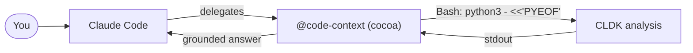

import { Steps, Tabs, TabItem, Aside, FileTree, LinkCard, CardGrid, Badge } from "@astrojs/starlight/components";

A coding agent guesses about code: it greps a few files and hopes. **COCOA** (**CO**de **CO**ntext **A**gent) is a [Claude Code plugin](https://code.claude.com/docs/en/plugins) that gives it ground truth instead: before the agent answers or edits, COCOA runs CLDK inside a Bash heredoc and reads back real static analysis: who calls a method, whether a sink is reachable, what a change would break.

This guide builds COCOA **by hand**, so you see every moving part of a CLDK-powered plugin: a manifest, a code-context subagent, and a couple of skills, all powered by one tiny CLDK heredoc. (The plugin's technical id stays lowercase `cocoa`, so its skills are `/cocoa:callers` and friends.)

<Aside type="note" title="Prerequisites">
[Claude Code](https://code.claude.com/docs/en/plugins), `pip install cldk` available on your `PATH`, and a JDK for Java projects. Skim [What is CLDK?](/what-is-cldk/) if the `analysis` facade is new to you.
</Aside>

## How cocoa works

cocoa is a thin wrapper around one idea: **the agent's Bash tool already runs anything**, so cocoa just has it run CLDK in a one-shot Python heredoc and read stdout. No SDK glue, no server.



The plugin ships two kinds of component over that engine:

- a **subagent** (`code-context`): cocoa's brain, which Claude delegates to for code-understanding questions;
- **skills** (`/cocoa:callers`, `/cocoa:reachable`): named, reusable operations you (or the agent) can invoke directly.

### The engine: CLDK in a heredoc

Every cocoa component runs a variant of this. It's the [agent pattern](/guides/common-tasks/) made into a plugin:

```bash
python3 - <<'PYEOF'
from cldk import CLDK
from cldk.analysis import AnalysisLevel
import networkx as nx

analysis = CLDK(language="java").analysis(
    project_path=".",
    analysis_level=AnalysisLevel.call_graph,   # needed for callers/reachability
)

callers = analysis.get_callers("org.apache.commons.cli.Options", "addOption(Option)")
for c in callers["caller_details"]:
    print(c["caller_method"].klass)
PYEOF
```

<Aside type="caution" title="Two things to know">
Call-graph queries need `analysis_level=AnalysisLevel.call_graph`. And since each heredoc is a fresh process, the analysis is rebuilt each call, but CLDK caches it on disk (`<project>/.codeanalyzer`), so only the first call is slow.
</Aside>

## COCOA in action

Here's the part that matters: **once COCOA is installed you don't run CLDK yourself.** You talk to Claude Code the way you always do, and it reaches for COCOA whenever a question needs ground truth: Claude auto-delegates to the `code-context` agent based on its description, or you invoke a skill like `/cocoa:reachable` directly. Three everyday jobs it turns from guesswork into facts:

### Write a unit test that actually compiles

Ask an LLM to test a method it can only half-see and you get tests that call methods that don't exist and mock the wrong collaborators. COCOA hands it the method's real body **and** the methods it actually calls, so the test targets true dependencies.

```text frame="terminal"
you ▸ Write a unit test for DefaultParser.parse(Options, String[]).

  ⤷ @code-context gather context for DefaultParser.parse(Options, String[])
  ⤷ COCOA ran CLDK: get_method (the body) + get_callees (its collaborators)

Claude ▸ parse() calls Options.getOption, CommandLine.addOption, and Util.stripLeadingHyphens,
         no external services, so nothing needs mocking. Here's a JUnit test that builds a real
         Options, parses argv, and asserts on the resulting CommandLine: …
```

The test is grounded in what `parse()` truly does: it compiles and exercises the right paths, instead of inventing APIs.

### Refactor without breaking callers you forgot about

About to change a signature? The unsafe move is editing the one file you happened to open. COCOA gives the agent the real fan-in first.

```text frame="terminal"
you ▸ I want to change Options.addOption(Option). What will break?

  ⤷ /cocoa:callers org.apache.commons.cli.Options addOption(Option)
  ⤷ COCOA ran CLDK get_callers

Claude ▸ 7 call sites across 4 classes use it: Options.addOption(String, boolean, String),
         DefaultParser.handleOption, GnuParser.flatten, … I'll update exactly those and
         leave everything else untouched. Want me to make the change?
```

The edit covers the actual call sites: no missed caller, no surprise red build.

### Understand unfamiliar code, correctly

New to a codebase? Instead of skimming files and hoping, let the agent map the real flow.

```text frame="terminal"
you ▸ I'm new here, how does option parsing actually flow?

  ⤷ @code-context trace parsing starting at DefaultParser.parse
  ⤷ COCOA walked callers and callees via CLDK

Claude ▸ DefaultParser.parse is invoked by CommandLineParser implementations; it calls
         Options.getOption, CommandLine.addOption, and Util.stripLeadingHyphens.
         Here's the real path through the parser: …
```

A mental model built from the call graph, not a plausible-sounding guess.

> The pattern across all three: you ask a normal question, COCOA quietly runs CLDK, and the agent answers with facts. The rest of this page is how you wire that up.

## Build the plugin

<Steps>

1. **Scaffold the layout.** A plugin is just a directory. Only `plugin.json` goes inside `.claude-plugin/`; everything else sits at the root.

   <FileTree>
   - cocoa/
     - .claude-plugin/
       - plugin.json
     - agents/
       - code-context.md
     - skills/
       - callers/
         - SKILL.md
       - reachable/
         - SKILL.md
     - README.md
   </FileTree>

2. **Write the manifest**: `.claude-plugin/plugin.json`. Only `name` is required; the rest is metadata for the plugin browser.

   ```json title=".claude-plugin/plugin.json"
   {
     "name": "cocoa",
     "displayName": "cocoa (Code Context Agent)",
     "version": "0.1.0",
     "description": "CLDK-powered code understanding: callers, reachability, and change impact, grounded in real static analysis.",
     "author": { "name": "Your Name" },
     "keywords": ["cldk", "static-analysis", "call-graph", "reachability"],
     "license": "Apache-2.0"
   }
   ```

3. **Add the Code Context subagent**: `agents/code-context.md`. The frontmatter declares its name, when Claude should delegate to it, and which tools it may use (`Bash` is the one that matters, it runs the heredoc). The body teaches it the CLDK pattern.

   ````markdown title="agents/code-context.md"
   ---
   name: code-context
   description: Answers questions about a codebase (callers, reachability, change impact) using CLDK static analysis. Delegate here before editing unfamiliar code.
   tools: Bash, Read, Grep, Glob
   model: sonnet
   ---

   You are a code-context agent. You never guess about call relationships or
   reachability, you compute them with CLDK and cite the result.

   To answer a question, run CLDK in a Python heredoc and read its stdout:

   ```bash
   python3 - <<'PYEOF'
   from cldk import CLDK
   from cldk.analysis import AnalysisLevel
   import networkx as nx

   analysis = CLDK(language="java").analysis(
       project_path=".", analysis_level=AnalysisLevel.call_graph,
   )
   # ... query analysis (get_callers / get_callees / get_call_graph) and print() ...
   PYEOF
   ```

   Guidelines:
   - Build the analysis at `call_graph` level for any caller/callee/reachability query.
   - For reachability, use `networkx.has_path` over `analysis.get_call_graph()`.
   - Print exactly what you need; the stdout is your only observation.
   - Report file/line and method signatures from the CLDK output, never invent them.
   ````

4. **Add skills for named operations.** Skills are namespaced by the plugin, so these become `/cocoa:callers` and `/cocoa:reachable`. `$ARGUMENTS` is whatever the user types after the command.

   <Tabs>
     <TabItem label="callers">
     ````markdown title="skills/callers/SKILL.md"
     ---
     description: List every method that calls a target Java method, via CLDK.
     allowed-tools: Bash, Read
     ---

     Find all callers of the method in: "$ARGUMENTS"
     (format: `fully.qualified.Class methodSignature`, e.g. `org.apache.commons.cli.Options addOption(Option)`)

     Run this, substituting the class and method, and report each caller:

     ```bash
     python3 - <<'PYEOF'
     from cldk import CLDK
     from cldk.analysis import AnalysisLevel

     analysis = CLDK(language="java").analysis(
         project_path=".", analysis_level=AnalysisLevel.call_graph,
     )
     callers = analysis.get_callers("<CLASS>", "<METHOD>")
     for c in callers["caller_details"]:
         m = c["caller_method"]
         print(f"{m.klass} :: {m.method.signature}")
     PYEOF
     ```
     ````
     </TabItem>
     <TabItem label="reachable">
     ````markdown title="skills/reachable/SKILL.md"
     ---
     description: Decide whether a sink method is reachable from a source method in the call graph.
     allowed-tools: Bash, Read
     ---

     Determine reachability for: "$ARGUMENTS"
     (format: `sourceClass sourceMethod -> sinkClass sinkMethod`)

     ```bash
     python3 - <<'PYEOF'
     from cldk import CLDK
     from cldk.analysis import AnalysisLevel
     import networkx as nx

     analysis = CLDK(language="java").analysis(
         project_path=".", analysis_level=AnalysisLevel.call_graph,
     )
     cg = analysis.get_call_graph()

     def node_for(cls, method):
         return next((n for n, d in cg.nodes(data=True)
                      if cls in str(d) and method in str(d)), None)

     src, sink = node_for("<SRC_CLASS>", "<SRC_METHOD>"), node_for("<SINK_CLASS>", "<SINK_METHOD>")
     print("REACHABLE" if src and sink and nx.has_path(cg, src, sink) else "NOT REACHABLE")
     PYEOF
     ```
     ````
     </TabItem>
   </Tabs>

5. **(Optional) Greet on session start** with a hook: `hooks/hooks.json`. Handy for reminding users the commands exist.

   ```json title="hooks/hooks.json"
   {
     "hooks": {
       "SessionStart": [
         { "hooks": [ { "type": "command",
           "command": "echo 'cocoa ready: try @code-context, /cocoa:callers, /cocoa:reachable'" } ] }
       ]
     }
   }
   ```

6. **Run it locally.** Point Claude Code at the directory, no install needed while developing:

   ```bash
   claude --plugin-dir ./cocoa
   ```

   Then delegate to the agent or call a skill:

   ```text frame="terminal"
   > @code-context what calls Options.addOption, and can CLI.main reach CommandLine.execute?
   > /cocoa:callers org.apache.commons.cli.Options addOption(Option)
   ```

   Edit a `SKILL.md` and `/reload-plugins` picks it up; agent and hook changes need a session restart.

7. **Publish it.** Validate, then add a marketplace entry so others can install it with the `/plugin` command.

   ```bash
   claude plugin validate ./cocoa
   # share via a marketplace.json in your repo, then:
   /plugin marketplace add you/cocoa-plugin
   /plugin install cocoa@cocoa-plugin
   ```

</Steps>

<Aside type="tip" title="Why a subagent *and* skills?">
The subagent is cocoa's identity: Claude delegates open-ended "help me understand this code" work to it. The skills are sharp, named tools (`/cocoa:callers`) for when you know exactly what you want. Both run the same CLDK heredoc; you're just choosing how much autonomy to hand the model.
</Aside>

## Where to go next

<CardGrid>
  <LinkCard title="Common tasks" description="The individual CLDK calls cocoa's heredocs are built from." href="/guides/common-tasks/" />
  <LinkCard title="Core concepts" description="Call graphs, reachability, and analysis levels: the facts cocoa surfaces." href="/guides/concepts/" />
  <LinkCard title="Java API reference" description="Every method available inside a cocoa heredoc." href="/reference/python-api/java/" />
  <LinkCard title="COCO MCP Toolbox" description="Prefer a cross-process tool server to an in-process plugin? Expose CLDK over MCP instead." href="/cocoa-mcp/" />
</CardGrid>
