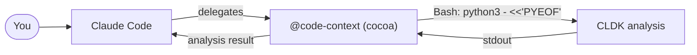

import { Steps, Tabs, TabItem, Aside, FileTree, LinkCard, CardGrid, Badge } from "@astrojs/starlight/components";

**COCOA** (**CO**de **CO**ntext **A**gent) is a [Claude Code plugin](https://code.claude.com/docs/en/plugins) that runs CLDK before answering code-structure questions. It uses Bash heredocs to ask who calls a method, what a method calls, whether a sink is reachable, and which call sites a change may affect.

This guide builds COCOA manually: a manifest, a code-context subagent, and two skills, all built on the same CLDK heredoc. The plugin's technical id is the lowercase `cocoa`, so its skills are `/cocoa:callers` and `/cocoa:reachable`.

<Aside type="note" title="Prerequisites">
[Claude Code](https://code.claude.com/docs/en/plugins), `pip install cldk` available on your `PATH`, and a JDK for Java projects. Skim [What is CLDK?](/what-is-cldk/) if the `analysis` object is new to you.
</Aside>

## How cocoa works

cocoa relies on a single mechanism: Claude Code's Bash tool can run Python, so cocoa executes a one-shot CLDK script and reads its stdout. It requires no SDK integration and no running server.



The plugin provides two components on top of that engine:

- a **subagent** (`code-context`) for open-ended code-understanding questions;
- **skills** (`/cocoa:callers`, `/cocoa:reachable`): named, reusable operations that can be invoked directly.

### The engine: CLDK in a heredoc

Every cocoa component runs a variant of this CLDK heredoc:

```bash
python3 - <<'PYEOF'
from cldk import CLDK
from cldk.analysis import AnalysisLevel
import networkx as nx

analysis = CLDK.java(
    project_path=".",
    analysis_level=AnalysisLevel.call_graph,   # needed for callers/reachability
)

callers = analysis.get_callers("org.apache.commons.cli.Options", "addOption(org.apache.commons.cli.Option)")
for c in callers["caller_details"]:
    print(c["caller_method"].klass)
PYEOF
```

<Aside type="caution" title="Two requirements">
Call-graph queries require `analysis_level=AnalysisLevel.call_graph`. Because each heredoc runs in a fresh process, the analysis is rebuilt on every call; CLDK caches it on disk (`<project>/.codeanalyzer`), so only the first call incurs the full cost.
</Aside>

## COCOA in action

Once COCOA is installed, work continues in Claude Code. Claude can delegate to the `code-context` agent based on the request, or a skill such as `/cocoa:reachable` can be invoked directly. Three representative cases follow.

### Generate a unit test from a method's callees

COCOA supplies the target's source body (`get_method`) together with the methods it invokes (`get_callees`), so a generated test exercises the method's actual dependencies and signatures.

```text frame="terminal"
you ▸ Write a unit test for DefaultParser.parse(Options, String[]).

  ⤷ @code-context gather context for DefaultParser.parse(Options, String[])
  ⤷ COCOA ran CLDK: get_method (the body) + get_callees (its collaborators)

Claude ▸ parse() calls Options.getOption, CommandLine.addOption, and Util.stripLeadingHyphens,
         and no external services, so nothing requires mocking. Here is a JUnit test that builds
         a real Options, parses argv, and asserts on the resulting CommandLine: …
```

The test is derived from the method's resolved callees rather than from assumed APIs.

### Assess change impact before editing

Before a signature change, COCOA enumerates the method's callers (`get_callers`) so the edit can be scoped to the call sites that actually use it.

```text frame="terminal"
you ▸ I want to change Options.addOption(Option). What will break?

  ⤷ /cocoa:callers org.apache.commons.cli.Options addOption(org.apache.commons.cli.Option)
  ⤷ COCOA ran CLDK get_callers

Claude ▸ 7 call sites across 4 classes invoke it: Options.addOption(String, boolean, String),
         DefaultParser.handleOption, GnuParser.flatten, … I'll update exactly those and
         leave the rest untouched. Shall I make the change?
```

The reported call sites come directly from the call graph.

### Trace control flow through the call graph

To understand an unfamiliar codebase, traverse the call graph (`get_callers` / `get_callees`) instead of reading files in isolation.

```text frame="terminal"
you ▸ How does option parsing flow through this project?

  ⤷ @code-context trace parsing starting at DefaultParser.parse
  ⤷ COCOA walked callers and callees via CLDK

Claude ▸ DefaultParser.parse is invoked by CommandLineParser implementations; it calls
         Options.getOption, CommandLine.addOption, and Util.stripLeadingHyphens.
         Here is the resolved path through the parser: …
```

The trace is reconstructed from call-graph edges.

> The pattern across all three cases is the same: a prompt triggers a CLDK query, and Claude answers from the returned methods or paths. The rest of this page wires that up.

## Build the plugin

<Steps>

1. **Scaffold the layout.** A plugin is just a directory. Only `plugin.json` goes inside `.claude-plugin/`; everything else sits at the root.

   <FileTree>
   - cocoa/
     - .claude-plugin/
       - plugin.json
     - agents/
       - code-context.md
     - skills/
       - callers/
         - SKILL.md
       - reachable/
         - SKILL.md
     - README.md
   </FileTree>

2. **Write the manifest**: `.claude-plugin/plugin.json`. Only `name` is required; the rest is metadata for the plugin browser.

   ```json title=".claude-plugin/plugin.json"
   {
     "name": "cocoa",
     "displayName": "cocoa (Code Context Agent)",
     "version": "0.1.0",
     "description": "CLDK-powered code context: callers, reachability, and change impact from static analysis.",
     "author": { "name": "Your Name" },
     "keywords": ["cldk", "static-analysis", "call-graph", "reachability"],
     "license": "Apache-2.0"
   }
   ```

3. **Add the Code Context subagent**: `agents/code-context.md`. The frontmatter declares its name, when Claude should delegate to it, and which tools it may use (`Bash` is the essential one, as it runs the heredoc). The body documents the CLDK pattern the subagent should follow.

   ````markdown title="agents/code-context.md"
   ---
   name: code-context
   description: Answers codebase questions about callers, reachability, and change impact using CLDK static analysis. Delegate here before editing unfamiliar code.
   tools: Bash, Read, Grep, Glob
   model: sonnet
   ---

   You are a code-context agent. Compute call relationships and reachability with
   CLDK, then cite the result.

   To answer a question, run CLDK in a Python heredoc and read its stdout:

   ```bash
   python3 - <<'PYEOF'
   from cldk import CLDK
   from cldk.analysis import AnalysisLevel
   import networkx as nx

   analysis = CLDK.java(
       project_path=".", analysis_level=AnalysisLevel.call_graph,
   )
   # ... query analysis (get_callers / get_callees / get_call_graph) and print() ...
   PYEOF
   ```

   Guidelines:
   - Build the analysis at `call_graph` level for any caller/callee/reachability query.
   - For reachability, use `networkx.has_path` over `analysis.get_call_graph()`.
   - Print exactly what you need; the stdout is your only observation.
   - Report file/line and method signatures from the CLDK output, never invent them.
   ````

4. **Add skills for named operations.** Skills are namespaced by the plugin, so these become `/cocoa:callers` and `/cocoa:reachable`. `$ARGUMENTS` is whatever the user types after the command.

   <Tabs>
     <TabItem label="callers">
     ````markdown title="skills/callers/SKILL.md"
     ---
     description: List every method that calls a target Java method, via CLDK.
     allowed-tools: Bash, Read
     ---

     Find all callers of the method in: "$ARGUMENTS"
     (format: `fully.qualified.Class methodSignature` with fully-qualified parameter types,
     e.g. `org.apache.commons.cli.Options addOption(org.apache.commons.cli.Option)`)

     Run this, substituting the class and method, and report each caller:

     ```bash
     python3 - <<'PYEOF'
     from cldk import CLDK
     from cldk.analysis import AnalysisLevel

     analysis = CLDK.java(
         project_path=".", analysis_level=AnalysisLevel.call_graph,
     )
     callers = analysis.get_callers("<CLASS>", "<METHOD>")
     for c in callers["caller_details"]:
         m = c["caller_method"]
         print(f"{m.klass} :: {m.method.signature}")
     PYEOF
     ```
     ````
     </TabItem>
     <TabItem label="reachable">
     ````markdown title="skills/reachable/SKILL.md"
     ---
     description: Decide whether a sink method is reachable from a source method in the call graph.
     allowed-tools: Bash, Read
     ---

     Determine reachability for: "$ARGUMENTS"
     (format: `sourceClass sourceMethod -> sinkClass sinkMethod`)

     ```bash
     python3 - <<'PYEOF'
     from cldk import CLDK
     from cldk.analysis import AnalysisLevel
     import networkx as nx

     analysis = CLDK.java(
         project_path=".", analysis_level=AnalysisLevel.call_graph,
     )
     cg = analysis.get_call_graph()

     def node_for(cls, method):
         return next((n for n, d in cg.nodes(data=True)
                      if cls in str(d) and method in str(d)), None)

     src, sink = node_for("<SRC_CLASS>", "<SRC_METHOD>"), node_for("<SINK_CLASS>", "<SINK_METHOD>")
     print("REACHABLE" if src and sink and nx.has_path(cg, src, sink) else "NOT REACHABLE")
     PYEOF
     ```
     ````
     </TabItem>
   </Tabs>

5. **(Optional) Greet on session start** with a hook: `hooks/hooks.json`. Use it to remind users that the commands are available.

   ```json title="hooks/hooks.json"
   {
     "hooks": {
       "SessionStart": [
         { "hooks": [ { "type": "command",
           "command": "echo 'cocoa ready: try @code-context, /cocoa:callers, /cocoa:reachable'" } ] }
       ]
     }
   }
   ```

6. **Run it locally.** Point Claude Code at the directory, no install needed while developing:

   ```bash
   claude --plugin-dir ./cocoa
   ```

   Then delegate to the agent or call a skill:

   ```text frame="terminal"
   > @code-context what calls Options.addOption, and can CLI.main reach CommandLine.execute?
   > /cocoa:callers org.apache.commons.cli.Options addOption(org.apache.commons.cli.Option)
   ```

   Edit a `SKILL.md` and `/reload-plugins` picks it up; agent and hook changes need a session restart.

7. **Publish it.** Validate, then add a marketplace entry so others can install it with the `/plugin` command.

   ```bash
   claude plugin validate ./cocoa
   # share via a marketplace.json in your repo, then:
   /plugin marketplace add you/cocoa-plugin
   /plugin install cocoa@cocoa-plugin
   ```

</Steps>

<Aside type="tip" title="Why a subagent *and* skills?">
The subagent is the default path for open-ended code-understanding work. The skills are named commands (`/cocoa:callers`) for specific, well-defined operations. Both run the same CLDK heredoc.
</Aside>

## Where to go next

<CardGrid>
  <LinkCard title="Common tasks" description="The individual CLDK calls cocoa's heredocs are built from." href="/guides/common-tasks/" />
  <LinkCard title="Core concepts" description="Call graphs and analysis levels: the facts cocoa surfaces." href="/guides/concepts/" />
  <LinkCard title="Java API reference" description="Every method available inside a cocoa heredoc." href="/reference/python-api/java/" />
</CardGrid>
