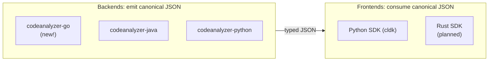

import { CardGrid, LinkCard, Aside } from "@astrojs/starlight/components";

CLDK has two independent extension points: language backends and frontend SDKs.

<Aside type="tip" title="Language backend scaffolding">
The maintainers build a new language with the [`cldk-language-pack`](https://github.com/codellm-devkit/developer-skillset/tree/main/cldk-language-pack) skill. The skill generates a `codeanalyzer-<lang>` backend and the SDK bindings, up to a validated level-1 analysis branch. The guides below do the same work by hand.
</Aside>

- **A backend** adds a new language. It parses the source, builds a symbol table and a call graph, and writes them to the canonical JSON schema. Backends are standalone tools (the [codeanalyzer-* family](/backends/)). You can write a backend in whichever language suits the analysis: Python analysis in Python, Java analysis in Java, and more.
- **A frontend** is an SDK that reads that JSON and gives you an `analysis` API. One frontend exists today, the Python SDK. A Rust frontend is planned.

A new backend makes its language available to every existing frontend. A new frontend makes every existing backend available through it.

## Guides

<CardGrid>
  <LinkCard title="Add a language backend (Go)" description="A full manual walkthrough: build codeanalyzer-go (schema, symbol table, call graph, CLI) and connect the Python SDK frontend." href="/contributing/add-language-backend/" />
  <LinkCard title="Add a Rust frontend" description="Stub and roadmap: a second SDK, in Rust, that reads the same canonical backends." href="/contributing/rust-frontend/" />
</CardGrid>
