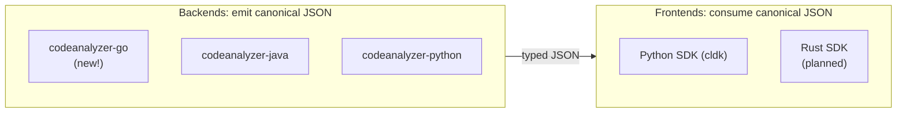

import { CardGrid, LinkCard, Aside } from "@astrojs/starlight/components";

CLDK has two independent extension points: language backends and frontend SDKs.

<Aside type="tip" title="Language backend scaffolding">
The `cldk-language-pack` skill scaffolds a `codeanalyzer-<lang>` backend plus SDK bindings through a validated level-1 analysis branch. See [codellm-devkit/developer-skillset](https://github.com/codellm-devkit/developer-skillset). The guides below are manual walkthroughs of that workflow.
</Aside>

- **A backend** adds support for a new language. It parses source, builds a symbol table and call graph, and serializes them to the canonical JSON schema. Backends are standalone tools (the [codeanalyzer-* family](/backends/)) and may be implemented in whichever language suits the analysis: Python analysis in Python, Java analysis in Java, and so on.
- **A frontend** is an SDK that consumes that JSON and exposes an `analysis` API. One frontend exists today, the Python SDK; a Rust frontend is on the roadmap.

Adding a backend makes the new language available to every existing frontend. Adding a frontend makes every existing backend available through it.

<Aside type="tip" title="Scaffolding skill">
The maintainers use the [`cldk-language-pack`](https://github.com/codellm-devkit/developer-skillset/tree/main/cldk-language-pack) skill to scaffold a new language end to end. These guides describe the **manual** path through the same stages.
</Aside>

## Guides

<CardGrid>
  <LinkCard title="Add a language backend (Go)" description="A full, manual walkthrough: build codeanalyzer-go (schema, symbol table, call graph, CLI) and wire the Python SDK frontend." href="/contributing/add-language-backend/" />
  <LinkCard title="Add a Rust frontend" description="Stub / roadmap: a second SDK, in Rust, that consumes the same canonical backends." href="/contributing/rust-frontend/" />
</CardGrid>
