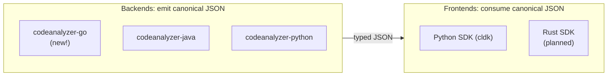

import { CardGrid, LinkCard, Aside } from "@astrojs/starlight/components";

CLDK extends along two clean axes, and they're independent. Understanding the split is the whole game.

- **A backend** teaches CLDK to *understand a new language*. It parses source, builds a symbol table and call graph, and serializes them to the canonical JSON schema. Backends are standalone tools (the [codeanalyzer-* family](/backends/)) and can be written in whatever language suits the analysis: Java analysis in Java, Python analysis in Python, and so on.
- **A frontend** is an SDK that *consumes* that JSON and exposes an ergonomic `analysis` API. Today there's one frontend: the Python SDK. A second (Rust) is on the roadmap.

Add a backend and every existing frontend can analyze the new language. Add a frontend and it inherits every existing backend.

<Aside type="tip" title="There's a skill for this">
The maintainers use the [`cldk-language-pack`](https://github.com/codellm-devkit/developer-skillset/tree/main/cldk-language-pack) skill to scaffold a new language end-to-end. These guides instead walk the **manual** path (the same stages, done by hand) so you understand every moving part.
</Aside>

## Guides

<CardGrid>
  <LinkCard title="Add a language backend (Go)" description="A full, manual walkthrough: build codeanalyzer-go (schema, symbol table, call graph, CLI) and wire the Python SDK frontend." href="/contributing/add-language-backend/" />
  <LinkCard title="Add a Rust frontend" description="Stub / roadmap: a second SDK, in Rust, that consumes the same canonical backends." href="/contributing/rust-frontend/" />
</CardGrid>
