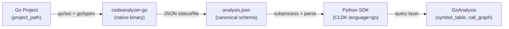

import { Tabs, TabItem, Steps, Aside, LinkCard, CardGrid, FileTree, Badge } from "@astrojs/starlight/components";

This guide walks you through manually adding first-class Go support to CLDK: building the `codeanalyzer-go` backend and wiring it into the Python SDK. Unlike a fully-scaffolded approach, you'll make informed decisions about tooling, schema design, and architecture at each stage, resulting in a modular, production-grade analyzer.

<Aside type="tip" title="There's a skill for this">
CLDK ships a skill that scaffolds first-class support for a new language end to end (a `codeanalyzer-<lang>` backend plus the SDK bindings) and takes you to a validated level-1 analysis on a branch. See [codellm-devkit/developer-skillset](https://github.com/codellm-devkit/developer-skillset). This page is the manual walkthrough behind what the skill automates.
</Aside>

## Architecture overview

CLDK's two-layer design separates the backend analyzer (emits `analysis.json`) from the SDK frontend (a Python query facade):



## Part 1: The Go backend (`codeanalyzer-go`)

### Step 1: Choose the backend tooling

Before writing a line of code, select the moving parts: runtime, parser, resolver, materialization, and packaging. Go has mature, purpose-built tools for each slot.

<Aside type="tip">
**Recommended tooling for Go:**
- Runtime: Go
- Structural parser: `go/ast` (the stdlib AST, always available with the Go toolchain)
- Resolver (Tier 1): `go/packages` + `go/types` (the standard library's source-level resolver: exact and performant)
- Build/deps: `go mod download` (materializes the module graph so `go/packages` can load it)
- Packaging: `go build` → single static binary (zero runtime deps for SDK users)
- Framework backend (Tier 2, optional): CodeQL Go pack (off by default; you implement level 1)

This is **separate-tool architecture**: `go/ast` is lightweight parsing; `go/types` is type resolution. Both are in the standard library, so the analyzer itself has minimal dependencies.
</Aside>

Make this explicit in your analyzer's `README.md` under an **Architecture & Tooling** heading so the locked choices are recoverable:

```markdown
## Architecture & Tooling

- **depth**: rapid (level 1): symbol table + resolver call graph; level 2 (CodeQL) stubbed
- **runtime**: Go 1.21+
- **structural**: go/ast
- **resolution**: go/types (via go/packages), loaded after `go mod download`
- **build/deps**: `go mod download` materializes the module graph
- **packaging**: `go build` → single static binary, version 0.1.0
- **extra nodes**: `GoStruct`, `GoInterface`, embedded structs/interface satisfaction in `base_classes`
```

**Before building**, check that the Go toolchain is installed:

```bash
go version  # must be 1.21+
```

If not present, stop and instruct the user to install it ([golang.org/dl](https://golang.org/dl)).

### Step 2: Define the Go schema

Design the analyzer's data types by mirroring the canonical schema and adding Go-specific nodes. Go's structure differs from Java/Python: no classes (but structs + interfaces), methods always carry a receiver type, interfaces are structural, packages are the module unit.

#### Anchor on existing models

Read the Python and Java models side by side:
- Java: `cldk/models/java/models.py` (`JType`, `JCallable`, `JField`)
- Python: `python-sdk/cldk/models/python/__init__.py` (`PyClass`, `PyCallable`)

Both models mirror the canonical spine (Module/Callable nesting, identity-only edges, `signature` as the primary key).

#### Go-specific design decisions

For each of these language concepts, decide how to model them:

| Concept | Java | Python | Go: your decision |
| --- | --- | --- | --- |
| **Top-level unit** | Compilation unit (file + package) | Module (file) | Package (all files in a package are siblings) |
| **Struct/Class equiv** | `JType` | `PyClass` | `GoStruct` (add as a node kind; methods are nested, fields explicit) |
| **Interface** | `JType` with `kind="interface"` | (none) | `GoInterface` (structural; methods are signatures, no body) |
| **Method receiver** | Implicit (this) | Implicit (self) | Explicit (receiver type is part of the signature) |
| **Callable signature format** | `package.ClassName.methodName` | `module.ClassName.method_name` | `package.StructName.MethodName` or `package.FunctionName` |
| **Base classes** | `extends` + `implements` | Base class chain | Embedded structs + satisfied interfaces (explicit) |
| **Packages/modules** | Multi-file, flat | Per-file | Multi-file module; GoPackage as the parent container |

<Aside type="caution">
**Key Go semantic:** Receiver types matter. `(*T).Method` is distinct from `T.Method` (pointer vs value receiver). Encode the receiver into the signature or a separate field so the call graph can distinguish them. Example: `package.(*StructName).MethodName` for pointer, `package.StructName.MethodName` for value.
</Aside>

#### Proposed Go schema

Define a `GoModule`, `GoStruct`, `GoInterface`, `GoCallable`, `GoCallSite`, and `GoCallEdge` matching the canonical invariants:

```json
{
  "symbol_table": {
    "net/http/server.go": {
      "file_path": "net/http/server.go",
      "module_name": "net/http",
      "imports": [
        { "path": "fmt", "is_local": false }
      ],
      "functions": {
        "net.http.ListenAndServe": {
          "name": "ListenAndServe",
          "signature": "net.http.ListenAndServe",
          "parameters": [
            { "name": "addr", "type": "string" },
            { "name": "handler", "type": "Handler" }
          ],
          "return_type": "error",
          "call_sites": [
            {
              "method_name": "Log",
              "receiver_type": "*log.Logger",
              "callee_signature": null,
              "start_line": 42
            }
          ]
        }
      },
      "structs": {
        "net.http.Server": {
          "name": "Server",
          "signature": "net.http.Server",
          "fields": [
            { "name": "Addr", "type": "string" },
            { "name": "Handler", "type": "Handler" }
          ],
          "methods": {
            "net.http.(*Server).ListenAndServe": {
              "name": "ListenAndServe",
              "signature": "net.http.(*Server).ListenAndServe",
              "receiver_type": "*Server"
            }
          }
        }
      },
      "interfaces": {
        "net.http.Handler": {
          "name": "Handler",
          "signature": "net.http.Handler",
          "methods": {
            "net.http.Handler.ServeHTTP": {
              "name": "ServeHTTP",
              "signature": "net.http.Handler.ServeHTTP",
              "parameters": [
                { "name": "w", "type": "ResponseWriter" },
                { "name": "r", "type": "*Request" }
              ]
            }
          }
        }
      }
    }
  },
  "call_graph": [
    {
      "source": "net.http.ListenAndServe",
      "target": "net.http.(*Server).ListenAndServe",
      "type": "CALL_DEP",
      "weight": 1,
      "provenance": ["go/types"]
    }
  ]
}
```

**Key decisions to lock in your `SCHEMA_DECISIONS.md`:**
1. Is `GoPackage` a top-level container, or is `GoModule` (file) the unit?
2. How do you distinguish `*T.Method` from `T.Method` in signatures?
3. Do you materialize interface satisfaction (`base_classes`), or record it separately?
4. Do struct tags get captured in a `tags` field?

### Step 3: Scaffold the modular analyzer package

Create the `codeanalyzer-go` project with a **delegating architecture**: a CLI entry, a `core` orchestrator, phase subpackages, and a pluggable pass layer (even if empty at start).

<FileTree>
- codeanalyzer-go/
  - cmd/
    - codeanalyzer-go/
      - main.go (CLI entry, delegates to core)
  - internal/
    - analysis/
      - pass.go (AnalysisPass interface, registry)
    - frameworks/
      - finder.go (EntrypointFinder base)
    - core/
      - analyzer.go (orchestrator, delegates phases)
    - syntactic_analysis/
      - symbol_table_builder.go (per-file builder)
      - modules.go (package discovery)
    - semantic_analysis/
      - call_graph.go (go/types resolver, edges)
      - (framework_backend.go: stubbed)
  - go.mod
  - go.sum
  - README.md (Architecture & Tooling)
</FileTree>

**Checklist for modularity:**
- CLI (`cmd/*/main.go`) parses flags and invokes `core.Analyzer`.
- Core orchestrator delegates to phases; never inlines analysis.
- Symbol table builder is one focused module (or a class-like set of methods), not flat functions.
- Framework backend (CodeQL) isolated in its own subpackage, scaffolded even when stubbed.
- `analysis/pass.go` defines `AnalysisPass` interface and a `Registry` for discovery and `run_pipeline`.
- `frameworks/finder.go` defines `EntrypointFinder` base for extension.

### Step 4: Project materialization

Before parsing, materialize the Go module graph so `go/packages` can load types from dependencies.

```go
// internal/core/materialize.go
func MaterializeProject(projectDir string) error {
    cmd := exec.Command("go", "mod", "download")
    cmd.Dir = projectDir
    if err := cmd.Run(); err != nil {
        // Log and degrade gracefully; proceed with partial types if it fails
        log.Printf("warning: go mod download failed, proceeding with partial types: %v", err)
        return nil
    }
    return nil
}
```

Run this **before** symbol-table construction so `go/packages.Load()` can access transitive dependencies.

**Degradation:** If `go.mod` is absent or `go mod download` fails, log and continue. The symbol table will have unresolved callees, which is acceptable.

### Step 5: Symbol table construction

Walk the project's Go packages and build `symbol_table: Dict[file_path, GoModule]`. Follow the pattern in the Python analyzer.

<Aside type="caution">
Go's package model is multi-file: all `.go` files in the same directory (excluding `vendor`) belong to one package. You'll need to discover packages and iterate over files per package, computing type info via `go/packages` once, then reusing that for all files in the package.
</Aside>

**Algorithm:**

1. Load packages with `go/packages.Load("./...", cfg)` (where `cfg` includes `Mode: packages.NeedTypes | NeedSyntax | NeedImports`)
2. For each package, iterate over its `.go` files.
3. Per file:
   - Compute a stable `file_key` (relative path from project root).
   - Check cache (by file hash / mtime). If unchanged, reuse the cached `GoModule`; skip to next file.
   - Parse the file with `go/ast` → get the `*ast.File`.
   - Walk the AST:
     - For each top-level `ast.FuncDecl`, create a `GoCallable` (unresolved call sites with `callee_signature = null`).
     - For each top-level `ast.GenDecl` with `Token == token.TYPE`, extract `ast.TypeSpec`:
       - If it's a struct (`*ast.StructType`), create a `GoStruct` with fields and methods.
       - If it's an interface (`*ast.InterfaceType`), create a `GoInterface` with method signatures.
     - For each method (receiver + FuncDecl), create a `GoCallable` nested in the struct/interface.
     - Collect imports, comments (via `go/ast` comment groups).
   - Assemble the `GoModule` and cache it.
4. Return `symbol_table[file_key] = module`.

**Per-file builder example** (pseudocode):

```go
func (b *SymbolTableBuilder) buildModuleFromFile(filePath string, pkg *packages.Package) (*GoModule, error) {
    module := &GoModule{
        FilePath: filePath,
        ModuleName: pkg.PkgPath,
        Imports: []GoImport{},
        Functions: map[string]GoCallable{},
        Structs: map[string]GoStruct{},
        Interfaces: map[string]GoInterface{},
    }

    // Parse AST
    file, err := parser.ParseFile(b.fset, filePath, nil, parser.ParseComments)
    if err != nil {
        return nil, err
    }

    // Walk declarations
    for _, decl := range file.Decls {
        switch d := decl.(type) {
        case *ast.GenDecl:
            if d.Tok == token.IMPORT {
                for _, spec := range d.Specs {
                    importSpec := spec.(*ast.ImportSpec)
                    module.Imports = append(module.Imports, GoImport{
                        Path: importSpec.Path.Value,
                    })
                }
            } else if d.Tok == token.TYPE {
                for _, spec := range d.Specs {
                    typeSpec := spec.(*ast.TypeSpec)
                    switch t := typeSpec.Type.(type) {
                    case *ast.StructType:
                        s := b.buildStruct(typeSpec.Name.Name, t, pkg)
                        module.Structs[s.Signature] = s
                    case *ast.InterfaceType:
                        iface := b.buildInterface(typeSpec.Name.Name, t, pkg)
                        module.Interfaces[iface.Signature] = iface
                    }
                }
            }
        case *ast.FuncDecl:
            fn := b.buildFunction(d, pkg)
            module.Functions[fn.Signature] = fn
        }
    }

    return module, nil
}
```

**Signature canonicalization** (the critical linchpin):

Define one `signatureOf()` function used everywhere:

```go
func signatureOf(pkgPath, name string, isPointerReceiver bool, receiverType string) string {
    if receiverType != "" {
        if isPointerReceiver {
            return fmt.Sprintf("%s.(*%s).%s", pkgPath, receiverType, name)
        }
        return fmt.Sprintf("%s.%s.%s", pkgPath, receiverType, name)
    }
    return fmt.Sprintf("%s.%s", pkgPath, name)
}
```

**Call sites:** When you encounter a function call within a function body, record it as unresolved:

```go
type GoCallSite struct {
    MethodName    string
    ReceiverType  string
    CalleeSignature *string // null until resolved
    StartLine     int
}
```

**Verify this stage:**
- Run on a small fixture project (e.g., a module with 2–3 files).
- Output validates against the SDK `GoApplication` Pydantic model (you'll create that in Part 2).
- `symbol_table` is non-empty, keyed by relative file paths.
- A known file's `GoModule` has the expected structs/functions/call sites.
- Re-running reuses cache for unchanged files (no rebuild).

### Step 6: Call graph construction (resolver-based, cheap)

Now resolve each unresolved call site using `go/types`. This is **level 1** and cheap because the type resolver is already loaded.

For each recorded call site in every callable:
1. Get the enclosing callable's receiver type and argument types (from the AST or the symbol table).
2. Resolve the call's target using `go/types`:
   - Use `types.LookupFieldOrMethod()` to resolve receiver-type dispatch (signature: `LookupFieldOrMethod(T Type, addressable bool, pkg *Package, name string) (Object, bool)`).
   - For unqualified names, search the package scope and imports.
3. Backfill `callee_signature` in place.
4. Emit an identity-only edge: `source_sig → target_sig` with `provenance: ["go/types"]`.

**Example** (pseudocode):

```go
func (r *CallGraphResolver) resolveCallSites(pkg *packages.Package, symbolTable map[string]*GoModule) []GoCallEdge {
    var edges []GoCallEdge

    for filePath, module := range symbolTable {
        // Resolve all call sites in all callables
        for _, fn := range module.Functions {
            for i, site := range fn.CallSites {
                resolved := r.resolveCallSite(site, pkg, fn)
                if resolved != "" {
                    fn.CallSites[i].CalleeSignature = &resolved
                    edges = append(edges, GoCallEdge{
                        Source: fn.Signature,
                        Target: resolved,
                        Type: "CALL_DEP",
                        Weight: 1,
                        Provenance: []string{"go/types"},
                    })
                }
            }
        }
        // Repeat for structs/interfaces/methods
    }

    return edges
}

func (r *CallGraphResolver) resolveCallSite(site GoCallSite, pkg *packages.Package, caller *GoCallable) string {
    // If receiver, use types.LookupFieldOrMethod with proper signature:
    // LookupFieldOrMethod(T Type, addressable bool, pkg *Package, name string) (Object, bool)
    if site.ReceiverType != "" {
        // Resolve receiver type, then method on it
        // Note: This is pseudocode; real implementation requires resolving receiverType to a types.Type first
        method, _ := types.LookupFieldOrMethod(
            resolveType(site.ReceiverType, pkg),
            true,
            pkg.Types,
            site.MethodName,
        )
        if method != nil {
            return signatureOf(pkg.PkgPath, method.Name(), isPointer, method.Type().String())
        }
    }

    // Unqualified: search package scope
    obj := pkg.Types.Scope().Lookup(site.MethodName)
    if obj != nil {
        return signatureOf(pkg.PkgPath, obj.Name(), false, "")
    }

    // Unresolved: return empty and skip the edge
    return ""
}
```

**Verify this stage:**
- Every edge endpoint is a real signature in the symbol table (no dangling nodes).
- Output still validates against the SDK model.
- A small fixture's call graph is non-empty and sensible.

### Step 7: CLI contract

Expose the analyzer via a command-line interface matching the SDK's expectations:

```go
// cmd/codeanalyzer-go/main.go
package main

import (
    "encoding/json"
    "flag"
    "fmt"
    "log"
    "os"
    "path/filepath"
    "github.com/codellm-devkit/codeanalyzer-go/internal/core"
)

func main() {
    input := flag.String("i", "", "Project root directory")
    output := flag.String("o", "", "Output directory for analysis.json")
    analysisLevel := flag.String("a", "2", "Analysis level: 1=symbol table, 2=+call graph")
    targetFiles := flag.String("t", "", "Comma-separated target files (optional)")
    skipTests := flag.Bool("skip-tests", true, "Skip test files")
    eager := flag.Bool("eager", false, "Force rebuild (ignore cache)")
    cacheDir := flag.String("c", "", "Cache directory")
    flagHelp := flag.Bool("h", false, "Show help")

    flag.Parse()

    if *flagHelp || *input == "" {
        flag.PrintDefaults()
        return
    }

    analyzer, err := core.NewAnalyzer(*input, *cacheDir, *skipTests, *eager)
    if err != nil {
        log.Fatalf("failed to init analyzer: %v", err)
    }

    result, err := analyzer.Analyze(*analysisLevel, *targetFiles)
    if err != nil {
        log.Fatalf("analysis failed: %v", err)
    }

    // Write JSON to output or stdout
    jsonBytes, err := json.MarshalIndent(result, "", "  ")
    if err != nil {
        log.Fatalf("json marshal failed: %v", err)
    }

    if *output == "" {
        fmt.Println(string(jsonBytes))
    } else {
        outPath := filepath.Join(*output, "analysis.json")
        if err := os.WriteFile(outPath, jsonBytes, 0644); err != nil {
            log.Fatalf("write failed: %v", err)
        }
    }
}
```

Test it:

```bash
go build -o codeanalyzer-go ./cmd/codeanalyzer-go
./codeanalyzer-go -i /path/to/project -o /tmp/out -a 2
cat /tmp/out/analysis.json
```

### Step 8: Build and package

Compile to a static binary:

```bash
go build -o codeanalyzer-go ./cmd/codeanalyzer-go

# Strip and compress
strip codeanalyzer-go
```

Version it and distribute (bundled in the SDK or downloaded on first use). Add a `VERSION` file or tag in Git:

```bash
git tag v0.1.0
```

## Part 2: The Python SDK frontend

Once `codeanalyzer-go` is working, wire it into the Python SDK. Do this **on a branch** (`add-go-support` in `python-sdk`).

### Step 9: Create Go data models

In the SDK, add `cldk/models/go/` with Pydantic models that mirror your schema and the canonical spine:

```python
# cldk/models/go/models.py
from typing import Any, Dict, List, Optional
from pydantic import BaseModel, Field

class GoImport(BaseModel):
    path: str
    is_local: bool = False

class GoCallSite(BaseModel):
    method_name: str
    receiver_type: Optional[str] = None
    argument_types: List[str] = Field(default_factory=list)
    return_type: Optional[str] = None
    callee_signature: Optional[str] = None
    start_line: int = -1
    start_column: int = -1
    end_line: int = -1
    end_column: int = -1

class GoCallEdge(BaseModel):
    source: str
    target: str
    type: str = "CALL_DEP"
    weight: int = 1
    provenance: List[str] = Field(default_factory=list)
    tags: Dict[str, Any] = Field(default_factory=dict)

class GoCallable(BaseModel):
    name: str
    path: Optional[str] = None
    signature: str
    parameters: List[Dict[str, Any]] = Field(default_factory=list)
    return_type: Optional[str] = None
    code: Optional[str] = None
    call_sites: List[GoCallSite] = Field(default_factory=list)
    receiver_type: Optional[str] = None
    start_line: int = -1
    end_line: int = -1
    code_start_line: int = -1

class GoField(BaseModel):
    name: str
    type: str
    is_exported: bool = False

class GoStruct(BaseModel):
    name: str
    signature: str
    fields: List[GoField] = Field(default_factory=list)
    methods: Dict[str, GoCallable] = Field(default_factory=dict)
    base_classes: List[str] = Field(default_factory=list)  # embedded structs + satisfied interfaces
    code: Optional[str] = None
    start_line: int = -1
    end_line: int = -1

class GoInterface(BaseModel):
    name: str
    signature: str
    methods: Dict[str, GoCallable] = Field(default_factory=dict)
    code: Optional[str] = None
    start_line: int = -1
    end_line: int = -1

class GoModule(BaseModel):
    file_path: str
    module_name: str
    imports: List[GoImport] = Field(default_factory=list)
    functions: Dict[str, GoCallable] = Field(default_factory=dict)
    structs: Dict[str, GoStruct] = Field(default_factory=dict)
    interfaces: Dict[str, GoInterface] = Field(default_factory=dict)
    content_hash: Optional[str] = None
    last_modified: Optional[float] = None
    file_size: int = 0

class GoApplication(BaseModel):
    symbol_table: Dict[str, GoModule] = Field(default_factory=dict)
    call_graph: List[GoCallEdge] = Field(default_factory=list)
    entrypoints: List[Dict[str, Any]] = Field(default_factory=list)

# cldk/models/go/__init__.py
from cldk.models.go.models import (
    GoApplication, GoModule, GoCallable, GoStruct, GoInterface,
    GoField, GoCallSite, GoCallEdge, GoImport
)

__all__ = [
    "GoApplication", "GoModule", "GoCallable", "GoStruct", "GoInterface",
    "GoField", "GoCallSite", "GoCallEdge", "GoImport"
]
```

### Step 10: Create the analysis facade

Add `cldk/analysis/go/` with the `GoAnalysis` class and backend wrapper:

```python
# cldk/analysis/go/go_analysis.py
from pathlib import Path
from typing import Dict, List, Optional, Union
import networkx as nx

from cldk.models.go import GoApplication, GoModule, GoCallable, GoStruct, GoInterface
from cldk.analysis.go.codeanalyzer import GoCodeanalyzer
from cldk.analysis import AnalysisLevel

class GoAnalysis:
    """Analysis facade for Go code."""

    def __init__(
        self,
        project_dir: Union[str, Path, None],
        analysis_backend_path: Optional[str],
        analysis_json_path: Optional[Union[str, Path]],
        analysis_level: str,
        target_files: Optional[List[str]],
        eager_analysis: bool,
    ) -> None:
        self.project_dir = Path(project_dir) if project_dir else None
        self.analysis_json_path = analysis_json_path
        self.analysis_level = analysis_level
        self.target_files = target_files
        self.eager_analysis = eager_analysis
        
        self.backend = GoCodeanalyzer(
            project_dir=self.project_dir,
            analysis_backend_path=analysis_backend_path,
            analysis_level=analysis_level,
            target_files=target_files,
            eager=eager_analysis,
        )
        self._application: Optional[GoApplication] = None

    def _ensure_analysis(self) -> GoApplication:
        if self._application is None:
            self._application = self.backend.analyze()
        return self._application

    def get_application_view(self) -> GoApplication:
        """Return the full canonical Application."""
        return self._ensure_analysis()

    def get_symbol_table(self) -> Dict[str, GoModule]:
        """Return symbol_table: Dict[file_path, GoModule]."""
        return self._ensure_analysis().symbol_table

    def get_call_graph(self) -> nx.DiGraph:
        """Build and return a NetworkX DiGraph."""
        app = self._ensure_analysis()
        graph = nx.DiGraph()
        for edge in app.call_graph:
            graph.add_edge(edge.source, edge.target)
        return graph

    def get_call_graph_json(self) -> List[dict]:
        """Return call_graph edges as JSON-serializable dicts."""
        app = self._ensure_analysis()
        return [e.model_dump() for e in app.call_graph]

    def get_classes(self) -> Dict[str, Union[GoStruct, GoInterface]]:
        """Return all structs and interfaces (the class-like entities)."""
        app = self._ensure_analysis()
        result = {}
        for module in app.symbol_table.values():
            result.update(module.structs)
            result.update(module.interfaces)
        return result

    def get_struct(self, signature: str) -> Optional[GoStruct]:
        """Retrieve a struct by signature."""
        classes = self.get_classes()
        return classes.get(signature)

    def get_methods(self, struct_signature: str) -> Dict[str, GoCallable]:
        """Return all methods in a struct."""
        s = self.get_struct(struct_signature)
        if s and isinstance(s, GoStruct):
            return s.methods
        return {}

    def get_method(self, struct_signature: str, method_signature: str) -> Optional[GoCallable]:
        """Retrieve a method by struct and method signature."""
        methods = self.get_methods(struct_signature)
        return methods.get(method_signature)

    def get_callers(self, target_signature: str) -> Dict[str, List[str]]:
        """Return all callers of a target."""
        graph = self.get_call_graph()
        callers = {}
        for source in graph.predecessors(target_signature):
            callers[source] = list(graph.successors(source))
        return callers

    def get_callees(self, source_signature: str) -> Dict[str, List[str]]:
        """Return all callees of a source."""
        graph = self.get_call_graph()
        return {source_signature: list(graph.successors(source_signature))}

    def get_go_file(self, file_path: str) -> Optional[GoModule]:
        """Retrieve a Go module by file path."""
        st = self.get_symbol_table()
        return st.get(file_path)

    def get_class_call_graph(self, struct_signature: str) -> nx.DiGraph:
        """Build a call graph restricted to a struct's methods."""
        graph = self.get_call_graph()
        subgraph = nx.DiGraph()
        methods = self.get_methods(struct_signature)
        for method_sig in methods.keys():
            subgraph.add_node(method_sig)
            for callee in graph.successors(method_sig):
                if callee in methods:
                    subgraph.add_edge(method_sig, callee)
        return subgraph

    def get_class_hierarchy(self) -> nx.DiGraph:
        """Build a type hierarchy (base_classes → subclasses)."""
        app = self._ensure_analysis()
        hierarchy = nx.DiGraph()
        for module in app.symbol_table.values():
            for struct in module.structs.values():
                hierarchy.add_node(struct.signature)
                for base in struct.base_classes:
                    hierarchy.add_edge(struct.signature, base)
            for iface in module.interfaces.values():
                hierarchy.add_node(iface.signature)
        return hierarchy
```

**Backend wrapper** (subprocess):

```python
# cldk/analysis/go/codeanalyzer/codeanalyzer.py
import json
import subprocess
import tempfile
from pathlib import Path
from typing import Optional, Union

from cldk.models.go import GoApplication

class GoCodeanalyzer:
    """Wrapper for the codeanalyzer-go subprocess binary."""

    def __init__(
        self,
        project_dir: Union[str, Path, None],
        analysis_backend_path: Optional[str],
        analysis_level: str,
        target_files: Optional[list],
        eager: bool,
    ) -> None:
        self.project_dir = Path(project_dir) if project_dir else None
        self.analysis_backend_path = analysis_backend_path
        self.analysis_level = analysis_level
        self.target_files = target_files
        self.eager = eager

    def analyze(self) -> GoApplication:
        """Run the analyzer and return GoApplication."""
        with tempfile.TemporaryDirectory() as tmpdir:
            cmd = [
                self._get_binary_path(),
                "-i", str(self.project_dir),
                "-o", tmpdir,
                "-a", self.analysis_level,
            ]
            if self.eager:
                cmd.append("--eager")
            if self.target_files:
                cmd.extend(["-t", ",".join(self.target_files)])

            result = subprocess.run(cmd, capture_output=True, text=True, check=True)
            
            # Read analysis.json
            analysis_path = Path(tmpdir) / "analysis.json"
            with open(analysis_path) as f:
                data = json.load(f)
            
            return GoApplication(**data)

    def _get_binary_path(self) -> str:
        """Locate the codeanalyzer-go binary."""
        if self.analysis_backend_path:
            return self.analysis_backend_path
        # TODO: Download binary on first use, cache it, version-pin
        # For now, assume it's on PATH
        return "codeanalyzer-go"
```

Export from `cldk/analysis/go/__init__.py`:

```python
from cldk.analysis.go.go_analysis import GoAnalysis

__all__ = ["GoAnalysis"]
```

### Step 11: Register in `cldk/core.py`

Add the dispatch branch:

```python
# cldk/core.py (add to imports)
from cldk.analysis.go import GoAnalysis

# In CLDK.analysis() method, add before the final else:
elif self.language == "go":
    return GoAnalysis(
        project_dir=project_path,
        analysis_backend_path=analysis_backend_path,
        analysis_json_path=analysis_json_path,
        analysis_level=analysis_level,
        target_files=target_files,
        eager_analysis=eager,
    )
```

### Step 12: Add tests

Create `tests/analysis/go/` and mock the backend:

```python
# tests/analysis/go/test_go_analysis.py
import json
from pathlib import Path
from unittest.mock import patch, MagicMock

import pytest
from cldk.analysis.go import GoAnalysis
from cldk.analysis.go.codeanalyzer import GoCodeanalyzer
from cldk.models.go import GoApplication

@pytest.fixture
def fixture_analysis_json():
    """Load a fixture analysis.json for a small Go project."""
    fixture_dir = Path(__file__).parent.parent.parent / "resources" / "go" / "analysis_json"
    with open(fixture_dir / "analysis.json") as f:
        return json.load(f)

def test_go_analysis_symbol_table(fixture_analysis_json):
    """Test get_symbol_table returns non-empty dict."""
    with patch.object(GoCodeanalyzer, "analyze") as mock_analyze:
        mock_analyze.return_value = GoApplication(**fixture_analysis_json)
        
        analysis = GoAnalysis(
            project_dir="/tmp/fixture",
            analysis_backend_path=None,
            analysis_json_path=None,
            analysis_level="2",
            target_files=None,
            eager_analysis=False,
        )
        
        st = analysis.get_symbol_table()
        assert len(st) > 0
        # Spot-check a module
        first_module = next(iter(st.values()))
        assert first_module.module_name

def test_go_analysis_call_graph(fixture_analysis_json):
    """Test get_call_graph builds a valid NetworkX graph."""
    with patch.object(GoCodeanalyzer, "analyze") as mock_analyze:
        mock_analyze.return_value = GoApplication(**fixture_analysis_json)
        
        analysis = GoAnalysis(
            project_dir="/tmp/fixture",
            analysis_backend_path=None,
            analysis_json_path=None,
            analysis_level="2",
            target_files=None,
            eager_analysis=False,
        )
        
        graph = analysis.get_call_graph()
        # Verify no dangling edges
        for source, target in graph.edges():
            # Both endpoints should be callable signatures
            # (This is a loose check; you'd validate harder in real tests)
            assert isinstance(source, str)
            assert isinstance(target, str)
```

Create fixture JSON under `tests/resources/go/analysis_json/analysis.json`.

### Step 13: Update SDK dependencies

In `pyproject.toml`, pin the analyzer version:

```toml
[tool.backend-versions]
codeanalyzer-go = "0.1.0"
```

If distributing as a bundled binary, add it to `cldk/analysis/go/codeanalyzer/bin/` or arrange download-on-first-use.

## Verification and checklist

Before merging, verify:

<Steps>
1. **Backend works standalone:**
   ```bash
   codeanalyzer-go -i /path/to/go/project -o /tmp/out -a 2
   cat /tmp/out/analysis.json  # valid JSON, no errors
   ```

2. **Output validates:**
   ```python
   from cldk.models.go import GoApplication
   with open("/tmp/out/analysis.json") as f:
       app = GoApplication(**json.load(f))  # no pydantic errors
   ```

3. **Symbol table is non-empty:**
   - `app.symbol_table` has at least one module.
   - Each module has expected structs/functions/imports.

4. **Call graph has no dangling nodes:**
   - Every edge's `source` and `target` are real callable signatures.
   - `nx.DiGraph` builds successfully.

5. **SDK facade works:**
   ```python
   from cldk import CLDK
   cldk = CLDK(language="go")
   analysis = cldk.analysis(project_path="/path/to/fixture")
   st = analysis.get_symbol_table()
   assert len(st) > 0
   graph = analysis.get_call_graph()
   assert graph.number_of_nodes() > 0
   ```

6. **Tests pass:**
   ```bash
   cd python-sdk
   uv run pytest tests/analysis/go/ -v
   ```

7. **Modularity checklist:**
   - [ ] CLI (`cmd/*/main.go`) parses flags, calls core.
   - [ ] Core orchestrator delegates to phases; never inlines.
   - [ ] Symbol-table builder is one cohesive module, not flat functions.
   - [ ] Framework backend isolated in its own subpackage.
   - [ ] `analysis/pass.go` and `frameworks/finder.go` exist and are wired.

8. **Schema integrity:**
   - [ ] All fields from canonical schema are present in Go models.
   - [ ] Language-specific nodes (`GoStruct`, `GoInterface`) are first-class.
   - [ ] `signature` is the identity key; every callable and type has one.
   - [ ] Receiver types are captured (for `*T.Method` vs `T.Method`).

</Steps>

## Next steps

After merging, consider:

- **Level-2 (CodeQL) backend**: Stub is ready; implement CodeQL Go pack integration for deeper dataflow analysis.
- **Entrypoint detection**: Add framework detection (e.g., gRPC services, REST handlers) and surface via `get_entry_point_*` methods.
- **Comments/docstrings**: Extract comments from the AST and attach to callables.
- **Testing utilities**: Add `is_parsable` and `get_raw_ast` if you ship a tree-sitter parser.

---

## Reference links

- <LinkCard title="What is CLDK?" href="/what-is-cldk/" />
- <LinkCard title="Quickstart" href="/quickstart/" />
- <LinkCard title="Concepts" href="/guides/concepts/" />
- <LinkCard title="Java backend reference" href="/backends/codeanalyzer-java/" />
- <LinkCard title="Python backend reference" href="/backends/codeanalyzer-python/" />
- <LinkCard title="Python API reference" href="/reference/python-api/" />
- <LinkCard title="Examples" href="/examples/" />
- <LinkCard title="Cheatsheet" href="/resources/cheatsheet/" />
