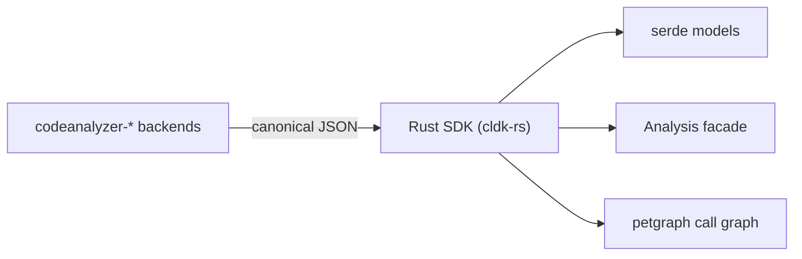

import { Steps, Aside, LinkCard, CardGrid, Badge } from "@astrojs/starlight/components";

<Badge text="Stub" variant="caution" /> <Badge text="Help wanted" variant="note" />

This page is a **stub**. A Rust frontend doesn't exist yet: this is the shape it would take and where to start. If you want to build it, open an issue first so we can pair you up.

## Why a Rust frontend

A *frontend* is just an SDK that consumes the canonical analysis JSON the [codeanalyzer backends](/backends/) emit and exposes an ergonomic `analysis` API over it. The [Python SDK](/reference/python-api/) is the reference implementation. Because the backends do all the language analysis, a second frontend inherits **every** backend for free: a Rust SDK would analyze Python, Java, and (once it lands) Go on day one.

Rust is a natural fit: strong types for the schema, `serde` for fast zero-copy-ish deserialization, and `petgraph` for call-graph queries that map cleanly onto the SDK's `networkx` graphs.

## The shape of the work

Mirror the Python SDK's structure, crate-by-module. None of this is built yet: treat each step as a tracking item.

<Steps>

1. **Model the canonical schema with `serde`.** Translate the backend JSON entities (`JApplication`/`JType`/`JCallable`, `PyModule`/`PyClass`/`PyCallable`, …) into Rust structs with `#[derive(Deserialize)]`. This is the Rust analogue of `cldk/models/*`. Start with one language (Java) to prove the round-trip.

2. **Define the analysis facade trait.** A `LanguageAnalysis` trait with the core methods (`get_symbol_table`, `get_classes`, `get_method`, `get_call_graph`, `get_callers`, `get_callees`) so every language implementation shares one surface, exactly as the Python facades do.

3. **Build the call graph with `petgraph`.** Deserialize the backend's call-graph edges into a `petgraph::DiGraph`. Reachability becomes `petgraph::algo::has_path_connecting`: the Rust counterpart of `networkx.has_path`.

4. **Shell out to the backends.** Reuse the exact same CLI contract the Python SDK uses to invoke `codeanalyzer-*` (input project dir, output JSON, analysis level). See the backend's [CLI interface](/backends/codeanalyzer-java/): the wire format is shared, so this is mostly process management + JSON parsing.

5. **Register languages.** A `CLDK::new(Language::Java).analysis(project_path)` entry point that dispatches to the right implementation, mirroring `cldk/core.py`.

6. **Validate against the same fixtures.** Point it at Apache Commons CLI and assert the same facts the Python test suite asserts: same project, same answers, different language.

</Steps>

<Aside type="note" title="Backend vs frontend">
You do **not** write any language analysis here: that lives in the backends. A frontend is deserialize + ergonomics + process management. If you instead want to teach CLDK a *new language*, that's a backend: see [Add a language backend (Go)](/contributing/add-language-backend/).
</Aside>

## Start here

<CardGrid>
  <LinkCard title="Add a language backend (Go)" description="The other extension axis, and the best worked example of the canonical schema and CLI contract a frontend consumes." href="/contributing/add-language-backend/" />
  <LinkCard title="The codeanalyzer backends" description="What a frontend talks to, and the JSON it gets back." href="/backends/" />
  <LinkCard title="Python API reference" description="The reference frontend to mirror, method for method." href="/reference/python-api/" />
</CardGrid>
