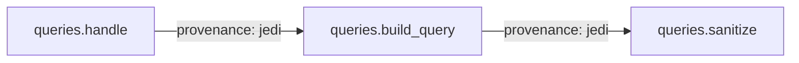
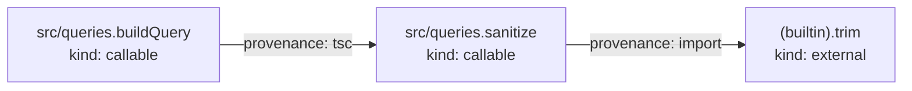

import { Tabs, TabItem, Aside, Badge, LinkCard, CardGrid } from "@astrojs/starlight/components";

A call graph is the map of which code can call which other code. This page answers three questions about that map: what one edge claims, which resolver drew it, and what the absence of an edge is worth.

## Nodes are callables, edges are possible calls

A **call graph** has one node for each **callable** in a project. A callable is a function, a method, a constructor, or an arrow function. Each directed edge points from a caller to a callee.

An edge from `A` to `B` claims one thing: a call to `B` **can** happen while `A` runs. The word *can* carries the whole claim.

CLDK reads the source text and never runs the program. An edge inside a branch that no input ever takes is still an edge. A call graph does not say how often a call happens, in what order two calls happen, or whether any call happens at all.

Every example on this page uses one small fixture.

<Tabs syncKey="lang">
  <TabItem label="Python">
    ```python
    # queries.py
    def sanitize(raw):
        return raw.strip()


    def build_query(user_input, limit):
        name = sanitize(user_input)
        if limit > 100:
            limit = 100
        return f"SELECT * FROM users WHERE name = '{name}' LIMIT {limit}"


    def handle(request):
        return build_query(request, 500)
    ```
  </TabItem>
  <TabItem label="TypeScript">
    ```typescript
    // src/queries.ts
    export function sanitize(raw: string): string {
      return raw.trim();
    }

    export function buildQuery(userInput: string, limit: number): string {
      const name = sanitize(userInput);
      if (limit > 100) {
        limit = 100;
      }
      return `SELECT * FROM users WHERE name = '${name}' LIMIT ${limit}`;
    }
    ```
  </TabItem>
</Tabs>

The Python fixture has three callables and two call edges. CLDK keys each node by its **signature**, the dotted name that every other accessor takes. Each edge carries the name of the resolver that drew it.



## Why a call graph is hard to build

A call site names its callee in the source text. A resolver must turn that text into the callable, or the set of callables, that the call can reach. Five things make that hard.

### Dynamic dispatch

**Dynamic dispatch** means that the method a call runs depends on the runtime type of the receiver object. The type that the source text declares does not settle it.

```python
class Store:
    def save(self, row): ...

class AuditStore(Store):
    def save(self, row): ...

def commit(store, row):
    store.save(row)          # Store.save, AuditStore.save, or both?
```

The resolver sees `store.save` and no object. A precise resolver emits an edge to every subtype that the program constructs. A weak resolver emits one edge, or none.

### Higher-order functions

A **higher-order function** takes another function as an argument, or returns one.

```python
def run_all(steps, value):
    for step in steps:
        value = step(value)   # which callables are in steps?
    return value
```

The callee is a value here, not a name. The resolver must first track which functions reach `steps`. Until it does, it has no name at the call site to draw an edge from.

### Callbacks, reflection, and monkey patching

- A **callback** is a function that your code hands to a framework, which calls it later. The call site sits in code that CLDK does not analyze, so the edge into your function has no source.
- **Reflection** builds the target name as a string while the program runs, as `getattr(obj, name)()` does. No name is in the source text for a resolver to bind.
- **Monkey patching** replaces an attribute of a module or a class after import. The function that runs at the call site is then a different one from the callee that the source text names.

## Resolvers differ in precision

A **resolver** is the part of a backend that answers the question "which callable does this call site reach". Resolvers form a ladder, and each rung costs more time than the one below it.

1. **A name match.** The resolver takes every callable whose name equals the text at the call site. It is cheap, and it over-reports for every name that two modules share.
2. **A scope-aware resolution.** The resolver follows imports and local bindings to the one definition that the name binds to.
3. **A def-use resolution.** A def-use chain links the line that assigns a name to the lines that read it. The resolver follows those chains inside the callable, so a function held in a local variable resolves to its definition.
4. **A type-based resolution.** The resolver asks a type checker for the type of the receiver, then widens the answer to the subtypes that the program constructs.

For TypeScript, the ts-morph type checker resolves each call site to its declared-type target. That answer is exact for **static dispatch**, the case where the declared type of the receiver settles the method.

The backend then adds RTA-style subtype expansion. RTA is short for rapid type analysis. It keeps only the classes that the program constructs somewhere. A call on an interface receiver, or on an abstract receiver, expands to the concrete overrides of those classes. See [The TypeScript backend](/backends/codeanalyzer-ts/).

For Python, Jedi resolves the symbols and gives the level-1 call edges. At level 2 the def-use linker adds edges through local def-use chains and module-scope bindings. `AnalysisLevel.call_graph` is level 2. See [The Python backend](/backends/codeanalyzer-python/).

The TypeScript fixture graph carries two resolvers at once.



A node with `kind` `external` is a target outside the project, such as a library member or a builtin. It has no body in the graph, so no edge continues past it.

### What a `prov` value lets you conclude

| Value | What drew the edge | What the edge lets you conclude |
| --- | --- | --- |
| `tsc` | The TypeScript type checker, plus the RTA expansion | The type of the receiver admits this target. A call on a base type carries one edge to each concrete override that the program constructs |
| `jedi` | Jedi symbol resolution in the Python backend | The name at the call site binds to this definition under the import rules and the scope rules |
| `defuse` | The def-use linker, in the Python backend and in the TypeScript backend | An assignment inside the caller, or a module-scope binding, carries this callee to the call site |
| `import` | The TypeScript backend, for a target outside the project | The call leaves the project here, and the walk stops at this node |

Read `prov` as the reason that the edge exists, not as a confidence score. None of the four values claims that the call happens. Each of them claims that the call site can reach the callable, and each names the evidence for that claim.

The wire record names the field `prov`. On the `networkx` graph the same information is the edge attribute `provenance`, and it holds a tuple.

```python
cg = analysis.get_call_graph()
for caller, callee, data in cg.edges(data=True):
    print(caller, "->", callee, data["provenance"])
# -> queries.build_query -> queries.sanitize ('jedi',)
# -> queries.handle -> queries.build_query ('jedi',)
```

## A call graph under-approximates

**Under-approximation** means that the graph holds fewer edges than the program can take. The missing edges belong to the call sites that no resolver resolved: a reflective call, a monkey-patched attribute, a callback that a framework holds. **Over-approximation** is the opposite error, where the graph holds edges that the program never takes.

The direction of the error is the important part, because the two claims you can make from a call graph are not equally safe.

| Claim | Evidence | Strength |
| --- | --- | --- |
| "`A` can reach `B`" | A path exists in the graph | Strong. A resolver drew every edge on that path, and `prov` names its reason |
| "`A` cannot reach `B`" | No path exists in the graph | Weak. An unresolved call site produces exactly the same empty answer |

So an absence claim needs more than a missing path. A **sink** is a place where a value becomes dangerous, such as a database query or a shell command. If you plan to state that a request handler never reaches a sink, the call graph alone does not support you.

<Aside type="caution" title="A missing edge is not a proof">
`exhausted` holds each source-sink pair that `taint()` searched to the end with nothing found. `unresolved` holds one entry for each thing that stopped a pair short of an answer, such as a call site that `taint()` cannot follow. While `unresolved` holds an entry, no absence claim in that result stands.

An empty `unresolved` still does not turn `exhausted` into a proof. `exhausted` is a claim about the graph that the backend emitted, never about the program. On the Python fixture, `taint()` puts `('request', 'raw')` in `exhausted` and leaves `unresolved` empty. The source text plainly carries that flow. In Python, no `taint()` result refutes a flow that crosses a call. See [Taint analysis](/guides/taint/).

The two graphs miss in opposite directions. A **data dependence** links a line that writes a value to a line that reads it. The data-dependence edges over-approximate, which is the safe direction for an absence claim. The call edges under-approximate, which is the unsafe one.
</Aside>

For a longer treatment of the two directions, read Michael D. Ernst, "Program Analysis" (course book), at [homes.cs.washington.edu](https://homes.cs.washington.edu/~mernst/pubs/program-analysis-book.pdf).

<Aside type="note" title="A call edge is not a value flow">
An edge says that a call can happen. It does not say which value crosses it. For a value question, use the dataflow methods. The TypeScript backend links value flow across a call:

```python
ts = CLDK.typescript(
    project_path="tiny_ts",
    analysis_level=AnalysisLevel.system_dependency_graph,
)
ts.flows_to_call("userInput", "sanitize", within="buildQuery")
# -> True
```

The pinned Python backend does not link value flow across a call, so a Python `False` from `flows_to_call` refutes nothing. This defect is fixed in codeanalyzer-python 1.5.4 ([issue #220](https://github.com/codellm-devkit/codeanalyzer-python/issues/220)). CLDK 2.0.0rc7 pins `codeanalyzer-python==1.5.2`, so the pre-release still carries it ([python-sdk #413](https://github.com/codellm-devkit/python-sdk/issues/413) tracks the pin bump). To get the fix today, install the backend over the pin with `pip install "codeanalyzer-python==1.5.4"`. In Python, keep value questions inside one callable. See [Dataflow graphs](/guides/dataflow/).
</Aside>

## What CLDK returns

| Method | Returns | Answers |
| --- | --- | --- |
| `get_call_graph()` | `networkx.DiGraph` | The whole graph, caller to callee |
| `get_callers(target_class_name, target_method_declaration)` | `dict` | Which callables call this one |
| `get_callees(source_class_name, source_method_declaration)` | `dict` | Which callables this one calls |
| `get_class_call_graph(qualified_class_name, method_signature=None)` | `list[tuple[str, str]]` | Which edges are reachable from one class |
| `reaches(src, dst, *, depth=None)` <Badge text="2.0" variant="caution" /> | `bool` | Whether a call path connects two callables |
| `call_paths_between(src, dst, *, depth=None, max_paths=10)` <Badge text="2.0" variant="caution" /> | `FlowPaths` | Which call paths connect them |

<Aside type="caution" title="Two of these methods need CLDK 2.0">
`reaches` and `call_paths_between` need CLDK 2.0. Version 2.0 is a release candidate, so `pip install cldk` gives you 1.5.0. To install the pre-release, run:

```bash frame="none"
pip install --pre cldk
```
</Aside>

### The whole graph

<Tabs syncKey="lang">
  <TabItem label="Python">
    ```python
    from cldk import CLDK
    from cldk.analysis import AnalysisLevel

    analysis = CLDK.python(
        project_path="tiny_py",
        analysis_level=AnalysisLevel.call_graph,
    )

    cg = analysis.get_call_graph()
    print(cg.number_of_nodes(), cg.number_of_edges())
    # -> 3 2
    print(sorted(cg.nodes))
    # -> ['queries.build_query', 'queries.handle', 'queries.sanitize']
    ```
  </TabItem>
  <TabItem label="TypeScript">
    ```python
    from cldk import CLDK
    from cldk.analysis import AnalysisLevel

    analysis = CLDK.typescript(
        project_path="tiny_ts",
        analysis_level=AnalysisLevel.call_graph,
    )

    cg = analysis.get_call_graph()
    for caller, callee, data in cg.edges(data=True):
        print(caller, "->", callee, data["provenance"])
    # -> src/queries.sanitize -> (builtin).trim ('import',)
    # -> src/queries.buildQuery -> src/queries.sanitize ('tsc',)

    print(cg.nodes["(builtin).trim"]["kind"])
    # -> external
    ```
  </TabItem>
</Tabs>

The result is a plain `networkx.DiGraph`, so every `networkx` algorithm applies to it. Each edge carries three attributes: `type`, which is always `"CALL_DEP"`, `weight`, and `provenance`.

<Aside type="caution" title="Build the analysis deep enough">
If `get_call_graph` returns an empty graph, or `caller_details` comes back empty, you asked for the default `symbol_table` level. Build the analysis again with `analysis_level=AnalysisLevel.call_graph`, or deeper.

The Python backend is the exception. It emits the `jedi` edges at every level, and it adds the `defuse` edges only at `call_graph` and deeper. So a Python graph that looks complete at `symbol_table` still misses edges.
</Aside>

### Direct neighbors

`get_callers` and `get_callees` answer for one callable instead of the whole project. Both return a dictionary, and both carry the edge attributes of every neighbor.

<Tabs syncKey="lang">
  <TabItem label="Python">
    ```python
    analysis.get_callers("queries", "sanitize")
    # -> {'target_method': 'queries.sanitize',
    #     'caller_details': [{'caller_signature': 'queries.build_query',
    #                         'edge': {'type': 'CALL_DEP', 'weight': 1,
    #                                  'provenance': ('jedi',)}}]}

    analysis.get_callees("queries", "build_query")
    # -> {'source_method': 'queries.build_query',
    #     'callee_details': [{'callee_signature': 'queries.sanitize',
    #                         'edge': {'type': 'CALL_DEP', 'weight': 1,
    #                                  'provenance': ('jedi',)}}]}
    ```

    The first argument names the owner and the second names the method. For a module-level function, pass the module as the owner.
  </TabItem>
  <TabItem label="TypeScript">
    ```python
    analysis.get_callers("src/queries.sanitize")
    # -> {'target_method': 'src/queries.sanitize',
    #     'caller_details': [{'caller_signature': 'src/queries.buildQuery',
    #                         'edge': {'type': 'CALL_DEP', 'weight': 1,
    #                                  'provenance': ('tsc',)}}]}
    ```

    For a module-level function, pass the whole signature as the first argument and leave the second one out.
  </TabItem>
</Tabs>

An empty `caller_details` list is ambiguous. It means that nothing calls the target, or that the name matched no callable at all. CLDK 2.0 has `callers_of(name)` and `callees_of(name)` for that case. <Badge text="2.0" variant="caution" /> Both take a name alone, and both raise `SelectorNotInGraph` when the name matches nothing.

### The edges of one class

`get_class_call_graph` returns the call edges that are reachable from one class, as a list of `(caller, callee)` pairs.

```python
for caller, callee in analysis.get_class_call_graph("my_pkg.models.Invoice"):
    print(caller, "->", callee)
```

Pass `method_signature` as well to start the walk from one method of that class instead of all of them.

### Reachability and call paths

`reaches` asks whether a call path exists. `call_paths_between` returns the paths themselves.

```python
analysis.reaches("build_query", "sanitize")
# -> True

flows = analysis.call_paths_between("build_query", "sanitize")
print([[hop.to.callable for hop in path.hops] for path in flows.paths])
# -> [['queries.sanitize']]
print(flows.complete)
# -> True

flows = analysis.call_paths_between("handle", "sanitize")
print([[hop.to.callable for hop in path.hops] for path in flows.paths])
# -> [['queries.build_query', 'queries.sanitize']]
```

A path holds the callables after `src`, and `src` itself is not a hop. Every hop carries `via="call"`, no `var`, and an empty `prov`, because a call edge carries no variable and no data-dependence evidence.

Both methods take a whole name, or a unique dotted suffix of one. A name that matches two callables raises `AmbiguousName`. `depth` is `None` on both by default, so neither walk stops at a hop limit. If you set `depth`, a real path that is longer than the limit becomes a `False`, or an empty list.

<Aside type="caution" title="Both methods take callable names, never value names">
`reaches(src, dst)` asks whether one **callable** reaches another. It does not ask whether one value reaches another value. A value name raises:

```python
analysis.reaches("user_input", "raw")
# -> SelectorNotInGraph: 1 of 1 callable not in graph: 'user_input'
```

`call_paths_between` takes the same two callable names, under the same rule.

For the value question, use `paths_between(src, dst, src_within=..., dst_within=...)`, or one of the `flows_to_*` predicates. Those take a value name plus the callable that the value lives in. See [Dataflow graphs](/guides/dataflow/).
</Aside>

## Language support

Java, Python, and TypeScript expose the same six methods through their `analysis` objects. The `prov` values differ by backend, because the resolvers differ. In Java, `get_class_call_graph` returns pairs of `JMethodDetail` objects, and in Python and TypeScript it returns pairs of strings.

## Where to go next

<CardGrid>
  <LinkCard title="Dataflow graphs" description="Levels 3 and 4: what moves along the calls, as slices, paths, and flow evidence." href="/guides/dataflow/" />
  <LinkCard title="Taint analysis" description="Source-to-sink queries, and what the exhausted and unresolved fields really claim." href="/guides/taint/" />
  <LinkCard title="The TypeScript backend" description="The type checker, the RTA expansion, and the three edge provenances." href="/backends/codeanalyzer-ts/" />
</CardGrid>
