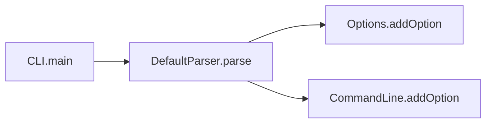

import { Tabs, TabItem, Steps, Aside, LinkCard, CardGrid } from "@astrojs/starlight/components";

CLDK analyzes a project and gives you structured program facts through one `analysis` object. The call graph answers questions about structure, such as which methods call a given method. You do not read the source files yourself.

This page describes the two kinds of facts that CLDK produces: **symbol tables** and **call graphs**. It also describes the **analysis levels** that control how much work CLDK does. Every example uses [Apache Commons CLI](https://commons.apache.org/proper/commons-cli/) (`project_path="commons-cli"`), the same checkout as [Quickstart](/quickstart/) and [COCOA](/cocoa/).

<Aside type="note" title="Construct once, query many times">
One `analysis` object serves every query on this page. The object is the handle to all the facts that CLDK holds about the project.
</Aside>

## Symbol tables

A **symbol table** is the structured inventory of a project: every file, class, method, field, and signature. CLDK builds it by default. It needs no call-graph analysis.

Use it to list or look up code structure: the classes in a project, the source body of a method, or the fields and signatures of a class.

<Tabs syncKey="lang">
  <TabItem label="Java">
    ```python
    from cldk import CLDK

    analysis = CLDK.java(project_path="commons-cli")

    # Whole-project inventory: file path -> JCompilationUnit
    symbol_table = analysis.get_symbol_table()

    # All classes: qualified name -> JType
    classes = analysis.get_classes()
    print(len(classes))
    # -> 60   (number of types in Commons CLI)

    # One method by qualified class + signature -> JCallable
    # Parameter types in the signature are fully qualified.
    method = analysis.get_method(
        "org.apache.commons.cli.Options", "addOption(org.apache.commons.cli.Option)"
    )
    print(method.code)
    # -> "public Options addOption(Option opt) { ... }"  (the source body)
    ```
  </TabItem>
  <TabItem label="Python">
    ```python
    from cldk import CLDK

    analysis = CLDK.python(project_path="my_pkg")

    # Whole-project inventory: module name -> PyModule
    symbol_table = analysis.get_symbol_table()

    # All classes: qualified name -> PyClass
    classes = analysis.get_classes()

    # One method -> PyCallable | None
    method = analysis.get_method("my_pkg.parser.Parser", "parse")
    ```
  </TabItem>
</Tabs>

<Aside type="tip">
`get_method(...).code` returns the exact source body of a method, not a paraphrase. This makes it a good way to put real source into a prompt. See [Common tasks](/guides/common-tasks/) for snippets.
</Aside>

C is more limited. It gives you the symbol table through `get_c_application()` and `get_functions()` (function name -> `CFunction`), but it has **no** call graph. See the note under [Analysis levels](#analysis-levels).

## Call graphs

A **call graph** records the caller and callee relationships in a project. Each node is a method. Each directed edge points from a **caller** to a **callee** that it calls. The graph shows how the code connects, and you can walk it.



CLDK gives you the graph as a `networkx.DiGraph` (edges point from caller to callee). It also gives you direct neighbor queries. Call graphs support impact analysis, dependency tracing, and other questions about how methods connect.

<Tabs syncKey="lang">
  <TabItem label="Java">
    ```python
    from cldk import CLDK
    from cldk.analysis import AnalysisLevel

    analysis = CLDK.java(
        project_path="commons-cli",
        analysis_level=AnalysisLevel.call_graph,  # required for call edges
    )

    cg = analysis.get_call_graph()       # networkx.DiGraph, caller -> callee
    print(cg.number_of_edges())
    # -> 412   (call edges in Commons CLI)

    # Callers of this method (impact analysis)
    callers = analysis.get_callers(
        "org.apache.commons.cli.Options", "addOption(org.apache.commons.cli.Option)"
    )

    # Methods invoked by this method
    callees = analysis.get_callees(
        "org.apache.commons.cli.DefaultParser",
        "parse(org.apache.commons.cli.Options, java.lang.String[])",
    )
    ```
  </TabItem>
  <TabItem label="Python">
    ```python
    from cldk import CLDK
    from cldk.analysis import AnalysisLevel

    analysis = CLDK.python(
        project_path="my_pkg",
        analysis_level=AnalysisLevel.call_graph,
    )

    cg = analysis.get_call_graph()       # networkx.DiGraph, caller -> callee
    callers = analysis.get_callers("my_pkg.parser.Parser", "parse")
    callees = analysis.get_callees("my_pkg.parser.Parser", "parse")
    ```
  </TabItem>
</Tabs>

## Analysis levels

The **analysis level** controls how much work CLDK does when it builds the `analysis` object. There are two:

- `AnalysisLevel.symbol_table`: the **default**. Resolves structure (classes, methods, fields, signatures). Fast, and enough for symbol-table queries.
- `AnalysisLevel.call_graph`: also computes call edges. **Required** for `get_call_graph`, `get_callers`, and `get_callees`.

```python
from cldk import CLDK
from cldk.analysis import AnalysisLevel

# Default: symbol table only (call edges are NOT populated)
st = CLDK.java(project_path="commons-cli")

# Opt in to call-graph depth when you need call relationships
cg = CLDK.java(
    project_path="commons-cli",
    analysis_level=AnalysisLevel.call_graph,
)
```

<Aside type="caution" title="Common pitfall">
If `get_call_graph`, `get_callers`, or `get_callees` return empty results, you built the `analysis` object at the default `symbol_table` level. Build it again with `analysis_level=AnalysisLevel.call_graph`. The default level does **not** populate call edges.
</Aside>

Java has a single-file mode, `CLDK.java(source_code="...")`, for quick syntactic work. This mode is deprecated, so use `project_path` instead. Python always needs `project_path`. Both give you the same symbol-table and call-graph methods through `analysis`.

## Where to go next

<CardGrid>
  <LinkCard title="Common tasks" description="Copy-paste snippets for each of these queries on a real project." href="/guides/common-tasks/" />
  <LinkCard title="COCOA" description="Build a Code Context Agent plugin over symbol tables and call graphs." href="/cocoa/" />
  <LinkCard title="Java API reference" description="Every method on the most complete analysis API." href="/reference/python-api/java/" />
</CardGrid>
