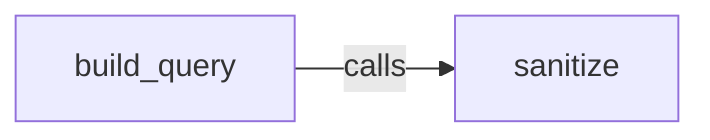
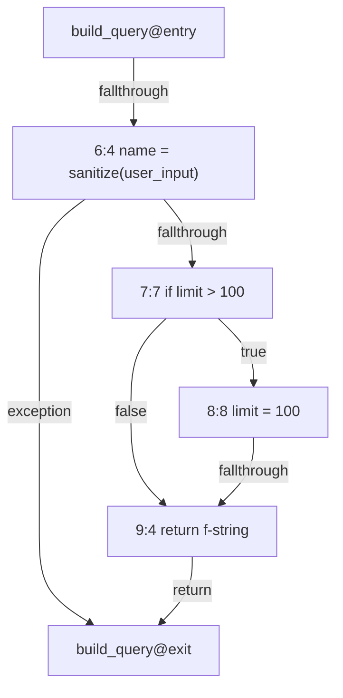
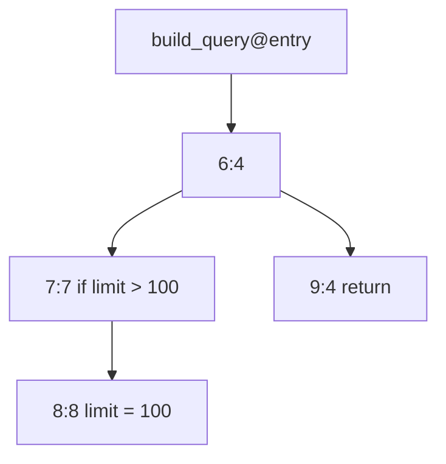
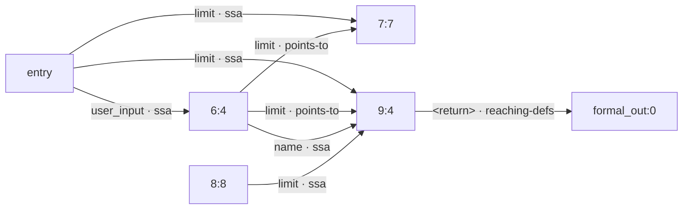
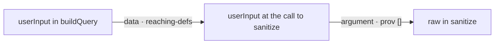

import { Tabs, TabItem, Steps, Aside, Badge, LinkCard, CardGrid } from "@astrojs/starlight/components";

This page answers one question. Why does CLDK build four different kinds of program facts, and how much can you trust each kind? Read it before the four pages that follow it.

## A static analysis reads the code and never runs it

A **static analysis** answers questions about a program without a single run of that program. It reads the source, builds a model of the source, and answers from the model.

The model is a graph. Each node stands for a piece of the program, such as one function or one statement. Each edge stands for a relation between two pieces, such as "this function calls that function".

A **dynamic analysis** is the other kind. It runs the program on real inputs and reports what happened on those inputs. The two kinds trade one strength for the other.

| Kind | Covers | Reports |
| --- | --- | --- |
| Dynamic | Only the inputs you supplied | Exactly what happened |
| Static | Every input at once | An approximation |

CLDK produces static facts. You construct one `analysis` object, and you ask that object your questions. You never parse the source yourself.

```python
from cldk import CLDK
from cldk.analysis import AnalysisLevel

analysis = CLDK.python(
    project_path="my_pkg",
    analysis_level=AnalysisLevel.call_graph,
)
```

## A static analysis cannot be exact

No static analysis answers every run-time question exactly for every program. This is a mathematical limit, not a gap in CLDK. Every static analysis therefore picks a direction to be wrong in, and there are only two directions.

- **Over-approximation.** The model holds more than the program does. Every real behavior is present, and some behaviors that never happen are present too.
- **Under-approximation.** The model holds less than the program does. Everything present is real, and some real behaviors are absent.

The rest of this track states the direction for every graph it describes. The next two sections give one real example of each direction.

### Over-approximation keeps what the backend cannot rule out

Take two lines from the fixture that this page follows:

```python
name = sanitize(user_input)    # line 6
if limit > 100:                # line 7
```

A **data-dependence edge** records that one statement reads a value that another statement wrote. Line 6 assigns `name`. Line 7 reads `limit`.

codeanalyzer-python records a data-dependence edge for `limit` from line 6 to line 7 anyway. Every such edge carries a **provenance**, which is the evidence the backend holds for the edge. The provenance of this one is `points-to`.

Line 6 does not assign `limit`. The backend keeps the edge because it cannot prove that the call to `sanitize` leaves `limit` alone. An unprovable case stays in the graph, and that is over-approximation.

The cost to you is a false alarm. An over-approximated graph can hand you a path that no real run takes. The three provenance values rank from `ssa` (strongest) through `reaching-defs` to `points-to` (weakest). [How certain an edge is](/guides/dataflow/#how-certain-an-edge-is) says what each value means.

### Under-approximation drops what the backend cannot resolve

Take a third function, one that calls `build_query`:

```python
def handle(request):
    return build_query(request, 500)
```

The value `request` flows into the `user_input` parameter of `build_query`. If you ask codeanalyzer-python whether the value crosses that call, the answer is `False`.

```python
# analysis is built with analysis_level=AnalysisLevel.system_dependency_graph
analysis.flows_to_call("request", "build_query", within="handle")
# -> False
```

The graph holds the vertices for this call. The traversal in the pinned backend does not connect them. A real behavior is absent from the model, and that is under-approximation. This defect is fixed in codeanalyzer-python 1.5.4 ([issue #220](https://github.com/codellm-devkit/codeanalyzer-python/issues/220)). CLDK 2.0.0rc7 pins `codeanalyzer-python==1.5.2`, so the pre-release still carries it ([python-sdk #413](https://github.com/codellm-devkit/python-sdk/issues/413) tracks the pin bump). To get the fix today, install the backend over the pin with `pip install "codeanalyzer-python==1.5.4"`.

The cost to you is a clean answer that is wrong. A batch query reports the pair as searched and empty, with no diagnostic to warn you.

```python
result = analysis.taint(
    sources=[("request", "handle")],
    sinks=[("raw", "sanitize")],
)
result.paths        # -> []
result.exhausted    # -> [('request', 'raw')]
result.complete     # -> True
result.unresolved   # -> []
```

<Aside type="caution" title="Do not read this Python result as a refutation">
A **refutation** is an answer that says no such flow exists anywhere in the program. This result is not one. The flow from `request` to `raw` is plain in the source. The empty `paths` list and the clean `exhausted` entry describe the emitted graph, not the program. For value flow across a call boundary, build the analysis with `CLDK.typescript`. See [System dependence](/guides/system-dependence/).
</Aside>

### An absent result is weaker evidence than a present one

A **present** result is a witness. CLDK names each node on the path, so you can read the path and judge it. The graph over-approximates, so a witness can be spurious. You still hold something concrete.

An **absent** result is a claim about the whole search space. It holds only if the model lost nothing that mattered. Wherever the model under-approximates, an absent result proves nothing at all about the program.

Which direction is safe depends on the question you ask.

| You want to trust | The model must | An extra entry costs you | A missing entry costs you |
| --- | --- | --- | --- |
| An absence, such as "no flow reaches this sink" | Over-approximate | A false alarm you can dismiss | The whole claim |
| A presence, such as "this flow always happens" | Under-approximate | The whole claim | A missed result |

CLDK sits on both sides of this table at once. The data-dependence edges over-approximate, which is the safe direction for an absence claim. The call structure under-approximates wherever **dispatch** stays unresolved. Dispatch is the step that turns a call site into the callable that the call runs. A backend cannot always settle it.

So a refutation from CLDK is only as strong as the call structure beneath it. [Taint analysis](/guides/taint/) describes the `unresolved` ledger that tells you where that structure gave out.

## The ladder CLDK builds

CLDK builds program facts in four rungs. A **callable** is one function or one method. Each rung is a strict superset of the rung below it. You pick a rung with the `analysis_level` argument, and CLDK passes the matching integer to the backend as `-a`.

| Rung | `AnalysisLevel` member | Backend `-a` | What it adds | Page |
| --- | --- | --- | --- | --- |
| 1 | `symbol_table` | 1 | Classes, functions, parameters, signatures, source text | [Symbol tables](/guides/symbol-tables/) |
| 2 | `call_graph` | 2 | Caller-to-callee edges | [Call graphs](/guides/call-graphs/) |
| 3 | `program_dependency_graph` <Badge text="2.0" variant="caution" /> | 3 | Control flow and dataflow inside one callable | [Dataflow graphs](/guides/dataflow/) |
| 4 | `system_dependency_graph` <Badge text="2.0" variant="caution" /> | 4 | Dataflow across call boundaries | [System dependence](/guides/system-dependence/) |

Rungs 1 and 2 are the two rungs that CLDK 1.x has. Rungs 3 and 4 arrive in CLDK 2.0. Version 2.0 is a release candidate, so `pip install cldk` gives you 1.5.0 from PyPI. To get the pre-release, run:

```bash frame="none"
pip install --pre cldk
```

<Aside type="note" title="codeanalyzer-iac counts to three, not four">
The `-a` column above applies to codeanalyzer-java, codeanalyzer-python, and codeanalyzer-typescript. The infrastructure backend `caniac` takes `-a 1`, `2`, or `3` only, and it rejects level 4 with an error. Its three levels mean different things. Read [codeanalyzer-iac](/backends/codeanalyzer-iac/) for that scale.
</Aside>

Pick the lowest rung that answers your question. A higher rung costs more time and more memory. If a graph accessor raises `CodeanalyzerUsageException`, you built the `analysis` object below rung 3.

## One file, four answers

The whole track follows one tiny file. Two functions carry every graph on this page. `build_query` calls `sanitize`, and it guards `limit` with an `if` statement.

<Tabs syncKey="lang">
  <TabItem label="Python">
    ```python title="queries.py" showLineNumbers
    def sanitize(raw):
        return raw.strip()


    def build_query(user_input, limit):
        name = sanitize(user_input)
        if limit > 100:
            limit = 100
        return f"SELECT * FROM users WHERE name = '{name}' LIMIT {limit}"
    ```
  </TabItem>
  <TabItem label="TypeScript">
    ```typescript title="src/queries.ts" showLineNumbers
    export function sanitize(raw: string): string {
      return raw.trim();
    }

    export function buildQuery(userInput: string, limit: number): string {
      const name = sanitize(userInput);
      if (limit > 100) {
        limit = 100;
      }
      return `SELECT * FROM users WHERE name = '${name}' LIMIT ${limit}`;
    }
    ```
  </TabItem>
</Tabs>

The line numbers beside the Python file are the ones that every node identifier below uses. Each rung says something more about this file. The four sections below sketch what each rung says. The four pages that follow this one go deep.

### Rung 1 says what exists

The symbol table is the structured inventory of the project. For this file it records two functions, `sanitize` and `build_query`. It records the parameter names `raw`, `user_input`, and `limit`. It records the exact source text of each body.

It records no relation between the two functions. Rung 1 knows that `sanitize` exists and that `build_query` exists, and nothing more.

### Rung 2 says what calls what

The call graph adds one edge for this file, from `build_query` to `sanitize`.



Two methods query that edge.

```python
analysis.reaches("build_query", "sanitize")
# -> True

paths = analysis.call_paths_between("build_query", "sanitize")
[[hop.to.callable for hop in path.hops] for path in paths]
# -> [['queries.sanitize']]
```

`reaches` works on **callables**, not on values. If you pass it a variable name, it raises, because a variable is not a node in the call graph.

```python
analysis.reaches("user_input", "raw")
# raises SelectorNotInGraph: 1 of 1 callable not in graph: 'user_input'
```

That exception marks the boundary between rung 2 and rung 3. Rung 2 knows that one function calls another. It knows nothing about the values that travel between them.

### Rung 3 says what flows inside one function

Rung 3 builds three graphs for each callable. Node identifiers name the callable, the line, and the column, so `build_query@6:4` is the node in `build_query` at line 6, column 4.

<Aside type="note" title="The dataflow numbers below come from a rung 4 build">
Rung 3 builds all three graphs of this section. It does not build the parameter vertices that a value name resolves to, and it does not carry the `points-to` edges. So the data-dependence graph and the slice below need `analysis_level=AnalysisLevel.system_dependency_graph`. A rung 3 data-dependence graph for the same function is narrower, not different.
</Aside>

The **control-flow graph**, or CFG, records the order in which statements can run. codeanalyzer-python emits seven edges for `build_query`, and each edge carries a kind.



The `exception` edge from line 6 to the exit is real. The call to `sanitize` can raise, so control can leave the function at line 6.

The **control-dependence graph**, or CDG, records which branch decides whether a statement runs. Statement B is control-dependent on branch A when the outcome of A decides whether B runs. The CDG for `build_query` holds four edges.



Line 8 runs only when the test on line 7 is true, so line 8 is control-dependent on line 7. Line 9 runs whatever line 7 decides, so line 9 is not control-dependent on line 7.

The **data-dependence graph**, or DDG, records which statement produced the value that another statement reads. It holds two more kinds of node. A **parameter vertex** stands for one parameter of the callable, or for the value it returns, and it sits at the signature line. A **call-site vertex** stands for one argument or one result at a call.

The full DDG for `build_query` holds seventeen edges. The figure below draws eight of them. The other nine touch a parameter vertex, touch a call-site vertex, or carry the name `sanitize` itself into line 6.



Each edge names the variable that carries the value and the provenance that justifies the edge. The two `points-to` edges out of line 6 are the over-approximation from earlier on this page. The last edge carries the result of line 9 out to `build_query@formal_out:0`, the parameter vertex for the return value.

A **forward slice** is the set of program points that a value at one point can affect. The forward slice of `user_input` inside `build_query` holds seven nodes.

```python
sl = analysis.slice_forward("user_input", within="build_query")
sl.total                           # -> 7
[node.ref for node in sl.roots]    # -> ['build_query@formal_in:0']
```

The one root is `build_query@formal_in:0`, the parameter vertex for `user_input`. The seven nodes cover lines 6, 7, 8, and 9, plus three nodes on the signature line. Every one of them stays inside `build_query`.

### Rung 4 says what flows across the call

Rung 4 joins the per-callable graphs into one **system dependence graph**, or SDG. It adds edges that bind an argument at a call site to the matching parameter of the callee. It adds edges that carry a result back. It adds **summary** edges. A summary edge joins an argument of one call to a result of that same call, and it records that the value gets through.

The TypeScript backend links `userInput` across the call into `sanitize`. Build the analysis for the TypeScript project at rung 4 first.

```python
analysis = CLDK.typescript(
    project_path="queries-ts",
    analysis_level=AnalysisLevel.system_dependency_graph,
)

analysis.flows_to_call("userInput", "sanitize", within="buildQuery")
# -> True
```

The boolean says that a flow exists. The next call returns the witness.

```python
flows = analysis.paths_between(
    "userInput", "raw",
    src_within="buildQuery",
    dst_within="sanitize",
)
len(flows.paths)    # -> 1
```

The single path has two hops. The figure below draws it as CLDK reports it.



The first hop is a `data` hop with the provenance `reaching-defs`, and it stays inside `buildQuery`. The second hop is an `argument` hop, and it crosses into `sanitize`. Its provenance list is empty, because the call itself is all the evidence a parameter edge needs. The forward slice grows to match:

```python
analysis.slice_forward("userInput", within="buildQuery").total
# -> 11
```

<Aside type="caution" title="Rung 4 crosses calls in TypeScript, not in Python">
codeanalyzer-typescript 1.6.0 links value flow across a call, as the numbers above record. codeanalyzer-python 1.5.2 emits the parameter vertices and the summary records, and the SDK traversal does not connect them. This defect is fixed in codeanalyzer-python 1.5.4 ([issue #220](https://github.com/codellm-devkit/codeanalyzer-python/issues/220)). CLDK 2.0.0rc7 pins `codeanalyzer-python==1.5.2`, so the pre-release still carries it ([python-sdk #413](https://github.com/codellm-devkit/python-sdk/issues/413) tracks the pin bump). To get the fix today, install the backend over the pin with `pip install "codeanalyzer-python==1.5.4"`. Every cross-procedure value-flow example in this track uses TypeScript, because that is what the pinned backends answer today. For Python on 1.5.2, treat rung 4 value queries as intraprocedural.
</Aside>

## How to read this track

Read the four pages in rung order. Each page assumes the page before it.

<Steps>
1. [Symbol tables](/guides/symbol-tables/) builds rung 1. It shows you how to list classes, find a method, and pull exact source text.

2. [Call graphs](/guides/call-graphs/) builds rung 2. It shows you callers, callees, and callable reachability, and it states where dispatch stays unresolved.

3. [Dataflow graphs](/guides/dataflow/) builds rung 3. It covers the three per-callable graphs, slices, flow paths, and the provenance order.

4. [System dependence](/guides/system-dependence/) builds rung 4. It covers parameter edges, summary edges, and the two-phase traversal that crosses a call.
</Steps>

[Taint analysis](/guides/taint/) sits on top of rung 4. Read it last, because its refutations only mean what the four rungs beneath them support.

## Background reading

For a reader-friendly book-length introduction to this whole field, read Michael D. Ernst, "Program Analysis" (course book), at [https://homes.cs.washington.edu/~mernst/pubs/program-analysis-book.pdf](https://homes.cs.washington.edu/~mernst/pubs/program-analysis-book.pdf). It assumes no prior background and it covers every term on this page.

Three papers define the graphs that rungs 3 and 4 build. The later pages cite them where they apply.

- Weiser, "Program Slicing", ICSE 1981. The origin of slicing.
- Ferrante, Ottenstein, Warren, "The Program Dependence Graph and Its Use in Optimization", ACM TOPLAS 9(3):319-349, 1987. The PDG and control dependence.
- Horwitz, Reps, Binkley, "Interprocedural Slicing Using Dependence Graphs", ACM TOPLAS 12(1):26-60, 1990. The SDG, parameter vertices, summary edges, and two-phase slicing.

## Where to go next

<CardGrid>
  <LinkCard title="Symbol tables" description="Rung 1: the structured inventory of a project, and how to pull exact source text from it." href="/guides/symbol-tables/" />
  <LinkCard title="Quickstart" description="Install CLDK, point it at a project, and run your first query." href="/quickstart/" />
  <LinkCard title="Cheat sheet" description="Every analysis method in one table, with the rung each one needs." href="/resources/cheatsheet/" />
</CardGrid>
