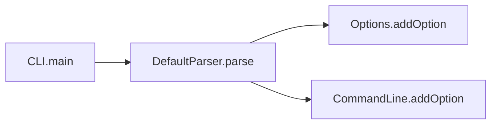

import { Tabs, TabItem, Steps, Aside, LinkCard, CardGrid } from "@astrojs/starlight/components";

CLDK points at a project and hands back structured, queryable facts instead of a wall of text, through one `analysis` interface that's the same across languages. An agent that uses CLDK answers *"what calls this method?"* by **looking it up**, not by guessing from the one file it happened to read.

This page covers the three facts CLDK produces (**symbol tables**, **call graphs**, and **reachability**) and the **analysis levels** that control how much work CLDK does to build them. Every snippet uses the recurring sample project, [Apache Commons CLI](https://commons.apache.org/proper/commons-cli/) (`project_path="commons-cli"`), the same checkout used across [Quickstart](/quickstart/) and [cocoa](/cocoa/).

<Aside type="note" title="Construct once, query many times">
Build a single `analysis` object up front and reuse it for every query below. It is the handle to all of CLDK's facts about your project.
</Aside>

## Symbol tables

A **symbol table** is the structured inventory of a project: every file, class, method, field, and signature, resolved and ready to query. It's the foundation every other concept is built on, and it's what you get by default, with no extra analysis cost.

Use it whenever you want to *enumerate* or *look up* code structure: list the classes in a project, pull a method's source body, walk fields and signatures. This is the "give me the structure" layer.

<Tabs syncKey="lang">
  <TabItem label="Java">
    ```python
    from cldk import CLDK

    analysis = CLDK(language="java").analysis(project_path="commons-cli")

    # Whole-project inventory: file path -> JCompilationUnit
    symbol_table = analysis.get_symbol_table()

    # All classes: qualified name -> JType
    classes = analysis.get_classes()
    print(len(classes))
    # -> 60   (number of types in Commons CLI)

    # One method by qualified class + signature -> JCallable
    method = analysis.get_method(
        "org.apache.commons.cli.Options", "addOption(Option)"
    )
    print(method.code)
    # -> "public Options addOption(Option opt) { ... }"  (the source body)
    ```
  </TabItem>
  <TabItem label="Python">
    ```python
    from cldk import CLDK

    analysis = CLDK(language="python").analysis(project_path="my_pkg")

    # Whole-project inventory: module name -> PyModule
    symbol_table = analysis.get_symbol_table()

    # All classes: qualified name -> PyClass
    classes = analysis.get_classes()

    # One method -> PyCallable | None
    method = analysis.get_method("my_pkg.parser.Parser", "parse")
    ```
  </TabItem>
</Tabs>

<Aside type="tip">
`get_method(...).code` is the single most useful call for feeding real source into a prompt: it returns the exact body, not a paraphrase. See [Common tasks](/guides/common-tasks/) for copy-paste snippets.
</Aside>

C is more limited: it exposes the symbol table through `get_c_application()` and `get_functions()` (function name -> `CFunction`), but has **no** call graph or reachability: see the note under [Analysis levels](#analysis-levels).

## Call graphs

A **call graph** records *who calls whom*: each node is a method, and each directed edge points from a **caller** to the **callee** it invokes. It turns "how is this code wired together?" into a graph you can traverse.



CLDK exposes the graph as a `networkx.DiGraph` (edges point caller -> callee), plus direct neighbor queries. Use call graphs for impact analysis ("what breaks if I change this?"), dependency tracing, and any question about how methods connect.

<Tabs syncKey="lang">
  <TabItem label="Java">
    ```python
    from cldk import CLDK
    from cldk.analysis import AnalysisLevel

    analysis = CLDK(language="java").analysis(
        project_path="commons-cli",
        analysis_level=AnalysisLevel.call_graph,  # required for call edges
    )

    cg = analysis.get_call_graph()       # networkx.DiGraph, caller -> callee
    print(cg.number_of_edges())
    # -> 412   (call edges in Commons CLI)

    # Who calls this method? (impact analysis)
    callers = analysis.get_callers(
        "org.apache.commons.cli.Options", "addOption(Option)"
    )

    # What does this method invoke?
    callees = analysis.get_callees(
        "org.apache.commons.cli.DefaultParser", "parse(Options, String[])"
    )
    ```
  </TabItem>
  <TabItem label="Python">
    ```python
    from cldk import CLDK
    from cldk.analysis import AnalysisLevel

    analysis = CLDK(language="python").analysis(
        project_path="my_pkg",
        analysis_level=AnalysisLevel.call_graph,
    )

    cg = analysis.get_call_graph()       # networkx.DiGraph, caller -> callee
    callers = analysis.get_callers("my_pkg.parser.Parser", "parse")
    callees = analysis.get_callees("my_pkg.parser.Parser", "parse")
    ```
  </TabItem>
</Tabs>

## Reachability

**Reachability** asks: *can execution get from method A to method B at all?* You answer it with a graph query over the call graph using `networkx`:

```python
import networkx as nx

cg = analysis.get_call_graph()
reachable = nx.has_path(cg, source_node, sink_node)
print(reachable)
# -> False   (no path from source to sink)
```

For the path itself, use `nx.shortest_path(cg, source_node, sink_node)` or `nx.all_simple_paths(cg, source_node, sink_node)`.

This is the difference between an agent *crawling the codebase* to approximate whether a vulnerable sink can be triggered and a tool *proving* it: `nx.has_path` returns the same deterministic, auditable answer every time, from real static analysis. It's the backbone of the source-to-sink triage in [cocoa](/cocoa/).

<Aside type="caution">
Reachability needs real call edges, so the project must be analyzed at the `call_graph` level.
</Aside>

## Analysis levels

The **analysis level** controls how much work CLDK does when it builds the `analysis` object. There are two:

- `AnalysisLevel.symbol_table`: the **default**. Resolves structure (classes, methods, fields, signatures). Fast, and enough for symbol-table queries.
- `AnalysisLevel.call_graph`: additionally computes call edges. **Required** for `get_call_graph`, `get_callers`, `get_callees`, and therefore reachability.

```python
from cldk import CLDK
from cldk.analysis import AnalysisLevel

# Default: symbol table only (call edges are NOT populated)
st = CLDK(language="java").analysis(project_path="commons-cli")

# Opt in to call-graph depth when you need call relationships
cg = CLDK(language="java").analysis(
    project_path="commons-cli",
    analysis_level=AnalysisLevel.call_graph,
)
```

<Aside type="caution" title="The mistake to avoid">
If `get_call_graph`, `get_callers`, or `get_callees` come back empty, you almost certainly built the facade at the default `symbol_table` level. Rebuild with `analysis_level=AnalysisLevel.call_graph`: the default does **not** populate call edges.
</Aside>

Java supports a single-file mode via `analysis(source_code="...")` for quick syntactic work; Python requires `project_path`. Both expose the same symbol-table and call-graph methods through the shared `analysis` facade.

## Where to go next

<CardGrid>
  <LinkCard title="Common tasks" description="Copy-paste snippets for each of these queries on a real project." href="/guides/common-tasks/" />
  <LinkCard title="cocoa" description="Build a Code Context Agent plugin over symbol tables, call graphs, and reachability." href="/cocoa/" />
  <LinkCard title="Java API reference" description="Every method on the richest analysis facade." href="/reference/python-api/java/" />
</CardGrid>
