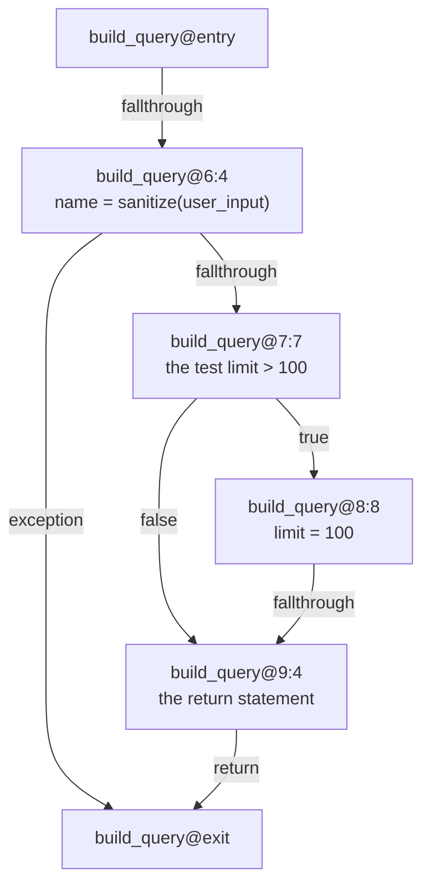
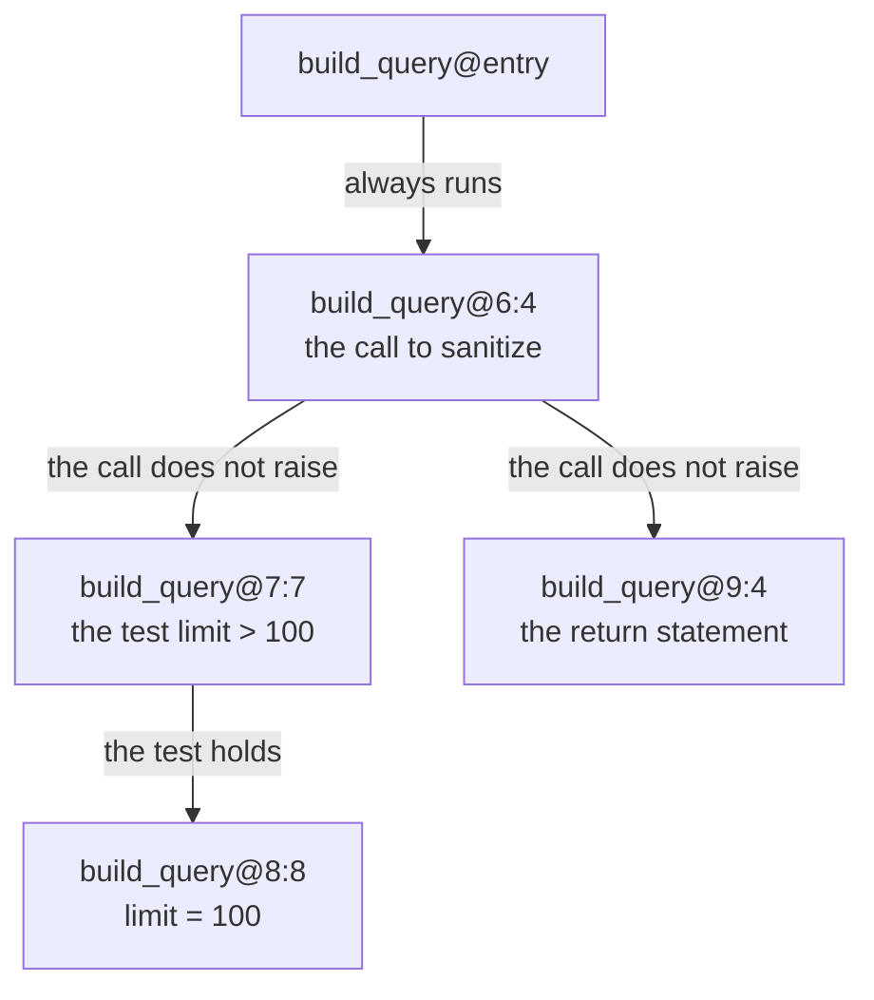
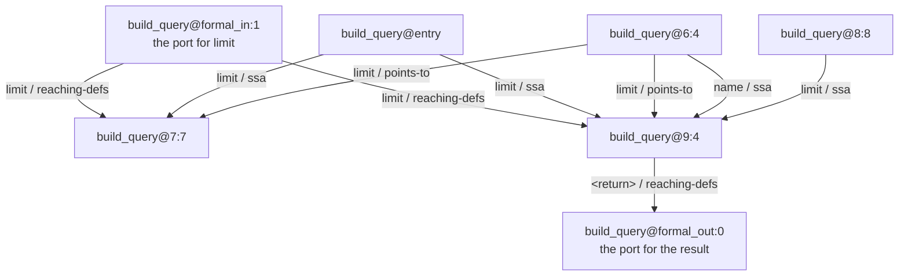

import { Aside, Badge, Steps, LinkCard, CardGrid } from "@astrojs/starlight/components";

<p><Badge text="2.0" variant="caution" /> <Badge text="Release candidate" variant="note" /></p>

This page answers one question: how does CLDK describe the order that statements run in, and the way values move between them, inside one function? Every graph on this page belongs to one function. Where a value crosses a call, this page says so and points at [System dependence graphs](/guides/system-dependence/).

<Aside type="caution" title="These graphs need CLDK 2.0">
Level 3 and level 4, and every method on this page, arrive in CLDK 2.0. The stable release on PyPI is 1.5.0, so `pip install cldk` gives you 1.5.0. To get the pre-release, run:

```bash frame="none"
pip install --pre cldk
```
</Aside>

## The function on this page

Every node, every edge and every number below comes from one real run against this file.

```python
# queries.py
def sanitize(raw):
    return raw.strip()


def build_query(user_input, limit):              # line 5
    name = sanitize(user_input)                  # line 6
    if limit > 100:                              # line 7
        limit = 100                              # line 8
    return f"SELECT ... '{name}' LIMIT {limit}"  # line 9
```

Build the analysis once at level 4, which CLDK names `system_dependency_graph`:

```python
from cldk import CLDK
from cldk.analysis import AnalysisLevel

analysis = CLDK.python(
    project_path="queries",
    analysis_level=AnalysisLevel.system_dependency_graph,
)
```

CLDK names a node inside a callable with the `can://` id of that callable, an `@`, and a key for the position. The full id runs to the project name, the language, the module path and the callable signature, so this page shortens each one. `build_query@8:8` stands for the node at line 8, column 8. Treat the whole id as opaque. Pass it back to CLDK rather than take it apart.

## The control-flow graph

A control-flow graph, or CFG, records the order that the parts of one function can run in. Each node is a piece of the function. Each edge says that control can pass from the source node to the target node.

Textbooks group straight-line statements into a **basic block**. A basic block is a run of statements with one way in and one way out. Control runs all of them, or none of them. CLDK does not group. It keeps one node for each statement and one node for each test, which is finer than a basic block.

The CFG of `build_query` uses five node kinds: `entry`, `statement`, `branch`, `return` and `exit`. The callable holds five more kinds that no CFG edge of it names: `call`, `formal_in`, `formal_out`, `actual_in` and `actual_out`. The data-dependence section below explains the ones this function uses.

Two nodes hold no code at all. `build_query@entry` is the single place control enters the function. `build_query@exit` is the single place control leaves it. Neither id carries a line or a column, because neither node is a position in the file. One entry and one exit give every later computation one place to start from and one place to finish at.

### The edge kinds

| `kind` | What the edge says |
| --- | --- |
| `fallthrough` | Control passes on with no test |
| `true` | The test held, so control takes this branch |
| `false` | The test did not hold, so control takes this branch |
| `exception` | The source can raise, so control can leave the function here |
| `return` | The function hands its result back and stops |

A loop adds a `loop_back` edge to the top of the loop. `build_query` has no loop, so no `loop_back` edge appears here.

### The real CFG of `build_query`

`analysis.get_cfg("build_query")` returns these seven edges.

| Source | Target | `kind` |
| --- | --- | --- |
| `build_query@entry` | `build_query@6:4` | `fallthrough` |
| `build_query@6:4` | `build_query@7:7` | `fallthrough` |
| `build_query@6:4` | `build_query@exit` | `exception` |
| `build_query@7:7` | `build_query@8:8` | `true` |
| `build_query@7:7` | `build_query@9:4` | `false` |
| `build_query@8:8` | `build_query@9:4` | `fallthrough` |
| `build_query@9:4` | `build_query@exit` | `return` |



The branch node is `build_query@7:7`, at column 7. That is the test `limit > 100`, not the `if` keyword at column 4. CLDK gives the test its own node, because the test is the thing with two outcomes.

### Why the exception edge is there

Read `build_query@6:4 -> build_query@exit  kind=exception` again. Line 6 calls `sanitize`. Any call can raise. If `sanitize` raises, `build_query` stops at line 6, and lines 7, 8 and 9 never run.

An edge set without that edge claims that line 7 always runs after line 6. The claim is false. Every later computation on this page reads the CFG, so one wrong edge here spreads. The exception edge is the single edge that shapes both of the other two graphs of this function.

## Control dependence

Node B is **control-dependent** on node A when A decides whether B runs. That is the whole idea. The rest is the precise test that turns the idea into edges.

Node A has two or more successors in the CFG. From one successor, B is certain to run. From another successor, B is not certain to run. A therefore decides B, and the control-dependence graph, or CDG, holds an edge from A to B.

"Certain to run" has a name of its own. Node P **post-dominates** node N when every path from N to `exit` passes through P. So the test reads: B post-dominates one successor of A, and B does not post-dominate another successor of A.

Ferrante, Ottenstein and Warren defined control dependence this way in 1987, and the CLDK backend follows them. The file `codeanalyzer/dataflow/dominance.py` says so in its own words: "Control dependence follows Ferrante-Ottenstein-Warren".

### The real CDG of `build_query`

`analysis.get_cdg("build_query")` returns these four edges.

| Source | Target |
| --- | --- |
| `build_query@entry` | `build_query@6:4` |
| `build_query@6:4` | `build_query@7:7` |
| `build_query@6:4` | `build_query@9:4` |
| `build_query@7:7` | `build_query@8:8` |



A `CdgEdge` carries `src` and `dst` and nothing else. The labels in the figure name the outcome that makes the target run. They come from the CFG edge kinds, not from a field on the CDG edge.

### What each edge says

`build_query@entry -> build_query@6:4`. Line 6 runs whenever `build_query` runs. The classic construction adds an edge from `entry` to `exit` before it applies the test. That gives `entry` a second successor, and every statement that always runs becomes control-dependent on `entry`. So read an edge out of `entry` as "this node always runs".

`build_query@6:4 -> build_query@7:7` and `build_query@6:4 -> build_query@9:4`. This is the exception edge at work. Line 6 has two successors: line 7 and `exit`. Down the `exit` successor, neither line 7 nor line 9 runs. Down the other successor, both are certain to run. So line 6 decides both of them.

Line 6 is not a test in the source. It is a decision point all the same, because the call can raise.

`build_query@7:7 -> build_query@8:8`. The plain case. Line 8 runs only when `limit > 100` holds.

Read what is **absent**. Line 9 is not control-dependent on line 7. Both branches of the test reach line 9, so the test does not decide whether line 9 runs. The test decides only what `limit` holds at line 9, and that is data dependence.

## Data dependence

A **definition** of a variable is a place that gives the variable a value. A **use** is a place that reads it. At line 8, `limit = 100` is a definition of `limit`. At line 9, `LIMIT {limit}` is a use of `limit`.

A **data-dependence edge**, also called a def-use edge, runs from a definition to a use. CLDK adds one when all three of these hold:

<Steps>
1. The source node defines a variable.
2. The target node reads the same variable.
3. A path in the CFG runs from the source to the target, and nothing on it is certain to give the variable another value.
</Steps>

Condition 3 is the reason the data-dependence graph, or DDG, sits on top of the CFG. Order in the file decides nothing. Order in the CFG decides everything.

Each `DdgEdge` carries four fields. `src` and `dst` are node ids. `var` names the variable that flows. `prov` is a list that names the evidence for the edge. The same pair of nodes appears more than once when the pair carries more than one variable, or more than one kind of evidence.

### The real DDG of `build_query`

`analysis.get_ddg("build_query")` returns these seventeen edges.

| Source | Target | `var` | `prov` |
| --- | --- | --- | --- |
| `build_query@entry` | `build_query@6:4` | `user_input` | `['ssa']` |
| `build_query@entry` | `build_query@6:4` | `queries::sanitize` | `['ssa']` |
| `build_query@entry` | `build_query@7:7` | `limit` | `['ssa']` |
| `build_query@entry` | `build_query@9:4` | `limit` | `['ssa']` |
| `build_query@entry` | `build_query@6:4/actual_in:0` | `user_input` | `['reaching-defs']` |
| `build_query@formal_in:0` | `build_query@6:4` | `user_input` | `['reaching-defs']` |
| `build_query@formal_in:1` | `build_query@7:7` | `limit` | `['reaching-defs']` |
| `build_query@formal_in:1` | `build_query@9:4` | `limit` | `['reaching-defs']` |
| `build_query@formal_in:2` | `build_query@6:4` | `queries::sanitize` | `['reaching-defs']` |
| `build_query@6:4` | `build_query@7:7` | `limit` | `['points-to']` |
| `build_query@6:4` | `build_query@9:4` | `limit` | `['points-to']` |
| `build_query@6:4` | `build_query@9:4` | `name` | `['ssa']` |
| `build_query@6:4` | `build_query@formal_out:1` | `user_input.*` | `['reaching-defs']` |
| `build_query@6:4/actual_out:0` | `build_query@6:4` | `<return>` | `['reaching-defs']` |
| `build_query@6:4/actual_out:1` | `build_query@6:4` | `raw` | `['reaching-defs']` |
| `build_query@8:8` | `build_query@9:4` | `limit` | `['ssa']` |
| `build_query@9:4` | `build_query@formal_out:0` | `<return>` | `['reaching-defs']` |

The figure below draws nine of the seventeen edges: the ones that carry `limit`, `name` and the result.

Four more edges bring `user_input` and `queries::sanitize` into line 6. The last four sit on `build_query@6:4/actual_in:0`, `build_query@6:4/actual_out:0`, `build_query@6:4/actual_out:1` and `build_query@formal_out:1`. Those four belong to the call at line 6, and [System dependence graphs](/guides/system-dependence/) explains them.



### The ports, and why a value has two sources

Every value that enters `build_query` has two source nodes in the DDG.

`build_query@entry` carries the `ssa` definition of each value that enters. `build_query@formal_in:0`, `:1` and `:2` are the **ports**, one for each value that enters the callable. A port is the vertex that a level-4 graph joins to the argument at a call site. Horwitz, Reps and Binkley introduced these ports in 1990. The two node kinds name the same value with different evidence, and for different work.

The three ports of `build_query` carry `user_input`, `limit` and `sanitize`. The third one surprises most readers. `sanitize` is a module-level name that the body reads, so CLDK treats it as a value that enters the callable. `resolve_value("sanitize", within="build_query")` returns the kind `global`, not `parameter`, and a `defined_in` of `queries`. The `var` field of the DDG spells the same value `queries::sanitize`, and the name you address it by is `sanitize`.

`build_query@formal_out:0` and `:1` are the ports for values that leave. `formal_out:0` carries `<return>`, the result of the function. `formal_out:1` carries `user_input`, because the call at line 6 can change what `user_input` refers to. CLDK writes that as `user_input.*`, which names the object rather than the name.

### Two definitions reach line 9

This is the case worth the most study in the whole graph. Four rows of the table carry `limit` into line 9. They name two definitions:

- `build_query@formal_in:1 -> build_query@9:4`, `var=limit`, `prov=['reaching-defs']`. This is the value the caller passed. The row `build_query@entry -> build_query@9:4`, `prov=['ssa']`, names the same value at the other source node.
- `build_query@8:8 -> build_query@9:4`, `var=limit`, `prov=['ssa']`. This is the literal `100`.

The fourth row, `build_query@6:4 -> build_query@9:4` with `prov=['points-to']`, is not a definition at all. The next section reads it.

Only one of the two is the real value in any single run. If the test at line 7 holds, line 8 runs, and line 9 reads `100`. If the test does not hold, line 8 never runs, and line 9 reads what the caller passed. The graph is static. It never runs the program, so it cannot know which branch a run takes. It records both.

Two definitions on one use mean one thing for you. Any claim you make about `limit` at line 9 must hold for both of them. CLDK errs in one direction only. It lists every definition that can reach the use, and it can list a definition that a particular run never takes. It does not drop a definition that a run does take.

A backward slice from line 9 is the set of nodes that can affect line 9. That slice is never too small, and it can be too large. The price you pay is extra nodes to read, not a missed source.

Compare `name` at line 9. One edge carries it, `build_query@6:4 -> build_query@9:4` with `prov=['ssa']`, because line 6 is the only definition of `name`. One definition, one use, no choice to make.

## How certain an edge is

The `prov` list is the evidence for an edge. Three values appear in the DDG of `build_query`, and they rank by certainty:

```
ssa  >  reaching-defs  >  points-to
```

| `prov` | What the backend did | How far you can trust it |
| --- | --- | --- |
| `ssa` | Rewrote the body so each name has exactly one definition | Exact. The edge names that one definition |
| `reaching-defs` | Walked the CFG and collected every definition still live at the use | Correct, but it can name more than one |
| `points-to` | Asked an alias computation which names can refer to the same object | Weakest. Two names that can alias do not always alias |

Only a data-dependence edge carries `prov`. A control-dependence edge carries none. An empty `prov` claims no approximation, so it ranks above all three.

`points-to` is the part of the graph that only an alias computation produces, and only a level-4 analysis carries it. A level-3 DDG is narrower than this one rather than wrong.

The two `points-to` edges here start at line 6. Line 6 calls `sanitize(user_input)`. The alias computation cannot rule out that the call reaches what `limit` refers to. So CLDK records the edge, and marks it as a possibility. Read a `points-to` edge as "this can happen", never as "this does happen".

### The weakest hop caps the claim

A path is a sequence of hops. A path is only as strong as its least certain hop, so one `points-to` hop makes the whole path a "can". `FlowPath.weakest` returns that hop. The two-hop path below comes from a TypeScript analysis of the same two functions.

```python
ts = CLDK.typescript(
    project_path="queries-ts",
    analysis_level=AnalysisLevel.system_dependency_graph,
)

flows = ts.paths_between(
    "userInput", "raw", src_within="buildQuery", dst_within="sanitize"
)
path = flows.paths[0]

print([(hop.via, hop.var, hop.prov) for hop in path.hops])
# [('data', 'userInput', ['reaching-defs']), ('argument', 'raw', [])]

print(path.weakest.via, path.weakest.prov)
# data ['reaching-defs']
```

The `argument` hop carries an empty `prov`, so it is the stronger of the two. The `data` hop carries `reaching-defs`, so `weakest` returns it and the whole path is a `reaching-defs` claim.

`weakest` is a property rather than a stored field, so it can never disagree with `hops`. When two hops tie, the earliest one wins, which keeps the answer reproducible.

## The program dependence graph

The program dependence graph, or PDG, of a function is its control-dependence graph and its data-dependence graph over one shared set of nodes. Ferrante, Ottenstein and Warren introduced it in 1987. CLDK names level 3 `program_dependency_graph` for that reason, and builds one PDG for each callable.

The PDG needs both edge kinds, because a value arrives at line 9 for two separate reasons. Data dependence says which definition the value came from. Control dependence says what had to happen for line 9 to run at all. A walk that follows data edges alone reports the value and drops the test that guards it.

The forward slice below makes that concrete. Line 8 assigns a constant and reads nothing from `user_input`. Line 8 still lands in the slice of `user_input`, because the graph holds a route to it.

## The API <Badge text="2.0" variant="caution" />

<Aside type="caution" title="Build at level 4">
Below level 3, `get_cfg`, `get_cdg`, `get_ddg`, `slice_forward` and `slice_backward` raise `CodeanalyzerUsageException`. The backend writes no control flow and no data flow below level 3, and an empty page reads exactly like a callable with no dependence.

Level 3 builds the three graphs. Level 3 does not build the `formal_in` and `formal_out` ports that a value name resolves to. So `resolve_value`, the two slices, `paths_between` and `taint` need level 4. At level 3 they raise `SelectorNotInGraph`, which names your value.

Build with `analysis_level=AnalysisLevel.system_dependency_graph` for everything on this page.
</Aside>

### Read the three graphs

| Method | Graph | Edge type |
| --- | --- | --- |
| `get_cfg(callable, *, in_class=None, page_size=10000, cursor=None)` | Control flow | `CfgEdge` |
| `get_cdg(callable, *, in_class=None, page_size=10000, cursor=None)` | Control dependence | `CdgEdge` |
| `get_ddg(callable, *, in_class=None, page_size=10000, cursor=None)` | Data dependence | `DdgEdge` |

All three return an `EdgePage`.

| Field | Type | Meaning |
| --- | --- | --- |
| `edges` | `list[E]` | This page of edges, in a canonical order that every backend agrees on |
| `total` | `int` | The size of the whole edge set, not of this page |
| `next_cursor` | `str \| None` | Where to resume. `None` means this page ends the set |
| `complete` | `bool` | `True` when `next_cursor` is `None` |

CLDK pages the answer rather than cuts it. Per-callable scope bounds which edges you get, not how many. On one real application, the largest CFG measured runs to 402 edges and the largest CDG to 314 edges, so both fit one page. One single callable in the same application has 1,386,918 DDG edges. That is 27 percent of the 5,134,655 DDG edges in the whole application. To read past the first page, pass `next_cursor` back as `cursor`.

```python
page = analysis.get_ddg("build_query")
print(page.total, "edges in total")

for edge in page.edges:
    print(edge.src, "->", edge.dst, edge.var, edge.prov)

while not page.complete:
    page = analysis.get_ddg("build_query", cursor=page.next_cursor)
```

In that application, 15,520 callables of 15,549 have fewer than 10,000 DDG edges, so the common call needs no loop at all.

### Address a node before you query it

Flow queries take a name and the scope that holds it. Three methods turn what you know into what the graph uses.

| Method | Returns | Use it to |
| --- | --- | --- |
| `resolve_callable(name, *, in_class=None, in_module=None)` | `SliceNode` | Find one callable by name |
| `resolve_value(name, *, within)` | `SliceNode` | Find one value inside a callable |
| `locate(path, line)` | `LocateResult` | Go from a file and a line to the node there |

A `SliceNode` carries `file`, `line`, `callable`, `kind`, `name`, `defined_in`, `source` and `ref`. `ref` is the opaque node id to pass back.

`locate` is the bridge from a file position, such as a frame in a stack trace, into the graph. `locate_many(positions)` does the same for a batch. A `LocateResult` carries `body`, `node_id`, `callable`, `type`, `module`, `source`, `span` and `diagnostics`. `source` holds the text of the enclosing callable, and `span` covers that text rather than the one line you asked about.

```python
hit = analysis.locate("queries.py", 7)

print(hit.callable.signature)              # queries.build_query
print(hit.body.kind)                       # branch
print(analysis.get_source(hit.node_id))    # limit > 100
```

`get_source(node_id)` returns the source text for a node. `describe(nodes)` fills in the `source` field on positions you already hold, such as slice nodes or a `locate` result. It is a second call because source text has no size ceiling. A bare id string raises `TypeError`, because `describe` needs an object that carries a `ref`.

### Slice one function

A slice is the set of nodes that a value reaches, or the set that reaches a value. Mark Weiser introduced the idea in 1981.

| Method | Direction | Answers |
| --- | --- | --- |
| `slice_forward(src, *, within, depth=5, max_nodes=10000)` | Forward | Where does this value go? |
| `slice_backward(src, *, within, depth=5, max_nodes=10000)` | Backward | What determined this value? |
| `backward_cone(sinks, *, depth=5, max_nodes=10000)` | Backward | Which callables can reach any of these sinks? |

The first two work over the PDG, so their nodes are positions inside a callable. `backward_cone` works over the call graph, so its nodes are whole callables rather than positions. It reads the call graph alone, so it answers from level 2 up. Keep that difference in mind, because the three sit next to each other in the API.

Each returns a `Slice` with `nodes`, `roots`, `resolved`, `total` and `diagnostics`. `total` reports how far the value reaches, even when `max_nodes` cut the returned list.

Here is the forward slice of `user_input` in `build_query`, exactly as CLDK returns it:

```python
sl = analysis.slice_forward("user_input", within="build_query")
print(sl.total)     # 7
```

`sl.roots` holds one node, `build_query@formal_in:0`, the port for `user_input`. The seven nodes are:

| `line` | `kind` | `name` | `ref` |
| --- | --- | --- | --- |
| 5 | `parameter` | `user_input` | `build_query@formal_in:0` |
| 6 | `statement` | `None` | `build_query@6:4` |
| 7 | `branch` | `None` | `build_query@7:7` |
| 8 | `statement` | `None` | `build_query@8:8` |
| 9 | `return` | `None` | `build_query@9:4` |
| 5 | `return` | `None` | `build_query@formal_out:0` |
| 5 | `return` | `user_input` | `build_query@formal_out:1` |

The `kind` column uses the words a caller reads, not the words inside the node id. A `formal_in` port reads as `parameter`, `global` or `capture`. An `actual_in` node reads as `argument`. An `actual_out` node and a `formal_out` port both read as `return`.

Line 8 assigns the constant `100` and reads nothing from `user_input`, yet it is in the slice. Two routes in the graph reach it. One route is the control-dependence chain `6:4 -> 7:7 -> 8:8`. The other route takes the `points-to` data edge `6:4 -> 7:7`, then the control-dependence edge `7:7 -> 8:8`.

The three synthetic nodes at line 5 carry no source position of their own, so CLDK reports the first line of the callable for them.

<Aside type="caution" title="On Python, a value slice stays inside one callable">
Line 6 passes `user_input` into `sanitize`, and no node of `sanitize` appears in the slice above. On codeanalyzer-python 1.5.2, the traversal does not follow a value across a call. CLDK 2.0.0rc7 pins codeanalyzer-python 1.5.2, so `pip install --pre cldk` gives you that version. `slice_forward("request", within="handle")` behaves the same way, with `total` of 4 and every node inside `handle`.

The parts exist. `build_query` carries `formal_in`, `formal_out`, `actual_in` and `actual_out` nodes, a `summary` is set on the callable, and `application.param_in` and `application.param_out` each hold 4 edges. The traversal in the pinned backend does not join them. This is fixed in codeanalyzer-python 1.5.4 ([issue #220](https://github.com/codellm-devkit/codeanalyzer-python/issues/220)). A later CLDK release raises the pin.

For value flow across a call, use the TypeScript backend. On codeanalyzer-typescript 1.6.0, the same fixture gives `slice_forward("userInput", within="buildQuery").total` of 11, and `paths_between("userInput", "raw", src_within="buildQuery", dst_within="sanitize")` returns one path.

If the source and the sink sit in different callables, do not trust an `exhausted` pair from `taint()` on codeanalyzer-python. The fixture above returns `paths == []`, `exhausted == [('request', 'raw')]` and `complete == True` for a flow that plainly exists.
</Aside>

### `reaches` takes callable names, not value names

| Method | Takes | Answers |
| --- | --- | --- |
| `reaches(src, dst, *, depth=None)` | Two callable names | Is there a call path from one callable to the other? |
| `call_paths_between(src, dst, *, depth=None, max_paths=10)` | Two callable names | Which call routes connect them? |

`reaches("build_query", "sanitize")` returns `True`. `call_paths_between("build_query", "sanitize")` returns one path, whose single hop names `queries.sanitize`.

`reaches("user_input", "raw")` raises `SelectorNotInGraph` with the message `1 of 1 callable not in graph: 'user_input'`. Both methods live with the call graph. See [Call graphs](/guides/call-graphs/).

For a question about a value, use `slice_forward`, `slice_backward`, `flows_to_call`, `flows_to_argument`, `paths_between` or [`taint()`](/guides/taint/) instead.

## The papers

- Mark Weiser, "Program Slicing", ICSE 1981. The origin of slices.
- Jeanne Ferrante, Karl J. Ottenstein and Joe D. Warren, "The Program Dependence Graph and Its Use in Optimization", ACM TOPLAS 9(3):319-349, 1987. Control dependence and the PDG.
- Susan Horwitz, Thomas Reps and David Binkley, "Interprocedural Slicing Using Dependence Graphs", ACM TOPLAS 12(1):26-60, 1990. The parameter ports and the summary edges.
- Michael D. Ernst, "Program Analysis" (course book). A reader-friendly introduction, at [homes.cs.washington.edu](https://homes.cs.washington.edu/~mernst/pubs/program-analysis-book.pdf).

## Where to go next

<CardGrid>
  <LinkCard title="System dependence graphs" description="Parameter ports, summary edges, and value flow across a call boundary." href="/guides/system-dependence/" />
  <LinkCard title="Taint analysis" description="Source-to-sink queries over these graphs, with sanitizer cuts and a verdict on pairs that do not connect." href="/guides/taint/" />
  <LinkCard title="Call graphs" description="Caller and callee edges, and the callable-level questions that reaches answers." href="/guides/call-graphs/" />
</CardGrid>
