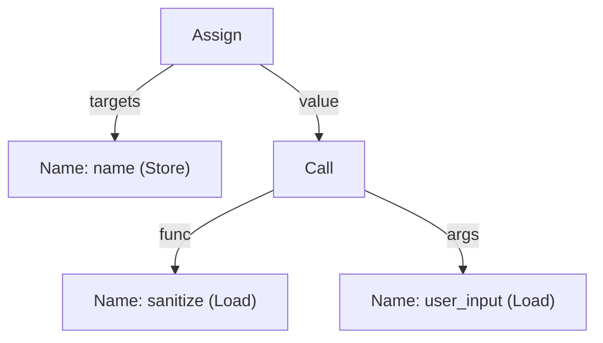

import { Tabs, TabItem, Aside, Badge, LinkCard, CardGrid } from "@astrojs/starlight/components";

This page answers one question. What does CLDK know about a project from the source text alone?

CLDK builds program facts in four rungs, and level 1 is the first rung of that ladder. CLDK reads each file, builds a syntax tree, and records every declaration that the tree holds. It records nothing about how the code runs.

## From source text to a syntax tree

### Tokens come first

A source file starts as plain text. A tokenizer reads the characters from left to right and groups them into tokens. A **token** is the smallest piece of text that carries meaning to the language.

The tiny fixture on this page is one file, `queries.py`:

```python
def sanitize(raw):
    return raw.strip()


def build_query(user_input, limit):
    name = sanitize(user_input)
    if limit > 100:
        limit = 100
    return f"SELECT * FROM users WHERE name = '{name}' LIMIT {limit}"
```

Line 6 holds `name = sanitize(user_input)`. The tokenizer splits that line into six tokens with text, and one end-of-line marker:

```text
name    =    sanitize    (    user_input    )
```

Each token carries its own text and its own position. No token knows what any other token means.

### The parser builds the tree

A parser reads the token stream and builds a syntax tree. A **syntax tree** is a tree whose nodes are the constructs of the language and whose edges are the parts of each construct.

This is the real tree that Python builds for line 6:



Read the figure from the top. The assignment has one target and one value. The value is a call. The call has a function part and one argument.

A syntax tree keeps every name, every construct and every position. It keeps no order of execution and no values. Every fact on this page comes from a tree like this one.

## What a symbol is

A **symbol** is a named thing that the source declares. Three facts identify a symbol.

| Fact | Meaning |
| --- | --- |
| Declaration site | The file, line and column where the source introduces the name |
| Kind | The sort of thing that the name denotes, such as a parameter or a class |
| Scope | The region of source text where the name refers to this declaration |

A **callable** is one function, one method or one constructor. `PyCallable.accessed_symbols` holds one `PySymbol` record for each name that the body of a Python callable reads:

```python
from cldk import CLDK
from cldk.analysis import AnalysisLevel

analysis = CLDK.python(project_path="tiny_py", analysis_level=AnalysisLevel.symbol_table)

callable_ = analysis.get_method("queries", "build_query")
for symbol in callable_.accessed_symbols:
    print(symbol.name, symbol.kind, symbol.scope, symbol.lineno, symbol.qualified_name)
```

```text
sanitize    function  local  6  queries.sanitize
user_input  variable  local  6  None
limit       variable  local  7  None
name        variable  local  9  None
limit       variable  local  9  builtins.int
```

`kind` is one of `variable`, `parameter`, `attribute`, `function`, `class` and `module`. `scope` is one of `local`, `nonlocal`, `global`, `class` and `module`.

<Aside type="caution" title="A record describes one read, not one declaration">
A write to a name makes no record here. The body writes `name` on line 6 and reads it on line 9, so the one `name` record says line 9. The body reads `limit` twice, on line 7 and on line 9, so `limit` gets two records. Three columns follow from this:

| Column | What one record holds |
| --- | --- |
| `lineno` | The line of the read, not the line of the declaration |
| `scope` | The scope that holds the read, not the scope of the declaration |
| `qualified_name` | What the name refers to at that read, or `None` |

The first row says that line 6 reads `sanitize`, and that this name refers to the module-level function `queries.sanitize`. The word `local` in that row names the scope of the read. CLDK writes `global` in the `scope` column only for the name of a module.
</Aside>

The Python backend uses Jedi, a name resolver for Python, to settle each name. For `sanitize` Jedi finds a function, so `qualified_name` is `queries.sanitize`. For `limit` on line 9 Jedi finds the type of the value, so `qualified_name` is `builtins.int`. For `user_input` Jedi finds nothing, so the field is `None`.

<Aside type="note" title="TypeScript records this differently">
`TSCallable` carries no `accessed_symbols` field and no `call_sites` field. For TypeScript, read `parameters` for the declared names and their types. Call `get_call_sites(signature)` for the names that the body calls.
</Aside>

## Scope and shadowed names

**Scope** is the region of source text where one name refers to one declaration. A declaration in an inner scope hides a declaration of the same name in an outer scope. The language calls this **shadowing**.

<Tabs syncKey="lang">
<TabItem label="Python">
```python
limit = 10                              # module scope
def build_query(user_input, limit):     # parameter scope: a second limit
    return limit                        # the parameter, not the module variable
```
</TabItem>
<TabItem label="TypeScript">
```typescript
const limit = 10;                                             // module scope
export function buildQuery(userInput: string, limit: number) {
  return `${limit}`;                                          // the parameter
}
```
</TabItem>
</Tabs>

Each file holds two declarations named `limit`. The text `limit` on the last line is one occurrence of that name. A reader must decide which of the two declarations that occurrence means.

## Name resolution

**Name resolution** turns one occurrence of a name into the declaration that it refers to. The inner-to-outer scope rule settles the `limit` case above. That rule is mechanical, so the Python backend applies it at level 1.

CLDK reports the answer in two fields. `PySymbol.qualified_name` holds what one read of a name refers to. `PyCallsite.callee_signature` holds the callable that one call reaches.

```python
for site in callable_.call_sites:
    print(site.method_name, site.callee_signature, site.start_line)
```

```text
sanitize  queries.sanitize  6
```

CLDK resolved the name `sanitize` on line 6 to the function that line 1 declares.

### When a name has no single answer

A dynamic language lets a call target arrive as a value. No rule over the syntax tree can name that target, because the target depends on the caller.

A second project, `dyn_py`, holds one such file:

```python
# dispatch.py
def apply(op, value):
    return op(value)


def pick(name, table):
    return getattr(table, name)
```

```python
dyn = CLDK.python(project_path="dyn_py", analysis_level=AnalysisLevel.symbol_table)

apply_ = dyn.get_method("dispatch", "apply")
for site in apply_.call_sites:
    print(site.method_name, site.callee_signature)
```

```text
op  None
```

CLDK records the call site and leaves `callee_signature` as `None`. This is the safe direction. A `None` costs you one target. It never names a target that the source does not settle.

Level 2 builds the call graph and resolves many of these targets from a wider view. See [Call graphs](/guides/call-graphs/).

### The two languages resolve at different levels

Python resolves a same-module call at level 1. TypeScript leaves `callee_signature` as `None` at level 1 and fills it at level 2. The property `has_resolution_edges` <Badge text="2.0" variant="caution" /> tells you which case you hold.

```python
print(analysis.has_resolution_edges)
```

For the Python fixture at level 1 that prints `True`. For the TypeScript fixture at level 1 it prints `False`.

Two different rules produce those two values. The Python backend runs Jedi on every call site whatever the level, so it answers `True` at level 1. The TypeScript backend resolves a call target in its own level-2 pass, so it answers `True` only from level 2. A `False` tells you that every `None` comes from the level, and not from a call site that failed.

## What CLDK returns at level 1

### The symbol table

`get_symbol_table()` returns a dictionary. Each key is the project-relative path of one file, with the file extension. Each value is one module model.

<Tabs syncKey="lang">
<TabItem label="Python">
```python
from cldk import CLDK
from cldk.analysis import AnalysisLevel

analysis = CLDK.python(
    project_path="tiny_py",
    analysis_level=AnalysisLevel.symbol_table,
)

symbol_table = analysis.get_symbol_table()
print(list(symbol_table))        # ['queries.py']

module = symbol_table["queries.py"]
print(module.module_name)        # queries
print(module.kind)               # module
print(module.id)                 # can://tiny_py/python/queries.py
print(list(module.functions))    # ['sanitize', 'build_query']
print(list(module.types))        # []
```
</TabItem>
<TabItem label="TypeScript">
```python
from cldk import CLDK
from cldk.analysis import AnalysisLevel

analysis = CLDK.typescript(
    project_path="tiny_ts",
    analysis_level=AnalysisLevel.symbol_table,
)

symbol_table = analysis.get_symbol_table()
print(list(symbol_table))        # ['src/queries.ts']

module = symbol_table["src/queries.ts"]
print(module.kind)               # module
print(module.id)                 # can://tiny_ts/typescript/src/queries.ts
print(list(module.functions))    # ['sanitize', 'buildQuery']
print(list(module.types))        # []
```

`TSModule` carries no `module_name` field. The dictionary key is the path.
</TabItem>
</Tabs>

### The typed models

| The thing | Python model | TypeScript model |
| --- | --- | --- |
| One file | `PyModule` | `TSModule` |
| One class | `PyClass` | `TSClass` |
| One function, method or constructor | `PyCallable` | `TSCallable` |

A module model holds `functions` and `types`. A callable model holds `parameters`, `return_type`, `decorators`, `signature`, `id` and a `span`. The two class models differ. `PyClass` holds `callables`, `attributes`, `base_classes` and nested `types`. `TSClass` holds `callables`, `fields` and `base_classes`, and holds no `types`.

<Aside type="caution" title="The type keys differ by language">
`PyModule.types` uses the full signature as the key, such as `store.orders.OrderBook`. `TSModule.types` uses the short name, such as `OrderBook`. `get_classes()` uses the full signature for both languages.
</Aside>

### The signature grammar

A **signature** is the name that every deeper rung uses to address a callable. The grammar has two forms.

| Form | Python | TypeScript |
| --- | --- | --- |
| Module-level function | `module.name` | `path/to/module.name` |
| Method of a class | `module.Class.name` | `path/to/module.Class.name` |

The Python module part is the dotted import path. The TypeScript module part is the symbol-table key without the file extension. These are real signatures from the two fixtures:

| Declaration | Signature |
| --- | --- |
| `sanitize` in `queries.py` | `queries.sanitize` |
| `build_query` in `queries.py` | `queries.build_query` |
| `sanitize` in `src/queries.ts` | `src/queries.sanitize` |
| `buildQuery` in `src/queries.ts` | `src/queries.buildQuery` |
| `total` on `OrderBook` in `store/orders.py` | `store.orders.OrderBook.total` |
| `total` on `OrderBook` in `src/orders.ts` | `src/orders.OrderBook.total` |

Each model also carries an `id`. An `id` is a `can://` address that names the project, the language and the path. For `build_query` the `id` is `can://tiny_py/python/queries.py/build_query(user_input,limit)`. The dataflow pages address one statement inside a body by that same `id` and a position. Line 6 of `build_query` is `can://tiny_py/python/queries.py/build_query(user_input,limit)@6:4`.

### Classes and one callable

`get_classes()` returns every class in the project, keyed by signature. `get_method()` takes two arguments and returns one callable. It returns `None` when neither a class nor a module matches the first argument.

The tiny fixture declares no class, so `get_classes()` returns an empty dictionary. A second project, `shop_py` for Python and `shop_ts` for TypeScript, declares one class.

<Tabs syncKey="lang">
<TabItem label="Python">
```python
# store/orders.py
class OrderBook:
    def __init__(self, owner):
        self.owner = owner

    def total(self, rate):
        return rate * 2


def load(path):
    return OrderBook(path)
```

```python
shop = CLDK.python(project_path="shop_py", analysis_level=AnalysisLevel.symbol_table)

print(list(shop.get_classes()))
# ['store.orders.OrderBook']

order_book = shop.get_classes()["store.orders.OrderBook"]
print(list(order_book.callables))
# ['__init__', 'total']

print(shop.get_method("store.orders.OrderBook", "total").signature)
# store.orders.OrderBook.total
print(shop.get_method_parameters("store.orders.OrderBook", "total"))
# ['self', 'rate']
```
</TabItem>
<TabItem label="TypeScript">
```typescript
// src/orders.ts
export class OrderBook {
  owner: string;
  constructor(owner: string) {
    this.owner = owner;
  }
  total(rate: number): number {
    return rate * 2;
  }
}

export function load(path: string): OrderBook {
  return new OrderBook(path);
}
```

```python
shop = CLDK.typescript(project_path="shop_ts", analysis_level=AnalysisLevel.symbol_table)

print(list(shop.get_classes()))
# ['src/orders.OrderBook']

order_book = shop.get_classes()["src/orders.OrderBook"]
print(list(order_book.callables))
# ['total', 'constructor']
print(list(order_book.fields))
# ['owner']

print(shop.get_method("src/orders.OrderBook", "total").signature)
# src/orders.OrderBook.total
print(shop.get_method_parameters("src/orders.OrderBook", "total"))
# ['rate']
```
</TabItem>
</Tabs>

Python lists `self` among the parameters of `total`. TypeScript has no equivalent, so its list starts at the first declared parameter.

The first argument of `get_method()` accepts two shapes. Pass a class signature for a method. Pass a module name for a module-level function.

<Tabs syncKey="lang">
<TabItem label="Python">
```python
print(analysis.get_method("queries", "build_query").signature)
# queries.build_query
print(analysis.get_method_parameters("queries", "build_query"))
# ['user_input', 'limit']
```

Read the module name from the `module_name` field of the module model, not from the symbol-table key. The two agree for `queries.py`. They disagree for any file below the project root:

```python
print(shop.get_symbol_table()["store/orders.py"].module_name)
# orders
print(shop.get_method("orders", "load").signature)
# store.orders.load
print(shop.get_method("store.orders", "load"))
# None
```

The signature reads `store.orders.load`, and yet only `orders` finds the callable.
</TabItem>
<TabItem label="TypeScript">
```python
print(analysis.get_method("src/queries", "buildQuery").signature)
# src/queries.buildQuery
print(analysis.get_method_parameters("src/queries", "buildQuery"))
# ['userInput', 'limit']
```

The module name is the symbol-table key without the file extension. A nested path needs no special care here:

```python
print(shop.get_method("src/orders", "load").signature)
# src/orders.load
```
</TabItem>
</Tabs>

### From a file position to a declaration

<Badge text="2.0" variant="caution" /> `locate()` runs the lookup in the other direction. Give it a path and a line number. It returns the declaration that encloses that position.

<Tabs syncKey="lang">
<TabItem label="Python">
```python
hit = shop.locate("store/orders.py", 6)
print(hit.callable.signature)   # store.orders.OrderBook.total
print(hit.type.signature)       # store.orders.OrderBook
print(hit.module.path)          # store/orders.py
print(hit.span.start)           # (5, 4)
```
</TabItem>
<TabItem label="TypeScript">
```python
hit = shop.locate("src/orders.ts", 7)
print(hit.callable.signature)   # src/orders.OrderBook.total
print(hit.type.signature)       # src/orders.OrderBook
print(hit.module.path)          # src/orders.ts
print(hit.span.start)           # (6, 3)
```
</TabItem>
</Tabs>

Each call asks about a line inside the body of `total`, and each answer names `total` itself. `hit.span` is where the whole declaration starts and ends, so `span.start` gives the line that opens `total`. A `start` is a `(line, column)` pair. The line counts from 1 in both languages, the Python column counts from 0, and the TypeScript column counts from 1.

`locate()` turns a stack frame or a scanner alert into a signature that every deeper rung accepts.

<Aside type="caution" title="locate() needs CLDK 2.0">
`locate()` and `has_resolution_edges` arrive in CLDK 2.0. PyPI serves 1.5.0 as the stable release, so `pip install cldk` gives you 1.5.0. To get the 2.0.0rc7 pre-release, run:

```bash frame="none"
pip install --pre cldk
```
</Aside>

## What level 1 answers

Level 1 settles every question that one file, read by itself, can settle:

- Where does the project declare this name?
- What does this file declare?
- Which parameters does this callable take, and what are their declared types?
- Which class declares this method, and which base classes does it name?
- Which names does this Python callable read, and on which line?

A module model also carries `imports`, and a callable model carries `decorators`. A survey of a large project reads both at this rung and goes no deeper. Level 1 is the cheapest rung, and CLDK passes `-a 1` to the backend for it.

## What level 1 cannot answer

Level 1 sees structure. It sees no execution. Four questions stay open at this rung.

| Question | Rung that answers it |
| --- | --- |
| Which function does this call reach? | Level 2, the call graph |
| In which order do these statements run? | Level 3, the control flow graph |
| Which value does this variable hold? | Level 3, the data dependence graph |
| Does this input reach that sink? | Level 4, the system dependence graph |

Level 1 gives an exact answer about declarations. It gives no answer at all about one run of the program. The next rung adds the call edges. See [Call graphs](/guides/call-graphs/).

<Aside type="tip" title="One book to read next">
Michael D. Ernst, "Program Analysis" (course book), https://homes.cs.washington.edu/~mernst/pubs/program-analysis-book.pdf, gives a reader-friendly introduction to the whole ladder.
</Aside>

## Where to go next

<CardGrid>
  <LinkCard title="Call graphs" description="Level 2: which callable reaches which, and what an unresolved target costs you." href="/guides/call-graphs/" />
  <LinkCard title="Core concepts" description="The four analysis levels, the backends behind them, and the cost of each." href="/guides/concepts/" />
  <LinkCard title="Cheat sheet" description="Every symbol-table, call-graph and dataflow method in one table." href="/resources/cheatsheet/" />
</CardGrid>
