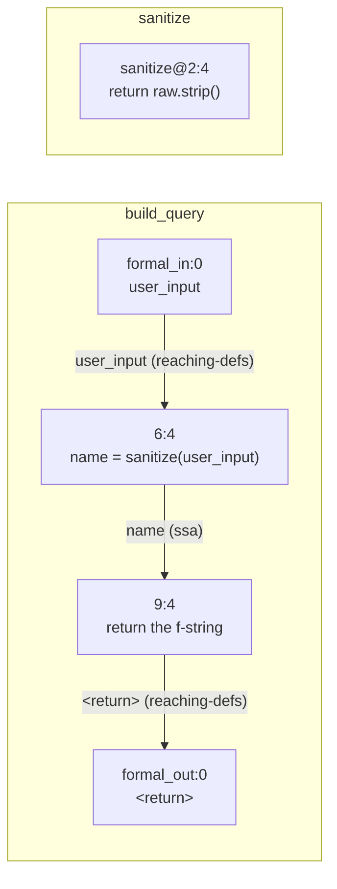
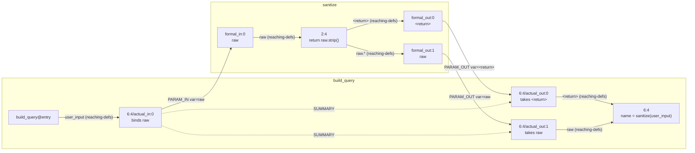

import { Aside, Badge, Steps, LinkCard, CardGrid } from "@astrojs/starlight/components";

<p><Badge text="New in 2.0" variant="caution" /> <Badge text="Release candidate" variant="note" /></p>

Level 3 gives you one dependence graph for each function. This page answers the question that such a graph cannot answer: where does a value go after the caller hands it to a callee?

<Aside type="caution" title="These methods need CLDK 2.0">
Level 4 and every method on this page arrive in CLDK 2.0. Version 2.0 is a release candidate today, so `pip install cldk` gives you 1.5.0 instead. To get the pre-release, run:

```bash frame="none"
pip install --pre cldk
```
</Aside>

## Where a dependence graph stops

A program dependence graph (PDG) holds one function. Its nodes are the statements of that function. A control edge says that one statement decides whether another statement runs. A data edge runs from the statement that writes a value to the statement that reads it. A data edge is what people mean by dataflow inside one function.

Here is the fixture that the rest of this page uses.

```python
# queries.py
def sanitize(raw):
    return raw.strip()


def build_query(user_input, limit):              # line 5
    name = sanitize(user_input)                  # line 6
    if limit > 100:                              # line 7
        limit = 100                              # line 8
    return f"SELECT ... '{name}' LIMIT {limit}"  # line 9
```

`get_ddg("build_query")` returns the data edges of `build_query` alone. Each node id joins the callable name, the line and the column, as [Dataflow graphs](/guides/dataflow/) explains. The call on line 6 is one node, `build_query@6:4`. Four of the seventeen real edges matter here:

| From | To | `var` | `prov` |
| --- | --- | --- | --- |
| `build_query@formal_in:0` | `build_query@6:4` | `user_input` | `['reaching-defs']` |
| `build_query@6:4` | `build_query@9:4` | `name` | `['ssa']` |
| `build_query@8:8` | `build_query@9:4` | `limit` | `['ssa']` |
| `build_query@9:4` | `build_query@formal_out:0` | `<return>` | `['reaching-defs']` |

`prov` records where the edge comes from, and it tells you how certain the edge is. See [How certain an edge is](/guides/dataflow/#how-certain-an-edge-is).

No edge in that answer reaches into the body of `sanitize`. The graph states that line 6 produces `name`. It does not state what `sanitize` does to `user_input`.



The forward slice agrees. `slice_forward("user_input", within="build_query")` returns 7 nodes from the root `build_query@formal_in:0`. All seven belong to `build_query`: lines 6, 7, 8 and 9, the parameter vertex on line 5, and two return vertices on line 5.

## The four ports of a call

Horwitz, Reps and Binkley keep one graph for each function and add vertices at the boundary. The result is one graph for the whole program, the system dependence graph (SDG). Every boundary vertex in it is a port. The caller writes a value into a port, and the callee reads that value out of the port that matches.

| Vertex kind | Where it sits | What it holds |
| --- | --- | --- |
| `actual_in` | At the call site | The value this call passes to one callee port |
| `formal_in` | At the callee entry | The same value as the callee names it |
| `formal_out` | At the callee exit | One value that the callee sends back |
| `actual_out` | At the call site | The value this call receives from one callee port |

A `formal_in` vertex exists for three things: each parameter, each variable that the callable captures from an outer function, and each global name that it reads. `build_query` has three. `formal_in:0` is `user_input` and `formal_in:1` is `limit`. `formal_in:2` is the module-level `sanitize` that line 6 calls, which the backend writes as `<global>:queries::sanitize`.

A `formal_out` vertex exists for three things: the return value, each parameter whose object the callee can change, and each global name that the callee writes. `build_query` has two. `formal_out:0` is `<return>`. `formal_out:1` is `user_input`, because the call on line 6 can change the object that `user_input` refers to.

The data edge into `formal_out:1` carries `var=user_input.*`, not `var=user_input`. The `.*` suffix names the contents of the object, not the name itself. If a callee gives a local name a new object, the caller never sees it. If a callee changes the object, the caller does see it, and the `.*` path is how the backend writes that.

At every call the backend assumes that the call can change the contents of each argument object. That assumption errs in one direction only. The graph can hold an edge for a change that never happens. The graph never misses a change that does happen. The cost to you is an extra node in a slice, never a lost flow.

At the call site the backend makes one `actual_in` and one `actual_out` for each callee port that this call site binds. Each of these vertices carries the name of the callee port, not the name of the value in the caller. The line 6 call has three of them.

| Vertex | The callee port it binds | The real data edge on it |
| --- | --- | --- |
| `build_query@6:4/actual_in:0` | `sanitize@formal_in:0`, the parameter `raw` | `build_query@entry` reaches it with `var=user_input`, `prov=['reaching-defs']` |
| `build_query@6:4/actual_out:0` | `sanitize@formal_out:0`, the `<return>` | it reaches `build_query@6:4` with `var=<return>`, `prov=['reaching-defs']` |
| `build_query@6:4/actual_out:1` | `sanitize@formal_out:1`, the parameter `raw` | it reaches `build_query@6:4` with `var=raw`, `prov=['reaching-defs']` |

So the name that the caller uses stays on the edge, and the name that the callee uses for the port stays on the vertex. Read the vertex and the edge together to get both names.



Every edge in that figure is an edge of the real graph. The two solid edges out of the `actual_out` vertices are the ones that put the answer back into the caller.

## Parameter edges and summary edges

Three relationships join the ports. The figure above uses the edge types of the graph itself, `PARAM_IN`, `PARAM_OUT` and `SUMMARY`. The Neo4j projection of a Python analysis puts `PY_` in front of each one.

| Relationship | From | To | What it records |
| --- | --- | --- | --- |
| `PY_PARAM_IN` | `actual_in` | `formal_in` | The caller binds one argument to one callee port |
| `PY_PARAM_OUT` | `formal_out` | `actual_out` | One callee result arrives at this call site |
| `PY_SUMMARY` | `actual_in` | `actual_out` | The input port reaches the output port through the callee |

A summary edge is a shortcut across a callee. It records one fact: a value that enters through this input port comes out of that output port. The backend solves each callee once, then adds the edge at every call site that binds those two ports.

`build_query` carries two summary pairs, and both start at `6:4/actual_in:0`. One ends at `6:4/actual_out:0`, the result of `sanitize`. The other ends at `6:4/actual_out:1`, the object that `raw` refers to. `sanitize` itself carries no summary pair, because it calls nothing that the backend resolved.

The shortcut earns its place in the next section. Without it, a walk must descend into `sanitize` every time it meets a call to `sanitize`. With it, the walk reads the answer at the call site and stays in the caller.

`PY_PARAM_IN` and `PY_PARAM_OUT` carry a `var` property and no `prov` property, and `PY_SUMMARY` carries neither property. A parameter edge comes from the call structure, so no dataflow solver produced it and there is nothing to record about its certainty.

The backend builds all of this at level 4. The help text for `-a 4` reads `+interprocedural SDG (param/summary edges, alias-aware DDG)`. The `--graphs` option accepts `cfg`, `dfg`, `pdg` and `sdg`, and `sdg` needs `-a 4`.

## Why the SDG makes a precise slice

A slice is the set of statements that can affect a value, or the set of statements that the value can affect. Mark Weiser introduced the idea in 1981. Ferrante, Ottenstein and Warren gave the PDG its control-dependence edges in 1987, which made a slice one graph traversal inside a function.

One walk over every edge of the SDG is not correct. Such a walk can enter `sanitize` from one call site and leave `sanitize` at a different call site. The route that comes back is a route that no run of the program takes. Horwitz, Reps and Binkley answer this with two passes. CLDK uses their traversal for a backward slice.

The node you ask about is the criterion. Both passes start from it.

<Steps>
1. Phase 1 walks backward over every edge except `PARAM_OUT`. It climbs from the criterion into callers, and it steps across a call site along a `SUMMARY` edge. It never descends into a callee.

2. Phase 2 starts at everything that phase 1 reached. It walks backward over every edge except `PARAM_IN` and `CALL`. It descends into callees, and it never climbs again.
</Steps>

Phase 1 walks up. Phase 2 walks down. Neither phase does both, so a walk can never leave a callee through a call site that it did not enter. Program analysis calls that property context sensitivity, and it is the whole reason for the two passes.

The `SUMMARY` edges are what let phase 1 cross a call without a descent into the callee. The summary edge and the two-phase traversal are one design, not two.

The papers behind this page:

- Weiser, "Program Slicing", ICSE 1981. The origin of the slice.
- Ferrante, Ottenstein, Warren, "The Program Dependence Graph and Its Use in Optimization", ACM TOPLAS 9(3):319-349, 1987. The PDG and control dependence.
- Horwitz, Reps, Binkley, "Interprocedural Slicing Using Dependence Graphs", ACM TOPLAS 12(1):26-60, 1990. The SDG, the parameter vertices, the summary edges and the two-phase traversal.
- Michael D. Ernst, ["Program Analysis"](https://homes.cs.washington.edu/~mernst/pubs/program-analysis-book.pdf). A reader-friendly book for the background.

## What CLDK gives you over the SDG

CLDK does not ask you to walk the graph. Four methods answer the questions that the SDG exists to answer.

| Method | Returns | Question |
| --- | --- | --- |
| `flows_to_call(src, callee, *, within)` <Badge text="2.0" variant="caution" /> | `bool` | Does this value reach a call to that callee? |
| `flows_to_argument(src, callee, arg, *, within)` <Badge text="2.0" variant="caution" /> | `bool` | Does it reach that argument of that callee? |
| `paths_between(src, dst, *, src_within, dst_within)` <Badge text="2.0" variant="caution" /> | `FlowPaths` | Which routes join these two values? |
| `taint(sources, sinks, ...)` <Badge text="2.0" variant="caution" /> | `TaintResult` | Which of many sources reach which of many sinks? |

Build the analysis at level 4 first. The examples below run the TypeScript backend over the same two functions, where the names are `buildQuery`, `sanitize`, `userInput` and `raw`.

```python
from cldk import CLDK
from cldk.analysis import AnalysisLevel

ts = CLDK.typescript(
    project_path="queries-ts",
    analysis_level=AnalysisLevel.system_dependency_graph,
)
```

The cheap question is the boolean one.

```python
ts.flows_to_call("userInput", "sanitize", within="buildQuery")
# True
```

The expensive question returns the route itself.

```python
flows = ts.paths_between(
    "userInput", "raw",
    src_within="buildQuery",
    dst_within="sanitize",
)
len(flows.paths)   # 1
```

That one path has two hops, and the second hop crosses the boundary:

| Hop | `via` | `var` | `prov` |
| --- | --- | --- | --- |
| 1 | `data` | `userInput` | `['reaching-defs']` |
| 2 | `argument` | `raw` | `[]` |

The first hop is a data edge inside `buildQuery`. The reaching-definitions analysis produced it, and `prov` says so. That analysis walks the control-flow graph and collects every definition of a name that is still live at the use. The second hop is a parameter edge, which comes from the call structure, so its `prov` list is empty.

The slice carries the same link. `slice_forward("userInput", within="buildQuery").total` is 11, and `get_ddg("buildQuery").total` is 11. The Python forward slice over the same two functions holds 7 nodes, all of them inside `build_query`.

### Callable reachability is a different question

`reaches` takes two callable names. It never takes the name of a value.

```python
py = CLDK.python(
    project_path="queries",
    analysis_level=AnalysisLevel.system_dependency_graph,
)

py.reaches("build_query", "sanitize")
# True
```

`call_paths_between` answers the same question with the route attached. It returns a `FlowPaths`, so read the hops off it.

```python
routes = py.call_paths_between("build_query", "sanitize")
[[hop.to.callable for hop in path.hops] for path in routes.paths]
# [['queries.sanitize']]
```

A value name in either method is an error, not a `False`.

```python
py.reaches("user_input", "raw")
# SelectorNotInGraph: 1 of 1 callable not in graph: 'user_input'
```

Callable reachability asks whether one function can call another, through any number of steps. It answers nothing about a value. For many sources against many sinks in one traversal, read [Taint analysis](/guides/taint/) next.

## What the pinned Python backend does not link

<Aside type="caution" title="A Python refutation is not evidence of absence">
This defect is fixed in codeanalyzer-python 1.5.4 ([issue #220](https://github.com/codellm-devkit/codeanalyzer-python/issues/220)). CLDK 2.0.0rc7 pins `codeanalyzer-python==1.5.2`, so the pre-release still carries it. A later CLDK release raises the pin. The rest of this section describes the behavior of the pinned 1.5.2 backend, which is what the pre-release installs today.

At CLDK 2.0.0rc7 with codeanalyzer-python 1.5.2, the SDK does not link a value across a call. Add one more function to the fixture, so that a caller of `build_query` is in view as well:

```python
def handle(request):
    return build_query(request, 500)
```

These are the real results on that file:

| Call | Result |
| --- | --- |
| `flows_to_call("user_input", "sanitize", within="build_query")` | `False` |
| `flows_to_argument("user_input", "sanitize", "raw", within="build_query")` | `False` |
| `flows_to_call("request", "build_query", within="handle")` | `False` |
| `flows_to_argument("request", "build_query", "user_input", within="handle")` | `False` |
| `paths_between(...)` | An empty `paths` list in every cross-callable direction tried |
| `slice_forward("request", within="handle").total` | `4`, and every node stays inside `handle` |

The `taint()` call is the one to watch. A pair lands in `exhausted` when the traversal searched it to the end and found no route. That is the refutation an empty `paths` list cannot give. `taint(sources=[("request", "handle")], sinks=[("raw", "sanitize")])` returns `paths == []`, `exhausted == [('request', 'raw')]`, `complete == True` and `unresolved == []`. That is a clean refutation of a flow that plainly exists in the program.

Do not use a Python `exhausted` pair as evidence that no value flows between two callables.

The graph machinery is present. `build_query` holds three `formal_in` vertices, two `formal_out` vertices, one `actual_in` vertex and two `actual_out` vertices. A `summary` is set on `build_query` and on `handle`. `application.param_in` and `application.param_out` each hold 4 edges. The SDK traversal does not join them.

TypeScript does join them, which is why every cross-call example on this page uses `CLDK.typescript(...)`. Python results that stay inside one callable, such as the `get_ddg` and `slice_forward` numbers above, are correct.

On codeanalyzer-python 1.5.4 the same fixture links end to end. `flows_to_call("request", "build_query", within="handle")` returns `True`, `paths_between("request", "raw", ...)` returns one path across two call boundaries, and `taint()` returns that path with an empty `exhausted`.
</Aside>

## Where to go next

<CardGrid>
  <LinkCard title="Taint analysis" description="Many sources against many sinks in one traversal, with sanitizer cuts and a verdict on each pair." href="/guides/taint/" />
  <LinkCard title="Dataflow graphs" description="The four levels, the three graphs, and the slice and path methods that run over them." href="/guides/dataflow/" />
  <LinkCard title="TypeScript examples" description="Runnable code against the backend that links a value across a call." href="/examples/typescript/" />
</CardGrid>
