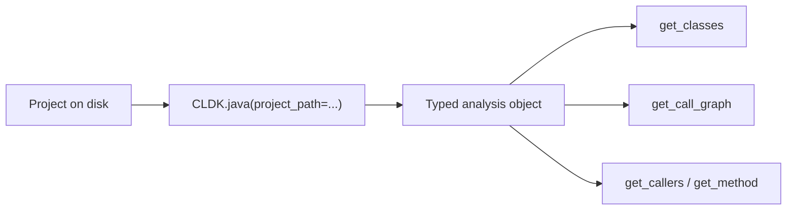

import { Tabs, TabItem, Steps, Aside, LinkCard, CardGrid } from "@astrojs/starlight/components";

CLDK loads a project and returns a typed `analysis` object containing its classes, methods, and, when requested, a call graph. It provides program structure that a code LLM or tool can query directly.

This guide covers three steps: install CLDK, obtain a sample project, and run an analysis. The result is a typed model of [Apache Commons CLI](https://commons.apache.org/proper/commons-cli/) and a `networkx` call graph.

<Steps>

1. **Install CLDK.**

   ```shell
   pip install cldk
   ```

   The Java backend ships with the package. Analyzing Java projects requires only a JDK on your `PATH`.

2. **Get a sample project.**

   This guide analyzes Apache Commons CLI. Download a release, unzip it, and note its location.

   ```shell
   wget https://github.com/apache/commons-cli/archive/refs/tags/rel/commons-cli-1.7.0.zip -O commons-cli.zip
   unzip commons-cli.zip
   export JAVA_APP_PATH=$(pwd)/commons-cli-rel-commons-cli-1.7.0
   ```

   <Aside type="note">
   Any Java project on disk works here: point `JAVA_APP_PATH` at its root. Commons CLI is a small, well-structured codebase that is quick to analyze.
   </Aside>

3. **Run your first analysis.**

   Build a CLDK object for Java, point it at the project, and print two results: the class count and the call graph. Call graphs, callers, and callees require `analysis_level=AnalysisLevel.call_graph`; the default level builds only the symbol table.

   ```python title="first_analysis.py"
   import os
   from cldk import CLDK
   from cldk.analysis import AnalysisLevel

   analysis = CLDK.java(
       project_path=os.environ["JAVA_APP_PATH"],
       analysis_level=AnalysisLevel.call_graph,   # required for the call graph
   )

   print(len(analysis.get_classes()), "classes")
   print(analysis.get_call_graph())               # -> networkx.DiGraph (edges caller -> callee)
   # 23 classes
   # DiGraph with 312 nodes and 488 edges
   ```

   `analysis` is now a typed, queryable model of the project. `get_call_graph()` returns a `networkx.DiGraph`, so caller and callee queries can use standard graph operations.

</Steps>

<Aside type="tip" title="Analyzing Python projects">
The same pattern applies to a Python package: change the language and point at the package root. Every CLDK analysis is project-based and takes a `project_path`.

```python
from cldk import CLDK
from cldk.analysis import AnalysisLevel

analysis = CLDK.python(
    project_path="my_pkg",
    analysis_level=AnalysisLevel.call_graph,
)
print(len(analysis.get_classes()), "classes")
print(analysis.get_call_graph())   # -> networkx.DiGraph
```
</Aside>

## How it works



A single call converts a directory of source files into a typed `analysis` object. From there, `get_method(cls, sig)` returns a method's source body, and `get_callers` / `get_callees` traverse the graph. The [concepts guide](/guides/concepts/) covers the object model, and the [cheat sheet](/resources/cheatsheet/) lists the available methods.

## Next steps

The same calls can run behind an agent tool. **cocoa** is a Claude Code plugin that runs CLDK for callers, reachability, and change-impact questions.

<CardGrid>
  <LinkCard title="cocoa plugin" description="Build a Claude Code plugin that runs CLDK for callers, reachability, and change impact." href="/cocoa/" />
  <LinkCard title="What is CLDK?" description="The object model: CLDK object -> analysis object -> typed models." href="/what-is-cldk/" />
  <LinkCard title="Common tasks" description="Task-oriented snippets: list methods, build a call graph, find callers, sanitize a focal method." href="/guides/common-tasks/" />
</CardGrid>
