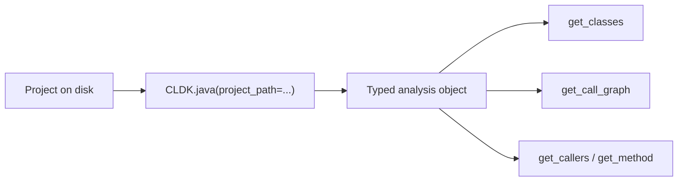

import { Tabs, TabItem, Steps, Aside, LinkCard, CardGrid } from "@astrojs/starlight/components";

CLDK loads a project and returns a typed `analysis` object. The object holds the classes and methods. If you ask for it, the object also holds the call graph. A code LLM or a tool can query this structure directly.

This guide has three steps: install CLDK, get a sample project, and run an analysis. The result is a typed model of [Apache Commons CLI](https://commons.apache.org/proper/commons-cli/) and a `networkx` call graph.

<Steps>

1. **Install CLDK.**

   ```bash
   pip install cldk
   ```

   The Java backend ships with the package and provides its own JVM. To build the call graph, the backend compiles the project with Maven, so `mvn` and a JDK must be on your `PATH`. For the full prerequisites, see [Installing CLDK](/installing/).

2. **Get a sample project.**

   This guide analyzes Apache Commons CLI. Download a release. Unzip the file. Note the location of the directory.

   ```shell
   wget https://github.com/apache/commons-cli/archive/refs/tags/rel/commons-cli-1.7.0.zip -O commons-cli.zip
   unzip commons-cli.zip
   export JAVA_APP_PATH=$(pwd)/commons-cli-rel-commons-cli-1.7.0
   ```

   <Aside type="note">
   Any Java project on disk works here. `JAVA_APP_PATH` must be the root directory of the project. Commons CLI is small and well structured, so the analysis runs quickly.
   </Aside>

3. **Run your first analysis.**

   Build an `analysis` object for Java. Point it at the project. Print the class count and the call graph. Call graphs, callers, and callees need `analysis_level=AnalysisLevel.call_graph`. The default level builds only the symbol table.

   ```python title="first_analysis.py"
   import os
   from cldk import CLDK
   from cldk.analysis import AnalysisLevel

   analysis = CLDK.java(
       project_path=os.environ["JAVA_APP_PATH"],
       analysis_level=AnalysisLevel.call_graph,   # required for the call graph
   )

   print(len(analysis.get_classes()), "classes")
   print(analysis.get_call_graph())               # -> networkx.DiGraph (edges caller -> callee)
   # 23 classes
   # DiGraph with 312 nodes and 488 edges
   ```

   `analysis` is now a typed model of the project that you can query. `get_call_graph()` returns a `networkx.DiGraph`. You can use standard graph operations for caller and callee queries.

</Steps>

<Aside type="tip" title="Analyzing Python projects">
The same pattern applies to a Python package. You change the language and give the path to the package root. Every CLDK analysis needs a `project_path`.

```python
from cldk import CLDK
from cldk.analysis import AnalysisLevel

analysis = CLDK.python(
    project_path="my_pkg",
    analysis_level=AnalysisLevel.call_graph,
)
print(len(analysis.get_classes()), "classes")
print(analysis.get_call_graph())   # -> networkx.DiGraph
```
</Aside>

## How it works



One call converts a directory of source files into a typed `analysis` object. Then `get_method(qualified_class_name, qualified_method_name)` returns a `JCallable`. Its `code` field holds the source of the method. `get_callers` and `get_callees` walk the graph. The [concepts guide](/guides/concepts/) covers the object model. The [cheat sheet](/resources/cheatsheet/) lists the available methods.

## Next steps

The same calls can run behind an agent tool. **COCOA** is a Claude Code plugin. It runs CLDK to answer questions about callers, reachability, and change impact.

<CardGrid>
  <LinkCard title="COCOA plugin" description="Build a Claude Code plugin that runs CLDK for callers, reachability, and change impact." href="/cocoa/" />
  <LinkCard title="What is CLDK?" description="The programming model: language factory -> analysis object -> typed models." href="/what-is-cldk/" />
  <LinkCard title="Common tasks" description="Task-oriented snippets: list methods, build a call graph, find callers, sanitize a focal method." href="/guides/common-tasks/" />
</CardGrid>
