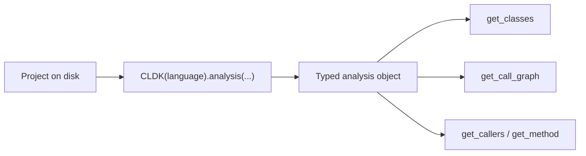

import { Tabs, TabItem, Steps, Aside, LinkCard, CardGrid } from "@astrojs/starlight/components";

CLDK loads a project and gives you a typed `analysis` object (its classes, methods, and call graph) through **one interface that's the same across languages** (Java and Python today). This is the grounding layer that lets a code LLM reason about a real program instead of guessing about it.

Three steps below: install, grab a sample project, and run your first analysis. By the end you'll have a typed model of [Apache Commons CLI](https://commons.apache.org/proper/commons-cli/) (the recurring sample across these docs) and a real `networkx` call graph in hand.

<Steps>

1. **Install CLDK.**

   ```shell
   pip install cldk
   ```

   That's the whole dependency. The Java backend ships with the package; you only need a JDK on your `PATH` to analyze Java projects.

2. **Get a sample project.**

   We'll analyze Apache Commons CLI. Download a release, unzip it, and remember where it landed.

   ```shell
   wget https://github.com/apache/commons-cli/archive/refs/tags/rel/commons-cli-1.7.0.zip -O commons-cli.zip
   unzip commons-cli.zip
   export JAVA_APP_PATH=$(pwd)/commons-cli-rel-commons-cli-1.7.0
   ```

   <Aside type="note">
   Any Java project on disk works here: point `JAVA_APP_PATH` at its root. Commons CLI is just a small, well-structured codebase that's quick to analyze.
   </Aside>

3. **Run your first analysis.**

   Build a CLDK object for Java, point it at the project, and ask for two things: how many classes it found, and the call graph. The call graph (and callers/callees) needs `analysis_level=AnalysisLevel.call_graph`: the default level only builds the symbol table.

   ```python title="first_analysis.py"
   import os
   from cldk import CLDK
   from cldk.analysis import AnalysisLevel

   analysis = CLDK(language="java").analysis(
       project_path=os.environ["JAVA_APP_PATH"],
       analysis_level=AnalysisLevel.call_graph,   # required for the call graph
   )

   print(len(analysis.get_classes()), "classes")
   print(analysis.get_call_graph())               # -> networkx.DiGraph (edges caller -> callee)
   # 23 classes
   # DiGraph with 312 nodes and 488 edges
   ```

   That's it: `analysis` is now a typed, queryable model of the whole project. `get_call_graph()` hands back a real `networkx.DiGraph`, so every "who calls whom" question is a graph query, not a guess.

</Steps>

<Aside type="tip" title="Prefer Python?">
The exact same shape works for a Python package: swap the language and point at the package root. Every CLDK analysis is project-based: pass `project_path`.

```python
from cldk import CLDK
from cldk.analysis import AnalysisLevel

analysis = CLDK(language="python").analysis(
    project_path="my_pkg",
    analysis_level=AnalysisLevel.call_graph,
)
print(len(analysis.get_classes()), "classes")
print(analysis.get_call_graph())   # -> networkx.DiGraph
```
</Aside>

## What just happened



One call turned a directory of source files into a typed `analysis` facade. From here `get_method(cls, sig)` pulls a method's source body and `get_callers` / `get_callees` walk the graph. The [concepts guide](/guides/concepts/) covers the object model; the [cheat sheet](/resources/cheatsheet/) is the day-to-day method list.

## Where this goes next

The real pattern isn't a script that prints a graph: it's an agent that *queries* one. Wrap CLDK in a Claude Code plugin and a coding agent shells out to it for grounded answers instead of guessing. That plugin is **cocoa**.

<CardGrid>
  <LinkCard title="cocoa: the real pattern" description="Build a Claude Code plugin that runs CLDK to answer callers, reachability, and change impact." href="/cocoa/" />
  <LinkCard title="What is CLDK?" description="The mental model: CLDK object → analysis facade → typed models, the same across languages." href="/what-is-cldk/" />
  <LinkCard title="Common tasks" description="Task-oriented snippets: list methods, build a call graph, find callers, sanitize a focal method." href="/guides/common-tasks/" />
</CardGrid>
