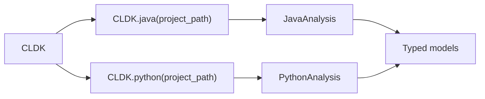

The `CLDK` class is the top-level entry point. Call the per-language factory,
e.g. `CLDK.java(project_path=...)`, to get an analysis object over your project.
You never instantiate `JavaAnalysis` or `PythonAnalysis` directly; the factory
hands you the correct one.

## Overview

One call per language, always the same shape:

```python
from cldk import CLDK

analysis = CLDK.java(project_path="commons-cli")
# -> JavaAnalysis, ready to query
```

The per-language factory methods are the top-level API:

- **`CLDK.java(...)`** -> [`JavaAnalysis`](/reference/python-api/java/)
- **`CLDK.python(...)`** -> [`PythonAnalysis`](/reference/python-api/python/)
- **`CLDK.typescript(...)`** -> `TypeScriptAnalysis`
- **`CLDK.c(project_path)`** -> C analysis

Each is backed by the appropriate static analysis engine, where the symbol table
and call graph are produced.



<aside>
The legacy `CLDK(language="java").analysis(project_path=...)` form still works but
is **deprecated** (it emits a `DeprecationWarning` and forwards to the factories).
Prefer `CLDK.java(project_path=...)` in new code.
</aside>

**Analysis levels.** The depth of analysis is governed by `analysis_level`.
The default, `AnalysisLevel.symbol_table`, populates classes, methods, and
fields. Call-graph computation incurs additional cost: `get_call_graph`,
`get_callers`, and `get_callees` require `AnalysisLevel.call_graph`. Set it up
front when call relationships are needed.

### Common factory arguments

| Argument | Applies to | What it does |
| -------- | ---------- | ------------ |
| `project_path` | all | Path to the project directory to analyze. |
| `analysis_level` | all | `AnalysisLevel.symbol_table` (default) or `AnalysisLevel.call_graph`. The latter is required for call graphs, callers, and callees. |
| `target_files` | all | Restrict analysis to specific files. |
| `eager` | all | Force a fresh analysis even when a cached artifact exists. |
| `backend` | all | A Parameter Object selecting the backend. Omit for the default in-process analyzer; pass `Neo4jConnectionConfig(...)` for a read-only Neo4j backend. |

### Backend selection

The backend is chosen by the **type** of the `backend=` config object:

- Omit `backend=` to use the default in-process analyzer. To tune it, pass
  `CodeAnalyzerConfig(...)` (Java/TypeScript) or `PyCodeAnalyzerConfig(...)`
  (Python, which adds `use_codeql` and `use_ray`).
- Pass `Neo4jConnectionConfig(uri=..., username=..., password=..., database=...,
  application_name=...)` for a read-only Neo4j backend.

```python
from cldk.analysis.commons.backend_config import (
    CodeAnalyzerConfig,
    PyCodeAnalyzerConfig,
    Neo4jConnectionConfig,
)
```

Analysis artifacts are cached under `cache_dir` (default `<project>/.codeanalyzer`,
with per-language artifacts under `<cache_dir>/<language>/`). Caching is on by
default for Java and TypeScript.

See the [generated reference](#api-reference) below for the full signature.

## Worked example

The recurring sample project is
[Apache Commons CLI](https://commons.apache.org/proper/commons-cli/), unpacked at
`commons-cli`.

### Construct a Java analysis

```python
from cldk import CLDK
from cldk.analysis import AnalysisLevel

analysis = CLDK.java(
    project_path="commons-cli",
    analysis_level=AnalysisLevel.call_graph,   # needed for call-graph methods
)

print(type(analysis).__name__)        # JavaAnalysis
print(len(analysis.get_classes()))    # 23
```

The CodeAnalyzer backend ships with the package; results are cached under
`<project>/.codeanalyzer` and reused on later runs. From here, every method lives
on `analysis`; see the [Java API reference](/reference/python-api/java/) for the
full surface.

### Construct a Python analysis

```python
from cldk import CLDK

analysis = CLDK.python(project_path="my_pkg")

print(type(analysis).__name__)        # PythonAnalysis
classes = analysis.get_classes()      # Dict[str, PyClass]
```

Same shape, same method names; just call `CLDK.python(...)` instead. Methods
are documented on the [Python API reference](/reference/python-api/python/).

For an introduction, see [What is CLDK?](/what-is-cldk/) and the
[Quickstart](/quickstart/). For task-oriented snippets, see
[Common tasks](/guides/common-tasks/) and the
[cocoa](/cocoa/); the [concepts](/guides/concepts/) page
explains analysis levels and call graphs in detail, and the
[cheat sheet](/resources/cheatsheet/) provides a one-page summary.

## API reference

The full generated reference follows.

<!-- CLDK:API:START -->

<!-- AUTO-GENERATED by scripts/gen_api_docs.py, do not edit by hand. -->

[](https://github.com/codellm-devkit/python-sdk) [](https://pypi.org/project/cldk/1.4.0/)

_API reference generated from cldk 1.4.0._

Core CLDK module.

This module provides the top-level entry point for the Code Language Development
Kit (CLDK), a unified framework for performing static analysis across multiple
programming languages. The primary interface is the `CLDK` class, which
serves as a factory for creating language-specific analysis objects, tree-sitter
parsers, and sanitization utilities.

> **The CLDK supports the following languages**
> - **Java**: Full static analysis via CodeAnalyzer backend, including symbol
>   tables, call graphs, and code metrics.
> - **Python**: Static analysis via codeanalyzer-python backend (Jedi plus
>   PyCG call-graph construction).
> - **C**: Basic analysis via libclang for parsing and extracting code structure.

Typical usage involves instantiating `CLDK` with a target language, then
calling `analysis` to obtain a language-specific analysis facade.

> **Note**
> This module requires language-specific backends to be available:
> - Java: ``codeanalyzer-*.jar`` (auto-downloaded or specified via path)
> - Python: ``codeanalyzer-python`` (auto-installed in virtualenv)
> - C: ``libclang`` (must be installed on the system)

## `CLDK`

```python
class CLDK
```

Core class for the Code Language Development Kit (CLDK).

The CLDK class serves as the primary entry point and factory for all code
analysis operations. It provides a unified interface for initializing
language-specific analysis facades, tree-sitter parsers, and code
sanitization utilities.

This class follows the factory pattern, where the ``language`` parameter
determines which concrete analysis implementation is returned by the
`analysis`, `treesitter_parser`, and `tree_sitter_utils`
methods.

**Parameters:**

| Name | Type | Description |
| ---- | ---- | ----------- |
| `language` | `str` | The target programming language for analysis. Supported values are ``"java"``, ``"python"``, and ``"c"`` (case-sensitive). |

**Raises:**

- `NotImplementedError`: Raised by factory methods when the specified language is not yet supported.

> **See Also**
> - `JavaAnalysis`: Java-specific analysis facade.
> - `PythonAnalysis`: Python-specific analysis facade.
> - `CAnalysis`: C-specific analysis facade.

### Attributes

| Name | Type | Description |
| ---- | ---- | ----------- |
| `language` | `str` |  |

### Methods

#### `CLDK.java`

```python
java(project_path: str | Path | None = None, source_code: str | None = None, analysis_level: str = AnalysisLevel.symbol_table, target_files: List[str] | None = None, eager: bool = False, backend: JavaBackend | None = None) -> JavaAnalysis
```

Create a Java analysis facade.

**Parameters:**

| Name | Type | Description |
| ---- | ---- | ----------- |
| `project_path` | `str \| Path \| None` | Path to the Java project directory. Optional only when ``backend`` is a `Neo4jConnectionConfig` (the graph is read out of band over Bolt). When provided, the path is validated, it must exist and be a directory, regardless of backend. |
| `source_code` | `str \| None` | Single Java source string (deprecated; pass ``project_path`` instead). |
| `analysis_level` | `str` | Analysis depth (see `AnalysisLevel`). |
| `target_files` | `List[str] \| None` | Restrict analysis to these files. |
| `eager` | `bool` | Force regeneration of cached analysis. |
| `backend` | `JavaBackend \| None` | Backend configuration. Defaults to `CodeAnalyzerConfig`. |

**Raises:**

- `CldkInitializationException`: If neither or both of ``project_path`` / ``source_code`` are provided.

#### `CLDK.python`

```python
python(project_path: str | Path | None = None, analysis_level: str = AnalysisLevel.symbol_table, target_files: List[str] | None = None, eager: bool = False, backend: PyBackend | None = None) -> PythonAnalysis
```

Create a Python analysis facade.

**Parameters:**

| Name | Type | Description |
| ---- | ---- | ----------- |
| `project_path` | `str \| Path \| None` | Path to the Python project directory. Optional only when ``backend`` is a `Neo4jConnectionConfig` (the graph is populated out of band over Bolt). When provided, the path is validated, it must exist and be a directory, regardless of backend. |
| `analysis_level` | `str` | Analysis depth (see `AnalysisLevel`). |
| `target_files` | `List[str] \| None` | Restrict analysis to these files. |
| `eager` | `bool` | Force regeneration of cached analysis. |
| `backend` | `PyBackend \| None` | Backend configuration. Defaults to `PyCodeAnalyzerConfig`; pass a `Neo4jConnectionConfig` to use the read-only Neo4j backend. |

#### `CLDK.typescript`

```python
typescript(project_path: str | Path | None = None, analysis_level: str = AnalysisLevel.symbol_table, target_files: List[str] | None = None, eager: bool = False, backend: TSBackend | None = None) -> TypeScriptAnalysis
```

Create a TypeScript analysis facade.

**Parameters:**

| Name | Type | Description |
| ---- | ---- | ----------- |
| `project_path` | `str \| Path \| None` | Path to the TypeScript project directory. Optional only when ``backend`` is a `Neo4jConnectionConfig` (the graph is populated out of band over Bolt). When provided, the path is validated, it must exist and be a directory, regardless of backend. |
| `analysis_level` | `str` | Analysis depth (see `AnalysisLevel`). |
| `target_files` | `List[str] \| None` | Restrict analysis to these files. |
| `eager` | `bool` | Force regeneration of cached analysis. |
| `backend` | `TSBackend \| None` | Backend configuration. Defaults to `CodeAnalyzerConfig`; pass a `TSCodeAnalyzerConfig` to set TypeScript-only knobs such as ``tsc_only`` (passes ``--tsc-only``), or a `Neo4jConnectionConfig` to use the read-only Neo4j backend. |

#### `CLDK.c`

```python
c(project_path: str | Path) -> CAnalysis
```

Create a C analysis facade for the given project directory.

#### `CLDK.analysis`

```python
analysis(project_path: str | Path | None = None, source_code: str | None = None, eager: bool = False, analysis_level: str = AnalysisLevel.symbol_table, target_files: List[str] | None = None, analysis_backend_path: str | None = None, analysis_json_path: str | Path | None = None, cache_dir: str | Path | None = None, use_ray: bool = False, neo4j_config: Neo4jConnectionConfig | None = None) -> JavaAnalysis | PythonAnalysis | CAnalysis | TypeScriptAnalysis
```

Deprecated entry point. Use the per-language factory methods instead.

``CLDK(language).analysis(...)`` is retained as a thin compatibility shim that forwards to
`java` / `python` / `typescript` / `c` with an appropriate
``backend=`` configuration object.

The former ``analysis_json_path`` is folded into the unified ``cache_dir`` (it is used as
the cache root when ``cache_dir`` is not given). ``analysis_backend_path`` is no longer
supported: the backend binary ships with the packaged dependency, and passing it is ignored.

.. deprecated::
    Use `java`, `python`, `typescript`, or `c`
    with a ``backend=<config>`` object.

#### `CLDK.treesitter_parser`

```python
treesitter_parser() -> TreesitterJava
```

Return a Tree-sitter parser for the selected language.

Creates and returns a language-specific Tree-sitter parser instance
that can be used for syntactic analysis, AST traversal, and code
querying operations. Tree-sitter provides incremental parsing with
excellent performance characteristics for real-time code analysis.

> **The returned parser provides methods for**
> - Parsing source code into an AST
> - Running Tree-sitter queries to extract code patterns
> - Extracting syntactic elements (methods, classes, imports, etc.)
> - Performing lexical analysis

**Returns:**

- `TreesitterJava`: A Tree-sitter parser wrapper for Java source code. The parser provides methods such as `is_parsable`, `get_raw_ast`, `get_all_imports`, and various code extraction utilities.

**Raises:**

- `NotImplementedError`: If the language specified during CLDK initialization does not have a Tree-sitter parser implementation. Currently, only Java is supported.

> **Note**
> The Tree-sitter parser operates at the syntactic level only and
> does not perform semantic analysis. For semantic information like
> resolved types or call graphs, use `analysis` instead.

> **See Also**
> - `TreesitterJava`:
>   Java Tree-sitter parser implementation.

#### `CLDK.tree_sitter_utils`

```python
tree_sitter_utils(source_code: str) -> TreesitterSanitizer
```

Return Tree-sitter-based code sanitization utilities for the selected language.

Creates and returns a utility class that provides code transformation
and sanitization operations using Tree-sitter for parsing. These utilities
are particularly useful for preparing code for LLM consumption, test
generation, and code analysis tasks.

> **The sanitization utilities provide operations such as**
> - Removing unused imports from source code
> - Keeping only focal methods and their callees for context reduction
> - Extracting and manipulating test assertions
> - Identifying and removing dead code

**Parameters:**

| Name | Type | Description |
| ---- | ---- | ----------- |
| `source_code` | `str` | The source code string to initialize the utilities with. This code will be parsed and made available for transformation operations. Must be valid syntax for the target language. |

**Returns:**

- `TreesitterSanitizer`: A utility wrapper that provides sanitization and transformation methods for Java source code, including: - `keep_only_focal_method_and_its_callees` - `remove_unused_imports`

**Raises:**

- `NotImplementedError`: If the language specified during CLDK initialization does not have sanitization utilities implemented. Currently, only Java is supported.

> **Note**
> The sanitization utilities modify code at the syntactic level using
> Tree-sitter patterns. For complex refactoring that requires semantic
> understanding, consider using the full analysis capabilities via
> `analysis`.

> **See Also**
> - `TreesitterSanitizer`:
>   Java sanitization utility implementation.
> - `treesitter_parser`: For raw Tree-sitter parsing without
>   sanitization utilities.

<!-- CLDK:API:END -->

