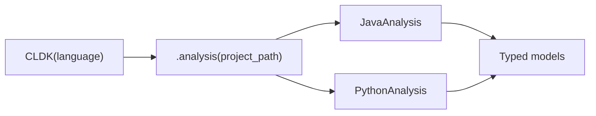

The `CLDK` class is the front door to the whole library. It is a **factory**: you
construct it once with a language, then ask it for an analysis facade over your
project. You never instantiate `JavaAnalysis` or `PythonAnalysis` directly,
`CLDK` hands you the correct one, and they share the same method surface, so your
code barely changes when you switch languages.

## Overview

Two steps, always the same shape:

```python
from cldk import CLDK
from cldk.analysis import AnalysisLevel

analysis = CLDK(language="java").analysis(project_path="commons-cli")
# -> JavaAnalysis facade, ready to query
```

`CLDK(language=...)` accepts `"java"` and `"python"` today (Go, TypeScript, Rust,
and C are on the way). The object it returns exposes the one method you'll use for
almost everything:

- **`.analysis(...)`**: returns the language-specific facade
  ([`JavaAnalysis`](/reference/python-api/java/) or
  [`PythonAnalysis`](/reference/python-api/python/)) backed by the appropriate
  static analysis engine. This is where ground truth comes from: a real symbol
  table and call graph.



**Analysis levels.** The depth of `.analysis()` is governed by `analysis_level`.
The default, `AnalysisLevel.symbol_table`, populates classes, methods, and
fields. Call graphs are not free: `get_call_graph`, `get_callers`, and
`get_callees` require `AnalysisLevel.call_graph`. Set it up front when you need
call relationships.

### Key `.analysis()` arguments

| Argument | Applies to | What it does |
| -------- | ---------- | ------------ |
| `project_path` | all | Path to the project directory to analyze. |
| `analysis_level` | all | `AnalysisLevel.symbol_table` (default) or `AnalysisLevel.call_graph`. The latter is required for call graphs, callers, and callees. |
| `analysis_backend_path` | Java only | Path to a `codeanalyzer-*.jar`. Omit to auto-download. |
| `cache_dir` | Python only | Directory for the codeanalyzer-python cache (virtualenv, CodeQL DB, analysis cache). Defaults to `<project_path>/.codeanalyzer`. |
| `use_codeql` | Python only | When `True` (default), augments Jedi call-graph resolution with CodeQL for more complete edges. Set `False` for faster, Jedi-only analysis. |

See the [generated reference](#api-reference) below for the full signature,
including `eager`, `target_files`, `analysis_json_path`, and `use_ray`.

## Worked example

The recurring sample project is
[Apache Commons CLI](https://commons.apache.org/proper/commons-cli/), unpacked at
`commons-cli`.

### Construct a Java analysis

```python
from cldk import CLDK
from cldk.analysis import AnalysisLevel

analysis = CLDK(language="java").analysis(
    project_path="commons-cli",
    analysis_level=AnalysisLevel.call_graph,   # needed for call-graph methods
)

print(type(analysis).__name__)        # JavaAnalysis
print(len(analysis.get_classes()))    # 23
```

The first run may download the CodeAnalyzer backend JAR; later runs reuse the
cache. From here, every method lives on the facade, see the
[Java API reference](/reference/python-api/java/) for the full surface.

### Construct a Python analysis

```python
from cldk import CLDK

analysis = CLDK(language="python").analysis(project_path="my_pkg")

print(type(analysis).__name__)        # PythonAnalysis
classes = analysis.get_classes()      # Dict[str, PyClass]
```

Same two-step shape, same method names, only `language` changed. Facade methods
are documented on the [Python API reference](/reference/python-api/python/).

New here? Read [What is CLDK?](/what-is-cldk/) for the mental model and the
[Quickstart](/quickstart/) for a five-minute tour. For task-shaped snippets see
[Common tasks](/guides/common-tasks/) and the
[cocoa](/cocoa/); the [concepts](/guides/concepts/) page
explains analysis levels and call graphs in depth, and the
[cheat sheet](/resources/cheatsheet/) is the one-page reminder. To expose any of
this to an agent over MCP, see [COCO MCP Toolbox](/cocoa-mcp/).

## API reference

The full generated reference follows.

<!-- CLDK:API:START -->

<!-- AUTO-GENERATED by scripts/gen_api_docs.py, do not edit by hand. -->

Core module

## `CLDK`

```python
class CLDK
```

The CLDK base class.

Parameters
----------
language : str
    The programming language of the project.

Attributes
----------
language : str
    The programming language of the project.

### Attributes

| Name | Type | Description |
| ---- | ---- | ----------- |
| `language` | `str` |  |

### Methods

#### `CLDK.analysis`

```python
analysis(project_path: str | Path | None = None, source_code: str | None = None, eager: bool = False, analysis_level: str = AnalysisLevel.symbol_table, target_files: List[str] | None = None, analysis_backend_path: str | None = None, analysis_json_path: str | Path = None) -> JavaAnalysis
```

Initialize the preprocessor based on the specified language.

Parameters
----------
project_path : str or Path
    The directory path of the project.
source_code : str, optional
    The source code of the project, defaults to None. If None, it is assumed that the whole project is being
    analyzed.
analysis_backend_path : str, optional
    The path to the analysis backend, defaults to None where it assumes the default backend path.
analysis_json_path : str or Path, optional
    The path save the to the analysis database (analysis.json), defaults to None. If None, the analysis database
    is not persisted.
eager : bool, optional
    A flag indicating whether to perform eager analysis, defaults to False. If True, the analysis is performed
    eagerly. That is, the analysis.json file is created during analysis every time even if it already exists.
analysis_level: str, optional
    Analysis levels. Refer to AnalysisLevel.
target_files: List[str] | None, optional
    The target files (paths) for which the analysis will run or get modified. Currently, this feature only supported
    with symbol table analysis. In the future, we will add this feature to other analysis levels.
Returns
-------
JavaAnalysis
    The initialized JavaAnalysis object.

Raises
------
CldkInitializationException
    If neither project_path nor source_code is provided.
NotImplementedError
    If the specified language is not implemented yet.

**Parameters:**

| Name | Type | Description |
| ---- | ---- | ----------- |
| `analysis_level` | `str` |  |
| `target_files` | `List[str] \| None` |  |
| `analysis_level` | `str` |  |

#### `CLDK.treesitter_parser`

```python
treesitter_parser()
```

Parse the project using treesitter.

Returns
-------
List
    A list of treesitter nodes.

#### `CLDK.tree_sitter_utils`

```python
tree_sitter_utils(source_code: str) -> [TreesitterSanitizer | NotImplementedError]
```

Parse the project using treesitter.

Parameters
----------
source_code : str, optional
    The source code of the project, defaults to None. If None, it is assumed that the whole project is being
    analyzed.

Returns
-------
List
    A list of treesitter nodes.

<!-- CLDK:API:END -->

