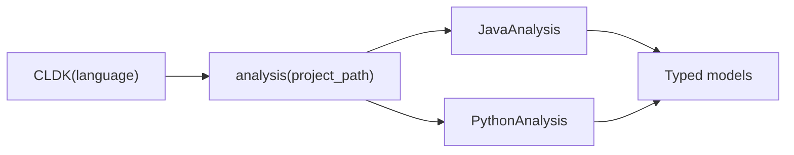

Every CLDK program follows the same shape: construct a `CLDK` object for a
language, ask it for an `analysis` facade over your project, then call typed
methods that return data models.

It's the same `analysis` facade and the same methods across languages, only the
`language` argument changes. New to the library? Start with [What is
CLDK?](/what-is-cldk/) for the mental model, or jump to the
[Quickstart](/quickstart/).

## Reference pages

- **[Core (CLDK)](/reference/python-api/core/)**, the factory: `CLDK(language)` and the `analysis()` entry point.
- **[Python analysis](/reference/python-api/python/)**: symbol table and call graph via Jedi + optional CodeQL.
- **[Java analysis](/reference/python-api/java/)**, the deepest analyzer: symbol table, call graph, subclasses/interfaces, CRUD.

More languages (Go, TypeScript, Rust, and C) are on the way.

Looking for runnable patterns instead of symbol lists? See [Common
tasks](/guides/common-tasks/) and the [cocoa](/cocoa/).
