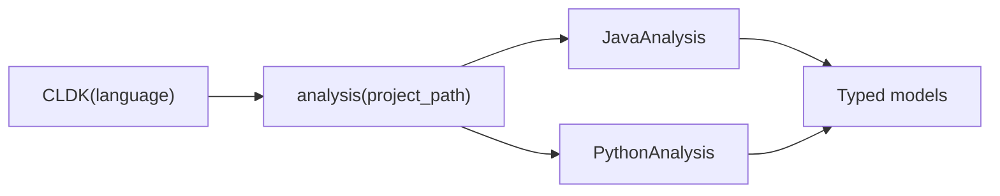

Every CLDK program follows the same shape: construct a `CLDK` object for a
language, ask it for an `analysis` object over your project, then call typed
methods that return data models.

The `analysis` API and its methods are the same across languages; only the
`language` argument changes. For an introduction to the library, see [What is
CLDK?](/what-is-cldk/), or the [Quickstart](/quickstart/).

## Reference pages

- **[Core (CLDK)](/reference/python-api/core/)**, the factory: `CLDK(language)` and the `analysis()` entry point.
- **[Python analysis](/reference/python-api/python/)**: symbol table and call graph via Jedi + optional CodeQL.
- **[Java analysis](/reference/python-api/java/)**, the most complete analyzer: symbol table, call graph, subclasses/interfaces, CRUD.

More languages (Go, TypeScript, Rust, and C) are on the way.

For runnable patterns rather than symbol lists, see [Common
tasks](/guides/common-tasks/) and the [cocoa](/cocoa/).
