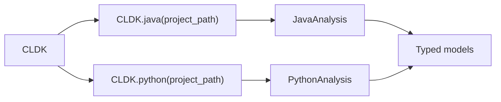

Every CLDK program follows the same shape. Call the per-language factory, for
example `CLDK.java(project_path=...)`, to get an analysis object over your
project. Then call typed methods that return data models.

The analysis API and its methods are the same across languages. Only the factory
that you call changes. For an introduction to the library, see [What is
CLDK?](/what-is-cldk/), or the [Quickstart](/quickstart/).

## Reference pages

- **[Core (CLDK)](/reference/python-api/core/)**, the factory: the per-language `CLDK.java()`, `CLDK.python()`, and `CLDK.typescript()` entry points.
- **[Python analysis](/reference/python-api/python/)**: symbol table and call graph, from Jedi and the level-2 defuse linker.
- **[Java analysis](/reference/python-api/java/)**, the most complete analysis: symbol table, call graph, subclasses, and interfaces.
- **[TypeScript analysis](/reference/python-api/typescript/)** (beta): symbol table, call graph, interfaces, enums, decorators, and framework entrypoints.

CLDK 2.0 adds the dataflow and taint methods to all three. See [Dataflow graphs](/guides/dataflow/). Go and Rust are planned.

For runnable patterns rather than symbol lists, see [Common
tasks](/guides/common-tasks/) and the [cocoa](/cocoa/).
