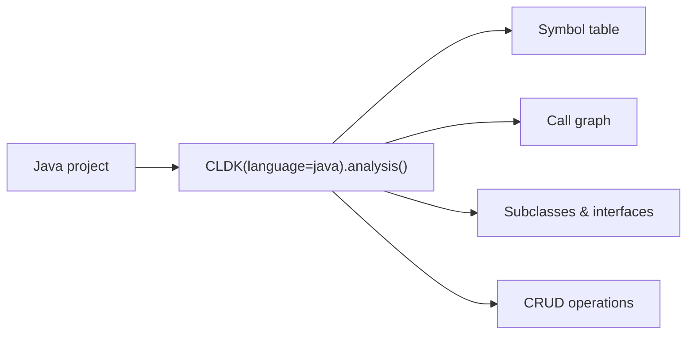

Java is CLDK's most complete analyzer. `JavaAnalysis` provides a typed symbol
table, call graph, subclass/interface queries, CRUD/data-access discovery, and
comments. [cocoa](/cocoa/) builds on these calls.

## Overview

`CLDK(language="java").analysis(...)` returns a `JavaAnalysis` object backed by
**CodeAnalyzer**, a WALA-based static analysis engine: symbol table, call graph,
subclass/interface relationships, CRUD operations, and comments. The backend JAR
is downloaded automatically (or point at one with `analysis_backend_path`).



**Analysis levels.** The `analysis_level` argument controls how much is computed.
`AnalysisLevel.symbol_table` (the default) populates classes, methods, and
fields. `AnalysisLevel.call_graph` additionally builds the call graph that
`get_call_graph`, `get_callers`, and `get_callees` rely on. Set it when you need
call relationships:

```python
from cldk import CLDK
from cldk.analysis import AnalysisLevel

analysis = CLDK(language="java").analysis(
    project_path="commons-cli",
    analysis_level=AnalysisLevel.call_graph,
)
```

## Worked example

Using [Apache Commons CLI](https://commons.apache.org/proper/commons-cli/) as the
sample project.

### Get the symbol table

```python
# Every file -> its compilation unit (classes, methods, fields).
symbol_table = analysis.get_symbol_table()
print(len(analysis.get_classes()), "classes")
# 23 classes
```

### Build a call graph

```python
import networkx as nx

cg = analysis.get_call_graph()      # networkx.DiGraph, caller -> callee
print(cg)                           # DiGraph with N nodes / M edges
```

### Find who calls a method

```python
callers = analysis.get_callers(
    target_class_name="org.apache.commons.cli.OptionBuilder",
    target_method_declaration="create(String)",
)
# -> dict of caller method signatures + call-site locations
```

See the [common tasks](/guides/common-tasks/) guide for more snippets, and the
[cocoa](/cocoa/), the Code Context Agent plugin, for exposing these calls to an agent.

## API reference

The full generated reference for the Java analysis API and data models
follows.

<!-- CLDK:API:START -->

<!-- AUTO-GENERATED by scripts/gen_api_docs.py, do not edit by hand. -->

[](https://github.com/codellm-devkit/python-sdk)

## Analysis

Java module

### `JavaAnalysis`

```python
class JavaAnalysis
```

#### Attributes

| Name | Type | Description |
| ---- | ---- | ----------- |
| `project_dir` | `` |  |
| `source_code` | `` |  |
| `analysis_level` | `` |  |
| `analysis_json_path` | `` |  |
| `analysis_backend_path` | `` |  |
| `eager_analysis` | `` |  |
| `target_files` | `` |  |
| `treesitter_java` | `TreesitterJava` |  |
| `backend` | `JCodeanalyzer` |  |

#### Methods

##### `JavaAnalysis.get_imports`

```python
get_imports() -> List[str]
```

Should return  all the imports in the source code.

**Raises:**

- `NotImplementedError`: Raised when this functionality is not suported.

**Returns:**

- `List[str]`: List[str]: List of all the imports.

##### `JavaAnalysis.get_variables`

```python
get_variables(**kwargs)
```

_Returns all the variables.

**Raises:**

- `NotImplementedError`: Raised when this functionality is not suported.

##### `JavaAnalysis.get_service_entry_point_classes`

```python
get_service_entry_point_classes(**kwargs)
```

Should return  all service entry point classes.

**Raises:**

- `NotImplementedError`: Raised when this functionality is not suported.

##### `JavaAnalysis.get_service_entry_point_methods`

```python
get_service_entry_point_methods(**kwargs)
```

Should return  all the service entry point methods.

**Raises:**

- `NotImplementedError`: Raised when this functionality is not suported.

##### `JavaAnalysis.get_application_view`

```python
get_application_view() -> JApplication
```

Should return  application view of the java code.

**Raises:**

- `NotImplementedError`: Raised when this functionality is not suported.

**Returns:**

- `JApplication`: Application view of the java code.

##### `JavaAnalysis.get_symbol_table`

```python
get_symbol_table() -> Dict[str, JCompilationUnit]
```

Should return  symbol table.

**Returns:**

- `Dict[str, JCompilationUnit]`: Dict[str, JCompilationUnit]: Symbol table

##### `JavaAnalysis.get_compilation_units`

```python
get_compilation_units() -> List[JCompilationUnit]
```

Should return  a list of all compilation units in the java code.

**Raises:**

- `NotImplementedError`: Raised when this functionality is not supported.

**Returns:**

- `List[JCompilationUnit]`: List[JCompilationUnit]: Compilation units of the Java code.

##### `JavaAnalysis.get_class_hierarchy`

```python
get_class_hierarchy() -> nx.DiGraph
```

Should return  class hierarchy of the java code.

**Raises:**

- `NotImplementedError`: Raised when this functionality is not suported.

**Returns:**

- `nx.DiGraph`: nx.DiGraph: The class hierarchy of the Java code.

##### `JavaAnalysis.is_parsable`

```python
is_parsable(source_code: str) -> bool
```

Check if the code is parsable
Args:
    source_code: source code

**Returns:**

- `bool`: True if the code is parsable, False otherwise

##### `JavaAnalysis.get_raw_ast`

```python
get_raw_ast(source_code: str) -> Tree
```

Get the raw AST
Args:
    code: source code

**Returns:**

- `Tree`: the raw AST

##### `JavaAnalysis.get_call_graph`

```python
get_call_graph() -> nx.DiGraph
```

Should return  the call graph of the Java code.

**Returns:**

- `nx.DiGraph`: nx.DiGraph: The call graph of the Java code.

##### `JavaAnalysis.get_call_graph_json`

```python
get_call_graph_json() -> str
```

Should return  a serialized call graph in json.

**Raises:**

- `NotImplementedError`: Raised when this functionality is not suported.

**Returns:**

- `str`: Call graph in json.

##### `JavaAnalysis.get_callers`

```python
get_callers(target_class_name: str, target_method_declaration: str, using_symbol_table: bool = False) -> Dict
```

Should return  a dictionary of callers of the target method.

**Parameters:**

| Name | Type | Description |
| ---- | ---- | ----------- |
| `target_class_name` | `str` | Qualified target class name. |
| `target_method_declaration` | `str` | Target method names |
| `using_symbol_table` | `bool` | Whether to use symbol table. Defaults to False. |

**Raises:**

- `NotImplementedError`: Raised when this functionality is not suported.

**Returns:**

- `Dict`: A dictionary of callers of target method.

##### `JavaAnalysis.get_callees`

```python
get_callees(source_class_name: str, source_method_declaration: str, using_symbol_table: bool = False) -> Dict
```

Should return  a dictionary of callees by the given method in the given class.

**Parameters:**

| Name | Type | Description |
| ---- | ---- | ----------- |
| `source_class_name` | `str` | Qualified class name where the given method is. |
| `source_method_declaration` | `str` | Given method |
| `using_symbol_table` | `bool` | Whether to use symbol table. Defaults to false. |

**Raises:**

- `NotImplementedError`: Raised when this functionality is not suported.

**Returns:**

- `Dict`: Dictionary with callee details.

##### `JavaAnalysis.get_methods`

```python
get_methods() -> Dict[str, Dict[str, JCallable]]
```

Should return  all methods in the Java code.

**Raises:**

- `NotImplementedError`: Raised when we do not support this function.

**Returns:**

- `Dict[str, Dict[str, JCallable]]`: Dict[str, Dict[str, JCallable]]: Dictionary of dictionaries of all methods in the Java code with qualified class name as key and dictionary of methods in that class.

##### `JavaAnalysis.get_classes`

```python
get_classes() -> Dict[str, JType]
```

Should return  all classes in the Java code.

**Raises:**

- `NotImplementedError`: Raised when we do not support this function.

**Returns:**

- `Dict[str, JType]`: Dict[str, JType]: A dictionary of all classes in the Java code, with qualified class names as keys.

##### `JavaAnalysis.get_classes_by_criteria`

```python
get_classes_by_criteria(inclusions = None, exclusions = None) -> Dict[str, JType]
```

Should return  a dictionary of all classes with the given criteria, in the Java code.

**Parameters:**

| Name | Type | Description |
| ---- | ---- | ----------- |
| `inclusions` | `List` | inlusion criteria for the classes. Defaults to None. |
| `exclusions` | `List` | exclusion criteria for the classes. Defaults to None. |

**Raises:**

- `NotImplementedError`: Raised when we do not support this function.

**Returns:**

- `Dict[str, JType]`: Dict[str, JType]: A dict of all classes in the Java code, with qualified class names as keys

##### `JavaAnalysis.get_class`

```python
get_class(qualified_class_name: str) -> JType
```

Should return  a class object given qualified class name.

**Parameters:**

| Name | Type | Description |
| ---- | ---- | ----------- |
| `qualified_class_name` | `str` | The qualified name of the class. |

**Raises:**

- `NotImplementedError`: Raised when we do not support this function.

**Returns:**

- `JType`: Class object for the given qualified class name.

##### `JavaAnalysis.get_method`

```python
get_method(qualified_class_name: str, qualified_method_name: str) -> JCallable
```

Should return  a method object given qualified class and method names.

**Parameters:**

| Name | Type | Description |
| ---- | ---- | ----------- |
| `qualified_class_name` | `str` | The qualified name of the class. |
| `qualified_method_name` | `str` | The qualified name of the method. |

**Raises:**

- `NotImplementedError`: Raised when we do not support this function.

**Returns:**

- `JCallable`: A method for the given qualified method name.

##### `JavaAnalysis.get_method_parameters`

```python
get_method_parameters(qualified_class_name: str, qualified_method_name: str) -> List[str]
```

Should return  a list of method parameters given qualified class and method names.

**Parameters:**

| Name | Type | Description |
| ---- | ---- | ----------- |
| `qualified_class_name` | `str` | The qualified name of the class. |
| `qualified_method_name` | `str` | The qualified name of the method. |

**Raises:**

- `NotImplementedError`: Raised when we do not support this function.

**Returns:**

- `List[str]`: A method for the given qualified method name.

##### `JavaAnalysis.get_java_file`

```python
get_java_file(qualified_class_name: str) -> str
```

Should return  a class given qualified class name.

**Parameters:**

| Name | Type | Description |
| ---- | ---- | ----------- |
| `qualified_class_name` | `str` | The qualified name of the class. |

**Raises:**

- `NotImplementedError`: Raised when we do not support this function.

**Returns:**

- `str`: Java file name containing the given qualified class.

##### `JavaAnalysis.get_java_compilation_unit`

```python
get_java_compilation_unit(file_path: str) -> JCompilationUnit
```

Given the path of a Java source file, returns the compilation unit object from the symbol table.

**Parameters:**

| Name | Type | Description |
| ---- | ---- | ----------- |
| `file_path` | `str` | Absolute path to Java source file |

**Raises:**

- `NotImplementedError`: Raised when we do not support this function.

**Returns:**

- `JCompilationUnit`: Compilation unit object for Java source file

##### `JavaAnalysis.get_methods_in_class`

```python
get_methods_in_class(qualified_class_name) -> Dict[str, JCallable]
```

Should return  a dictionary of all methods of the given class.

**Parameters:**

| Name | Type | Description |
| ---- | ---- | ----------- |
| `qualified_class_name` | `str` | qualified class name |

**Raises:**

- `NotImplementedError`: Raised when we do not support this function.

**Returns:**

- `Dict[str, JCallable]`: Dict[str, JCallable]: A dictionary of all constructors of the given class.

##### `JavaAnalysis.get_constructors`

```python
get_constructors(qualified_class_name) -> Dict[str, JCallable]
```

Should return  a dictionary of all constructors of the given class.

**Parameters:**

| Name | Type | Description |
| ---- | ---- | ----------- |
| `qualified_class_name` | `str` | qualified class name |

**Raises:**

- `NotImplementedError`: Raised when we do not support this function.

**Returns:**

- `Dict[str, JCallable]`: Dict[str, JCallable]: A dictionary of all constructors of the given class.

##### `JavaAnalysis.get_fields`

```python
get_fields(qualified_class_name) -> List[JField]
```

Should return  a dictionary of all fields of the given class

**Parameters:**

| Name | Type | Description |
| ---- | ---- | ----------- |
| `qualified_class_name` | `str` | qualified class name |

**Raises:**

- `NotImplementedError`: Raised when we do not support this function.

**Returns:**

- `List[JField]`: List[JField]: A list of all fields of the given class.

##### `JavaAnalysis.get_nested_classes`

```python
get_nested_classes(qualified_class_name) -> List[JType]
```

Should return  a dictionary of all nested classes of the given class

**Parameters:**

| Name | Type | Description |
| ---- | ---- | ----------- |
| `qualified_class_name` | `str` | qualified class name |

**Raises:**

- `NotImplementedError`: Raised when we do not support this function.

**Returns:**

- `List[JType]`: List[JType]: A list of nested classes for the given class.

##### `JavaAnalysis.get_sub_classes`

```python
get_sub_classes(qualified_class_name) -> Dict[str, JType]
```

Should return  a dictionary of all sub-classes of the given class

**Parameters:**

| Name | Type | Description |
| ---- | ---- | ----------- |
| `qualified_class_name` | `str` | qualified class name |

**Returns:**

- `Dict[str, JType]`: Dict[str, JType]: A dictionary of all sub-classes of the given class, and class details

##### `JavaAnalysis.get_extended_classes`

```python
get_extended_classes(qualified_class_name) -> List[str]
```

Should return  a list of all extended classes for the given class.
Args:
    qualified_class_name (str): The qualified name of the class.

**Raises:**

- `NotImplementedError`: Raised when we do not support this function.

**Returns:**

- `List[str]`: List[str]: A list of extended classes for the given class.

##### `JavaAnalysis.get_implemented_interfaces`

```python
get_implemented_interfaces(qualified_class_name: str) -> List[str]
```

Should return  a list of all implemented interfaces for the given class.

**Parameters:**

| Name | Type | Description |
| ---- | ---- | ----------- |
| `qualified_class_name` | `str` | The qualified name of the class. |

**Raises:**

- `NotImplementedError`: Raised when we do not support this function.

**Returns:**

- `List[str]`: List[str]: A list of implemented interfaces for the given class.

##### `JavaAnalysis.get_class_call_graph`

```python
get_class_call_graph(qualified_class_name: str, method_signature: str | None = None, using_symbol_table: bool = False) -> List[Tuple[JMethodDetail, JMethodDetail]]
```

A call graph for a given class and (optionally) a given method.

**Parameters:**

| Name | Type | Description |
| ---- | ---- | ----------- |
| `qualified_class_name` | `str` | The qualified name of the class. |
| `method_signature` | `str \| None` | The signature of the method in the class.. Defaults to None. |
| `using_symbol_table` | `bool` | Generate call graph using symbol table. Defaults to False. |

**Raises:**

- `NotImplementedError`: Raised when we do not support this function.

**Returns:**

- `List[Tuple[JMethodDetail, JMethodDetail]]`: List[Tuple[JMethodDetail, JMethodDetail]]: An edge list of the call graph for the given class and method.

##### `JavaAnalysis.get_entry_point_classes`

```python
get_entry_point_classes() -> Dict[str, JType]
```

Should return  a dictionary of all entry point classes in the Java code.

**Raises:**

- `NotImplementedError`: Raised when we do not support this function.

**Returns:**

- `Dict[str, JType]`: Dict[str, JType]: A dict of all entry point classes in the Java code, with qualified class names as keys

##### `JavaAnalysis.get_entry_point_methods`

```python
get_entry_point_methods() -> Dict[str, Dict[str, JCallable]]
```

Should return  a dictionary of all entry point methods in the Java code with qualified class name as key and dictionary of methods in that class as value

**Raises:**

- `NotImplementedError`: Raised when we do not support this function.

**Returns:**

- `Dict[str, Dict[str, JCallable]]`: Dict[str, Dict[str, JCallable]]: A dictionary of dictionaries of entry point methods in the Java code.

##### `JavaAnalysis.remove_all_comments`

```python
remove_all_comments() -> str
```

Remove all comments from the source code.

**Raises:**

- `NotImplementedError`: Raised when we do not support this function.

**Returns:**

- `str`: The source code with all comments removed.

##### `JavaAnalysis.get_methods_with_annotations`

```python
get_methods_with_annotations(annotations: List[str]) -> Dict[str, List[Dict]]
```

Should return  a dictionary of method names and method bodies.

**Parameters:**

| Name | Type | Description |
| ---- | ---- | ----------- |
| `annotations` | `List[str]` | List of annotation strings. |

**Raises:**

- `NotImplementedError`: Raised when we do not support this function.

**Returns:**

- `Dict[str, List[Dict]]`: Dict[str, List[Dict]]: Dictionary with annotations as keys and a list of dictionaries containing method names and bodies, as values.

##### `JavaAnalysis.get_test_methods`

```python
get_test_methods() -> Dict[str, str]
```

Should return  a dictionary of method names and method bodies

**Raises:**

- `NotImplementedError`: Raised when we do not support this function.

**Returns:**

- `Dict[str, str]`: Dict[str, str]: Dictionary of method names and method bodies.

##### `JavaAnalysis.get_calling_lines`

```python
get_calling_lines(target_method_name: str) -> List[int]
```

Should return  a list of line numbers in source method block where target method is called.

**Parameters:**

| Name | Type | Description |
| ---- | ---- | ----------- |
| `target_method_name` | `str` | target method name. |

**Raises:**

- `NotImplementedError`: Raised when we do not support this function.

**Returns:**

- `List[int]`: List[int]: List of line numbers within in source method code block.

##### `JavaAnalysis.get_call_targets`

```python
get_call_targets(declared_methods: dict) -> Set[str]
```

Uses simple name resolution for finding the call targets. Nothing sophiscticed here. Just a simple search over the AST.

**Parameters:**

| Name | Type | Description |
| ---- | ---- | ----------- |
| `declared_methods` | `dict` | A dictionary of all declared methods in the class. |

**Returns:**

- `Set[str]`: Set[str]: A list of call targets (methods).

##### `JavaAnalysis.get_all_crud_operations`

```python
get_all_crud_operations() -> List[Dict[str, Union[JType, JCallable, List[JCRUDOperation]]]]
```

Should return  a dictionary of all CRUD operations in the source code.

**Returns:**

- `List[Dict[str, Union[JType, JCallable, List[JCRUDOperation]]]]`: List[Dict[str, Union[JType, JCallable, List[JCRUDOperation]]]]: A list of all CRUD operations in the source code.

##### `JavaAnalysis.get_all_create_operations`

```python
get_all_create_operations() -> List[Dict[str, Union[JType, JCallable, List[JCRUDOperation]]]]
```

Should return  a list of all create operations in the source code.

**Returns:**

- `List[Dict[str, Union[JType, JCallable, List[JCRUDOperation]]]]`: List[Dict[str, Union[JType, JCallable, List[JCRUDOperation]]]]: A list of all create operations in the source code.

##### `JavaAnalysis.get_all_read_operations`

```python
get_all_read_operations() -> List[Dict[str, Union[JType, JCallable, List[JCRUDOperation]]]]
```

Should return  a list of all read operations in the source code.

**Returns:**

- `List[Dict[str, Union[JType, JCallable, List[JCRUDOperation]]]]`: List[Dict[str, Union[JType, JCallable, List[JCRUDOperation]]]]: A list of all read operations in the source code.

##### `JavaAnalysis.get_all_update_operations`

```python
get_all_update_operations() -> List[Dict[str, Union[JType, JCallable, List[JCRUDOperation]]]]
```

Should return  a list of all update operations in the source code.

**Returns:**

- `List[Dict[str, Union[JType, JCallable, List[JCRUDOperation]]]]`: List[Dict[str, Union[JType, JCallable, List[JCRUDOperation]]]]: A list of all update operations in the source code.

##### `JavaAnalysis.get_all_delete_operations`

```python
get_all_delete_operations() -> List[Dict[str, Union[JType, JCallable, List[JCRUDOperation]]]]
```

Should return  a list of all delete operations in the source code.

**Returns:**

- `List[Dict[str, Union[JType, JCallable, List[JCRUDOperation]]]]`: List[Dict[str, Union[JType, JCallable, List[JCRUDOperation]]]]: A list of all delete operations in the source code.

##### `JavaAnalysis.get_comments_in_a_method`

```python
get_comments_in_a_method(qualified_class_name: str, method_signature: str) -> List[JComment]
```

Get all comments in a method.

**Parameters:**

| Name | Type | Description |
| ---- | ---- | ----------- |
| `qualified_class_name` | `str` | Qualified name of the class. |
| `method_signature` | `str` | Signature of the method. |

**Returns:**

- `List[JComment]`: List[str]: List of comments in the method.

##### `JavaAnalysis.get_comments_in_a_class`

```python
get_comments_in_a_class(qualified_class_name: str) -> List[JComment]
```

Get all comments in a class.

**Parameters:**

| Name | Type | Description |
| ---- | ---- | ----------- |
| `qualified_class_name` | `str` | Qualified name of the class. |

**Returns:**

- `List[JComment]`: List[str]: List of comments in the class.

##### `JavaAnalysis.get_comment_in_file`

```python
get_comment_in_file(file_path: str) -> List[JComment]
```

Get all comments in a file.

**Parameters:**

| Name | Type | Description |
| ---- | ---- | ----------- |
| `file_path` | `str` | Path to the file. |

**Returns:**

- `List[JComment]`: List[str]: List of comments in the file.

##### `JavaAnalysis.get_all_comments`

```python
get_all_comments() -> Dict[str, List[JComment]]
```

Get all comments in the Java application.

**Returns:**

- `Dict[str, List[JComment]]`: Dict[str, List[str]]: Dictionary of file paths and their corresponding comments.

##### `JavaAnalysis.get_all_docstrings`

```python
get_all_docstrings() -> Dict[str, List[JComment]]
```

Get all docstrings in the Java application.

**Returns:**

- `Dict[str, List[JComment]]`: Dict[str, List[str]]: Dictionary of file paths and their corresponding docstrings.

## Schema

Models module

### `JComment`

```python
class JComment(BaseModel)
```

Represents a comment in Java code.

#### Attributes

| Name | Type | Description |
| ---- | ---- | ----------- |
| `content` | `str \| None` |  |
| `start_line` | `int` |  |
| `end_line` | `int` |  |
| `start_column` | `int` |  |
| `end_column` | `int` |  |
| `is_javadoc` | `bool` |  |

### `JRecordComponent`

```python
class JRecordComponent(BaseModel)
```

Represents a component of a Java record.

#### Attributes

| Name | Type | Description |
| ---- | ---- | ----------- |
| `comment` | `JComment \| None` |  |
| `name` | `str` |  |
| `type` | `str` |  |
| `modifiers` | `List[str]` |  |
| `annotations` | `List[str]` |  |
| `default_value` | `Union[str, None, Any]` |  |
| `is_var_args` | `bool` |  |

### `JField`

```python
class JField(BaseModel)
```

Represents a field in a Java class or interface.

#### Attributes

| Name | Type | Description |
| ---- | ---- | ----------- |
| `comment` | `JComment \| None` |  |
| `type` | `str` |  |
| `start_line` | `int` |  |
| `end_line` | `int` |  |
| `variables` | `List[str]` |  |
| `modifiers` | `List[str]` |  |
| `annotations` | `List[str]` |  |

### `JCallableParameter`

```python
class JCallableParameter(BaseModel)
```

Represents a parameter of a Java callable.

#### Attributes

| Name | Type | Description |
| ---- | ---- | ----------- |
| `name` | `str \| None` |  |
| `type` | `str` |  |
| `annotations` | `List[str]` |  |
| `modifiers` | `List[str]` |  |
| `start_line` | `int` |  |
| `end_line` | `int` |  |
| `start_column` | `int` |  |
| `end_column` | `int` |  |

### `JEnumConstant`

```python
class JEnumConstant(BaseModel)
```

Represents a constant in an enumeration.

#### Attributes

| Name | Type | Description |
| ---- | ---- | ----------- |
| `name` | `str` |  |
| `arguments` | `List[str]` |  |

### `JCRUDOperation`

```python
class JCRUDOperation(BaseModel)
```

Represents a CRUD operation.

#### Attributes

| Name | Type | Description |
| ---- | ---- | ----------- |
| `line_number` | `int` |  |
| `operation_type` | `CRUDOperationType \| None` |  |

### `JCRUDQuery`

```python
class JCRUDQuery(BaseModel)
```

Represents a CRUD query.

#### Attributes

| Name | Type | Description |
| ---- | ---- | ----------- |
| `line_number` | `int` |  |
| `query_arguments` | `List[str] \| None` |  |
| `query_type` | `CRUDQueryType \| None` |  |

### `JCallSite`

```python
class JCallSite(BaseModel)
```

Represents a call site.

#### Attributes

| Name | Type | Description |
| ---- | ---- | ----------- |
| `comment` | `JComment \| None` |  |
| `method_name` | `str` |  |
| `receiver_expr` | `str` |  |
| `receiver_type` | `str` |  |
| `argument_types` | `List[str]` |  |
| `argument_expr` | `List[str]` |  |
| `return_type` | `str` |  |
| `callee_signature` | `str` |  |
| `is_static_call` | `bool \| None` |  |
| `is_private` | `bool \| None` |  |
| `is_public` | `bool \| None` |  |
| `is_protected` | `bool \| None` |  |
| `is_unspecified` | `bool \| None` |  |
| `is_constructor_call` | `bool` |  |
| `crud_operation` | `JCRUDOperation \| None` |  |
| `crud_query` | `JCRUDQuery \| None` |  |
| `start_line` | `int` |  |
| `start_column` | `int` |  |
| `end_line` | `int` |  |
| `end_column` | `int` |  |

### `JVariableDeclaration`

```python
class JVariableDeclaration(BaseModel)
```

Represents a variable declaration.

#### Attributes

| Name | Type | Description |
| ---- | ---- | ----------- |
| `comment` | `JComment \| None` |  |
| `name` | `str` |  |
| `type` | `str` |  |
| `initializer` | `str` |  |
| `start_line` | `int` |  |
| `start_column` | `int` |  |
| `end_line` | `int` |  |
| `end_column` | `int` |  |

### `InitializationBlock`

```python
class InitializationBlock(BaseModel)
```

Represents an initialization block in Java.

#### Attributes

| Name | Type | Description |
| ---- | ---- | ----------- |
| `file_path` | `str` |  |
| `comments` | `List[JComment]` |  |
| `annotations` | `List[str]` |  |
| `thrown_exceptions` | `List[str]` |  |
| `code` | `str` |  |
| `start_line` | `int` |  |
| `end_line` | `int` |  |
| `is_static` | `bool` |  |
| `referenced_types` | `List[str]` |  |
| `accessed_fields` | `List[str]` |  |
| `call_sites` | `List[JCallSite]` |  |
| `variable_declarations` | `List[JVariableDeclaration]` |  |
| `cyclomatic_complexity` | `int` |  |

### `JCallable`

```python
class JCallable(BaseModel)
```

Represents a callable entity such as a method or constructor in Java.

#### Attributes

| Name | Type | Description |
| ---- | ---- | ----------- |
| `signature` | `str` |  |
| `is_implicit` | `bool` |  |
| `is_constructor` | `bool` |  |
| `comments` | `List[JComment]` |  |
| `annotations` | `List[str]` |  |
| `modifiers` | `List[str]` |  |
| `thrown_exceptions` | `List[str]` |  |
| `declaration` | `str` |  |
| `parameters` | `List[JCallableParameter]` |  |
| `return_type` | `Optional[str]` |  |
| `code` | `str` |  |
| `start_line` | `int` |  |
| `end_line` | `int` |  |
| `code_start_line` | `int` |  |
| `referenced_types` | `List[str]` |  |
| `accessed_fields` | `List[str]` |  |
| `call_sites` | `List[JCallSite]` |  |
| `is_entrypoint` | `bool` |  |
| `variable_declarations` | `List[JVariableDeclaration]` |  |
| `crud_operations` | `List[JCRUDOperation] \| None` |  |
| `crud_queries` | `List[JCRUDQuery] \| None` |  |
| `cyclomatic_complexity` | `int \| None` |  |

### `JType`

```python
class JType(BaseModel)
```

Represents a Java class or interface.

#### Attributes

| Name | Type | Description |
| ---- | ---- | ----------- |
| `is_interface` | `bool` |  |
| `is_inner_class` | `bool` |  |
| `is_local_class` | `bool` |  |
| `is_nested_type` | `bool` |  |
| `is_class_or_interface_declaration` | `bool` |  |
| `is_enum_declaration` | `bool` |  |
| `is_annotation_declaration` | `bool` |  |
| `is_record_declaration` | `bool` |  |
| `is_concrete_class` | `bool` |  |
| `comments` | `List[JComment] \| None` |  |
| `extends_list` | `List[str] \| None` |  |
| `implements_list` | `List[str] \| None` |  |
| `modifiers` | `List[str] \| None` |  |
| `annotations` | `List[str] \| None` |  |
| `parent_type` | `str` |  |
| `nested_type_declarations` | `List[str] \| None` |  |
| `callable_declarations` | `Dict[str, JCallable]` |  |
| `field_declarations` | `List[JField]` |  |
| `enum_constants` | `List[JEnumConstant] \| None` |  |
| `record_components` | `List[JRecordComponent] \| None` |  |
| `initialization_blocks` | `List[InitializationBlock] \| None` |  |
| `is_entrypoint_class` | `bool` |  |

### `JCompilationUnit`

```python
class JCompilationUnit(BaseModel)
```

Represents a compilation unit in Java.

#### Attributes

| Name | Type | Description |
| ---- | ---- | ----------- |
| `file_path` | `str` |  |
| `package_name` | `str` |  |
| `comments` | `List[JComment]` |  |
| `imports` | `List[str]` |  |
| `type_declarations` | `Dict[str, JType]` |  |
| `is_modified` | `bool` |  |

### `JMethodDetail`

```python
class JMethodDetail(BaseModel)
```

Represents details about a method in a Java class.

#### Attributes

| Name | Type | Description |
| ---- | ---- | ----------- |
| `method_declaration` | `str` |  |
| `klass` | `str` |  |
| `method` | `JCallable` |  |

### `JGraphEdgesST`

```python
class JGraphEdgesST(BaseModel)
```

Represents an edge in a graph structure for method dependencies.

#### Attributes

| Name | Type | Description |
| ---- | ---- | ----------- |
| `source` | `JMethodDetail` |  |
| `target` | `JMethodDetail` |  |
| `type` | `str` |  |
| `weight` | `str` |  |
| `source_kind` | `str \| None` |  |
| `destination_kind` | `str \| None` |  |

### `JGraphEdges`

```python
class JGraphEdges(BaseModel)
```

#### Attributes

| Name | Type | Description |
| ---- | ---- | ----------- |
| `source` | `JMethodDetail` |  |
| `target` | `JMethodDetail` |  |
| `type` | `str` |  |
| `weight` | `str` |  |
| `source_kind` | `str \| None` |  |
| `destination_kind` | `str \| None` |  |

#### Methods

##### `JGraphEdges.validate_source`

```python
validate_source(value) -> JMethodDetail
```

### `JApplication`

```python
class JApplication(BaseModel)
```

Represents a Java application.

Parameters
----------
symbol_table : List[JCompilationUnit]
    The symbol table representation
system_dependency : List[JGraphEdges]
    The edges of the system dependency graph. Default None.

#### Attributes

| Name | Type | Description |
| ---- | ---- | ----------- |
| `symbol_table` | `Dict[str, JCompilationUnit]` |  |
| `call_graph` | `List[JGraphEdges]` |  |
| `system_dependency_graph` | `List[JGraphEdges]` |  |

#### Methods

##### `JApplication.validate_source`

```python
validate_source(symbol_table) -> Dict[str, JCompilationUnit]
```

<!-- CLDK:API:END -->
