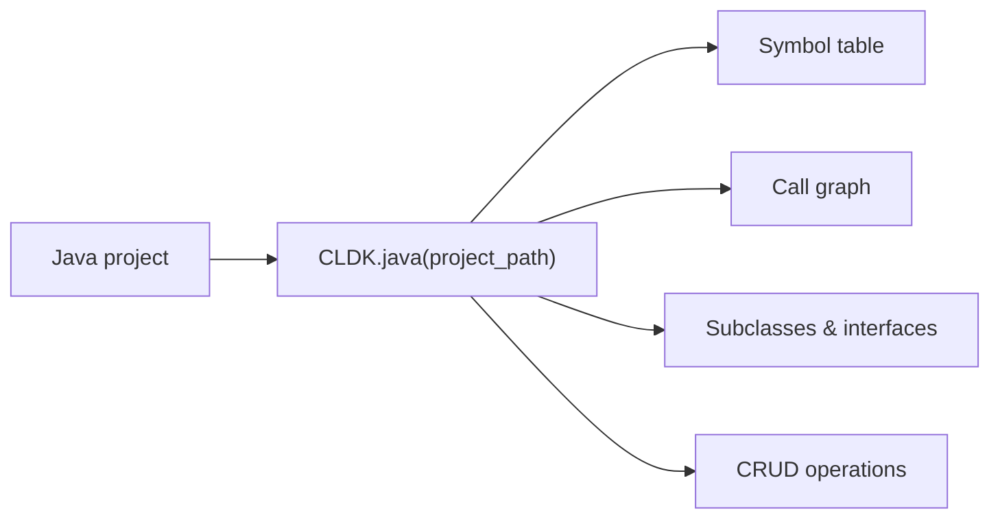

Java is CLDK's most complete analyzer. `JavaAnalysis` provides a typed symbol
table, call graph, subclass/interface queries, CRUD/data-access discovery, and
comments. [cocoa](/cocoa/) builds on these calls.

## Overview

`CLDK.java(project_path=...)` returns a `JavaAnalysis` object backed by
**CodeAnalyzer**, a WALA-based static analysis engine: symbol table, call graph,
subclass/interface relationships, CRUD operations, and comments. The backend
ships with the package; results are cached under `<project>/.codeanalyzer` (on by
default) and reused on later runs.



**Analysis levels.** The `analysis_level` argument controls how much is computed.
`AnalysisLevel.symbol_table` (the default) populates classes, methods, and
fields. `AnalysisLevel.call_graph` additionally builds the call graph that
`get_call_graph`, `get_callers`, and `get_callees` rely on. Set it when you need
call relationships:

```python
from cldk import CLDK
from cldk.analysis import AnalysisLevel

analysis = CLDK.java(
    project_path="commons-cli",
    analysis_level=AnalysisLevel.call_graph,
)
```

To run against a read-only Neo4j backend instead of the in-process analyzer, pass
a `Neo4jConnectionConfig` as `backend=`:

```python
from cldk import CLDK
from cldk.analysis import AnalysisLevel
from cldk.analysis.commons.backend_config import Neo4jConnectionConfig

analysis = CLDK.java(
    project_path="commons-cli",
    analysis_level=AnalysisLevel.call_graph,
    backend=Neo4jConnectionConfig(
        uri="bolt://localhost:7687",
        username="neo4j",
        password="password",
        database="neo4j",
        application_name="commons-cli",
    ),
)
```

## Worked example

Using [Apache Commons CLI](https://commons.apache.org/proper/commons-cli/) as the
sample project.

### Get the symbol table

```python
# Every file -> its compilation unit (classes, methods, fields).
symbol_table = analysis.get_symbol_table()
print(len(analysis.get_classes()), "classes")
# 23 classes
```

### Build a call graph

```python
import networkx as nx

cg = analysis.get_call_graph()      # networkx.DiGraph, caller -> callee
print(cg)                           # DiGraph with N nodes / M edges
```

### Find who calls a method

```python
callers = analysis.get_callers(
    target_class_name="org.apache.commons.cli.OptionBuilder",
    target_method_declaration="create(String)",
)
# -> dict of caller method signatures + call-site locations
```

See the [common tasks](/guides/common-tasks/) guide for more snippets, and the
[cocoa](/cocoa/), the Code Context Agent plugin, for exposing these calls to an agent.

## API reference

The full generated reference for the Java analysis API and data models
follows.

<!-- CLDK:API:START -->

<!-- AUTO-GENERATED by scripts/gen_api_docs.py, do not edit by hand. -->

[](https://github.com/codellm-devkit/python-sdk)

## Analysis

Java analysis facade module.

This module provides the `JavaAnalysis` class, which serves as the
primary high-level interface for performing static analysis on Java projects
and source files. It combines Tree-sitter-based parsing with the CodeAnalyzer
backend to provide comprehensive code analysis capabilities.

> **The analysis supports two modes of operation**
> - **Project mode**: Analyze an entire Java project directory, providing
>   access to cross-file analysis features like call graphs and class
>   hierarchies.
> - **Source code mode**: Analyze a single Java source code string, useful
>   for quick syntactic analysis without a full project structure.

> **Key capabilities include**
> - Symbol table extraction (classes, methods, fields, imports)
> - Call graph construction and traversal
> - Class hierarchy and inheritance analysis
> - Method parameter and signature analysis
> - Comment and Javadoc extraction
> - CRUD operation detection for enterprise applications
> - Entry point identification (main methods, REST endpoints)

> **The analysis is powered by**
> - **Tree-sitter**: Fast incremental parsing for syntactic analysis
> - **CodeAnalyzer**: Semantic analysis backend (JAR-based)

> **See Also**
> - `PythonAnalysis`: Python equivalent.
> - `JCodeanalyzer`: Backend implementation.

### `JavaAnalysis`

```python
class JavaAnalysis
```

Analysis facade for Java code.

This class provides a comprehensive interface for performing static analysis
on Java projects and source files. It combines Tree-sitter-based parsing for
syntactic analysis with the CodeAnalyzer backend for semantic analysis.

> **The facade supports two modes of operation**
> - **Project mode**: When initialized with ``project_dir``, provides full
>   analysis capabilities including cross-file call graphs, class hierarchies,
>   and symbol tables.
> - **Source code mode**: When initialized with ``source_code``, provides
>   syntactic analysis capabilities like parsing and AST extraction.

> **Key features**
> - Symbol table access with classes, methods, and fields
> - Call graph construction and traversal
> - Caller/callee relationship analysis
> - Class hierarchy and inheritance queries
> - Comment and Javadoc extraction
> - CRUD operation detection
> - Entry point identification

> **See Also**
> - `PythonAnalysis`: Python equivalent.
> - `JCodeanalyzer`: Backend.

#### Attributes

| Name | Type | Description |
| ---- | ---- | ----------- |
| `project_dir` | `` |  |
| `source_code` | `` |  |
| `analysis_level` | `` |  |
| `eager_analysis` | `` |  |
| `target_files` | `` |  |
| `backend_config` | `JavaBackend` |  |
| `treesitter_java` | `TreesitterJava` |  |
| `backend` | `JavaAnalysisBackend` |  |

#### Methods

##### `JavaAnalysis.get_imports`

```python
get_imports() -> List[str]
```

Return all import statements in the source code.

This method is intended to extract all import declarations from the
analyzed Java source code, including both single-type imports and
wildcard imports.

**Returns:**

- `List[str]`: A list of import statement strings, each representing a fully
- `List[str]`: qualified import (e.g., ``"java.util.List"``, ``"java.io.*"``).

**Raises:**

- `NotImplementedError`: This functionality is not yet implemented.

> **See Also**
> `get_symbol_table`: For accessing compilation units which
>     contain import information.

##### `JavaAnalysis.get_variables`

```python
get_variables(**kwargs) -> Dict
```

Return all variables discovered in the source code.

This method is intended to extract variable declarations from the
analyzed code, including local variables, fields, and parameters.

**Parameters:**

| Name | Type | Description |
| ---- | ---- | ----------- |
| `**kwargs` | `` | Implementation-specific filtering options. |

**Returns:**

- `Dict`: An implementation-defined view of variables discovered in the code.

**Raises:**

- `NotImplementedError`: This functionality is not yet implemented.

> **See Also**
> `get_fields`: For class-level field access (implemented).

##### `JavaAnalysis.get_service_entry_point_classes`

```python
get_service_entry_point_classes(**kwargs) -> Dict[str, JType]
```

Return all service entry-point classes.

This method is intended to identify classes that serve as entry points
for services, such as JAX-RS resources, Spring controllers, or servlet
classes.

**Parameters:**

| Name | Type | Description |
| ---- | ---- | ----------- |
| `**kwargs` | `` | Framework-specific filtering options (e.g., annotation filters for ``@RestController``, ``@Path``, etc.). |

**Returns:**

- `Dict[str, JType]`: A dictionary mapping qualified class names to `JType` objects
- `Dict[str, JType]`: for classes identified as service entry points.

**Raises:**

- `NotImplementedError`: This functionality is not yet implemented.

> **See Also**
> `get_entry_point_classes`: For general entry point detection.

##### `JavaAnalysis.get_service_entry_point_methods`

```python
get_service_entry_point_methods(**kwargs) -> Dict[str, Dict[str, JCallable]]
```

Return all service entry-point methods.

This method is intended to identify methods that serve as entry points
for services, such as REST endpoint handlers, servlet methods, or
message handlers.

**Parameters:**

| Name | Type | Description |
| ---- | ---- | ----------- |
| `**kwargs` | `` | Framework-specific filtering options (e.g., HTTP method filters, annotation filters for ``@GET``, ``@POST``, etc.). |

**Returns:**

- `Dict[str, Dict[str, JCallable]]`: A nested dictionary mapping class names to method signatures to
- `Dict[str, Dict[str, JCallable]]`: class:`JCallable` objects for methods identified as service
- `Dict[str, Dict[str, JCallable]]`: entry points.

**Raises:**

- `NotImplementedError`: This functionality is not yet implemented.

> **See Also**
> `get_entry_point_methods`: For general entry point detection.

##### `JavaAnalysis.get_application_view`

```python
get_application_view() -> JApplication
```

Return the complete analyzed application model.

Returns the top-level `JApplication` object that represents
the entire analyzed Java project. This object contains all compilation
units, classes, methods, and their relationships discovered during
analysis.

**Returns:**

- `JApplication`: class:`~cldk.models.java.JApplication` object containing: - All compilation units (``symbol_table`` attribute) - Project-level metadata - Aggregated statistics about the codebase

**Raises:**

- `NotImplementedError`: If called in single-file mode (``source_code`` was provided instead of ``project_dir``).

> **See Also**
> `get_symbol_table`: For direct access to the symbol table.
> `get_compilation_units`: For a list of compilation units.

##### `JavaAnalysis.get_symbol_table`

```python
get_symbol_table() -> Dict[str, JCompilationUnit]
```

Return the symbol table mapping file paths to compilation units.

Returns a dictionary that maps each analyzed Java file's path to its
corresponding `JCompilationUnit` object. This is the primary
data structure for accessing analyzed code structure.

**Returns:**

- `Dict[str, JCompilationUnit]`: A dictionary where keys are file paths (as strings) and values are
- `Dict[str, JCompilationUnit]`: class:`~cldk.models.java.JCompilationUnit` objects containing: - Package declaration - Import statements - Type declarations (classes, interfaces, enums) - Method and field definitions

> **See Also**
> `get_compilation_units`: For a list without file paths.
> `get_java_compilation_unit`: For direct lookup by path.

##### `JavaAnalysis.get_compilation_units`

```python
get_compilation_units() -> List[JCompilationUnit]
```

Return all compilation units in the project as a list.

Returns all `JCompilationUnit` objects discovered during
analysis as a flat list. Each compilation unit represents a single
Java source file.

**Returns:**

- `List[JCompilationUnit]`: A list of `JCompilationUnit` objects,
- `List[JCompilationUnit]`: one for each Java source file analyzed in the project.

> **See Also**
> `get_symbol_table`: For file-path-keyed access.

##### `JavaAnalysis.get_class_hierarchy`

```python
get_class_hierarchy() -> nx.DiGraph
```

Return the complete class inheritance hierarchy as a graph.

This method is intended to return a NetworkX directed graph representing
the full class inheritance relationships in the project, including
extends and implements relationships.

**Returns:**

- `nx.DiGraph`: Would return a ``networkx.DiGraph`` with classes as nodes and
- `nx.DiGraph`: edges representing inheritance (subclass -> superclass).

**Raises:**

- `NotImplementedError`: This functionality is not yet implemented.

> **See Also**
> `get_sub_classes`: For finding subclasses of a specific class.
> `get_extended_classes`: For finding superclasses.
> `get_implemented_interfaces`: For interface implementations.

##### `JavaAnalysis.is_parsable`

```python
is_parsable(source_code: str) -> bool
```

Check if the given source code is valid Java syntax.

Uses the Tree-sitter Java parser to attempt parsing the source code.
This is useful for validating code snippets before further processing
or for filtering out malformed code.

**Parameters:**

| Name | Type | Description |
| ---- | ---- | ----------- |
| `source_code` | `str` | A string containing Java source code to validate. Can be a complete compilation unit, a class definition, or any syntactically valid Java code fragment. |

**Returns:**

- `bool`: ``True`` if the source code parses without syntax errors,
- `bool`: ``False`` otherwise. Note that this only checks syntactic validity,
- `bool`: not semantic correctness (e.g., type errors won't be caught).

> **See Also**
> `get_raw_ast`: To obtain the full AST for valid code.

##### `JavaAnalysis.get_raw_ast`

```python
get_raw_ast(source_code: str) -> Tree
```

Parse source code and return the Tree-sitter AST.

Parses the provided Java source code using Tree-sitter and returns
the resulting abstract syntax tree. The AST can be traversed to
extract syntactic information about the code structure.

**Parameters:**

| Name | Type | Description |
| ---- | ---- | ----------- |
| `source_code` | `str` | A string containing Java source code to parse. Should be syntactically valid Java code. |

**Returns:**

- `Tree`: A Tree-sitter ``Tree`` object representing the parsed AST. The tree
- `Tree`: contains nodes representing all syntactic elements of the code,
- `Tree`: including classes, methods, statements, and expressions.

> **Note**
> If the source code contains syntax errors, Tree-sitter will still
> return a tree but with ERROR nodes at the locations of parse errors.
> Use `is_parsable` to check for valid syntax first.

> **See Also**
> `is_parsable`: To validate syntax before parsing.

##### `JavaAnalysis.get_call_graph`

```python
get_call_graph() -> nx.DiGraph
```

Return the project call graph as a NetworkX directed graph.

Constructs and returns a directed graph representing method call
relationships across the entire project. Each node represents a
method, and each edge represents a call from one method to another.

The call graph requires ``analysis_level`` to be set to ``"call_graph"``
during initialization for accurate results.

**Returns:**

- `nx.DiGraph`: A ``networkx.DiGraph`` where: - Nodes represent methods with attributes containing method metadata (class name, signature, etc.) - Edges represent call relationships, directed from caller to callee - Edge attributes may include call site information

> **See Also**
> `get_callers`: For finding callers of a specific method.
> `get_callees`: For finding callees of a specific method.
> `get_class_call_graph`: For class-scoped call graphs.

##### `JavaAnalysis.get_call_graph_json`

```python
get_call_graph_json() -> str
```

Return the complete analysis results serialized as JSON.

Serializes the full analysis results, including the call graph and
symbol table, to a JSON string. This is useful for persisting
analysis results, sharing with other tools, or debugging.

**Returns:**

- `str`: A JSON-formatted string containing the complete analysis data,
- `str`: including compilation units, classes, methods, and call
- `str`: relationships.

**Raises:**

- `NotImplementedError`: If called in single-file mode (``source_code`` was provided instead of ``project_dir``).

> **See Also**
> `get_call_graph`: For the graph object directly.

##### `JavaAnalysis.get_callers`

```python
get_callers(target_class_name: str, target_method_declaration: str, using_symbol_table: bool = False) -> Dict
```

Return all methods that call the specified target method.

Finds and returns information about all methods that invoke the
specified target method. This is useful for impact analysis and
understanding how a method is used throughout the codebase.

**Parameters:**

| Name | Type | Description |
| ---- | ---- | ----------- |
| `target_class_name` | `str` | The fully qualified name of the class containing the target method (e.g., ``"com.example.service.UserService"``). |
| `target_method_declaration` | `str` | The method signature to find callers for (e.g., ``"getUser(String)"`` or ``"process())"``). |
| `using_symbol_table` | `bool` | If ``True``, uses the symbol table for resolution (faster but may be less accurate). If ``False`` (default), uses the full call graph analysis. |

**Returns:**

- `Dict`: A dictionary containing information about all callers, including: - Caller method signatures - Call site locations (file and line) - Caller class information

**Raises:**

- `NotImplementedError`: If called in single-file mode (``source_code`` was provided instead of ``project_dir``).

> **See Also**
> `get_callees`: For the reverse direction (what a method calls).
> `get_call_graph`: For the complete call relationship graph.

##### `JavaAnalysis.get_callees`

```python
get_callees(source_class_name: str, source_method_declaration: str, using_symbol_table: bool = False) -> Dict
```

Return all methods called by the specified source method.

Finds and returns information about all methods that are invoked by
the specified source method. This is useful for understanding method
dependencies and tracing execution paths.

**Parameters:**

| Name | Type | Description |
| ---- | ---- | ----------- |
| `source_class_name` | `str` | The fully qualified name of the class containing the source method (e.g., ``"com.example.service.OrderService"``). |
| `source_method_declaration` | `str` | The method signature to find callees for (e.g., ``"processOrder(Order)"``). |
| `using_symbol_table` | `bool` | If ``True``, uses the symbol table for resolution (faster but may be less accurate). If ``False`` (default), uses the full call graph analysis. |

**Returns:**

- `Dict`: A dictionary containing information about all callees, including: - Callee method signatures - Target class information - Call site locations within the source method

**Raises:**

- `NotImplementedError`: If called in single-file mode (``source_code`` was provided instead of ``project_dir``).

> **See Also**
> `get_callers`: For the reverse direction (who calls a method).
> `get_call_graph`: For the complete call relationship graph.

##### `JavaAnalysis.get_methods`

```python
get_methods() -> Dict[str, Dict[str, JCallable]]
```

Return all methods in the project grouped by class.

Retrieves all methods from all classes in the analyzed project,
organized in a nested dictionary structure by qualified class name
and then method signature.

**Returns:**

- `Dict[str, Dict[str, JCallable]]`: A nested dictionary with structure:: { "com.example.ClassName": { "methodName(ParamType)": JCallable, "anotherMethod()": JCallable, ... }, ... }
- `Dict[str, Dict[str, JCallable]]`: class:`~cldk.models.java.JCallable` contains the method's
- `Dict[str, Dict[str, JCallable]]`: signature, parameters, return type, body, annotations, and other
- `Dict[str, Dict[str, JCallable]]`: metadata.

> **See Also**
> `get_methods_in_class`: For methods of a specific class.
> `get_method`: For a single method by name.

##### `JavaAnalysis.get_classes`

```python
get_classes() -> Dict[str, JType]
```

Return all classes in the project.

Retrieves all type declarations (classes, interfaces, enums, records)
discovered during analysis, organized by their fully qualified names.

**Returns:**

- `Dict[str, JType]`: A dictionary mapping fully qualified class names (strings) to
- `Dict[str, JType]`: class:`~cldk.models.java.JType` objects containing class metadata,
- `Dict[str, JType]`: methods, fields, and inheritance information.

> **See Also**
> `get_class`: For a single class by name.
> `get_classes_by_criteria`: For filtered class retrieval.

##### `JavaAnalysis.get_classes_by_criteria`

```python
get_classes_by_criteria(inclusions: List[str] | None = None, exclusions: List[str] | None = None) -> Dict[str, JType]
```

Return classes matching inclusion/exclusion filter criteria.

Filters the project's classes based on substring matching against
their qualified names. Classes are included if their name contains
any inclusion substring AND does not contain any exclusion substring.

**Parameters:**

| Name | Type | Description |
| ---- | ---- | ----------- |
| `inclusions` | `List[str] \| None` | List of substrings that class names must contain to be included. If ``None`` or empty, no inclusion filtering is applied (effectively includes nothing unless you have at least one inclusion pattern). |
| `exclusions` | `List[str] \| None` | List of substrings that class names must NOT contain. Classes matching any exclusion pattern are filtered out, even if they match an inclusion pattern. |

**Returns:**

- `Dict[str, JType]`: A dictionary mapping qualified class names to
- `Dict[str, JType]`: class:`~cldk.models.java.JType` objects for classes matching
- `Dict[str, JType]`: the criteria.

> **Note**
> The filtering uses substring matching (``in`` operator), not
> regular expressions or glob patterns.

> **See Also**
> `get_classes`: For all classes without filtering.

##### `JavaAnalysis.get_class`

```python
get_class(qualified_class_name: str) -> JType
```

Return a specific class by its qualified name.

Retrieves detailed information about a single class, including its
methods, fields, annotations, modifiers, and inheritance information.

**Parameters:**

| Name | Type | Description |
| ---- | ---- | ----------- |
| `qualified_class_name` | `str` | The fully qualified name of the class (e.g., ``"com.example.service.UserService"``). |

**Returns:**

- `JType`: class:`~cldk.models.java.JType` object containing all analyzed
- `JType`: information about the class. Returns ``None`` if the class is not
- `JType`: found in the analyzed project.

> **See Also**
> `get_classes`: For all classes in the project.
> `get_java_file`: To find which file contains a class.

##### `JavaAnalysis.get_method`

```python
get_method(qualified_class_name: str, qualified_method_name: str) -> JCallable
```

Return a specific method by class and method signature.

Retrieves detailed information about a single method, including its
signature, parameters, return type, annotations, body, and metrics.

**Parameters:**

| Name | Type | Description |
| ---- | ---- | ----------- |
| `qualified_class_name` | `str` | The fully qualified name of the class containing the method (e.g., ``"com.example.service.UserService"``). |
| `qualified_method_name` | `str` | The method signature to retrieve (e.g., ``"getUser(String)"`` or ``"process())"``). |

**Returns:**

- `JCallable`: class:`~cldk.models.java.JCallable` object containing all
- `JCallable`: analyzed information about the method. Returns ``None`` if the
- `JCallable`: method is not found.

> **See Also**
> `get_methods_in_class`: For all methods of a class.
> `get_method_parameters`: For just the parameter list.

##### `JavaAnalysis.get_method_parameters`

```python
get_method_parameters(qualified_class_name: str, qualified_method_name: str) -> List[str]
```

Return the parameter types for a specific method.

Retrieves the list of parameter type names defined in the method
signature.

**Parameters:**

| Name | Type | Description |
| ---- | ---- | ----------- |
| `qualified_class_name` | `str` | The fully qualified name of the class containing the method. |
| `qualified_method_name` | `str` | The method signature to get parameters for. |

**Returns:**

- `List[str]`: A list of parameter type names as strings, in the order they
- `List[str]`: appear in the method signature. Returns an empty list if the
- `List[str]`: method is not found or has no parameters.

> **See Also**
> `get_method`: For complete method information.

##### `JavaAnalysis.get_java_file`

```python
get_java_file(qualified_class_name: str) -> str
```

Return the file path containing a class with the given name.

Given a qualified class name, returns the file path where that class
is defined. This is useful for navigating from class references back
to source files.

**Parameters:**

| Name | Type | Description |
| ---- | ---- | ----------- |
| `qualified_class_name` | `str` | The fully qualified name of the class to locate (e.g., ``"com.example.service.UserService"``). |

**Returns:**

- `str`: The file path (as a string) containing the class definition.
- `str`: Returns ``None`` if no class with the given name is found.

> **See Also**
> `get_class`: To get the full class object by name.
> `get_java_compilation_unit`: To get the compilation unit.

##### `JavaAnalysis.get_java_compilation_unit`

```python
get_java_compilation_unit(file_path: str) -> JCompilationUnit
```

Return the compilation unit for a specific file path.

Retrieves the `JCompilationUnit` object corresponding to a
specific Java source file in the analyzed project.

**Parameters:**

| Name | Type | Description |
| ---- | ---- | ----------- |
| `file_path` | `str` | The path to the Java file, which should be an absolute path or a path relative to the project root. |

**Returns:**

- `JCompilationUnit`: class:`~cldk.models.java.JCompilationUnit` for the file,
- `JCompilationUnit`: containing all analyzed information about package, imports,
- `JCompilationUnit`: and type declarations. Returns ``None`` if the file is not
- `JCompilationUnit`: part of the analyzed project.

> **See Also**
> `get_symbol_table`: For bulk access to all compilation units.
> `get_java_file`: For reverse lookup (class to file).

##### `JavaAnalysis.get_methods_in_class`

```python
get_methods_in_class(qualified_class_name: str) -> Dict[str, JCallable]
```

Return all methods defined in a specific class.

Retrieves all methods belonging to the specified class, including
instance methods, static methods, and constructors.

**Parameters:**

| Name | Type | Description |
| ---- | ---- | ----------- |
| `qualified_class_name` | `str` | The fully qualified name of the class (e.g., ``"com.example.service.UserService"``). |

**Returns:**

- `Dict[str, JCallable]`: A dictionary mapping method signatures (strings) to
- `Dict[str, JCallable]`: class:`~cldk.models.java.JCallable` objects. Returns an empty
- `Dict[str, JCallable]`: dictionary if the class is not found or has no methods.

> **See Also**
> `get_method`: For a single method by signature.
> `get_constructors`: For constructors specifically.

##### `JavaAnalysis.get_constructors`

```python
get_constructors(qualified_class_name: str) -> Dict[str, JCallable]
```

Return all constructors of a specific class.

Retrieves all constructor methods defined in the specified class.
Constructors are methods with the same name as the class.

**Parameters:**

| Name | Type | Description |
| ---- | ---- | ----------- |
| `qualified_class_name` | `str` | The fully qualified name of the class (e.g., ``"com.example.model.User"``). |

**Returns:**

- `Dict[str, JCallable]`: A dictionary mapping constructor signatures to
- `Dict[str, JCallable]`: class:`~cldk.models.java.JCallable` objects. Returns an empty
- `Dict[str, JCallable]`: dictionary if the class has no explicit constructors.

> **See Also**
> `get_methods_in_class`: For all methods including constructors.

##### `JavaAnalysis.get_fields`

```python
get_fields(qualified_class_name: str) -> List[JField]
```

Return all fields (member variables) of a specific class.

Retrieves all field declarations in the specified class, including
instance fields, static fields, and constants.

**Parameters:**

| Name | Type | Description |
| ---- | ---- | ----------- |
| `qualified_class_name` | `str` | The fully qualified name of the class (e.g., ``"com.example.model.User"``). |

**Returns:**

- `List[JField]`: A list of `JField` objects, each
- `List[JField]`: containing information about a field's name, type, modifiers,
- `List[JField]`: and annotations.

> **See Also**
> `get_class`: For complete class information.

##### `JavaAnalysis.get_nested_classes`

```python
get_nested_classes(qualified_class_name: str) -> List[JType]
```

Return all nested (inner) classes of a specific class.

Retrieves all classes that are defined inside the specified class,
including static nested classes and inner classes.

**Parameters:**

| Name | Type | Description |
| ---- | ---- | ----------- |
| `qualified_class_name` | `str` | The fully qualified name of the outer class (e.g., ``"com.example.model.Container"``). |

**Returns:**

- `List[JType]`: A list of `JType` objects for each
- `List[JType]`: nested class. Returns an empty list if no nested classes exist.

> **See Also**
> `get_class`: For the outer class information.

##### `JavaAnalysis.get_sub_classes`

```python
get_sub_classes(qualified_class_name: str) -> Dict[str, JType]
```

Return all classes that extend the specified class.

Finds all classes in the project that directly extend the specified
base class. This is useful for understanding class hierarchies and
finding implementations of abstract classes.

**Parameters:**

| Name | Type | Description |
| ---- | ---- | ----------- |
| `qualified_class_name` | `str` | The fully qualified name of the base class to find subclasses of (e.g., ``"com.example.base.BaseService"``). |

**Returns:**

- `Dict[str, JType]`: A dictionary mapping qualified class names to
- `Dict[str, JType]`: class:`~cldk.models.java.JType` objects for all classes that
- `Dict[str, JType]`: extend the specified class.

> **See Also**
> `get_extended_classes`: For the reverse (what a class extends).
> `get_class_hierarchy`: For the full inheritance graph.

##### `JavaAnalysis.get_extended_classes`

```python
get_extended_classes(qualified_class_name: str) -> List[str]
```

Return the superclass(es) that a class extends.

Retrieves the parent class for the specified class. In Java, a class
can extend at most one other class (single inheritance).

**Parameters:**

| Name | Type | Description |
| ---- | ---- | ----------- |
| `qualified_class_name` | `str` | The fully qualified name of the class to get the superclass for. |

**Returns:**

- `List[str]`: A list of superclass names (typically containing zero or one
- `List[str]`: element, since Java has single inheritance). Returns empty list
- `List[str]`: if the class directly extends Object or is not found.

> **See Also**
> `get_sub_classes`: For finding classes that extend this class.
> `get_implemented_interfaces`: For interface implementations.

##### `JavaAnalysis.get_implemented_interfaces`

```python
get_implemented_interfaces(qualified_class_name: str) -> List[str]
```

Return all interfaces implemented by a class.

Retrieves the list of interfaces that the specified class implements.
A Java class can implement multiple interfaces.

**Parameters:**

| Name | Type | Description |
| ---- | ---- | ----------- |
| `qualified_class_name` | `str` | The fully qualified name of the class to get implemented interfaces for. |

**Returns:**

- `List[str]`: A list of interface names (as strings) that the class implements.
- `List[str]`: Returns empty list if the class implements no interfaces.

> **See Also**
> `get_extended_classes`: For class inheritance.

##### `JavaAnalysis.get_class_call_graph`

```python
get_class_call_graph(qualified_class_name: str, method_signature: str | None = None, using_symbol_table: bool = False) -> List[Tuple[JMethodDetail, JMethodDetail]]
```

Return call graph edges reachable from a class or method.

Extracts a subset of the call graph containing only edges reachable
from the specified class (and optionally a specific method within
that class). This is useful for understanding the call structure
of a specific component without the noise of the full project graph.

**Parameters:**

| Name | Type | Description |
| ---- | ---- | ----------- |
| `qualified_class_name` | `str` | The fully qualified name of the class to start traversal from (e.g., ``"com.example.service.UserService"``). |
| `method_signature` | `str \| None` | Optional method signature to further constrain the starting point. If provided, only edges reachable from that specific method are included. If ``None``, edges from all methods in the class are included. |
| `using_symbol_table` | `bool` | If ``True``, uses the symbol table for faster but potentially less accurate resolution. If ``False`` (default), uses the full call graph analysis. |

**Returns:**

- `List[Tuple[JMethodDetail, JMethodDetail]]`: A list of tuples ``(caller, callee)`` where each element is a
- `List[Tuple[JMethodDetail, JMethodDetail]]`: class:`~cldk.models.java.JMethodDetail` object representing
- `List[Tuple[JMethodDetail, JMethodDetail]]`: a method in the call relationship.

> **See Also**
> `get_call_graph`: For the complete project call graph.
> `get_callees`: For direct callees of a single method.

##### `JavaAnalysis.get_entry_point_classes`

```python
get_entry_point_classes() -> Dict[str, JType]
```

Return all classes identified as application entry points.

Identifies classes that serve as entry points for the application,
such as classes containing main methods, servlet classes, or
framework-specific entry point classes.

**Returns:**

- `Dict[str, JType]`: A dictionary mapping qualified class names to
- `Dict[str, JType]`: class:`~cldk.models.java.JType` objects for classes identified
- `Dict[str, JType]`: as entry points.

> **See Also**
> `get_entry_point_methods`: For entry point methods.

##### `JavaAnalysis.get_entry_point_methods`

```python
get_entry_point_methods() -> Dict[str, Dict[str, JCallable]]
```

Return all methods identified as application entry points.

Identifies methods that serve as entry points for the application,
such as main methods, servlet doGet/doPost methods, or framework-
specific handler methods.

**Returns:**

- `Dict[str, Dict[str, JCallable]]`: A nested dictionary mapping class names to method signatures
- `Dict[str, Dict[str, JCallable]]`: class:`~cldk.models.java.JCallable` objects for methods
- `Dict[str, Dict[str, JCallable]]`: identified as entry points.

> **See Also**
> `get_entry_point_classes`: For entry point classes.

##### `JavaAnalysis.remove_all_comments`

```python
remove_all_comments() -> str
```

Remove all comments from the source code.

Strips all single-line (``//``) and multi-line (``/* */``) comments
from the source code, including Javadoc comments. This is useful
for code analysis that should ignore comment content.

**Returns:**

- `str`: A string containing the source code with all comments removed.
- `str`: Whitespace where comments were removed may be preserved or
- `str`: collapsed depending on the implementation.

> **Note**
> This method operates on the ``source_code`` provided during
> initialization. It requires single-file mode.

> **See Also**
> `get_all_comments`: For extracting comments instead.

##### `JavaAnalysis.get_methods_with_annotations`

```python
get_methods_with_annotations(annotations: List[str]) -> Dict[str, List[Dict]]
```

Return methods decorated with specific annotations.

This method is intended to find all methods that have any of the
specified annotations, such as ``@Override``, ``@Test``,
``@RequestMapping``, or custom annotations.

**Parameters:**

| Name | Type | Description |
| ---- | ---- | ----------- |
| `annotations` | `List[str]` | List of annotation names to search for (e.g., ``["Override", "Test", "RequestMapping"]``). The ``@`` symbol should not be included. |

**Returns:**

- `Dict[str, List[Dict]]`: Would return a dictionary mapping annotation names to lists of
- `Dict[str, List[Dict]]`: method information dictionaries containing method details and
- `Dict[str, List[Dict]]`: bodies.

**Raises:**

- `NotImplementedError`: This functionality is not yet implemented.

> **See Also**
> `get_test_methods`: For finding test methods specifically.

##### `JavaAnalysis.get_test_methods`

```python
get_test_methods() -> Dict[str, str]
```

Return methods identified as test methods.

Finds all test methods in the source code by looking for methods
annotated with common test framework annotations (e.g., ``@Test``
from JUnit).

**Returns:**

- `Dict[str, str]`: A dictionary mapping test method signatures to their source
- `Dict[str, str]`: code bodies.

> **Note**
> This method operates on the ``source_code`` provided during
> initialization. It requires single-file mode.

> **See Also**
> `get_methods_with_annotations`: For finding methods with
>     any annotation.

##### `JavaAnalysis.get_calling_lines`

```python
get_calling_lines(target_method_name: str) -> List[int]
```

Return line numbers where a method is called.

This method is intended to find all line numbers in the source code
where the specified method is invoked.

**Parameters:**

| Name | Type | Description |
| ---- | ---- | ----------- |
| `target_method_name` | `str` | The name of the method to find calls to. |

**Returns:**

- `List[int]`: Would return a list of line numbers (integers) where calls occur.

**Raises:**

- `NotImplementedError`: This functionality is not yet implemented.

> **See Also**
> `get_callers`: For finding caller methods instead of lines.

##### `JavaAnalysis.get_call_targets`

```python
get_call_targets(declared_methods: dict) -> Set[str]
```

Return call targets using simple name resolution.

This method is intended to find all methods that could be called
based on simple name matching in the AST, without full semantic
analysis.

**Parameters:**

| Name | Type | Description |
| ---- | ---- | ----------- |
| `declared_methods` | `dict` | Dictionary of declared method names and signatures to match against. |

**Returns:**

- `Set[str]`: Would return a set of method names that are call targets.

**Raises:**

- `NotImplementedError`: This functionality is not yet implemented.

> **See Also**
> `get_call_graph`: For full semantic call resolution.

##### `JavaAnalysis.get_all_crud_operations`

```python
get_all_crud_operations() -> List[Dict[str, Union[JType, JCallable, List[JCRUDOperation]]]]
```

Return all CRUD (Create, Read, Update, Delete) operations.

Identifies and returns all database operations in the project by
analyzing JPA/Hibernate annotations, repository patterns, and SQL
statements. This is useful for understanding data access patterns
in enterprise applications.

**Returns:**

- `List[Dict[str, Union[JType, JCallable, List[JCRUDOperation]]]]`: A list of dictionaries, each containing: - ``"class"``: The `JType` containing the operation - ``"method"``: The `JCallable` performing the operation - ``"operations"``: List of `JCRUDOperation` objects

> **See Also**
> `get_all_create_operations`: For create operations only.
> `get_all_read_operations`: For read operations only.
> `get_all_update_operations`: For update operations only.
> `get_all_delete_operations`: For delete operations only.

##### `JavaAnalysis.get_all_create_operations`

```python
get_all_create_operations() -> List[Dict[str, Union[JType, JCallable, List[JCRUDOperation]]]]
```

Return all Create operations from CRUD analysis.

Identifies database insert/create operations by analyzing
``save()``, ``persist()``, ``insert()``, and similar patterns.

**Returns:**

- `List[Dict[str, Union[JType, JCallable, List[JCRUDOperation]]]]`: A list of dictionaries with class, method, and operation details.
- `List[Dict[str, Union[JType, JCallable, List[JCRUDOperation]]]]`: Same structure as `get_all_crud_operations`.

> **See Also**
> `get_all_crud_operations`: For all CRUD operations.

##### `JavaAnalysis.get_all_read_operations`

```python
get_all_read_operations() -> List[Dict[str, Union[JType, JCallable, List[JCRUDOperation]]]]
```

Return all Read operations from CRUD analysis.

Identifies database read/select operations by analyzing
``find()``, ``get()``, ``select()``, and similar patterns.

**Returns:**

- `List[Dict[str, Union[JType, JCallable, List[JCRUDOperation]]]]`: A list of dictionaries with class, method, and operation details.
- `List[Dict[str, Union[JType, JCallable, List[JCRUDOperation]]]]`: Same structure as `get_all_crud_operations`.

> **See Also**
> `get_all_crud_operations`: For all CRUD operations.

##### `JavaAnalysis.get_all_update_operations`

```python
get_all_update_operations() -> List[Dict[str, Union[JType, JCallable, List[JCRUDOperation]]]]
```

Return all Update operations from CRUD analysis.

Identifies database update operations by analyzing
``update()``, ``merge()``, ``set()``, and similar patterns.

**Returns:**

- `List[Dict[str, Union[JType, JCallable, List[JCRUDOperation]]]]`: A list of dictionaries with class, method, and operation details.
- `List[Dict[str, Union[JType, JCallable, List[JCRUDOperation]]]]`: Same structure as `get_all_crud_operations`.

> **See Also**
> `get_all_crud_operations`: For all CRUD operations.

##### `JavaAnalysis.get_all_delete_operations`

```python
get_all_delete_operations() -> List[Dict[str, Union[JType, JCallable, List[JCRUDOperation]]]]
```

Return all Delete operations from CRUD analysis.

Identifies database delete operations by analyzing
``delete()``, ``remove()``, and similar patterns.

**Returns:**

- `List[Dict[str, Union[JType, JCallable, List[JCRUDOperation]]]]`: A list of dictionaries with class, method, and operation details.
- `List[Dict[str, Union[JType, JCallable, List[JCRUDOperation]]]]`: Same structure as `get_all_crud_operations`.

> **See Also**
> `get_all_crud_operations`: For all CRUD operations.

##### `JavaAnalysis.get_comments_in_a_method`

```python
get_comments_in_a_method(qualified_class_name: str, method_signature: str) -> List[JComment]
```

Return all comments contained within a specific method.

Retrieves all comment nodes (single-line, multi-line, and Javadoc)
that appear within the body of the specified method.

**Parameters:**

| Name | Type | Description |
| ---- | ---- | ----------- |
| `qualified_class_name` | `str` | The fully qualified name of the class containing the method. |
| `method_signature` | `str` | The method signature to get comments from. |

**Returns:**

- `List[JComment]`: A list of `JComment` objects found
- `List[JComment]`: within the method body. Returns empty list if method not found.

> **See Also**
> `get_comments_in_a_class`: For class-level comments.
> `get_all_comments`: For all comments in the project.

##### `JavaAnalysis.get_comments_in_a_class`

```python
get_comments_in_a_class(qualified_class_name: str) -> List[JComment]
```

Return all comments contained within a specific class.

Retrieves all comment nodes that appear within the class body,
including Javadoc comments, method-level comments, and inline
comments.

**Parameters:**

| Name | Type | Description |
| ---- | ---- | ----------- |
| `qualified_class_name` | `str` | The fully qualified name of the class. |

**Returns:**

- `List[JComment]`: A list of `JComment` objects found
- `List[JComment]`: within the class. Returns empty list if class not found.

> **See Also**
> `get_comments_in_a_method`: For method-specific comments.
> `get_comment_in_file`: For file-level comments.

##### `JavaAnalysis.get_comment_in_file`

```python
get_comment_in_file(file_path: str) -> List[JComment]
```

Return all comments in a specific file.

Retrieves all comment nodes from the specified source file,
including file-level comments, class comments, and method comments.

**Parameters:**

| Name | Type | Description |
| ---- | ---- | ----------- |
| `file_path` | `str` | The path to the Java file. |

**Returns:**

- `List[JComment]`: A list of `JComment` objects found
- `List[JComment]`: in the file. Returns empty list if file not found.

> **See Also**
> `get_all_comments`: For comments across all files.

##### `JavaAnalysis.get_all_comments`

```python
get_all_comments() -> Dict[str, List[JComment]]
```

Return all comments in the project grouped by file.

Retrieves all comment nodes from all analyzed files, organized
by file path.

**Returns:**

- `Dict[str, List[JComment]]`: A dictionary mapping file paths (strings) to lists of
- `Dict[str, List[JComment]]`: class:`~cldk.models.java.JComment` objects.

> **See Also**
> `get_all_docstrings`: For Javadoc comments only.

##### `JavaAnalysis.get_all_docstrings`

```python
get_all_docstrings() -> Dict[str, List[JComment]]
```

Return all Javadoc comments in the project grouped by file.

Retrieves only Javadoc-style comments (``/** ... */``) from all
analyzed files. These typically document classes, methods, and
fields.

**Returns:**

- `Dict[str, List[JComment]]`: A dictionary mapping file paths (strings) to lists of
- `Dict[str, List[JComment]]`: class:`~cldk.models.java.JComment` objects where
- `Dict[str, List[JComment]]`: ``is_javadoc`` is ``True``.

> **See Also**
> `get_all_comments`: For all comment types.

## Schema

Java data models module.

This module defines Pydantic model classes for representing Java code elements
extracted during static analysis. These models form the core data structures
returned by `JavaAnalysis` and related classes.

> **The models represent**
> - **Types**: Classes, interfaces, enums, records (`JType`)
> - **Callables**: Methods, constructors (`JCallable`)
> - **Fields**: Class and instance variables (`JField`)
> - **Comments**: Javadoc and inline comments (`JComment`)
> - **Imports**: Import declarations (`JImport`)
> - **CRUD Operations**: Database operations (`JCRUDOperation`)
> - **Call Information**: Method call details (`JMethodDetail`, `JCallSite`)

All models inherit from Pydantic's `BaseModel`, providing:
    - Automatic validation of field types
    - JSON serialization/deserialization
    - Schema generation for documentation

> **See Also**
> - `JavaAnalysis`: Analysis facade using these models.
> - `enums`: Related enumeration types.

### `JComment`

```python
class JComment(BaseModel)
```

Represents a comment in Java code.

#### Attributes

| Name | Type | Description |
| ---- | ---- | ----------- |
| `content` | `str \| None` |  |
| `start_line` | `int` |  |
| `end_line` | `int` |  |
| `start_column` | `int` |  |
| `end_column` | `int` |  |
| `is_javadoc` | `bool` |  |

### `JImport`

```python
class JImport(BaseModel)
```

Represents a Java import declaration.

#### Attributes

| Name | Type | Description |
| ---- | ---- | ----------- |
| `path` | `str` |  |
| `is_static` | `bool` |  |
| `is_wildcard` | `bool` |  |

### `JRecordComponent`

```python
class JRecordComponent(BaseModel)
```

Represents a component of a Java record.

#### Attributes

| Name | Type | Description |
| ---- | ---- | ----------- |
| `comment` | `JComment \| None` |  |
| `name` | `str` |  |
| `type` | `str` |  |
| `modifiers` | `List[str]` |  |
| `annotations` | `List[str]` |  |
| `default_value` | `Union[str, None, Any]` |  |
| `is_var_args` | `bool` |  |

### `JField`

```python
class JField(BaseModel)
```

Represents a field in a Java class or interface.

#### Attributes

| Name | Type | Description |
| ---- | ---- | ----------- |
| `comment` | `JComment \| None` |  |
| `type` | `str` |  |
| `start_line` | `int` |  |
| `end_line` | `int` |  |
| `variables` | `List[str]` |  |
| `modifiers` | `List[str]` |  |
| `annotations` | `List[str]` |  |
| `variable_initializers` | `Dict[str, str] \| None` |  |

### `JCallableParameter`

```python
class JCallableParameter(BaseModel)
```

Represents a parameter of a Java callable.

#### Attributes

| Name | Type | Description |
| ---- | ---- | ----------- |
| `name` | `str \| None` |  |
| `type` | `str` |  |
| `annotations` | `List[str]` |  |
| `modifiers` | `List[str]` |  |
| `start_line` | `int` |  |
| `end_line` | `int` |  |
| `start_column` | `int` |  |
| `end_column` | `int` |  |

### `JEnumConstant`

```python
class JEnumConstant(BaseModel)
```

Represents a constant in an enumeration.

#### Attributes

| Name | Type | Description |
| ---- | ---- | ----------- |
| `name` | `str` |  |
| `arguments` | `List[str]` |  |

### `JCRUDOperation`

```python
class JCRUDOperation(BaseModel)
```

Represents a CRUD operation.

#### Attributes

| Name | Type | Description |
| ---- | ---- | ----------- |
| `line_number` | `int` |  |
| `operation_type` | `CRUDOperationType \| None` |  |

### `JCRUDQuery`

```python
class JCRUDQuery(BaseModel)
```

Represents a CRUD query.

#### Attributes

| Name | Type | Description |
| ---- | ---- | ----------- |
| `line_number` | `int` |  |
| `query_arguments` | `List[str] \| None` |  |
| `query_type` | `CRUDQueryType \| None` |  |

### `JCallSite`

```python
class JCallSite(BaseModel)
```

Represents a call site.

#### Attributes

| Name | Type | Description |
| ---- | ---- | ----------- |
| `comment` | `JComment \| None` |  |
| `method_name` | `str` |  |
| `receiver_expr` | `str` |  |
| `receiver_type` | `str` |  |
| `argument_types` | `List[str]` |  |
| `argument_expr` | `List[str]` |  |
| `return_type` | `str` |  |
| `callee_signature` | `str` |  |
| `is_static_call` | `bool \| None` |  |
| `is_private` | `bool \| None` |  |
| `is_public` | `bool \| None` |  |
| `is_protected` | `bool \| None` |  |
| `is_unspecified` | `bool \| None` |  |
| `is_constructor_call` | `bool` |  |
| `crud_operation` | `JCRUDOperation \| None` |  |
| `crud_query` | `JCRUDQuery \| None` |  |
| `start_line` | `int` |  |
| `start_column` | `int` |  |
| `end_line` | `int` |  |
| `end_column` | `int` |  |

### `JVariableDeclaration`

```python
class JVariableDeclaration(BaseModel)
```

Represents a variable declaration.

#### Attributes

| Name | Type | Description |
| ---- | ---- | ----------- |
| `comment` | `JComment \| None` |  |
| `name` | `str` |  |
| `type` | `str` |  |
| `initializer` | `str` |  |
| `start_line` | `int` |  |
| `start_column` | `int` |  |
| `end_line` | `int` |  |
| `end_column` | `int` |  |

### `InitializationBlock`

```python
class InitializationBlock(BaseModel)
```

Represents an initialization block in Java.

#### Attributes

| Name | Type | Description |
| ---- | ---- | ----------- |
| `file_path` | `str` |  |
| `comments` | `List[JComment]` |  |
| `annotations` | `List[str]` |  |
| `thrown_exceptions` | `List[str]` |  |
| `code` | `str` |  |
| `start_line` | `int` |  |
| `end_line` | `int` |  |
| `is_static` | `bool` |  |
| `referenced_types` | `List[str]` |  |
| `accessed_fields` | `List[str]` |  |
| `call_sites` | `List[JCallSite]` |  |
| `variable_declarations` | `List[JVariableDeclaration]` |  |
| `cyclomatic_complexity` | `int` |  |

### `JCallable`

```python
class JCallable(BaseModel)
```

Represents a callable entity such as a method or constructor in Java.

#### Attributes

| Name | Type | Description |
| ---- | ---- | ----------- |
| `signature` | `str` |  |
| `is_implicit` | `bool` |  |
| `is_constructor` | `bool` |  |
| `comments` | `List[JComment]` |  |
| `annotations` | `List[str]` |  |
| `modifiers` | `List[str]` |  |
| `thrown_exceptions` | `List[str]` |  |
| `declaration` | `str` |  |
| `parameters` | `List[JCallableParameter]` |  |
| `return_type` | `Optional[str]` |  |
| `code` | `str` |  |
| `start_line` | `int` |  |
| `end_line` | `int` |  |
| `code_start_line` | `int` |  |
| `referenced_types` | `List[str]` |  |
| `accessed_fields` | `List[str]` |  |
| `call_sites` | `List[JCallSite]` |  |
| `is_entrypoint` | `bool` |  |
| `variable_declarations` | `List[JVariableDeclaration]` |  |
| `crud_operations` | `List[JCRUDOperation] \| None` |  |
| `crud_queries` | `List[JCRUDQuery] \| None` |  |
| `cyclomatic_complexity` | `int \| None` |  |

### `JType`

```python
class JType(BaseModel)
```

Represents a Java class or interface.

#### Attributes

| Name | Type | Description |
| ---- | ---- | ----------- |
| `is_interface` | `bool` |  |
| `is_inner_class` | `bool` |  |
| `is_local_class` | `bool` |  |
| `is_nested_type` | `bool` |  |
| `is_class_or_interface_declaration` | `bool` |  |
| `is_enum_declaration` | `bool` |  |
| `is_annotation_declaration` | `bool` |  |
| `is_record_declaration` | `bool` |  |
| `is_concrete_class` | `bool` |  |
| `comments` | `List[JComment] \| None` |  |
| `extends_list` | `List[str] \| None` |  |
| `implements_list` | `List[str] \| None` |  |
| `modifiers` | `List[str] \| None` |  |
| `annotations` | `List[str] \| None` |  |
| `parent_type` | `str` |  |
| `nested_type_declarations` | `List[str] \| None` |  |
| `callable_declarations` | `Dict[str, JCallable]` |  |
| `field_declarations` | `List[JField]` |  |
| `enum_constants` | `List[JEnumConstant] \| None` |  |
| `record_components` | `List[JRecordComponent] \| None` |  |
| `initialization_blocks` | `List[InitializationBlock] \| None` |  |
| `is_entrypoint_class` | `bool` |  |

### `JCompilationUnit`

```python
class JCompilationUnit(BaseModel)
```

Represents a compilation unit in Java.

#### Attributes

| Name | Type | Description |
| ---- | ---- | ----------- |
| `file_path` | `str` |  |
| `package_name` | `str` |  |
| `comments` | `List[JComment]` |  |
| `imports` | `List[str]` |  |
| `import_declarations` | `List[JImport]` |  |
| `type_declarations` | `Dict[str, JType]` |  |
| `is_modified` | `bool` |  |

#### Methods

##### `JCompilationUnit.normalize_import_fields`

```python
normalize_import_fields(data: Any) -> Any
```

Normalize legacy and structured import payloads into both model fields.

**Parameters:**

| Name | Type | Description |
| ---- | ---- | ----------- |
| `data` | `Any` | Raw input payload for ``JCompilationUnit``. |

**Returns:**

- `Any`: Input payload with ``imports`` and ``import_declarations`` synchronized.

### `JMethodDetail`

```python
class JMethodDetail(BaseModel)
```

Represents details about a method in a Java class.

#### Attributes

| Name | Type | Description |
| ---- | ---- | ----------- |
| `method_declaration` | `str` |  |
| `klass` | `str` |  |
| `method` | `JCallable` |  |

### `JGraphEdgesST`

```python
class JGraphEdgesST(BaseModel)
```

Represents an edge in a graph structure for method dependencies.

#### Attributes

| Name | Type | Description |
| ---- | ---- | ----------- |
| `source` | `JMethodDetail` |  |
| `target` | `JMethodDetail` |  |
| `type` | `str` |  |
| `weight` | `str` |  |
| `source_kind` | `str \| None` |  |
| `destination_kind` | `str \| None` |  |

### `JGraphEdges`

```python
class JGraphEdges(BaseModel)
```

#### Attributes

| Name | Type | Description |
| ---- | ---- | ----------- |
| `source` | `JMethodDetail` |  |
| `target` | `JMethodDetail` |  |
| `type` | `str` |  |
| `weight` | `str` |  |
| `source_kind` | `str \| None` |  |
| `destination_kind` | `str \| None` |  |

#### Methods

##### `JGraphEdges.validate_source`

```python
validate_source(value) -> JMethodDetail
```

### `JApplication`

```python
class JApplication(BaseModel)
```

Represents a Java application.

Parameters
----------
symbol_table : List[JCompilationUnit]
    The symbol table representation
system_dependency : List[JGraphEdges]
    The edges of the system dependency graph. Default None.

#### Attributes

| Name | Type | Description |
| ---- | ---- | ----------- |
| `symbol_table` | `Dict[str, JCompilationUnit]` |  |
| `call_graph` | `List[JGraphEdges]` |  |
| `system_dependency_graph` | `List[JGraphEdges]` |  |

#### Methods

##### `JApplication.validate_source`

```python
validate_source(symbol_table) -> Dict[str, JCompilationUnit]
```

<!-- CLDK:API:END -->

