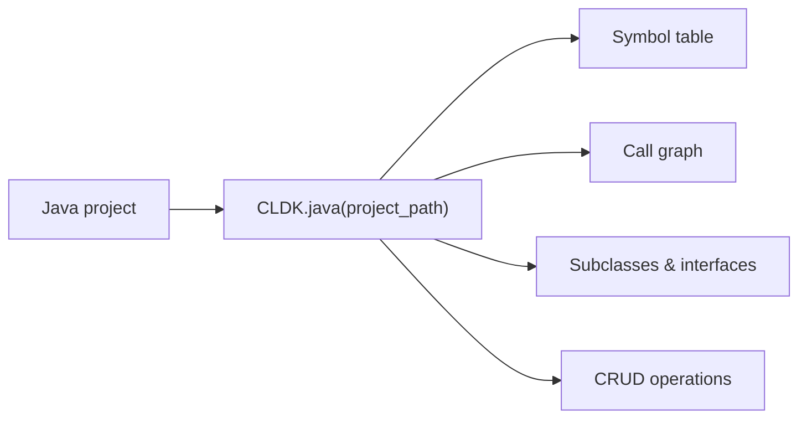

Java is CLDK's most complete analyzer. `JavaAnalysis` provides a typed symbol
table, call graph, subclass/interface queries, CRUD/data-access discovery, and
comments. [cocoa](/cocoa/) builds on these calls.

## Overview

`CLDK.java(project_path=...)` returns a `JavaAnalysis` object backed by
**CodeAnalyzer**, a WALA-based static analysis engine: symbol table, call graph,
subclass/interface relationships, CRUD operations, and comments. The backend
ships with the package; results are cached under `<project>/.codeanalyzer` (on by
default) and reused on later runs.



**Analysis levels.** The `analysis_level` argument controls how much is computed.
`AnalysisLevel.symbol_table` (the default) populates classes, methods, and
fields. `AnalysisLevel.call_graph` additionally builds the call graph that
`get_call_graph`, `get_callers`, and `get_callees` rely on. Set it when you need
call relationships:

```python
from cldk import CLDK
from cldk.analysis import AnalysisLevel

analysis = CLDK.java(
    project_path="commons-cli",
    analysis_level=AnalysisLevel.call_graph,
)
```

To run against a read-only Neo4j backend instead of the in-process analyzer, pass
a `Neo4jConnectionConfig` as `backend=`:

```python
from cldk import CLDK
from cldk.analysis import AnalysisLevel
from cldk.analysis.commons.backend_config import Neo4jConnectionConfig

analysis = CLDK.java(
    project_path="commons-cli",
    analysis_level=AnalysisLevel.call_graph,
    backend=Neo4jConnectionConfig(
        uri="bolt://localhost:7687",
        username="neo4j",
        password="password",
        database="neo4j",
        application_name="commons-cli",
    ),
)
```

## Worked example

Using [Apache Commons CLI](https://commons.apache.org/proper/commons-cli/) as the
sample project.

### Get the symbol table

```python
# Every file -> its compilation unit (classes, methods, fields).
symbol_table = analysis.get_symbol_table()
print(len(analysis.get_classes()), "classes")
# 23 classes
```

### Build a call graph

```python
import networkx as nx

cg = analysis.get_call_graph()      # networkx.DiGraph, caller -> callee
print(cg)                           # DiGraph with N nodes / M edges
```

### Find who calls a method

```python
callers = analysis.get_callers(
    target_class_name="org.apache.commons.cli.OptionBuilder",
    target_method_declaration="create(String)",
)
# -> dict of caller method signatures + call-site locations
```

See the [common tasks](/guides/common-tasks/) guide for more snippets, and the
[cocoa](/cocoa/), the Code Context Agent plugin, for exposing these calls to an agent.

## API reference

The full generated reference for the Java analysis API and data models
follows.

<!-- CLDK:API:START -->

<!-- AUTO-GENERATED by scripts/gen_api_docs.py, do not edit by hand. -->

[](https://github.com/codellm-devkit/python-sdk) [](https://pypi.org/project/cldk/2.0.0rc4/)

_API reference generated from cldk 2.0.0rc4._

## Analysis

Java analysis facade module.

This module provides the `JavaAnalysis` class, which serves as the
primary high-level interface for performing static analysis on Java projects.
It combines Tree-sitter-based parsing with the CodeAnalyzer backend to provide
comprehensive code analysis capabilities.

The analysis operates on a project directory (cross-file call graphs, class
hierarchies, the symbol table). The 1.x single-file ``source_code`` mode was
removed in 2.0 (spec leg 3, J-10): pass the project directory, or hand a source
string to `TreesitterJava` directly.

> **Key capabilities include**
> - Symbol table extraction (classes, methods, fields, imports)
> - Call graph construction and traversal
> - Class hierarchy and inheritance analysis
> - Method parameter and signature analysis
> - Comment and Javadoc extraction
> - CRUD operation detection for enterprise applications
> - Entry point identification (main methods, REST endpoints)

> **The analysis is powered by**
> - **Tree-sitter**: Fast incremental parsing for syntactic analysis
> - **CodeAnalyzer**: Semantic analysis backend (JAR-based)

> **See Also**
> - `PythonAnalysis`: Python equivalent.
> - `JCodeanalyzer`: Backend implementation.

### `JavaAnalysis`

```python
class JavaAnalysis
```

Analysis facade for Java code.

This class provides a comprehensive interface for performing static analysis
on Java projects and source files. It combines Tree-sitter-based parsing for
syntactic analysis with the CodeAnalyzer backend for semantic analysis.

The facade is initialized with ``project_dir`` and provides full analysis
capabilities including cross-file call graphs, class hierarchies, and symbol
tables; the single-file ``source_code`` mode was removed in 2.0.

> **Key features**
> - Symbol table access with classes, methods, and fields
> - Call graph construction and traversal
> - Caller/callee relationship analysis
> - Class hierarchy and inheritance queries
> - Comment and Javadoc extraction
> - CRUD operation detection
> - Entry point identification

> **See Also**
> - `PythonAnalysis`: Python equivalent.
> - `JCodeanalyzer`: Backend.

#### Attributes

| Name | Type | Description |
| ---- | ---- | ----------- |
| `project_dir` | `` |  |
| `analysis_level` | `` |  |
| `eager_analysis` | `` |  |
| `target_files` | `` |  |
| `backend_config` | `JavaBackend` |  |
| `treesitter_java` | `TreesitterJava` |  |
| `backend` | `JavaAnalysisBackend` |  |
| `has_resolution_edges` | `bool` | Whether call sites carry a resolved callee on this backend right now. |

#### Methods

##### `JavaAnalysis.get_imports`

```python
get_imports() -> List[str]
```

Return every distinct import target of the project, sorted.

A **set**, not a per-file listing and not the file's import order: the Neo4j projection
aggregates every import of a module that resolves to the same target onto one edge, so the
order within a file is not recoverable there and a list that preserved it locally would be
one the two backends disagree about. The 1.x signature is a flat ``List[str]`` and never
carried the file an import belongs to either.

**Returns:**

- `List[str]`: Fully qualified import targets (``"java.util.List"``, ``"java.io.*"``), sorted and
- `List[str]`: distinct. A wildcard keeps its ``.*``; static imports are not marked here.

> **See Also**
> `get_symbol_table`: per-file `JImport` records,
>     with spans and the static/wildcard flags.

##### `JavaAnalysis.get_variables`

```python
get_variables(**kwargs) -> Dict
```

Return the local variables each callable declares.

**Parameters:**

| Name | Type | Description |
| ---- | ---- | ----------- |
| `**kwargs` | `` | The 1.x signature's filtering options, of which there are none. An unexpected keyword raises `TypeError` naming it, rather than being ignored: silently dropping a filter returns an unfiltered answer that looks filtered. |

**Returns:**

- `Dict`: ``{"<type fqn>.<signature>": [JLocalVariable, ...]}``, the J-1 call-graph key of
- `Dict`: meth:`get_call_graph`, and one entry per callable including those declaring nothing.
- `Dict`: Fields and parameters are *not* folded in; they have their own accessors. Each list is
- `Dict`: ordered by ``(start_line, name)``: the Neo4j projection carries a line-only span, so
- `Dict`: two variables declared on one line have no order there to preserve.

**Raises:**

- `TypeError`: An unexpected keyword argument was passed.

> **See Also**
> `get_fields`: class-level fields.
> `get_method_parameters`: a callable's parameters.

##### `JavaAnalysis.get_service_entry_point_classes`

```python
get_service_entry_point_classes(**kwargs) -> Dict[str, JType]
```

Return all service entry-point classes.

This method is intended to identify classes that serve as entry points
for services, such as JAX-RS resources, Spring controllers, or servlet
classes.

**Parameters:**

| Name | Type | Description |
| ---- | ---- | ----------- |
| `**kwargs` | `` | Framework-specific filtering options (e.g., annotation filters for ``@RestController``, ``@Path``, etc.). |

**Returns:**

- `Dict[str, JType]`: A dictionary mapping qualified class names to `JType` objects
- `Dict[str, JType]`: for classes identified as service entry points.

**Raises:**

- `NotImplementedError`: This functionality is not yet implemented.

> **See Also**
> `get_entry_point_classes`: For general entry point detection.

##### `JavaAnalysis.get_service_entry_point_methods`

```python
get_service_entry_point_methods(**kwargs) -> Dict[str, Dict[str, JCallable]]
```

Return all service entry-point methods.

This method is intended to identify methods that serve as entry points
for services, such as REST endpoint handlers, servlet methods, or
message handlers.

**Parameters:**

| Name | Type | Description |
| ---- | ---- | ----------- |
| `**kwargs` | `` | Framework-specific filtering options (e.g., HTTP method filters, annotation filters for ``@GET``, ``@POST``, etc.). |

**Returns:**

- `Dict[str, Dict[str, JCallable]]`: A nested dictionary mapping class names to method signatures to
- `Dict[str, Dict[str, JCallable]]`: class:`JCallable` objects for methods identified as service
- `Dict[str, Dict[str, JCallable]]`: entry points.

**Raises:**

- `NotImplementedError`: This functionality is not yet implemented.

> **See Also**
> `get_entry_point_methods`: For general entry point detection.

##### `JavaAnalysis.get_application_view`

```python
get_application_view() -> JApplication
```

Return the complete analyzed application model.

Returns the top-level `JApplication` object that represents
the entire analyzed Java project. This object contains all compilation
units, classes, methods, and their relationships discovered during
analysis.

**Returns:**

- `JApplication`: class:`~cldk.models.java.JApplication` object containing: - All compilation units (``symbol_table`` attribute) - Project-level metadata - Aggregated statistics about the codebase

> **See Also**
> `get_symbol_table`: For direct access to the symbol table.
> `get_compilation_units`: For a list of compilation units.

##### `JavaAnalysis.get_symbol_table`

```python
get_symbol_table() -> Dict[str, JCompilationUnit]
```

Return the symbol table mapping file paths to compilation units.

Returns a dictionary that maps each analyzed Java file's path to its
corresponding `JCompilationUnit` object. This is the primary
data structure for accessing analyzed code structure.

**Returns:**

- `Dict[str, JCompilationUnit]`: A dictionary where keys are file paths (as strings) and values are
- `Dict[str, JCompilationUnit]`: class:`~cldk.models.java.JCompilationUnit` objects containing: - Package declaration - Import statements - Type declarations (classes, interfaces, enums) - Method and field definitions

> **See Also**
> `get_compilation_units`: For a list without file paths.
> `get_java_compilation_unit`: For direct lookup by path.

##### `JavaAnalysis.get_compilation_units`

```python
get_compilation_units() -> List[JCompilationUnit]
```

Return all compilation units in the project as a list.

Returns all `JCompilationUnit` objects discovered during
analysis as a flat list. Each compilation unit represents a single
Java source file.

**Returns:**

- `List[JCompilationUnit]`: A list of `JCompilationUnit` objects,
- `List[JCompilationUnit]`: one for each Java source file analyzed in the project.

> **See Also**
> `get_symbol_table`: For file-path-keyed access.

##### `JavaAnalysis.get_class_hierarchy`

```python
get_class_hierarchy() -> nx.DiGraph
```

Return the complete class inheritance hierarchy as a graph.

This method is intended to return a NetworkX directed graph representing
the full class inheritance relationships in the project, including
extends and implements relationships.

**Returns:**

- `nx.DiGraph`: A ``networkx.DiGraph`` with one node per declared type (interfaces, enums, annotations
- `nx.DiGraph`: and records included) and an edge **subclass → supertype** carrying
- `nx.DiGraph`: ``type="EXTENDS"`` or ``type="IMPLEMENTS"``, Java projects the two as separate
- `nx.DiGraph`: relationship types and this keeps them apart. A supertype outside the project is a node
- `nx.DiGraph`: too, spelled as the declaration wrote it.

> **See Also**
> `get_sub_classes`: For finding subclasses of a specific class.
> `get_extended_classes`: For finding superclasses.
> `get_implemented_interfaces`: For interface implementations.

##### `JavaAnalysis.is_parsable`

```python
is_parsable(source_code: str) -> bool
```

Check if the given source code is valid Java syntax.

Uses the Tree-sitter Java parser to attempt parsing the source code.
This is useful for validating code snippets before further processing
or for filtering out malformed code.

**Parameters:**

| Name | Type | Description |
| ---- | ---- | ----------- |
| `source_code` | `str` | A string containing Java source code to validate. Can be a complete compilation unit, a class definition, or any syntactically valid Java code fragment. |

**Returns:**

- `bool`: ``True`` if the source code parses without syntax errors,
- `bool`: ``False`` otherwise. Note that this only checks syntactic validity,
- `bool`: not semantic correctness (e.g., type errors won't be caught).

> **See Also**
> `get_raw_ast`: To obtain the full AST for valid code.

##### `JavaAnalysis.get_raw_ast`

```python
get_raw_ast(source_code: str) -> Tree
```

Parse source code and return the Tree-sitter AST.

Parses the provided Java source code using Tree-sitter and returns
the resulting abstract syntax tree. The AST can be traversed to
extract syntactic information about the code structure.

**Parameters:**

| Name | Type | Description |
| ---- | ---- | ----------- |
| `source_code` | `str` | A string containing Java source code to parse. Should be syntactically valid Java code. |

**Returns:**

- `Tree`: A Tree-sitter ``Tree`` object representing the parsed AST. The tree
- `Tree`: contains nodes representing all syntactic elements of the code,
- `Tree`: including classes, methods, statements, and expressions.

> **Note**
> If the source code contains syntax errors, Tree-sitter will still
> return a tree but with ERROR nodes at the locations of parse errors.
> Use `is_parsable` to check for valid syntax first.

> **See Also**
> `is_parsable`: To validate syntax before parsing.

##### `JavaAnalysis.get_call_graph`

```python
get_call_graph() -> nx.DiGraph
```

Return the project call graph as a NetworkX directed graph.

Constructs and returns a directed graph representing method call
relationships across the entire project. Each node represents a
method, and each edge represents a call from one method to another.

The call graph requires ``analysis_level`` of at least ``"call_graph"``;
below it the graph is empty.

**Returns:**

- `nx.DiGraph`: A ``networkx.DiGraph`` where: - Nodes are keyed by the string ``"<type fqn>.<signature>"`` (e.g. ``"com.acme.Svc.run(java.lang.String)"``), with a `JMethodDetail` under ``method_detail`` and ``kind="callable"`` - Edges represent call relationships, directed from caller to callee, with ``type``, ``weight`` and ``calling_lines``

> **See Also**
> `get_callers`: For finding callers of a specific method.
> `get_callees`: For finding callees of a specific method.
> `get_class_call_graph`: For class-scoped call graphs.

##### `JavaAnalysis.get_call_graph_json`

```python
get_call_graph_json() -> str
```

Return the complete analysis results serialized as JSON.

Serializes the full analysis results, including the call graph and
symbol table, to a JSON string. This is useful for persisting
analysis results, sharing with other tools, or debugging.

**Returns:**

- `str`: A JSON-formatted string containing the complete analysis data,
- `str`: including compilation units, classes, methods, and call
- `str`: relationships.

> **See Also**
> `get_call_graph`: For the graph object directly.

##### `JavaAnalysis.get_callers`

```python
get_callers(target_class_name: str, target_method_declaration: str, using_symbol_table: bool = False) -> Dict
```

Return all methods that call the specified target method.

Finds and returns information about all methods that invoke the
specified target method. This is useful for impact analysis and
understanding how a method is used throughout the codebase.

**Parameters:**

| Name | Type | Description |
| ---- | ---- | ----------- |
| `target_class_name` | `str` | The fully qualified name of the class containing the target method (e.g., ``"com.example.service.UserService"``). |
| `target_method_declaration` | `str` | The method signature to find callers for (e.g., ``"getUser(String)"`` or ``"process())"``). |
| `using_symbol_table` | `bool` | If ``True``, uses the symbol table for resolution (faster but may be less accurate). If ``False`` (default), uses the full call graph analysis. |

**Returns:**

- `Dict`: A dictionary containing information about all callers, including: - Caller method signatures - Call site locations (file and line) - Caller class information

> **See Also**
> `get_callees`: For the reverse direction (what a method calls).
> `get_call_graph`: For the complete call relationship graph.

##### `JavaAnalysis.get_callees`

```python
get_callees(source_class_name: str, source_method_declaration: str, using_symbol_table: bool = False) -> Dict
```

Return all methods called by the specified source method.

Finds and returns information about all methods that are invoked by
the specified source method. This is useful for understanding method
dependencies and tracing execution paths.

**Parameters:**

| Name | Type | Description |
| ---- | ---- | ----------- |
| `source_class_name` | `str` | The fully qualified name of the class containing the source method (e.g., ``"com.example.service.OrderService"``). |
| `source_method_declaration` | `str` | The method signature to find callees for (e.g., ``"processOrder(Order)"``). |
| `using_symbol_table` | `bool` | If ``True``, uses the symbol table for resolution (faster but may be less accurate). If ``False`` (default), uses the full call graph analysis. |

**Returns:**

- `Dict`: A dictionary containing information about all callees, including: - Callee method signatures - Target class information - Call site locations within the source method

> **See Also**
> `get_callers`: For the reverse direction (who calls a method).
> `get_call_graph`: For the complete call relationship graph.

##### `JavaAnalysis.get_methods`

```python
get_methods() -> Dict[str, Dict[str, JCallable]]
```

Return all methods in the project grouped by class.

Retrieves all methods from all classes in the analyzed project,
organized in a nested dictionary structure by qualified class name
and then method signature.

**Returns:**

- `Dict[str, Dict[str, JCallable]]`: A nested dictionary with structure:: { "com.example.ClassName": { "methodName(ParamType)": JCallable, "anotherMethod()": JCallable, ... }, ... }
- `Dict[str, Dict[str, JCallable]]`: class:`~cldk.models.java.JCallable` contains the method's
- `Dict[str, Dict[str, JCallable]]`: signature, parameters, return type, body, annotations, and other
- `Dict[str, Dict[str, JCallable]]`: metadata.

> **See Also**
> `get_methods_in_class`: For methods of a specific class.
> `get_method`: For a single method by name.

##### `JavaAnalysis.get_classes`

```python
get_classes() -> Dict[str, JType]
```

Return all classes in the project.

Retrieves all type declarations (classes, interfaces, enums, records)
discovered during analysis, organized by their fully qualified names.

**Returns:**

- `Dict[str, JType]`: A dictionary mapping fully qualified class names (strings) to
- `Dict[str, JType]`: class:`~cldk.models.java.JType` objects containing class metadata,
- `Dict[str, JType]`: methods, fields, and inheritance information.

> **See Also**
> `get_class`: For a single class by name.
> `get_classes_by_criteria`: For filtered class retrieval.

##### `JavaAnalysis.get_classes_by_criteria`

```python
get_classes_by_criteria(inclusions: List[str] | None = None, exclusions: List[str] | None = None) -> Dict[str, JType]
```

Return classes matching inclusion/exclusion filter criteria.

Filters the project's classes based on substring matching against
their qualified names. Classes are included if their name contains
any inclusion substring AND does not contain any exclusion substring.

**Parameters:**

| Name | Type | Description |
| ---- | ---- | ----------- |
| `inclusions` | `List[str] \| None` | List of substrings that class names must contain to be included. If ``None`` or empty, no inclusion filtering is applied (effectively includes nothing unless you have at least one inclusion pattern). |
| `exclusions` | `List[str] \| None` | List of substrings that class names must NOT contain. Classes matching any exclusion pattern are filtered out, even if they match an inclusion pattern. |

**Returns:**

- `Dict[str, JType]`: A dictionary mapping qualified class names to
- `Dict[str, JType]`: class:`~cldk.models.java.JType` objects for classes matching
- `Dict[str, JType]`: the criteria.

> **Note**
> The filtering uses substring matching (``in`` operator), not
> regular expressions or glob patterns.

> **See Also**
> `get_classes`: For all classes without filtering.

##### `JavaAnalysis.get_class`

```python
get_class(qualified_class_name: str) -> JType | None
```

Return a specific class by its qualified name.

Retrieves detailed information about a single class, including its
methods, fields, annotations, modifiers, and inheritance information.

**Parameters:**

| Name | Type | Description |
| ---- | ---- | ----------- |
| `qualified_class_name` | `str` | The fully qualified name of the class (e.g., ``"com.example.service.UserService"``). |

**Returns:**

- `JType \| None`: class:`~cldk.models.java.JType` object containing all analyzed
- `JType \| None`: information about the class. Returns ``None`` if the class is not
- `JType \| None`: found in the analyzed project.

> **See Also**
> `get_classes`: For all classes in the project.
> `get_java_file`: To find which file contains a class.

##### `JavaAnalysis.get_method`

```python
get_method(qualified_class_name: str, qualified_method_name: str) -> JCallable | None
```

Return a specific method by class and method signature.

Retrieves detailed information about a single method, including its
signature, parameters, return type, annotations, body, and metrics.

**Parameters:**

| Name | Type | Description |
| ---- | ---- | ----------- |
| `qualified_class_name` | `str` | The fully qualified name of the class containing the method (e.g., ``"com.example.service.UserService"``). |
| `qualified_method_name` | `str` | The method signature to retrieve (e.g., ``"getUser(String)"`` or ``"process())"``). |

**Returns:**

- `JCallable \| None`: class:`~cldk.models.java.JCallable` object containing all
- `JCallable \| None`: analyzed information about the method. Returns ``None`` if the
- `JCallable \| None`: method is not found.

> **Note**
> Two fields depend on which backend answered. On the
> ``analysis.json`` backend ``code`` is the **body block** and
> ``body`` holds every body node. On the Neo4j backend ``code`` is
> the whole **declaration** (it *ends with* the body block, because
> the graph projects one line range per callable and no
> ``body_span``) and ``body`` holds the ``call`` nodes only, about
> 30% of the graph's body nodes, which is what ``call_sites`` needs
> and all it needs.

> **See Also**
> `get_methods_in_class`: For all methods of a class.
> `get_method_parameters`: For just the parameter list.

##### `JavaAnalysis.get_method_parameters`

```python
get_method_parameters(qualified_class_name: str, qualified_method_name: str) -> List[JCallableParameter]
```

Return the parameters of a specific method.

**Parameters:**

| Name | Type | Description |
| ---- | ---- | ----------- |
| `qualified_class_name` | `str` | The fully qualified name of the class containing the method. |
| `qualified_method_name` | `str` | The method signature to get parameters for. |

**Returns:**

- `List[JCallableParameter]`: class:`~cldk.models.java.models.JCallableParameter` objects
- `List[JCallableParameter]`: (name, type, annotations, position), in signature order. Returns an
- `List[JCallableParameter]`: empty list if the method is not found or has no parameters. (1.x
- `List[JCallableParameter]`: annotated this ``List[str]``; it always returned the objects.)

> **See Also**
> `get_method`: For complete method information.

##### `JavaAnalysis.get_java_file`

```python
get_java_file(qualified_class_name: str) -> str | None
```

Return the file path containing a class with the given name.

Given a qualified class name, returns the file path where that class
is defined. This is useful for navigating from class references back
to source files.

**Parameters:**

| Name | Type | Description |
| ---- | ---- | ----------- |
| `qualified_class_name` | `str` | The fully qualified name of the class to locate (e.g., ``"com.example.service.UserService"``). |

**Returns:**

- `str \| None`: The file path (as a string) containing the class definition.
- `str \| None`: Returns ``None`` if no class with the given name is found.

> **See Also**
> `get_class`: To get the full class object by name.
> `get_java_compilation_unit`: To get the compilation unit.

##### `JavaAnalysis.get_java_compilation_unit`

```python
get_java_compilation_unit(file_path: str) -> JCompilationUnit
```

Return the compilation unit for a specific file path.

Retrieves the `JCompilationUnit` object corresponding to a
specific Java source file in the analyzed project.

**Parameters:**

| Name | Type | Description |
| ---- | ---- | ----------- |
| `file_path` | `str` | The path to the Java file, which should be an absolute path or a path relative to the project root. |

**Returns:**

- `JCompilationUnit`: class:`~cldk.models.java.JCompilationUnit` for the file,
- `JCompilationUnit`: containing all analyzed information about package, imports,
- `JCompilationUnit`: and type declarations. Returns ``None`` if the file is not
- `JCompilationUnit`: part of the analyzed project.

> **See Also**
> `get_symbol_table`: For bulk access to all compilation units.
> `get_java_file`: For reverse lookup (class to file).

##### `JavaAnalysis.get_methods_in_class`

```python
get_methods_in_class(qualified_class_name: str) -> Dict[str, JCallable]
```

Return all methods defined in a specific class.

Retrieves all methods belonging to the specified class, including
instance methods, static methods, and constructors.

**Parameters:**

| Name | Type | Description |
| ---- | ---- | ----------- |
| `qualified_class_name` | `str` | The fully qualified name of the class (e.g., ``"com.example.service.UserService"``). |

**Returns:**

- `Dict[str, JCallable]`: A dictionary mapping method signatures (strings) to
- `Dict[str, JCallable]`: class:`~cldk.models.java.JCallable` objects. Returns an empty
- `Dict[str, JCallable]`: dictionary if the class is not found or has no methods.

> **See Also**
> `get_method`: For a single method by signature.
> `get_constructors`: For constructors specifically.

##### `JavaAnalysis.get_constructors`

```python
get_constructors(qualified_class_name: str) -> Dict[str, JCallable]
```

Return all constructors of a specific class.

Retrieves all constructor methods defined in the specified class.
Constructors are methods with the same name as the class.

**Parameters:**

| Name | Type | Description |
| ---- | ---- | ----------- |
| `qualified_class_name` | `str` | The fully qualified name of the class (e.g., ``"com.example.model.User"``). |

**Returns:**

- `Dict[str, JCallable]`: A dictionary mapping constructor signatures to
- `Dict[str, JCallable]`: class:`~cldk.models.java.JCallable` objects. Returns an empty
- `Dict[str, JCallable]`: dictionary if the class has no explicit constructors.

> **See Also**
> `get_methods_in_class`: For all methods including constructors.

##### `JavaAnalysis.get_fields`

```python
get_fields(qualified_class_name: str) -> List[JField]
```

Return all fields (member variables) of a specific class.

Retrieves all field declarations in the specified class, including
instance fields, static fields, and constants.

**Parameters:**

| Name | Type | Description |
| ---- | ---- | ----------- |
| `qualified_class_name` | `str` | The fully qualified name of the class (e.g., ``"com.example.model.User"``). |

**Returns:**

- `List[JField]`: A list of `JField` objects, each
- `List[JField]`: containing information about a field's name, type, modifiers,
- `List[JField]`: and annotations.

> **See Also**
> `get_class`: For complete class information.

##### `JavaAnalysis.get_nested_classes`

```python
get_nested_classes(qualified_class_name: str) -> List[JType]
```

Return all nested (inner) classes of a specific class.

Retrieves all classes that are defined inside the specified class,
including static nested classes and inner classes.

**Parameters:**

| Name | Type | Description |
| ---- | ---- | ----------- |
| `qualified_class_name` | `str` | The fully qualified name of the outer class (e.g., ``"com.example.model.Container"``). |

**Returns:**

- `List[JType]`: A list of `JType` objects for each
- `List[JType]`: nested class. Returns an empty list if no nested classes exist.

> **See Also**
> `get_class`: For the outer class information.

##### `JavaAnalysis.get_sub_classes`

```python
get_sub_classes(qualified_class_name: str) -> Dict[str, JType]
```

Return all classes that extend the specified class.

Finds all classes in the project that directly extend the specified
base class. This is useful for understanding class hierarchies and
finding implementations of abstract classes.

**Parameters:**

| Name | Type | Description |
| ---- | ---- | ----------- |
| `qualified_class_name` | `str` | The fully qualified name of the base class to find subclasses of (e.g., ``"com.example.base.BaseService"``). |

**Returns:**

- `Dict[str, JType]`: A dictionary mapping qualified class names to
- `Dict[str, JType]`: class:`~cldk.models.java.JType` objects for all classes that
- `Dict[str, JType]`: extend the specified class.

> **See Also**
> `get_extended_classes`: For the reverse (what a class extends).
> `get_class_hierarchy`: For the full inheritance graph.

##### `JavaAnalysis.get_extended_classes`

```python
get_extended_classes(qualified_class_name: str) -> List[str]
```

Return the superclass(es) that a class extends.

Retrieves the parent class for the specified class. In Java, a class
can extend at most one other class (single inheritance).

**Parameters:**

| Name | Type | Description |
| ---- | ---- | ----------- |
| `qualified_class_name` | `str` | The fully qualified name of the class to get the superclass for. |

**Returns:**

- `List[str]`: A list of superclass names (typically containing zero or one
- `List[str]`: element, since Java has single inheritance). Returns empty list
- `List[str]`: if the class directly extends Object or is not found.

> **See Also**
> `get_sub_classes`: For finding classes that extend this class.
> `get_implemented_interfaces`: For interface implementations.

##### `JavaAnalysis.get_implemented_interfaces`

```python
get_implemented_interfaces(qualified_class_name: str) -> List[str]
```

Return all interfaces implemented by a class.

Retrieves the list of interfaces that the specified class implements.
A Java class can implement multiple interfaces.

**Parameters:**

| Name | Type | Description |
| ---- | ---- | ----------- |
| `qualified_class_name` | `str` | The fully qualified name of the class to get implemented interfaces for. |

**Returns:**

- `List[str]`: A list of interface names (as strings) that the class implements.
- `List[str]`: Returns empty list if the class implements no interfaces.

> **See Also**
> `get_extended_classes`: For class inheritance.

##### `JavaAnalysis.get_class_call_graph`

```python
get_class_call_graph(qualified_class_name: str, method_signature: str | None = None, using_symbol_table: bool = False) -> List[Tuple[JMethodDetail, JMethodDetail]]
```

Return call graph edges reachable from a class or method.

Extracts a subset of the call graph containing only edges reachable
from the specified class (and optionally a specific method within
that class). This is useful for understanding the call structure
of a specific component without the noise of the full project graph.

**Parameters:**

| Name | Type | Description |
| ---- | ---- | ----------- |
| `qualified_class_name` | `str` | The fully qualified name of the class to start traversal from (e.g., ``"com.example.service.UserService"``). |
| `method_signature` | `str \| None` | Optional method signature to further constrain the starting point. If provided, only edges reachable from that specific method are included. If ``None``, edges from all methods in the class are included. |
| `using_symbol_table` | `bool` | If ``True``, uses the symbol table for faster but potentially less accurate resolution. If ``False`` (default), uses the full call graph analysis. |

**Returns:**

- `List[Tuple[JMethodDetail, JMethodDetail]]`: A list of tuples ``(caller, callee)`` where each element is a
- `List[Tuple[JMethodDetail, JMethodDetail]]`: class:`~cldk.models.java.JMethodDetail` object representing
- `List[Tuple[JMethodDetail, JMethodDetail]]`: a method in the call relationship.

> **See Also**
> `get_call_graph`: For the complete project call graph.
> `get_callees`: For direct callees of a single method.

##### `JavaAnalysis.get_entry_point_classes`

```python
get_entry_point_classes() -> Dict[str, JType]
```

Return all classes identified as application entry points.

Identifies classes that serve as entry points for the application,
such as classes containing main methods, servlet classes, or
framework-specific entry point classes.

**Returns:**

- `Dict[str, JType]`: A dictionary mapping qualified class names to
- `Dict[str, JType]`: class:`~cldk.models.java.JType` objects for classes identified
- `Dict[str, JType]`: as entry points.

> **See Also**
> `get_entry_point_methods`: For entry point methods.

##### `JavaAnalysis.get_entry_point_methods`

```python
get_entry_point_methods() -> Dict[str, Dict[str, JCallable]]
```

Return all methods identified as application entry points.

Identifies methods that serve as entry points for the application,
such as main methods, servlet doGet/doPost methods, or framework-
specific handler methods.

**Returns:**

- `Dict[str, Dict[str, JCallable]]`: A nested dictionary mapping class names to method signatures
- `Dict[str, Dict[str, JCallable]]`: class:`~cldk.models.java.JCallable` objects for methods
- `Dict[str, Dict[str, JCallable]]`: identified as entry points.

> **See Also**
> `get_entry_point_classes`: For entry point classes.

##### `JavaAnalysis.remove_all_comments`

```python
remove_all_comments() -> str
```

Remove all comments from the source code.

Strips all single-line (``//``) and multi-line (``/* */``) comments
from the source code, including Javadoc comments. This is useful
for code analysis that should ignore comment content.

**Raises:**

- `NotImplementedError`: always. This accessor only ever operated on the
- meth:`TreesitterJava.remove_all_comments` directly.

> **See Also**
> `get_all_comments`: For extracting comments instead.

##### `JavaAnalysis.get_methods_with_annotations`

```python
get_methods_with_annotations(annotations: List[str]) -> Dict[str, List[Dict]]
```

Return methods decorated with specific annotations.

This method is intended to find all methods that have any of the
specified annotations, such as ``@Override``, ``@Test``,
``@RequestMapping``, or custom annotations.

**Parameters:**

| Name | Type | Description |
| ---- | ---- | ----------- |
| `annotations` | `List[str]` | List of annotation names to search for (e.g., ``["Override", "Test", "RequestMapping"]``). The ``@`` symbol should not be included. |

**Returns:**

- `Dict[str, List[Dict]]`: A dictionary keyed by **the strings passed in**, each mapping to a list of
- `Dict[str, List[Dict]]`: ``{"class", "signature", "method_name", "body"}`` dicts, sorted by
- `Dict[str, List[Dict]]`: ``(class, signature)``. An annotation no callable carries is omitted. ``body`` is
- `Dict[str, List[Dict]]`: attr:`~cldk.models.java.models.JCallable.code`, which is the body block off
- `Dict[str, List[Dict]]`: ``analysis.json`` and the whole declaration off the Neo4j projection, the same
- `Dict[str, List[Dict]]`: documented model property `get_test_methods` hands back.
- `Dict[str, List[Dict]]`: Matching reads the analyzer's own annotations rather than re-parsing source, so it
- `Dict[str, List[Dict]]`: answers on a Neo4j-backed analysis, which carries no module source at all.

> **See Also**
> `get_test_methods`: For finding test methods specifically.
> `get_decorated_callables`: The projected form, whose J-5 marker rule this shares.

##### `JavaAnalysis.get_test_methods`

```python
get_test_methods() -> Dict[str, str]
```

Return methods identified as test methods.

A callable is a test method when one of its own annotations is a test-declaring one:
``@Test`` (JUnit 4/5, TestNG), ``@ParameterizedTest``, ``@RepeatedTest``, ``@TestFactory``
or ``@TestTemplate``. The annotation is matched by simple name, so a fully qualified
spelling (``@org.junit.Test``) matches too, and its arguments are ignored, the same
marker rule the spec's J-5 gives ``get_decorated_callables``.

This reads the **analyzer's own** annotations off the model rather than re-parsing a
module's ``source``, so it answers identically on both backends: a Neo4j-backed analysis
carries no module ``source`` at all (``JCompilationUnit.source`` is ``""``), and the
source-parsing version returned ``{}`` there, an empty reading as "this application has
no tests" on an application with thousands.

**Returns:**

- `Dict[str, str]`: A dictionary mapping ``"<type fqn>.<signature>"``, the call-graph node key of J-1,
- `Dict[str, str]`: unique application-wide, to the callable's ``code``. Note that ``code`` is the body
- `Dict[str, str]`: block off ``analysis.json`` and the whole declaration off the Neo4j projection
- `Dict[str, str]`: (`code`).

> **See Also**
> `get_methods_with_annotations`: For finding methods with
>     any annotation.

##### `JavaAnalysis.get_calling_lines`

```python
get_calling_lines(target_method_name: str) -> List[int]
```

Return line numbers where a method is called.

This method is intended to find all line numbers in the source code
where the specified method is invoked.

**Parameters:**

| Name | Type | Description |
| ---- | ---- | ----------- |
| `target_method_name` | `str` | The name of the method to find calls to. |

**Returns:**

- `List[int]`: Sorted, distinct **absolute file lines** of every call to a method of that name anywhere
- `List[int]`: in the project, read off ``get_call_graph()``'s ``calling_lines`` edge attribute. A full
- `List[int]`: signature is accepted and cut at its first ``(``; overloads share a name at a call site
- `List[int]`: and so cannot be separated here. Empty when nothing calls that name.

> **See Also**
> `get_callers`: For finding caller methods instead of lines.

##### `JavaAnalysis.get_call_targets`

```python
get_call_targets(declared_methods: dict) -> Set[str]
```

Return call targets using simple name resolution.

This method is intended to find all methods that could be called
based on simple name matching in the AST, without full semantic
analysis.

**Parameters:**

| Name | Type | Description |
| ---- | ---- | ----------- |
| `declared_methods` | `dict` | Dictionary of declared method names and signatures to match against. |

**Returns:**

- `Set[str]`: The subset of ``declared_methods``' keys, cut to their simple names at the last
- `Set[str]`: ``(``, so a signature-keyed dict such as `get_methods_in_class`'s can be passed
- `Set[str]`: straight in, that some call site in the project actually writes. Simple-name matching
- `Set[str]`: no overload resolution, no receiver typing, no hierarchy walk.

> **See Also**
> `get_call_graph`: For full semantic call resolution.

##### `JavaAnalysis.get_all_crud_operations`

```python
get_all_crud_operations() -> List[Dict[str, Union[JType, JCallable, List[JCRUDOperation]]]]
```

Return all CRUD (Create, Read, Update, Delete) operations.

Identifies and returns all database operations in the project by
analyzing JPA/Hibernate annotations, repository patterns, and SQL
statements. This is useful for understanding data access patterns
in enterprise applications.

**Returns:**

- `List[Dict[str, Union[JType, JCallable, List[JCRUDOperation]]]]`: A list of dictionaries, each containing: - ``"class"``: The `JType` containing the operation - ``"method"``: The `JCallable` performing the operation - ``"operations"``: List of `JCRUDOperation` objects

> **See Also**
> `get_all_create_operations`: For create operations only.
> `get_all_read_operations`: For read operations only.
> `get_all_update_operations`: For update operations only.
> `get_all_delete_operations`: For delete operations only.

##### `JavaAnalysis.get_all_create_operations`

```python
get_all_create_operations() -> List[Dict[str, Union[JType, JCallable, List[JCRUDOperation]]]]
```

Return all Create operations from CRUD analysis.

Identifies database insert/create operations by analyzing
``save()``, ``persist()``, ``insert()``, and similar patterns.

**Returns:**

- `List[Dict[str, Union[JType, JCallable, List[JCRUDOperation]]]]`: A list of dictionaries with class, method, and operation details.
- `List[Dict[str, Union[JType, JCallable, List[JCRUDOperation]]]]`: Same structure as `get_all_crud_operations`.

> **See Also**
> `get_all_crud_operations`: For all CRUD operations.

##### `JavaAnalysis.get_all_read_operations`

```python
get_all_read_operations() -> List[Dict[str, Union[JType, JCallable, List[JCRUDOperation]]]]
```

Return all Read operations from CRUD analysis.

Identifies database read/select operations by analyzing
``find()``, ``get()``, ``select()``, and similar patterns.

**Returns:**

- `List[Dict[str, Union[JType, JCallable, List[JCRUDOperation]]]]`: A list of dictionaries with class, method, and operation details.
- `List[Dict[str, Union[JType, JCallable, List[JCRUDOperation]]]]`: Same structure as `get_all_crud_operations`.

> **See Also**
> `get_all_crud_operations`: For all CRUD operations.

##### `JavaAnalysis.get_all_update_operations`

```python
get_all_update_operations() -> List[Dict[str, Union[JType, JCallable, List[JCRUDOperation]]]]
```

Return all Update operations from CRUD analysis.

Identifies database update operations by analyzing
``update()``, ``merge()``, ``set()``, and similar patterns.

**Returns:**

- `List[Dict[str, Union[JType, JCallable, List[JCRUDOperation]]]]`: A list of dictionaries with class, method, and operation details.
- `List[Dict[str, Union[JType, JCallable, List[JCRUDOperation]]]]`: Same structure as `get_all_crud_operations`.

> **See Also**
> `get_all_crud_operations`: For all CRUD operations.

##### `JavaAnalysis.get_all_delete_operations`

```python
get_all_delete_operations() -> List[Dict[str, Union[JType, JCallable, List[JCRUDOperation]]]]
```

Return all Delete operations from CRUD analysis.

Identifies database delete operations by analyzing
``delete()``, ``remove()``, and similar patterns.

**Returns:**

- `List[Dict[str, Union[JType, JCallable, List[JCRUDOperation]]]]`: A list of dictionaries with class, method, and operation details.
- `List[Dict[str, Union[JType, JCallable, List[JCRUDOperation]]]]`: Same structure as `get_all_crud_operations`.

> **See Also**
> `get_all_crud_operations`: For all CRUD operations.

##### `JavaAnalysis.get_comments_in_a_method`

```python
get_comments_in_a_method(qualified_class_name: str, method_signature: str) -> List[JComment]
```

Return the method's own comment.

**Not** every comment inside the body: on both backends this is the
analyzer's per-declaration comment list, which holds the comment
immediately above the declaration and nothing else (at most one; 70 of
the 128 callables in the committed ``-a 4`` fixture have one, 65 of
them javadoc). Comments *inside* a method body reach the SDK only
through `get_comment_in_file`, which reports the whole file's.

**Parameters:**

| Name | Type | Description |
| ---- | ---- | ----------- |
| `qualified_class_name` | `str` | The fully qualified name of the class containing the method. |
| `method_signature` | `str` | The method signature to get comments from. |

**Returns:**

- `List[JComment]`: A list of `JComment` objects found
- `List[JComment]`: within the method body. Returns empty list if method not found.

> **Note**
> On a backend whose source keeps only per-declaration javadoc, the
> Neo4j backend, this narrows to **the method's javadoc alone**: a
> strictly smaller set than every comment in the body, and still a
> real answer about a real declaration, which is why this accessor
> narrows where `get_all_comments` and
> `get_comment_in_file` refuse (J-16).

> **See Also**
> `get_comments_in_a_class`: For class-level comments.
> `get_all_comments`: For all comments in the project.

##### `JavaAnalysis.get_comments_in_a_class`

```python
get_comments_in_a_class(qualified_class_name: str) -> List[JComment]
```

Return the class's own comment.

**Not** the comments inside the class body: on both backends this is
the type declaration's own comment list, the comment immediately
above ``class Foo``. A method's comment is on
`get_comments_in_a_method`, and an inline comment in a body is
on neither; `get_comment_in_file` reports the whole file's.

**Parameters:**

| Name | Type | Description |
| ---- | ---- | ----------- |
| `qualified_class_name` | `str` | The fully qualified name of the class. |

**Returns:**

- `List[JComment]`: A list of `JComment` objects found
- `List[JComment]`: within the class. Returns empty list if class not found.

> **Note**
> Narrows to the class's javadoc alone on a javadoc-only backend, in
> exactly the way `get_comments_in_a_method` does (J-16).

> **See Also**
> `get_comments_in_a_method`: For method-specific comments.
> `get_comment_in_file`: For file-level comments.

##### `JavaAnalysis.get_comment_in_file`

```python
get_comment_in_file(file_path: str) -> List[JComment]
```

Return all comments in a specific file.

Retrieves all comment nodes from the specified source file,
including file-level comments, class comments, and method comments.

**Parameters:**

| Name | Type | Description |
| ---- | ---- | ----------- |
| `file_path` | `str` | The path to the Java file. |

**Returns:**

- `List[JComment]`: A list of `JComment` objects found
- `List[JComment]`: in the file. Returns empty list if file not found.

**Raises:**

- `CodeanalyzerExecutionException`: If the backend's source carries no file-level comments at all, the Neo4j projection does not, naming what is missing and what to read instead. An empty list would read as "this file has no comments" (J-16).

> **See Also**
> `get_all_comments`: For comments across all files.

##### `JavaAnalysis.get_all_comments`

```python
get_all_comments() -> Dict[str, List[JComment]]
```

Return all comments in the project grouped by file.

Retrieves all comment nodes from all analyzed files, organized
by file path.

**Returns:**

- `Dict[str, List[JComment]]`: A dictionary mapping file paths (strings) to lists of
- `Dict[str, List[JComment]]`: class:`~cldk.models.java.JComment` objects.

**Raises:**

- `CodeanalyzerExecutionException`: As `get_comment_in_file` does, and for the same reason (J-16).

> **See Also**
> `get_all_docstrings`: For Javadoc comments only.

##### `JavaAnalysis.get_all_docstrings`

```python
get_all_docstrings() -> Dict[str, List[JComment]]
```

Return all Javadoc comments in the project grouped by file.

Retrieves only Javadoc-style comments (``/** ... */``) from all
analyzed files. These typically document classes, methods, and
fields.

**Returns:**

- `Dict[str, List[JComment]]`: A dictionary mapping file paths (strings) to lists of
- `Dict[str, List[JComment]]`: class:`~cldk.models.java.JComment` objects where
- `Dict[str, List[JComment]]`: ``is_javadoc`` is ``True``.

> **Note**
> *Which* javadoc depends on the backend: the ``analysis.json``
> backend reports each compilation unit's own comment list, holding
> the **file-level** javadoc; the Neo4j backend reports the javadoc of
> each **declaration** in the file (type, callable, field, enum
> constant, record component). Both are javadoc keyed by file, and
> they are different sets for the same file (J-16).

> **See Also**
> `get_all_comments`: For all comment types.

##### `JavaAnalysis.locate`

```python
locate(path: str, line: int) -> LocateResult
```

Resolve a source position to its enclosing callable, with the source in hand.

The single most-needed query for triaging a scanner alert: an alert arrives as
``file:line`` and this resolves it to the enclosing callable in one call, rather than
``get_method``, falling back to ``get_callers``, falling back to scanning the symbol table
by hand. Four outcomes stay distinguishable, see
`LocateResult`: inside a callable (``callable`` set,
plus ``body`` when a body node is that precise), at real module scope (``module_scope``
diagnostic), in the gap between two callables (also module scope, never snapped to the
nearest callable), or in a file the analysis has no module for (``file_not_in_graph``).

There is no ``col`` parameter: the Neo4j graph projects only ``start_line``/``end_line`` on
``:JCallable`` and ``:JBodyNode``, so a column would work in process and be silently inert
over the graph.

**Parameters:**

| Name | Type | Description |
| ---- | ---- | ----------- |
| `path` | `str` | The file path. Normalised against the backend's module keys, so a ``./``-prefixed or absolute path resolves rather than reading back as ``file_not_in_graph``. |
| `line` | `int` | The 1-based line number. |

**Returns:**

- `LocateResult`: class:`~cldk.analysis.commons.results.LocateResult` carrying the innermost body
- `LocateResult`: node, the enclosing callable, its owning type, its module, and the source slice, never
- `LocateResult`: an ambiguous empty. ``module.module_name`` is the unit's **declared package** (J-2),
- `LocateResult`: and ``source`` is the enclosing callable's text, which is the **body block** on the
- `LocateResult`: ``analysis.json`` backend and the whole **declaration** over Neo4j (see
- `LocateResult`: meth:`get_source`). A module-scope result over Neo4j is ``""`` plus a
- `LocateResult`: ``module_source_unavailable`` diagnostic: the graph carries no module text.

> **See Also**
> `locate_many`: The bulk form, the point, not an optimisation.

##### `JavaAnalysis.locate_many`

```python
locate_many(positions: Sequence[Tuple[str, int]]) -> List[LocateResult]
```

Resolve many ``(path, line)`` positions in one round trip, in input order.

**Parameters:**

| Name | Type | Description |
| ---- | ---- | ----------- |
| `positions` | `Sequence[Tuple[str, int]]` | The ``(path, line)`` pairs to resolve, e.g. from a scanner's alert list. |

**Returns:**

- `List[LocateResult]`: class:`~cldk.analysis.commons.results.LocateResult` per input position, in the
- `List[LocateResult]`: same order.

> **See Also**
> `locate`: The single-position form.

##### `JavaAnalysis.resolve_callable`

```python
resolve_callable(name: str, in_class: str | None = None, in_module: str | None = None) -> SliceNode
```

Resolve a callable name to the one callable it names, in the caller's vocabulary.

The addressing step every name-taking accessor performs, exposed so a caller can perform it
once and keep the answer::

    node = java.resolve_callable("cancelOrder(java.lang.Integer, boolean)", in_class="TradeDirect")
    node.callable   # "…impl.direct.TradeDirect.cancelOrder(java.lang.Integer, boolean)"
    node.file, node.line

``name`` matches whole or as a dotted suffix, **and** against the signature with its
parameter tail cut, so ``"cancelOrder"`` names a method a caller has not typed the
parameters of; the tail-carrying spelling is what resolves one overload out of a pair
(J-3). ``in_class`` is a dotted suffix of the owning type's qualified name, which, for a
local or anonymous class, carries the callable that declares it (the J-1 erratum);
``in_module`` is a repo-relative path suffix or a dotted spelling of the unit's **declared
package**, optionally qualified by a type it declares (J-2). Ambiguity raises with every
candidate; nothing is guessed.

Everything the analyzer emitted as a callable is addressable (J-6): an initializer
(``<clinit>$0()``) resolves and behaves like a method, and an **implicit** callable
resolves with ``line=-1``, it has no span at all, which is why `get_source` refuses
it by name rather than returning an empty string.

**Raises:**

- `AmbiguousName`: More than one callable matched.
- `SelectorNotInGraph`: Nothing matched, naming the argument that missed.

##### `JavaAnalysis.resolve_value`

```python
resolve_value(name: str, within: str) -> SliceNode
```

Resolve a value name inside a callable, in Java, a parameter, to the position that
carries it.

The same resolution the dataflow accessors perform on their ``src``, exposed so a caller can
check what a name means before asking a question of it::

    java.resolve_value("orderID", within="TradeDirect.cancelOrder").kind   # "parameter"

**Raises:**

- `AmbiguousName`: ``within`` named more than one callable, or ``name`` more than one value.
- `SelectorNotInGraph`: No such callable, or no such value in it.

##### `JavaAnalysis.get_source`

```python
get_source(node_id: str) -> str
```

Return the source text named by ``node_id``, a callable, or one of its body nodes.

``node_id`` is a callable's ``"<type fqn>.<signature>"`` name (what `resolve_callable`
returns in ``callable``), a callable's opaque id (what it returns in ``ref``), or the
body-node id `node_id` hands back, so a
statement or call site `locate` found can be re-fetched precisely. Passed back as
received, never composed.

**What comes back for a callable depends on the backend, and it is the graph's difference,
not this method's.** On the ``analysis.json`` backend it is the **body block**; over Neo4j
it is the whole **declaration**, which *ends with* that body block: the projection carries
one line range per callable and no ``body_span`` (upstream codeanalyzer-java#176). The
relation is exact and total, so a caller reading either can rely on it; it is recorded in
the lossiness table of ``docs/agent-api-reference.md`` and asserted by the live parity
suite. A **body node** likewise has text only on the ``analysis.json`` backend: the graph
carries none below callable granularity.

**Parameters:**

| Name | Type | Description |
| ---- | ---- | ----------- |
| `node_id` | `str` | A callable's name or id, or an id from `locate`, passed back as received, not composed. |

**Returns:**

- `str`: The source text, never an ambiguous empty string.

**Raises:**

- `KeyError`: Nothing matches ``node_id``, or it names a node with no recoverable source, an implicit callable (the analyzer emits it with no span and no body), or, over Neo4j, a body node. The message names the reason.

##### `JavaAnalysis.describe`

```python
describe(nodes: Sequence[object]) -> List[SliceNode]
```

Fill in ``source`` for these positions, in one round trip.

Addressing answers *where*; this answers *what*, and it is a second call because source is
the one field with no size ceiling. Takes anything carrying an address, slice nodes, a
``locate()`` result, and gives back the same
`SliceNode` shape with ``source`` filled.

Afterwards, ``source=None`` means exactly one thing: **this position exists and there is no
text for it.** A ref that names nothing raises instead.

**Parameters:**

| Name | Type | Description |
| ---- | ---- | ----------- |
| `nodes` | `Sequence[object]` | The positions to hydrate. An empty sequence costs no round trip. |

**Returns:**

- `List[SliceNode]`: The same positions, in the same order, with ``source`` filled where the backend has
- `List[SliceNode]`: text for them.

**Raises:**

- `KeyError`: A ref names nothing in this application.
- `TypeError`: An element carries no address to look up.

##### `JavaAnalysis.get_cfg`

```python
get_cfg(callable: str, in_class: str | None = None, page_size: int = DEFAULT_PAGE_SIZE, cursor: str | None = None) -> EdgePage[JCfgEdge]
```

Return one page of the control flow edges within one callable.

The intraprocedural half of "how does this method run": the analyzer's own CFG, one edge
per successor, with the branch kind on the edge rather than implied by order. Endpoints are
body-node ids `get_source` accepts, so a statement on a path can be read back.

**Parameters:**

| Name | Type | Description |
| ---- | ---- | ----------- |
| `callable` | `str` | The callable's name, resolved as in `resolve_callable`. |
| `in_class` | `str \| None` | Disambiguate by owning class. |
| `page_size` | `int` | Most edges to return. |
| `cursor` | `str \| None` | ``next_cursor`` from a previous page. |

**Returns:**

- `EdgePage[JCfgEdge]`: class:`~cldk.analysis.commons.results.EdgePage` of
- `EdgePage[JCfgEdge]`: class:`~cldk.models.java.models.JCfgEdge`, whose ``complete`` says whether the page is
- `EdgePage[JCfgEdge]`: the whole graph and whose ``total`` says how large that is.

**Raises:**

- `AmbiguousName`: ``callable`` named more than one callable.
- `SelectorNotInGraph`: Nothing matched.
- `ValueError`: ``page_size`` below 1, or a cursor from another page.
- `CodeanalyzerUsageException`: ``callable`` is an implicit callable, it resolves (J-6) and the analyzer emits it with no body, so there is no flow to page, or the analysis was built below ``analysis_level="program_dependency_graph"``.

##### `JavaAnalysis.get_cdg`

```python
get_cdg(callable: str, in_class: str | None = None, page_size: int = DEFAULT_PAGE_SIZE, cursor: str | None = None) -> EdgePage[JCdgEdge]
```

Return one page of the control dependence edges within one callable.

``src`` is the branching node ``dst`` is control dependent on, the analyzer's
post-dominance over the CFG, not re-derived here. Arguments and failures are
`get_cfg`'s.

##### `JavaAnalysis.get_ddg`

```python
get_ddg(callable: str, in_class: str | None = None, page_size: int = DEFAULT_PAGE_SIZE, cursor: str | None = None) -> EdgePage[JDdgEdge]
```

Return one page of the data dependence edges within one callable.

Each edge names the variable it flows (``var``) and the evidence for it (``prov``), which in
Java is one of **two** tiers: ``ssa`` (324,959 edges on the reference graph) or
``points-to`` (1,134). `prov_rank` ranks ``points-to``
least certain, which is what a caller weighing two hops reads. Arguments and failures are
`get_cfg`'s.

##### `JavaAnalysis.slice_backward`

```python
slice_backward(src: str, within: str, depth: int | None = DEFAULT_DEPTH, max_nodes: int = DEFAULT_MAX_NODES) -> Slice
```

Return everything the value ``src`` depends on.

On an analysis whose port lattice carries no dependence edge, codeanalyzer-java before
3.0.3, or ``--l3-engine wala``, that is the seed plus the argument vertex at every call
site that passes a value into the parameter, and nothing behind those arguments. It is
still a real answer that varies with the program, which is why this one answers where
`slice_forward` refuses. From 3.0.3 the walk carries on into the statements that
computed those arguments.

**Parameters:**

| Name | Type | Description |
| ---- | ---- | ----------- |
| `src` | `str` | The value's name, in Java, a parameter of ``within``. |
| `within` | `str` | The callable to look inside. Required: a value name is scoped by its callable. |
| `depth` | `int \| None` | Most hops from the seed; ``None`` for the whole cone. |
| `max_nodes` | `int` | Most nodes to return. A cap that fires is reported, never silent. |

**Returns:**

- `Slice`: class:`~cldk.analysis.commons.results.Slice` containing the seed, ordered by node id.

**Raises:**

- `AmbiguousName`: ``within`` or ``src`` matched more than one thing.
- `SelectorNotInGraph`: Either matched nothing.
- `ValueError`: ``depth`` is not a positive ``int``, or ``max_nodes`` is below 1.

##### `JavaAnalysis.slice_forward`

```python
slice_forward(src: str, within: str, depth: int | None = DEFAULT_DEPTH, max_nodes: int = DEFAULT_MAX_NODES) -> Slice
```

Return everything the value ``src`` can affect.

**Java cannot answer this today and says so.** A parameter vertex has no outgoing dependence
edge in codeanalyzer-java's output, so the result would be the seed alone for every
parameter of every application, indistinguishable from "this parameter affects nothing".
Arguments and names are judged first; then it raises naming the gap.

**Raises:**

- `CodeanalyzerExecutionException`: The analyzer's port lattice carries no dependence edge.

##### `JavaAnalysis.backward_cone`

```python
backward_cone(sinks: Sequence[str], depth: int | None = DEFAULT_DEPTH, max_nodes: int = DEFAULT_MAX_NODES) -> Slice
```

Return every callable that can reach any of ``sinks``, "what could get here".

A call-graph cone, so its vertices are callables; the sinks are in the result and in
``roots``. Bounded by default, because an unbounded cone on a real application is a
truncated answer to a question nobody asked; ``depth=None`` asks for the whole thing and
``total`` says how much a cap left out.

**Parameters:**

| Name | Type | Description |
| ---- | ---- | ----------- |
| `sinks` | `Sequence[str]` | The callables to walk back from, each resolved as in `resolve_callable`. |
| `depth` | `int \| None` | Most call hops back; ``None`` for the whole cone. |
| `max_nodes` | `int` | Most nodes to return. |

**Raises:**

- `AmbiguousName`: A sink matched more than one callable.
- `SelectorNotInGraph`: A sink matched none.
- `TypeError`: ``sinks`` is a bare string.
- `ValueError`: ``sinks`` is empty, or a bound is out of range.

##### `JavaAnalysis.reaches`

```python
reaches(src: str, dst: str, depth: int | None = None) -> bool
```

Return whether there is a call path from ``src`` to ``dst``.

The cheap check before asking for the paths themselves. **Unbounded by default**, unlike the
slices: a hop budget on a boolean would make "there is no path" and "there is no path within
five hops" the same ``False``.

**Raises:**

- `AmbiguousName`: Either name matched more than one callable.
- `SelectorNotInGraph`: Either matched none.
- `ValueError`: ``depth`` is not a positive ``int``.

##### `JavaAnalysis.callers_of`

```python
callers_of(name: str, in_class: str | None = None, in_module: str | None = None) -> List[SliceNode]
```

Return the callables that call this one, one hop back, addressed by name.

The name-based sibling of `get_callers`, which takes a class name plus a method
signature and returns raw dicts; that one is a frozen 1.x signature and is unchanged. ``[]``
is unambiguous, a name matching nothing raises.

**Raises:**

- `AmbiguousName`: ``name`` matched more than one callable.
- `SelectorNotInGraph`: Nothing matched.

##### `JavaAnalysis.callees_of`

```python
callees_of(name: str, in_class: str | None = None, in_module: str | None = None) -> List[SliceNode]
```

Return the callables this one calls, one hop forward, addressed by name.

Java's call graph has no external vertices on either backend (J-1), so unlike Python's and
TypeScript's this never reports a ``kind="external"`` node; ``get_external_symbols`` is where
call targets outside the project live.

**Raises:**

- `AmbiguousName`: ``name`` matched more than one callable.
- `SelectorNotInGraph`: Nothing matched.

##### `JavaAnalysis.paths_between`

```python
paths_between(src: str, dst: str, src_within: str, dst_within: str, depth: int | None = None, max_paths: int = DEFAULT_MAX_PATHS) -> FlowPaths
```

Return how the value ``src`` reaches the value ``dst``, the sequences, where a slice is
the set.

Two scopes, not one, and neither defaults to the other: a value is addressed by a name plus
the callable it enters, and a single scope could never find the cross-callable path this
exists for.

**Java cannot answer this today and says so**: see `slice_forward`. Arguments and
names are judged first.

**Raises:**

- `AmbiguousName / SelectorNotInGraph`: A name matched more than one thing, or nothing.
- `ValueError`: A bound is out of range, or the two endpoints are the same position.
- `CodeanalyzerExecutionException`: The analyzer's port lattice carries no dependence edge.

##### `JavaAnalysis.call_paths_between`

```python
call_paths_between(src: str, dst: str, depth: int | None = None, max_paths: int = DEFAULT_MAX_PATHS) -> FlowPaths
```

Return how one callable reaches another, the evidence-carrying form of `reaches`.

Every hop is ``via="call"`` with no ``var`` and no ``prov``: a call edge carries neither, and
saying so is better than inventing a provenance. Only shortest paths, ordered so that
``max_paths`` truncates a prefix of one total order rather than an arbitrary subset.

**Raises:**

- `AmbiguousName / SelectorNotInGraph`: A name matched more than one callable, or none.
- `ValueError`: A bound is out of range, or ``src`` and ``dst`` name the same callable.

##### `JavaAnalysis.flows_to_call`

```python
flows_to_call(src: str, callee: str, within: str, depth: int | None = None) -> bool
```

Return whether the value ``src`` reaches any argument of a call to ``callee``.

**Java cannot answer this today and says so**: see `slice_forward`.

**Raises:**

- `AmbiguousName / SelectorNotInGraph`: A name matched more than one thing, or nothing.
- `ValueError`: ``depth`` is not a positive ``int``.
- `CodeanalyzerExecutionException`: The analyzer's port lattice carries no dependence edge.

##### `JavaAnalysis.flows_to_argument`

```python
flows_to_argument(src: str, callee: str, arg: str, within: str, depth: int | None = None) -> bool
```

Return whether the value ``src`` reaches ``callee``'s parameter ``arg``.

A different question from `flows_to_call`: a tainted value routinely reaches a method
without reaching the parameter that matters. ``arg`` is named, never numbered.

**Java cannot answer this today and says so**: see `slice_forward`.

**Raises:**

- `AmbiguousName / SelectorNotInGraph`: A name matched more than one thing, or nothing, including ``arg`` naming no parameter of ``callee``, which is a caller error and not a ``False``.
- `ValueError`: ``depth`` is not a positive ``int``.
- `CodeanalyzerExecutionException`: The analyzer's port lattice carries no dependence edge.

##### `JavaAnalysis.get_callables_overview`

```python
get_callables_overview() -> List[JCallableOverview]
```

Return a lightweight overview of every callable in the project, in one bulk read.

A field-projected alternative to `get_methods` for enumeration: each
`JCallableOverview` carries the callable's addressable
key, declaring type, kind, location, modifiers and annotation names, but not the full
reconstruction (body nodes, call sites, local classes). Body-inspect the few you need
afterwards via `get_method` or `get_method_bodies`.

**Returns:**

- `List[JCallableOverview]`: A flat list, one entry per callable the analyzer emitted, initializers, implicit
- `List[JCallableOverview]`: constructors and the callables of local and anonymous classes included (J-6).

> **See Also**
> `get_decorated_callables`: The same projection filtered by annotation.
> `get_method_bodies`: Bulk source fetch for chosen keys.

##### `JavaAnalysis.get_method_bodies`

```python
get_method_bodies(signatures: List[str]) -> Dict[str, str]
```

Return source text for the given callables, in one bulk read.

**Parameters:**

| Name | Type | Description |
| ---- | ---- | ----------- |
| `signatures` | `List[str]` | The keys `get_callables_overview` hands back (``JCallableOverview.key``, the J-1 ``"<type fqn>.<signature>"`` name), matched exactly. A bare Java signature is unique only within its declaring type, so it is not an address here. |

**Returns:**

- `Dict[str, str]`: A dict mapping each key to its source text. Keys with no matching callable are omitted,
- `Dict[str, str]`: as are callables with no source text of their own, the implicit constructors, and only
- `Dict[str, str]`: those (1,117 of daytrader8's 1,216). The ``<clinit>$N()`` initializers carry a body
- `Dict[str, str]`: block and do come back. Every value is a real, non-empty ``str``.

> **Note**
> The text differs by backend exactly as `get_source` does: the body block off
> ``analysis.json``, the whole declaration off the Neo4j projection
> (codeanalyzer-java#176).

##### `JavaAnalysis.get_decorated_callables`

```python
get_decorated_callables(markers: List[str]) -> List[JCallableOverview]
```

Return overviews of callables annotated with any of the given markers, in one bulk read.

**Parameters:**

| Name | Type | Description |
| ---- | ---- | ----------- |
| `markers` | `List[str]` | Annotation names. Each matches by simple name (``Test``), with a leading ``@`` ignored (``@Test``), or by fully-qualified name (``org.junit.Test``), J-5. Nothing is matched fuzzily (E8). |

**Returns:**

- `List[JCallableOverview]`: A list of `JCallableOverview`, one per matching
- `List[JCallableOverview]`: callable.

> **See Also**
> `get_callables_overview`: The unfiltered projection.

##### `JavaAnalysis.get_entrypoints`

```python
get_entrypoints() -> List[JCallableOverview]
```

Return overviews of every callable the analyzer marked as an entrypoint, in one bulk read.

codeanalyzer-java's own detection pass already finds servlet methods, JAX-RS resource
methods, MDB listeners and the rest; this surfaces that mark instead of making a caller
rediscover it. 133 of daytrader8's 1,216 callables carry it.

**Returns:**

- `List[JCallableOverview]`: A list of `JCallableOverview`. Empty means the pass
- `List[JCallableOverview]`: found no entrypoint *callables*, the mark itself is never missing, on either backend.

> **See Also**
> `get_entrypoint_classes`: The type-level sibling this walk never sees.
> `get_entrypoint_coverage`: Whether the pass itself had gaps, which Java, alone
>     of the three languages, cannot say.

##### `JavaAnalysis.get_entrypoint_classes`

```python
get_entrypoint_classes() -> List[JClassOverview]
```

Return overviews of every type the analyzer marked as an entrypoint in its own right.

`get_entrypoints` walks callables only, so a type marked at the declaration with no
individually-marked method is invisible to it. This is that sibling, the projected form of
`get_entry_point_classes`, which keeps its 1.x ``Dict[str, JType]`` shape.

##### `JavaAnalysis.get_entrypoint_coverage`

```python
get_entrypoint_coverage() -> EntrypointCoverage
```

Report the entrypoint pass's coverage, which for Java is that **there is no report**.

codeanalyzer-java 3.0.1 emits the entrypoint marks and nothing about the pass that made
them: ``analysis.json`` has no report key and the ``:JApplication`` anchor carries only
``name``/``schema_version``/``analyzer_name``/``analyzer_version``. So this returns an
`EntrypointCoverage` whose ``diagnostics`` carry
``entrypoint_report_unavailable`` and whose other fields are therefore not coverage
information, the same "say so honestly" shape as
`diagnostics`'s
``module_source_unavailable``, and identical on both backends (J-4).

It is deliberately **not** synthesised from the ``is_entrypoint`` booleans: a count of
syntactically-marked callables is not a coverage record.

##### `JavaAnalysis.get_callsites_for`

```python
get_callsites_for(signatures: List[str]) -> Dict[str, List[JCallSite]]
```

Return the call sites of the given callables, keyed by the key that named them.

Avoids the per-callable reconstruction fan-out when call sites are wanted for a specific
frontier.

**Parameters:**

| Name | Type | Description |
| ---- | ---- | ----------- |
| `signatures` | `List[str]` | The keys `get_callables_overview` hands back, matched exactly. |

**Returns:**

- `Dict[str, List[JCallSite]]`: A dict mapping each existing key to its list of
- `Dict[str, List[JCallSite]]`: class:`~cldk.models.java.models.JCallSite` (empty when the callable makes no calls);
- `Dict[str, List[JCallSite]]`: keys with no matching callable are omitted.

> **See Also**
> `has_resolution_edges`: Distinguishes a genuinely unresolved callee from a graph
>     carrying no resolution at all.

##### `JavaAnalysis.get_external_symbols`

```python
get_external_symbols() -> Dict[str, JExternalSymbol]
```

Return every call-graph endpoint outside the analysed project, keyed by its
``@external`` id.

**Returns:**

- `Dict[str, JExternalSymbol]`: The analyzer's own ``external_symbols`` map. Empty means the run homed them and this
- `Dict[str, JExternalSymbol]`: project's call graph makes no calls outside itself.

**Raises:**

- `CodeanalyzerExecutionException`: The run never homed them, which is a different fact. codeanalyzer-java emits ``external_symbols`` only under ``--external-calls``, which ``--emit neo4j`` forces and a local ``-a`` run does not, so the Neo4j backend answers and the local one refuses rather than returning an empty dict that would read as "nothing outside".

##### `JavaAnalysis.get_artifacts`

```python
get_artifacts() -> Dict[str, PyArtifact]
```

Return every non-code project artifact (``pom.xml``, properties files, descriptors, …),
keyed by repo-relative path.

This layer (``Artifact``/``ConfigKey``/``Package`` nodes) is the one part of the graph every
``codeanalyzer-<lang>`` projects identically and unprefixed, so it is carried in the shared
``Py*`` models rather than in Java-specific ones. ``JArtifact.text_truncated`` has no home
on the shared model; read it off ``JApplication.artifacts`` when it matters.

> **See Also**
> `get_dependencies`, `get_config_keys`, `get_config_uses`.

##### `JavaAnalysis.get_dependencies`

```python
get_dependencies(direct_only: bool = False, ecosystem: str | None = None, declared_in: str | None = None) -> List[PyDependency]
```

Return every declared dependency, one entry per declaring manifest, optionally filtered.

All three filters default to "don't filter". The Maven ``group`` coordinate has no home on
the shared model; read it off ``JApplication.dependencies`` when ``name`` alone is
ambiguous.

**Parameters:**

| Name | Type | Description |
| ---- | ---- | ----------- |
| `direct_only` | `bool` | When ``True``, excludes lockfile-only transitive pins. |
| `ecosystem` | `str \| None` | When given, only dependencies from this package ecosystem (``"maven"``). |
| `declared_in` | `str \| None` | When given, only dependencies declared by this artifact id. |

##### `JavaAnalysis.get_config_keys`

```python
get_config_keys() -> Dict[str, PyConfigKey]
```

Return every configuration key flattened out of a config-bearing artifact, keyed
``"<artifact repo-relative path>@key/<dotted key>"`` (``pom.xml@key/project.artifactId``).

That is the analyzer's own id with its ``can://<app>/artifact/`` prefix dropped: the
application name belongs to the run, not to the key, and ``can://`` ids stay off the public
surface (E6). The full id is still on ``PyConfigKey.id``. Python and TypeScript key this by
the raw id today; aligning the three is tracked as python-sdk#346 and is deliberately not
done piecemeal here.

##### `JavaAnalysis.get_config_uses`

```python
get_config_uses(key: str | None = None) -> List[PyConfigUseEdge]
```

Return resolved code-to-config edges: which body node reads which config key.

Always ``[]`` on codeanalyzer-java 3.0.1, which has no code-to-config detector (there is no
``config_uses`` on the Java wire), so there is nothing for ``key`` to filter.

**Parameters:**

| Name | Type | Description |
| ---- | ---- | ----------- |
| `key` | `str \| None` | When given, only edges whose target key has this bare ``key``. |

> **See Also**
> `get_config_readers`: The same edges, resolved to their reading callables.
> `get_unresolved_config_reads`: The reads this cannot show.

##### `JavaAnalysis.get_unresolved_config_reads`

```python
get_unresolved_config_reads() -> List[PyConfigRead]
```

Return every detector-matched config read that never closed on exactly one declared key.

Always ``[]`` on codeanalyzer-java 3.0.1: there is no config-read detector, so there is
nothing to have failed to resolve.

##### `JavaAnalysis.get_config_readers`

```python
get_config_readers(key: str) -> List[JCallableOverview]
```

Return overviews of every callable reading configuration key ``key``.

Always ``[]`` for the same reason `get_config_uses` is: with no code-to-config edges
on the Java wire there is no edge to resolve to a reading callable.

**Parameters:**

| Name | Type | Description |
| ---- | ---- | ----------- |
| `key` | `str` | The bare configuration key, matched as `get_config_uses` matches it. |

##### `JavaAnalysis.get_interfaces`

```python
get_interfaces() -> Dict[str, JType]
```

Return every interface in the project, keyed by qualified name.

The ``kind``-filtered siblings of `get_classes`, sharing TypeScript's names for the
same concepts (G3). Measured: 3 interfaces in daytrader8, 594 in ThingsBoard.

##### `JavaAnalysis.get_enums`

```python
get_enums() -> Dict[str, JType]
```

Return every enum in the project, keyed by qualified name (192 in ThingsBoard; daytrader8
declares none).

##### `JavaAnalysis.get_enum_members`

```python
get_enum_members(qualified_enum_name: str) -> List[JEnumConstant]
```

Return the constants declared by one enum.

**Parameters:**

| Name | Type | Description |
| ---- | ---- | ----------- |
| `qualified_enum_name` | `str` | The enum's qualified name, as `get_enums` keys it. |

**Raises:**

- `SelectorNotInGraph`: The name is not an enum of this application, no type at all, or a type of another kind. An empty list means an enum that declares no constant, which is a different answer (D7).

##### `JavaAnalysis.get_records`

```python
get_records() -> Dict[str, JType]
```

Return every record in the project, keyed by qualified name, the one Java-only type kind
(35 in ThingsBoard; daytrader8 declares none). Annotation types have no leaf accessor of
their own and stay reachable through `get_classes` (J-7).

## Schema

Java schema models, a pydantic mirror of ``codeanalyzer-java/src/main/java/com/ibm/cldk/schema``
at the 3.0.1 floor, schema v2 (the pin itself is ``[tool.backend-versions]`` in ``pyproject.toml``).

The wire is one containment tree: ``JAnalysis{analyzer, application}`` →
``JApplication{symbol_table{path → JCompilationUnit}, call_graph, param_in, param_out, artifacts,
dependencies, config_uses, config_reads_unresolved, entrypoint_report}`` →
``JCompilationUnit{types{name → JType}}`` → ``JType{fields{}, callables{signature →
JCallable}, types{}}`` → ``JCallable{body{}, cfg, cdg, ddg, summary, types{}}``. Every node carries a
``can://`` ``id`` and a ``kind``; a unit carries its full ``source`` once and every node's text is a
slice of it. Gson omits ``null`` fields, so an absent key is a ``None``/empty default here.

What the 1.x models exposed as stored fields is kept as **properties** where the wire still has the
fact in another shape (J-8): ``code`` over ``span`` + ``source``, ``call_sites`` over the ``call``
body nodes, ``thrown_exceptions`` over ``error_channel``, ``cyclomatic_complexity`` over ``metrics``,
``variable_declarations`` over ``local_variables``, ``referenced_types``/``accessed_fields`` over
``refs``, the ``is_*`` type predicates over ``kind`` and the owner chain. What the wire does not
carry (CRUD) is an empty list, and the facade raises for it (J-4).

``extra="forbid"`` is intentional: drift between the analyzer's JSON and these models fails loudly.

### `JSpan`

```python
class JSpan(_Base)
```

``start``/``end`` are ``[line, column]`` (1-based); ``bytes`` are ``[from, to]`` **UTF-8 byte**
offsets into the owning unit's ``source`` (the analyzer's ``Spans.java`` computes them as prefix
sums over ``getBytes(UTF_8)``).

**``-1`` in any position means "not known", never zero.** A span rebuilt from the Neo4j
projection carries real lines and ``-1`` for both columns and both byte offsets, because the
graph writes ``start_line``/``end_line`` and nothing else -- a ``0`` there would read as column
one, offset zero, which is a position, and a wrong one. Off ``analysis.json`` every position is
the analyzer's own.

#### Attributes

| Name | Type | Description |
| ---- | ---- | ----------- |
| `start` | `Tuple[int, int]` |  |
| `end` | `Tuple[int, int]` |  |
| `bytes` | `Tuple[int, int]` |  |

### `JComment`

```python
class JComment(_Spanned)
```

A comment or Javadoc block.

#### Attributes

| Name | Type | Description |
| ---- | ---- | ----------- |
| `content` | `str` |  |
| `is_javadoc` | `bool` |  |

### `JImport`

```python
class JImport(_Spanned)
```

An import declaration: ``name`` is the imported simple name, ``path`` the fully-qualified target.

#### Attributes

| Name | Type | Description |
| ---- | ---- | ----------- |
| `name` | `str` |  |
| `path` | `str` |  |
| `is_static` | `bool` |  |
| `is_wildcard` | `bool` |  |

### `JDecorator`

```python
class JDecorator(_Spanned)
```

An annotation use; ``args`` are the source spellings of its arguments (``name="accountejb"``).

#### Attributes

| Name | Type | Description |
| ---- | ---- | ----------- |
| `name` | `str` |  |
| `args` | `List[str]` |  |

### `JTypeParameter`

```python
class JTypeParameter(_Spanned)
```

#### Attributes

| Name | Type | Description |
| ---- | ---- | ----------- |
| `name` | `str` |  |
| `bounds` | `List[str]` |  |
| `decorators` | `List[JDecorator]` |  |

### `JEnumConstant`

```python
class JEnumConstant(_Spanned)
```

#### Attributes

| Name | Type | Description |
| ---- | ---- | ----------- |
| `name` | `str` |  |
| `arguments` | `List[str]` |  |
| `comments` | `List[JComment]` |  |
| `decorators` | `List[JDecorator]` |  |

### `JRecordComponent`

```python
class JRecordComponent(_Spanned)
```

#### Attributes

| Name | Type | Description |
| ---- | ---- | ----------- |
| `name` | `str` |  |
| `type` | `str` |  |
| `modifiers` | `List[str]` |  |
| `decorators` | `List[JDecorator]` |  |
| `comments` | `List[JComment]` |  |
| `is_variadic` | `bool` |  |
| `annotations` | `List[str]` |  |
| `comment` | `Optional[JComment]` |  |
| `is_var_args` | `bool` |  |

### `JCallableParameter`

```python
class JCallableParameter(_Spanned)
```

#### Attributes

| Name | Type | Description |
| ---- | ---- | ----------- |
| `name` | `Optional[str]` |  |
| `type` | `str` |  |
| `modifiers` | `List[str]` |  |
| `decorators` | `List[JDecorator]` |  |
| `is_variadic` | `bool` |  |
| `annotations` | `List[str]` |  |

### `JLocalVariable`

```python
class JLocalVariable(_Spanned)
```

A local variable declaration inside a callable (the 1.x ``JVariableDeclaration``).

#### Attributes

| Name | Type | Description |
| ---- | ---- | ----------- |
| `name` | `str` |  |
| `type` | `str` |  |
| `initializer` | `Optional[str]` |  |
| `comments` | `List[JComment]` |  |
| `comment` | `Optional[JComment]` |  |

### `JField`

```python
class JField(_Node)
```

#### Attributes

| Name | Type | Description |
| ---- | ---- | ----------- |
| `kind` | `Literal['field']` |  |
| `name` | `str` |  |
| `type` | `str` |  |
| `modifiers` | `List[str]` |  |
| `comments` | `List[JComment]` |  |
| `decorators` | `List[JDecorator]` |  |
| `initializer` | `Optional[str]` |  |
| `annotations` | `List[str]` |  |
| `variables` | `List[str]` |  |
| `variable_initializers` | `Optional[Dict[str, str]]` |  |
| `comment` | `Optional[JComment]` |  |

### `JMetrics`

```python
class JMetrics(_Base)
```

#### Attributes

| Name | Type | Description |
| ---- | ---- | ----------- |
| `cyclomatic` | `int` |  |

### `JRefs`

```python
class JRefs(_Base)
```

#### Attributes

| Name | Type | Description |
| ---- | ---- | ----------- |
| `types` | `List[str]` |  |
| `fields` | `List[str]` |  |

### `JBodyNode`

```python
class JBodyNode(_Spanned)
```

One entry of a callable's ``body{}`` map, keyed ``L:C``, ``@entry``/``@exit``/``@formal_in:N``/
``@formal_out`` or ``L:C/actual_in:N``/``L:C/actual_out``. Every attribute is optional: the
analyzer writes the empty call-shaped fields on non-call nodes too.

#### Attributes

| Name | Type | Description |
| ---- | ---- | ----------- |
| `kind` | `str` |  |
| `callee` | `Optional[str]` |  |
| `arguments` | `List[str]` |  |
| `receiver_expr` | `Optional[str]` |  |
| `receiver_type` | `Optional[str]` |  |
| `argument_types` | `List[str]` |  |
| `argument_expr` | `List[str]` |  |
| `callee_signature` | `Optional[str]` |  |
| `method_name` | `Optional[str]` |  |
| `return_type` | `Optional[str]` |  |
| `accessibility` | `Optional[str]` |  |
| `comment` | `Optional[JComment]` |  |
| `is_static_call` | `Optional[bool]` |  |
| `is_constructor_call` | `bool` |  |
| `of` | `Optional[str]` |  |
| `parent` | `Optional[str]` |  |

### `JCfgEdge`

```python
class JCfgEdge(_Base)
```

#### Attributes

| Name | Type | Description |
| ---- | ---- | ----------- |
| `src` | `str` |  |
| `dst` | `str` |  |
| `kind` | `str` |  |

### `JCdgEdge`

```python
class JCdgEdge(_Base)
```

#### Attributes

| Name | Type | Description |
| ---- | ---- | ----------- |
| `src` | `str` |  |
| `dst` | `str` |  |

### `JDdgEdge`

```python
class JDdgEdge(_Base)
```

#### Attributes

| Name | Type | Description |
| ---- | ---- | ----------- |
| `src` | `str` |  |
| `dst` | `str` |  |
| `var` | `Optional[str]` |  |
| `prov` | `List[str]` |  |

### `JSummaryEdge`

```python
class JSummaryEdge(_Base)
```

#### Attributes

| Name | Type | Description |
| ---- | ---- | ----------- |
| `src` | `str` |  |
| `dst` | `str` |  |

### `JCRUDOperation`

```python
class JCRUDOperation(_Base)
```

Not emitted by codeanalyzer-java 3.0.1 (upstream #187); kept for import compatibility.

#### Attributes

| Name | Type | Description |
| ---- | ---- | ----------- |
| `line_number` | `int` |  |
| `operation_type` | `Optional[CRUDOperationType]` |  |

### `JCRUDQuery`

```python
class JCRUDQuery(_Base)
```

Not emitted by codeanalyzer-java 3.0.1 (upstream #187); kept for import compatibility.

#### Attributes

| Name | Type | Description |
| ---- | ---- | ----------- |
| `line_number` | `int` |  |
| `query_arguments` | `Optional[List[str]]` |  |
| `query_type` | `Optional[CRUDQueryType]` |  |

### `JCallSite`

```python
class JCallSite(_Base)
```

The 1.x per-call record, built on demand from a ``call`` body node (`from_body_node`).
The four visibility booleans derive from ``accessibility`` and are ``None`` when the callee was
not resolved.

#### Attributes

| Name | Type | Description |
| ---- | ---- | ----------- |
| `comment` | `Optional[JComment]` |  |
| `method_name` | `str` |  |
| `receiver_expr` | `str` |  |
| `receiver_type` | `str` |  |
| `argument_types` | `List[str]` |  |
| `argument_expr` | `List[str]` |  |
| `return_type` | `str` |  |
| `callee_signature` | `str` |  |
| `is_static_call` | `Optional[bool]` |  |
| `is_private` | `Optional[bool]` |  |
| `is_public` | `Optional[bool]` |  |
| `is_protected` | `Optional[bool]` |  |
| `is_unspecified` | `Optional[bool]` |  |
| `is_constructor_call` | `bool` |  |
| `crud_operation` | `Optional[JCRUDOperation]` |  |
| `crud_query` | `Optional[JCRUDQuery]` |  |
| `start_line` | `int` |  |
| `start_column` | `int` |  |
| `end_line` | `int` |  |
| `end_column` | `int` |  |

#### Methods

##### `JCallSite.from_body_node`

```python
from_body_node(node: JBodyNode) -> 'JCallSite'
```

### `JCallable`

```python
class JCallable(_Node)
```

A method, constructor or initializer (``<clinit>$N()``). Implicit callables (default
constructors) carry no span, body, parameters, metrics or declaration.

``cfg``/``cdg``/``ddg`` are present from L3 and ``summary`` from L4 **off ``analysis.json``**,
where ``None`` means the run was below that level and re-running higher fills them in.
**Off the Neo4j projection all four are ``None`` at every level**, and re-ingesting does not
change that: ``--emit neo4j`` already forces L4, and this leg's projection does not rebuild the
per-callable graphs from it (leg 3b reads them on demand). So ``None`` here is "this backend
does not carry it", not "analyse deeper".

#### Attributes

| Name | Type | Description |
| ---- | ---- | ----------- |
| `kind` | `str` |  |
| `signature` | `str` |  |
| `parameters` | `List[JCallableParameter]` |  |
| `return_type` | `Optional[str]` |  |
| `error_channel` | `List[str]` |  |
| `modifiers` | `List[str]` |  |
| `decorators` | `List[JDecorator]` |  |
| `type_parameters` | `List[JTypeParameter]` |  |
| `body_span` | `Optional[JSpan]` |  |
| `declaration` | `Optional[str]` |  |
| `is_implicit` | `bool` |  |
| `comments` | `List[JComment]` |  |
| `is_entrypoint` | `bool` |  |
| `entrypoint_frameworks` | `List[str]` |  |
| `metrics` | `Optional[JMetrics]` |  |
| `refs` | `Optional[JRefs]` |  |
| `local_variables` | `List[JLocalVariable]` |  |
| `body` | `Dict[str, JBodyNode]` |  |
| `cfg` | `Optional[List[JCfgEdge]]` |  |
| `cdg` | `Optional[List[JCdgEdge]]` |  |
| `ddg` | `Optional[List[JDdgEdge]]` |  |
| `summary` | `Optional[List[JSummaryEdge]]` |  |
| `types` | `Dict[str, 'JType']` |  |
| `code` | `str` | The 1.x ``code``: the **body block** (``body_span``), which is what ``code_start_line`` |
| `code_start_line` | `int` | The file line :attr:`code` starts on: the body block's first line, or the declaration's |
| `annotations` | `List[str]` |  |
| `thrown_exceptions` | `List[str]` |  |
| `cyclomatic_complexity` | `Optional[int]` |  |
| `variable_declarations` | `List[JLocalVariable]` |  |
| `referenced_types` | `List[str]` |  |
| `accessed_fields` | `List[str]` |  |
| `call_sites` | `List[JCallSite]` |  |
| `is_constructor` | `bool` |  |
| `is_static` | `bool` |  |
| `crud_operations` | `List[JCRUDOperation]` |  |
| `crud_queries` | `List[JCRUDQuery]` |  |

### `JType`

```python
class JType(_Node)
```

A class, interface, enum, annotation or record. The wire has no ``name``: the map key is the
simple name and the id's last segment; `name` is stamped from the key (J-13).

#### Attributes

| Name | Type | Description |
| ---- | ---- | ----------- |
| `kind` | `Literal['class', 'interface', 'enum', 'annotation', 'record']` |  |
| `span` | `JSpan` |  |
| `comments` | `List[JComment]` |  |
| `modifiers` | `List[str]` |  |
| `base_types` | `List[str]` |  |
| `interfaces` | `List[str]` |  |
| `decorators` | `List[JDecorator]` |  |
| `type_parameters` | `List[JTypeParameter]` |  |
| `is_entrypoint_class` | `bool` |  |
| `entrypoint_frameworks` | `List[str]` |  |
| `enum_constants` | `List[JEnumConstant]` |  |
| `record_components` | `List[JRecordComponent]` |  |
| `fields` | `Dict[str, JField]` |  |
| `callables` | `Dict[str, JCallable]` |  |
| `types` | `Dict[str, 'JType']` |  |
| `name` | `str` |  |
| `qualified_name` | `str` | ``package.Outer.Inner`` for a member type, the source spelling, nested types joined |
| `is_interface` | `bool` |  |
| `is_nested_type` | `bool` |  |
| `is_local_class` | `bool` |  |
| `is_inner_class` | `bool` |  |
| `is_class_or_interface_declaration` | `bool` |  |
| `is_enum_declaration` | `bool` |  |
| `is_annotation_declaration` | `bool` |  |
| `is_record_declaration` | `bool` |  |
| `is_concrete_class` | `bool` |  |
| `extends_list` | `List[str]` |  |
| `implements_list` | `List[str]` |  |
| `annotations` | `List[str]` |  |
| `parent_type` | `str` | Qualified name of the enclosing type, ``""`` at top level (the 1.x value). |
| `field_declarations` | `List[JField]` |  |
| `callable_declarations` | `Dict[str, JCallable]` |  |
| `nested_type_declarations` | `List[str]` | Qualified names of the member types (the 1.x value; both backends feed them to ``get_class``). |
| `initialization_blocks` | `List[JCallable]` |  |

### `JCompilationUnit`

```python
class JCompilationUnit(_Node)
```

One ``.java`` file. The symbol-table key is its repo-relative path (`file_path`); the
wire carries no ``file_path``/``package_name``. The wire key ``imports`` holds structured
`JImport` records, exposed as `import_declarations`; the 1.x ``imports`` (a list of
paths) is the property of that name.

#### Attributes

| Name | Type | Description |
| ---- | ---- | ----------- |
| `model_config` | `` |  |
| `kind` | `Literal['module']` |  |
| `span` | `JSpan` |  |
| `package` | `str` |  |
| `source` | `str` |  |
| `comments` | `List[JComment]` |  |
| `import_declarations` | `List[JImport]` |  |
| `types` | `Dict[str, JType]` |  |
| `content_hash` | `Optional[str]` |  |
| `file_path` | `str` |  |
| `package_name` | `str` |  |
| `imports` | `List[str]` |  |
| `type_declarations` | `Dict[str, JType]` |  |
| `is_modified` | `bool` | Always ``False``: the analyzer emits a snapshot, never an edit state. |
| `code` | `str` |  |

#### Methods

##### `JCompilationUnit.model_post_init`

```python
model_post_init(__context: Any) -> None
```

##### `JCompilationUnit.slice`

```python
slice(span: JSpan) -> str
```

``source`` between the span's UTF-8 byte offsets (J-15); a plain index when the file is ASCII.

### `JCallGraphEdge`

```python
class JCallGraphEdge(_Base)
```

A wire call-graph edge: ``can://`` endpoints, provenance tokens ``declared`` / ``rta``.

#### Attributes

| Name | Type | Description |
| ---- | ---- | ----------- |
| `src` | `str` |  |
| `dst` | `str` |  |
| `prov` | `List[str]` |  |
| `weight` | `int` |  |

### `JParamEdge`

```python
class JParamEdge(_Base)
```

An L4 ``param_in``/``param_out`` edge with global endpoints
(``<callable id>@L:C/actual_in:N`` → ``<callable id>@formal_in:N``).

#### Attributes

| Name | Type | Description |
| ---- | ---- | ----------- |
| `src` | `str` |  |
| `dst` | `str` |  |

### `JExternalSymbol`

```python
class JExternalSymbol(_Base)
```

A call target outside the project, keyed by its ``@external/…`` id on the application.
Declared in the analyzer's schema; not emitted for daytrader8 at any level.

#### Attributes

| Name | Type | Description |
| ---- | ---- | ----------- |
| `kind` | `str` |  |
| `signature` | `str` |  |
| `declaring_type` | `Optional[str]` |  |

### `JConfigKey`

```python
class JConfigKey(_Base)
```

#### Attributes

| Name | Type | Description |
| ---- | ---- | ----------- |
| `id` | `str` |  |
| `key` | `str` |  |
| `namespace` | `str` |  |
| `value` | `Optional[str]` |  |
| `span` | `Optional[JSpan]` |  |
| `references` | `List[str]` |  |

### `JArtifact`

```python
class JArtifact(_Base)
```

A recognized non-code file (config, manifest, build descriptor).

#### Attributes

| Name | Type | Description |
| ---- | ---- | ----------- |
| `id` | `str` |  |
| `kind` | `Literal['artifact']` |  |
| `path` | `str` |  |
| `format` | `str` |  |
| `roles` | `List[str]` |  |
| `size_bytes` | `int` |  |
| `sha256` | `str` |  |
| `source` | `str` |  |
| `text_truncated` | `bool` |  |
| `extraction` | `str` |  |
| `config_keys` | `List[JConfigKey]` |  |

### `JDependency`

```python
class JDependency(_Base)
```

#### Attributes

| Name | Type | Description |
| ---- | ---- | ----------- |
| `group` | `Optional[str]` |  |
| `name` | `str` |  |
| `ecosystem` | `str` |  |
| `spec` | `str` |  |
| `kind` | `str` |  |
| `extras` | `List[str]` |  |
| `declared_in` | `str` |  |
| `direct` | `bool` |  |
| `locked_version` | `Optional[str]` |  |
| `prov` | `List[str]` |  |

### `JEntrypointReport`

```python
class JEntrypointReport(_Base)
```

Coverage and failure record for the entrypoint pass (codeanalyzer-java#235, 3.1.0).

The same four fields Python and TypeScript already carry (``PyEntrypointReport`` /
``TSEntrypointReport``), so `EntrypointCoverage` reads
one shape across the three languages.

#### Attributes

| Name | Type | Description |
| ---- | ---- | ----------- |
| `frameworks_detected` | `List[str]` |  |
| `rulesets` | `List[str]` |  |
| `unresolved` | `Dict[str, int]` |  |
| `errors` | `List[str]` |  |

### `JConfigUse`

```python
class JConfigUse(_Base)
```

One code-to-config edge: a config read whose key closed on a declared `JConfigKey`.

``src`` is the reading call's body-node id (``<callable id>@<line>:<col>``), ``dst`` the matched
key's id. ``prov`` names the **tier** that resolved it and is the reason this is not flattened:
``["literal"]`` is a string literal at the call site (codeanalyzer-java#233); ``"dataflow"``
means the key was reached over the L3 DDG / L4 call graph (codeanalyzer-java#237), weaker
evidence, and monotone with the analysis level. Python's ``PyConfigUseEdge`` verbatim.

#### Attributes

| Name | Type | Description |
| ---- | ---- | ----------- |
| `src` | `str` |  |
| `dst` | `str` |  |
| `prov` | `List[str]` |  |

### `JConfigRead`

```python
class JConfigRead(_Base)
```

One config read whose key closed on no declared key, first class, so a read nobody can
trace stays as visible as one that resolves.

``key`` is the literal text when it *was* a literal that matches no declared key
(``reason="undefined-key"``) and ``None`` when it never closed on one (``reason="non-literal"``);
``prov`` lists every tier that was **attempted** before giving up, so ``["literal", "dataflow"]``
means the dataflow tier ran too and still could not name the key. Python's ``PyConfigRead``
verbatim.

#### Attributes

| Name | Type | Description |
| ---- | ---- | ----------- |
| `site` | `str` |  |
| `callee` | `str` |  |
| `key` | `Optional[str]` |  |
| `reason` | `str` |  |
| `prov` | `List[str]` |  |

### `JApplication`

```python
class JApplication(_Base)
```

The application root. ``call_graph``/``param_in``/``param_out`` are absent below the level
that computes them, empty here, never ``None``.

That reading is exact for ``call_graph`` on both backends. ``param_in``/``param_out`` are
**always empty off the Neo4j projection**, at every level: ``--emit neo4j`` forces L4, so the
dataflow overlay was computed, but this leg does not project the port lattice back out (leg 3b
does). An empty pair there is this backend's silence, not the analyzer's.

#### Attributes

| Name | Type | Description |
| ---- | ---- | ----------- |
| `id` | `str` |  |
| `kind` | `Literal['application']` |  |
| `symbol_table` | `Dict[str, JCompilationUnit]` |  |
| `call_graph` | `List[JCallGraphEdge]` |  |
| `external_symbols` | `Optional[Dict[str, JExternalSymbol]]` |  |
| `param_in` | `List[JParamEdge]` |  |
| `param_out` | `List[JParamEdge]` |  |
| `artifacts` | `Dict[str, JArtifact]` |  |
| `dependencies` | `List[JDependency]` |  |
| `config_uses` | `Optional[List[JConfigUse]]` |  |
| `config_reads_unresolved` | `Optional[List[JConfigRead]]` |  |
| `entrypoint_report` | `Optional[JEntrypointReport]` |  |

#### Methods

##### `JApplication.model_post_init`

```python
model_post_init(__context: Any) -> None
```

### `JAnalyzer`

```python
class JAnalyzer(_Base)
```

#### Attributes

| Name | Type | Description |
| ---- | ---- | ----------- |
| `name` | `str` |  |
| `version` | `str` |  |

### `JAnalysis`

```python
class JAnalysis(_Base)
```

The envelope ``analysis.json`` IS.

#### Attributes

| Name | Type | Description |
| ---- | ---- | ----------- |
| `schema_version` | `str` |  |
| `language` | `str` |  |
| `max_level` | `int` |  |
| `k_limit` | `Optional[int]` |  |
| `analyzer` | `JAnalyzer` |  |
| `application` | `JApplication` |  |

### `JMethodDetail`

```python
class JMethodDetail(_Base)
```

The ``method_detail`` node attribute of ``get_call_graph()``: built from the string node key
(``klass`` = everything before the signature's simple name) and the resolved callable.

#### Attributes

| Name | Type | Description |
| ---- | ---- | ----------- |
| `method_declaration` | `Optional[str]` |  |
| `klass` | `str` |  |
| `method` | `JCallable` |  |

<!-- CLDK:API:END -->

