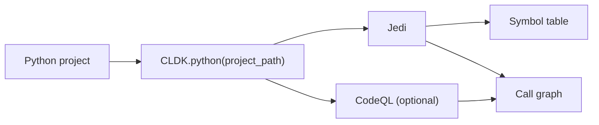

Python is CLDK's second-most complete analyzer. `PythonAnalysis` provides a
typed symbol table, classes and methods, and a call graph through nearly the same
API as [Java](/reference/python-api/java/). [cocoa](/cocoa/) uses these calls for
Python code-context queries.

## Overview

`CLDK.python(project_path=...)` returns a `PythonAnalysis` object backed by
the `codeanalyzer-python` backend, which combines two engines:

- **Jedi** (semantic understanding): symbol resolution, type inference, and the
  baseline call graph.
- **CodeQL** (optional): augments the call graph with more accurate
  inter-procedural edges, at the cost of longer analysis time. Enable it through
  `PyCodeAnalyzerConfig(use_codeql=True)`.



**Project path only.** Python analysis always needs a project directory of valid
Python sources. Pass it as `project_path`:

```python
from cldk import CLDK
from cldk.analysis import AnalysisLevel

analysis = CLDK.python(
    project_path="my_pkg",
    analysis_level=AnalysisLevel.call_graph,
)
```

To tune the in-process backend, pass a `PyCodeAnalyzerConfig` as `backend=`. It
adds `use_codeql` (richer inter-procedural edges) and `use_ray` (parallelism):

```python
from cldk import CLDK
from cldk.analysis import AnalysisLevel
from cldk.analysis.commons.backend_config import PyCodeAnalyzerConfig

analysis = CLDK.python(
    project_path="my_pkg",
    analysis_level=AnalysisLevel.call_graph,
    backend=PyCodeAnalyzerConfig(use_codeql=True),
)
```

**Analysis levels.** The `analysis_level` argument controls how much is computed.
`AnalysisLevel.symbol_table` (the default) populates classes, methods, and
imports. `AnalysisLevel.call_graph` additionally builds the call graph that
`get_call_graph`, `get_callers`, and `get_callees` depend on. Set it when you
need call relationships, as shown above.

## Worked example

Using a generic package, `my_pkg`, as the project under analysis.

### Get the symbol table

```python
# Every file -> its PyModule (classes, functions, imports).
symbol_table = analysis.get_symbol_table()
print(len(analysis.get_classes()), "classes")
# 12 classes
```

`get_symbol_table()` returns `Dict[str, PyModule]` keyed by file path; reach for
`get_classes()` when you want a flat `Dict[str, PyClass]` keyed by qualified name.

### Build a call graph

```python
# Requires analysis_level=AnalysisLevel.call_graph (set during construction).
cg = analysis.get_call_graph()      # networkx.DiGraph, caller -> callee
print(cg)                           # DiGraph with N nodes / M edges
```

The graph is a standard `networkx.DiGraph`, so you can traverse it with networkx
directly. Node identity is backend- and version-dependent, so inspect one node
once to learn its shape before matching on metadata:

```python
node, attrs = next(iter(cg.nodes(data=True)))
print(node, attrs)                  # learn the node id + attribute keys
```

### Find who calls a method

```python
callers = analysis.get_callers(
    target_class_name="my_pkg.models.User",
    target_method_declaration="save",
)
# -> dict of caller signatures + call-site locations
```

For module-level functions, pass an empty string or the module name as
`target_class_name`. Use `get_callees(...)` for the reverse direction (what a
method calls), and `get_class_call_graph(...)` for a class-scoped slice.

See the [common tasks](/guides/common-tasks/) guide for more snippets, the
[concepts](/guides/concepts/) page for how the pieces fit together, and the
[cocoa](/cocoa/), the Code Context Agent plugin, for exposing these calls to an agent.

## API reference

The full generated reference for the Python analysis API and data models
follows.

<!-- CLDK:API:START -->

<!-- AUTO-GENERATED by scripts/gen_api_docs.py, do not edit by hand. -->

[](https://github.com/codellm-devkit/python-sdk) [](https://pypi.org/project/cldk/2.0.0rc4/)

_API reference generated from cldk 2.0.0rc4._

## Analysis

Python analysis facade module.

This module provides the `PythonAnalysis` class, which serves as the primary
interface for performing static analysis on Python projects. It mirrors the API
surface of `JavaAnalysis` to provide a consistent
experience across languages.

The analysis is powered by the ``codeanalyzer-python`` backend, which uses a
combination of:
    - **Jedi**: For semantic code understanding, symbol resolution, and basic
      call graph construction.
    - **PyCG**: For call-graph construction.
    - **Tree-sitter**: For fast syntactic parsing and AST operations.

> **Key capabilities include**
> - Extracting symbol tables with classes, methods, and imports
> - Building call graphs (both intra- and inter-procedural)
> - Querying class hierarchies and inheritance relationships
> - Analyzing method signatures and parameters

> **Note**
> Unlike the Java analysis facade, Python analysis does not support single-file
> ``source_code`` mode. Analysis always requires a project directory containing
> valid Python source files.

> **See Also**
> - `JavaAnalysis`: Java-specific analysis facade.
> - `PyCodeanalyzer`: Backend implementation.

### `PythonAnalysis`

```python
class PythonAnalysis
```

Analysis facade for Python projects.

This class provides a comprehensive interface for performing static analysis
on Python projects. It wraps the ``codeanalyzer-python`` backend and exposes
methods for extracting code structure, call graphs, and symbol information.

> **The facade provides access to**
> - **Symbol tables**: Classes, methods, functions, and their relationships
> - **Call graphs**: Method invocation relationships as NetworkX graphs
> - **Class hierarchies**: Inheritance and composition relationships
> - **Code structure**: Imports, parameters, fields, and nested elements

The analysis is performed lazily on first access to analysis methods, with
results cached by the backend. Use ``eager_analysis=True`` to force
regeneration of all analysis artifacts.

> **See Also**
> - `JavaAnalysis`: Equivalent facade for Java.
> - `PyCodeanalyzer`: Backend.

#### Attributes

| Name | Type | Description |
| ---- | ---- | ----------- |
| `backend_config` | `PyBackend` |  |
| `project_dir` | `` |  |
| `analysis_level` | `` |  |
| `eager_analysis` | `` |  |
| `target_files` | `` |  |
| `treesitter_python` | `TreesitterPython` |  |
| `backend` | `PythonAnalysisBackend` |  |
| `has_resolution_edges` | `bool` | Whether :meth:`get_callsites_for` can resolve call sites on this backend right now. |

#### Methods

##### `PythonAnalysis.is_parsable`

```python
is_parsable(source_code: str) -> bool
```

Check if the given source code is valid Python syntax.

Uses the Tree-sitter Python parser to attempt parsing the source code.
This is useful for validating code snippets before further processing
or for filtering out malformed code.

**Parameters:**

| Name | Type | Description |
| ---- | ---- | ----------- |
| `source_code` | `str` | A string containing Python source code to validate. Can be a complete module, a function definition, or any valid Python code fragment. |

**Returns:**

- `bool`: ``True`` if the source code parses without syntax errors,
- `bool`: ``False`` otherwise. Note that this only checks syntactic validity,
- `bool`: not semantic correctness (e.g., undefined variables won't be caught).

> **See Also**
> `get_raw_ast`: To obtain the full AST for valid code.

##### `PythonAnalysis.get_raw_ast`

```python
get_raw_ast(source_code: str) -> Tree
```

Parse source code and return the Tree-sitter AST.

Parses the provided Python source code using Tree-sitter and returns
the resulting abstract syntax tree. The AST can be traversed to
extract syntactic information about the code structure.

**Parameters:**

| Name | Type | Description |
| ---- | ---- | ----------- |
| `source_code` | `str` | A string containing Python source code to parse. Should be syntactically valid Python code. |

**Returns:**

- `Tree`: A Tree-sitter ``Tree`` object representing the parsed AST. The tree
- `Tree`: contains nodes representing all syntactic elements of the code,
- `Tree`: including functions, classes, statements, and expressions.

> **Note**
> If the source code contains syntax errors, Tree-sitter will still
> return a tree but with ERROR nodes at the locations of parse errors.
> Use `is_parsable` to check for valid syntax first.

> **See Also**
> `is_parsable`: To validate syntax before parsing.

##### `PythonAnalysis.get_application_view`

```python
get_application_view() -> PyApplication
```

Return the complete analyzed application model.

Returns the top-level `PyApplication` object that represents
the entire analyzed Python project. This object contains all modules,
classes, functions, and their relationships discovered during analysis.

**Returns:**

- `PyApplication`: class:`~cldk.models.python.PyApplication` object containing: - All analyzed modules (``modules`` attribute) - Project metadata and configuration - Aggregated statistics about the codebase

> **See Also**
> `get_symbol_table`: For file-keyed access to modules.
> `get_modules`: For a flat list of all modules.

##### `PythonAnalysis.get_symbol_table`

```python
get_symbol_table(paths: Sequence[str] | None = None) -> Dict[str, PyModule]
```

Return the symbol table mapping file paths to module objects.

Returns a dictionary that maps each analyzed file's path to its
corresponding `PyModule` object. This is useful for looking
up module information when you know the file path.

**Parameters:**

| Name | Type | Description |
| ---- | ---- | ----------- |
| `paths` | `Sequence[str] \| None` | Restrict the result to these modules, named by symbol-table key (the module's file path). Absolute paths and native separators are accepted; a path naming no module raises rather than contributing nothing. ``None`` (the default) returns the whole application, on a large graph that is thousands of modules, so prefer naming the ones you need. |

**Returns:**

- `Dict[str, PyModule]`: A dictionary where keys are file paths (as strings) and values are
- `Dict[str, PyModule]`: class:`~cldk.models.python.PyModule` objects containing the
- `Dict[str, PyModule]`: analyzed structure of each file, including classes, functions,
- `Dict[str, PyModule]`: imports, and other symbols.

**Raises:**

- `TypeError`: ``paths`` is a bare string. It takes a *sequence* of paths, a string is a sequence of characters, and iterating it is never what you meant.
- `ValueError`: ``paths`` is an empty sequence. Omit the keyword to enumerate everything; the argument that means "the whole application" is the argument not passed.
- `SelectorNotInGraph`: a path names no module in this application (``cldk.utils.exceptions``, a ``ValueError``). A partial miss raises too, so a short result can never be read as a complete one.

> **See Also**
> `get_python_module`: For direct lookup by file path.
> `get_modules`: For a flat list without file paths.

##### `PythonAnalysis.get_modules`

```python
get_modules() -> List[PyModule]
```

Return a list of all analyzed modules.

Returns all `PyModule` objects discovered during analysis as
a flat list. Each module represents a single Python file and contains
information about its classes, functions, imports, and other symbols.

**Returns:**

- `List[PyModule]`: A list of `PyModule` objects, one for
- `List[PyModule]`: each Python file analyzed in the project.

> **See Also**
> `get_symbol_table`: For file-path-keyed access.
> `get_application_view`: For the full application model.

##### `PythonAnalysis.get_python_file`

```python
get_python_file(qualified_class_name: str) -> str | None
```

Return the file path containing a class with the given signature.

Given a qualified class name (typically including the module path),
returns the file path where that class is defined. This is useful
for navigating from class references back to source files.

**Parameters:**

| Name | Type | Description |
| ---- | ---- | ----------- |
| `qualified_class_name` | `str` | The fully qualified name of the class to locate. This typically includes the module path and class name (e.g., ``"mypackage.module.MyClass"``). |

**Returns:**

- `str \| None`: The file path (as a string) containing the class definition, or
- `str \| None`: ``None`` if no class with the given name is found in the analyzed
- `str \| None`: project.

> **See Also**
> `get_class`: To get the full class object by name.
> `get_python_module`: To get the module for a file path.

##### `PythonAnalysis.get_python_module`

```python
get_python_module(file_path: str) -> PyModule | None
```

Return the module object for a given file path.

Retrieves the `PyModule` object corresponding to a specific
Python source file in the analyzed project.

**Parameters:**

| Name | Type | Description |
| ---- | ---- | ----------- |
| `file_path` | `str` | The path to the Python file, relative to the project root or as an absolute path. |

**Returns:**

- `PyModule \| None`: class:`~cldk.models.python.PyModule` object for the file,
- `PyModule \| None`: containing all analyzed information about classes, functions,
- `PyModule \| None`: imports, and other symbols. Returns ``None`` if the file is
- `PyModule \| None`: not part of the analyzed project.

> **See Also**
> `get_symbol_table`: For bulk access to all modules.
> `get_python_file`: For reverse lookup (class to file).

##### `PythonAnalysis.get_imports`

```python
get_imports() -> Dict[str, List]
```

Return all import statements for each module in the project.

Collects and returns import statements from all analyzed modules,
organized by file path. This is useful for dependency analysis,
understanding module relationships, and identifying external
dependencies.

**Returns:**

- `Dict[str, List]`: A dictionary mapping file paths (strings) to lists of import
- `Dict[str, List]`: objects. Each import object contains information about the
- `Dict[str, List]`: imported module or symbol, including whether it's an absolute
- `Dict[str, List]`: or relative import.

> **See Also**
> `get_python_module`: For detailed module information.

##### `PythonAnalysis.get_call_graph`

```python
get_call_graph(roots: Sequence[str] | None = None, depth: int | None = None) -> nx.DiGraph
```

Return the project call graph as a NetworkX directed graph.

Constructs and returns a directed graph representing method/function
call relationships across the entire project. Each node represents
a callable (function or method), and each edge represents a call
from one callable to another.

**Parameters:**

| Name | Type | Description |
| ---- | ---- | ----------- |
| `roots` | `Sequence[str] \| None` | Restrict the result to the sub-graph reachable from these callables, named by signature. ``None`` (the default) returns the whole application's call graph. |
| `depth` | `int \| None` | Maximum number of call hops from a root, an ``int`` >= 1; ``None`` is unbounded. Requires ``roots``. |

The unscoped graph on a real application runs to hundreds of thousands of edges, which is
not an answer to a question about one function, ``roots=`` and ``depth=`` are how you ask
the question you actually have. The result is the *induced* sub-graph over the reached
nodes, so an edge between two nodes you can see is never silently absent, and a root that
calls nothing is a graph of one node rather than an empty one. A root the graph does not
hold raises `SelectorNotInGraph` instead of quietly
contributing nothing.

> **The call graph is built using**
> - Jedi for semantic call resolution
> - PyCG for inter-procedural call-graph construction

**Returns:**

- `nx.DiGraph`: A ``networkx.DiGraph`` where: - Nodes represent callables (functions/methods) with attributes containing callable metadata - Edges represent call relationships, directed from caller to callee - Edge attributes may include call site information

> **Note**
> The completeness of the call graph depends on the analysis backend
> (Jedi plus PyCG in codeanalyzer-python 0.3.0).

> **See Also**
> `get_callers`: For finding callers of a specific method.
> `get_callees`: For finding callees of a specific method.
> `get_class_call_graph`: For call graph subset by class.

##### `PythonAnalysis.get_call_graph_json`

```python
get_call_graph_json() -> str
```

Return the complete analysis results serialized as JSON.

Serializes the full analysis results, including the call graph and
symbol table, to a JSON string. This is useful for persisting
analysis results, sharing with other tools, or debugging.

**Returns:**

- `str`: A JSON-formatted string containing the complete analysis data,
- `str`: including modules, classes, methods, and call relationships.

> **See Also**
> `get_call_graph`: For the graph object directly.

##### `PythonAnalysis.get_callers`

```python
get_callers(target_class_name: str, target_method_declaration: str) -> Dict
```

Return all methods that call the specified target method.

Finds and returns information about all callables (functions and
methods) that invoke the specified target method. This is useful
for impact analysis and understanding how a method is used.

**Parameters:**

| Name | Type | Description |
| ---- | ---- | ----------- |
| `target_class_name` | `str` | The fully qualified name of the class containing the target method. Use an empty string or module name for module-level functions. |
| `target_method_declaration` | `str` | The method/function name or signature to find callers for. |

**Returns:**

- `Dict`: A dictionary containing information about all callers, including: - Caller method signatures - Call site locations (file and line) - Caller class information (if applicable)

> **See Also**
> `get_callees`: For the reverse direction (what a method calls).
> `get_call_graph`: For the complete call relationship graph.

##### `PythonAnalysis.get_callees`

```python
get_callees(source_class_name: str, source_method_declaration: str) -> Dict
```

Return all methods called by the specified source method.

Finds and returns information about all callables (functions and
methods) that are invoked by the specified source method. This is
useful for understanding method dependencies and tracing execution
paths.

**Parameters:**

| Name | Type | Description |
| ---- | ---- | ----------- |
| `source_class_name` | `str` | The fully qualified name of the class containing the source method. Use an empty string or module name for module-level functions. |
| `source_method_declaration` | `str` | The method/function name or signature to find callees for. |

**Returns:**

- `Dict`: A dictionary containing information about all callees, including: - Callee method signatures - Target class information (if applicable) - Call site locations within the source method

> **See Also**
> `get_callers`: For the reverse direction (who calls a method).
> `get_call_graph`: For the complete call relationship graph.

##### `PythonAnalysis.get_class_call_graph`

```python
get_class_call_graph(qualified_class_name: str, method_signature: str | None = None) -> List[Tuple[str, str]]
```

Return call graph edges reachable from a class or method.

Extracts a subset of the call graph containing only edges reachable
from the specified class (and optionally a specific method within
that class). This is useful for understanding the call structure
of a specific component without the noise of the full project graph.

**Parameters:**

| Name | Type | Description |
| ---- | ---- | ----------- |
| `qualified_class_name` | `str` | The fully qualified name of the class to start traversal from (e.g., ``"mypackage.models.User"``). |
| `method_signature` | `str \| None` | Optional method name or signature to further constrain the starting point. If provided, only edges reachable from that specific method are included. If ``None``, edges from all methods in the class are included. |

**Returns:**

- `List[Tuple[str, str]]`: A list of tuples, where each tuple ``(caller, callee)`` represents
- `List[Tuple[str, str]]`: a directed edge in the call graph. The caller and callee are
- `List[Tuple[str, str]]`: string representations of the callable signatures.

> **See Also**
> `get_call_graph`: For the complete project call graph.
> `get_callees`: For direct callees of a single method.

##### `PythonAnalysis.get_methods`

```python
get_methods() -> Dict[str, Dict[str, PyCallable]]
```

Return all methods in the project grouped by class.

Retrieves all methods (including static methods and class methods)
from all classes in the analyzed project, organized in a nested
dictionary structure by class name and then method name.

**Returns:**

- `Dict[str, Dict[str, PyCallable]]`: A nested dictionary with structure:: { "qualified.class.Name": { "method_name": PyCallable, "another_method": PyCallable, ... }, ... }
- `Dict[str, Dict[str, PyCallable]]`: class:`~cldk.models.python.PyCallable` contains the method's
- `Dict[str, Dict[str, PyCallable]]`: signature, parameters, return type, body, and other metadata.

> **See Also**
> `get_methods_in_class`: For methods of a specific class.
> `get_method`: For a single method by name.

##### `PythonAnalysis.get_callables_overview`

```python
get_callables_overview() -> List[PyCallableOverview]
```

Return a lightweight overview of every callable in the project, in one bulk read.

A field-projected alternative to `get_methods` for enumeration: each
`PyCallableOverview` carries the callable's signature, owning
class (if any), kind, location, and decorators, but not the full reconstruction (call
sites, inner callables, locals). On the Neo4j backend this is a single Cypher query instead
of the per-entity fan-out `get_methods` pays. Body-inspect the few you need afterwards
via `get_method` or `get_method_bodies`.

**Returns:**

- `List[PyCallableOverview]`: A flat list of `PyCallableOverview`, one per callable
- `List[PyCallableOverview]`: (methods, module-level functions, and nested functions).

> **See Also**
> `get_decorated_callables`: The same projection filtered by decorator.
> `get_method_bodies`: Bulk source-body fetch for chosen signatures.

##### `PythonAnalysis.get_method_bodies`

```python
get_method_bodies(signatures: List[str]) -> Dict[str, str]
```

Return source bodies for the given callable signatures, in one bulk read.

**Parameters:**

| Name | Type | Description |
| ---- | ---- | ----------- |
| `signatures` | `List[str]` | Callable signatures to fetch bodies for (e.g. from `get_callables_overview`). |

**Returns:**

- `Dict[str, str]`: A dict mapping each signature to its source body. Signatures with no matching callable
- `Dict[str, str]`: are omitted, as are callables whose ``code`` is ``None``, every returned value is a
- `Dict[str, str]`: real ``str``.

##### `PythonAnalysis.get_decorated_callables`

```python
get_decorated_callables(markers: List[str]) -> List[PyCallableOverview]
```

Return overviews of callables decorated with any of the given markers, in one bulk read.

**Parameters:**

| Name | Type | Description |
| ---- | ---- | ----------- |
| `markers` | `List[str]` | Decorator names to match (e.g. ``["staticmethod", "app.route"]``). |

**Returns:**

- `List[PyCallableOverview]`: A list of `PyCallableOverview` for every callable carrying at
- `List[PyCallableOverview]`: least one of ``markers`` as a decorator.

> **See Also**
> `get_callables_overview`: The unfiltered projection.

##### `PythonAnalysis.get_entrypoints`

```python
get_entrypoints() -> List[PyCallableOverview]
```

Return overviews of every callable the analyzer marked as an entrypoint, in one bulk read.

The analyzer's own entrypoint-detection pass already finds route handlers, CLI commands,
and other externally-invoked callables (``PyCallable.is_entrypoint``); this just surfaces
that mark instead of making a caller rediscover it (e.g. by sharding
`get_callables_overview` across workers to guess which callables are reachable from
outside the application).

**Returns:**

- `List[PyCallableOverview]`: A list of `PyCallableOverview` for every entrypoint
- `List[PyCallableOverview]`: callable. Empty means the project genuinely has none, not that the graph lacks the mark.

> **See Also**
> `get_callables_overview`: The unfiltered projection.
> `get_decorated_callables`: The same projection filtered by decorator instead.
> `get_entrypoint_classes`: The class-level sibling this walk never sees.
> `get_entrypoint_coverage`: Whether the detection pass itself had gaps.

##### `PythonAnalysis.get_entrypoint_classes`

```python
get_entrypoint_classes() -> List[PyClassOverview]
```

Return overviews of every class the analyzer marked as an entrypoint in its own right,
in one bulk read.

`get_entrypoints` walks callables only, so a class-based view (a Django/Flask CBV,
say) marked ``is_entrypoint`` at the class with no individually-marked method is invisible
to it. This is that sibling.

**Returns:**

- `List[PyClassOverview]`: A list of `PyClassOverview` for every entrypoint class.
- `List[PyClassOverview]`: Empty means the project genuinely has none, not that the graph lacks the mark.

> **See Also**
> `get_entrypoints`: The callable-level projection.

##### `PythonAnalysis.get_entrypoint_coverage`

```python
get_entrypoint_coverage() -> EntrypointCoverage
```

Return the entrypoint-detection pass's own coverage/failure record, in one bulk read.

The analyzer's detection pass "under-approximates by design, so silence is its failure
mode" (its own ``PyEntrypointReport`` docstring); `get_entrypoints` returning ``[]``
cannot, on its own, distinguish "ran clean, found none" from "had gaps". This can.

**Returns:**

- `EntrypointCoverage`: class:`~cldk.analysis.commons.results.EntrypointCoverage`. Non-empty
- `EntrypointCoverage`: ``diagnostics`` means this backend cannot supply the report at all (a Neo4j graph
- `EntrypointCoverage`: emitted by codeanalyzer-python 1.4.0 does not carry it) rather than the pass having
- `EntrypointCoverage`: run clean, see the model's
- `EntrypointCoverage`: own docstring for the field-by-field contract.

> **See Also**
> `get_entrypoints`: The accessor whose empty result this disambiguates.

##### `PythonAnalysis.get_callsites_for`

```python
get_callsites_for(signatures: List[str]) -> Dict[str, List[PyCallsite]]
```

Return the call sites of the given callables, keyed by signature, in one bulk read.

Avoids the per-callable reconstruction fan-out when you need call sites for a specific
frontier (e.g. dispatch-edge synthesis or external-reader detection).

**Parameters:**

| Name | Type | Description |
| ---- | ---- | ----------- |
| `signatures` | `List[str]` | Callable signatures to fetch call sites for. |

**Returns:**

- `Dict[str, List[PyCallsite]]`: A dict mapping each existing signature to its list of
- `Dict[str, List[PyCallsite]]`: class:`~cldk.models.python.PyCallsite` (empty if the callable has no call sites).
- `Dict[str, List[PyCallsite]]`: Signatures with no matching callable are omitted.

> **See Also**
> `has_resolution_edges`: Distinguishes a genuinely unresolved call site from a
>     graph with no resolution data at all.

##### `PythonAnalysis.get_external_symbols`

```python
get_external_symbols() -> Dict[str, PyExternalSymbol]
```

Every call-graph endpoint outside the analyzed project (an imported library or builtin
member), keyed by its ``can://…/@external/…`` id.

The analyzer mints one of these ghost symbols for every call target that isn't a declared
class/callable, so no call-graph edge dangles; `get_callsites_for`'s resolved
``callee_signature`` for an external target is exactly this dict's key.

**Returns:**

- `Dict[str, PyExternalSymbol]`: A dict mapping each ``@external`` can-id to its
- `Dict[str, PyExternalSymbol]`: class:`~cldk.models.python.PyExternalSymbol`. Empty means this project's call graph
- `Dict[str, PyExternalSymbol]`: makes no calls outside itself.

##### `PythonAnalysis.get_methods_in_class`

```python
get_methods_in_class(qualified_class_name: str) -> Dict[str, PyCallable]
```

Return all methods defined in a specific class.

Retrieves all methods belonging to the specified class, including
instance methods, class methods, static methods, and special
methods (like ``__init__``, ``__str__``, etc.).

**Parameters:**

| Name | Type | Description |
| ---- | ---- | ----------- |
| `qualified_class_name` | `str` | The fully qualified name of the class (e.g., ``"mypackage.models.User"``). |

**Returns:**

- `Dict[str, PyCallable]`: A dictionary mapping method names (strings) to
- `Dict[str, PyCallable]`: class:`~cldk.models.python.PyCallable` objects. Returns an
- `Dict[str, PyCallable]`: empty dictionary if the class is not found or has no methods.

> **Note**
> Returned callables' call sites are not resolved the way `get_callsites_for`
> resolves them: on the Neo4j backend ``callee_signature`` is always ``None`` here; on
> the local backend an external target keeps Jedi's raw, unaddressable dotted guess
> instead of the resolved ``@external`` can-id. Use `get_callsites_for` for the
> same call sites with resolved signatures.

> **See Also**
> `get_method`: For a single method by name.
> `get_constructors`: For ``__init__`` methods specifically.

##### `PythonAnalysis.get_method`

```python
get_method(qualified_class_name: str, qualified_method_name: str) -> PyCallable | None
```

Return a specific method or module-level function by scope and name.

Retrieves detailed information about a single method, including
its signature, parameters, return type, decorators, and body.

``qualified_class_name`` is looked up the same way as
`get_all_methods_in_application`'s outer keys: a class signature resolves to that
class's methods, and a module name (``PyModule.module_name``) resolves to that module's
top-level functions.

**Parameters:**

| Name | Type | Description |
| ---- | ---- | ----------- |
| `qualified_class_name` | `str` | The fully qualified name of the class containing the method (e.g., ``"mypackage.models.User"``), or a module name for module-level functions. |
| `qualified_method_name` | `str` | The name of the method to retrieve (e.g., ``"save"`` or ``"__init__"``). |

**Returns:**

- `PyCallable \| None`: class:`~cldk.models.python.PyCallable` object containing
- `PyCallable \| None`: all analyzed information about the method, or ``None`` if
- `PyCallable \| None`: neither a matching class nor a matching module resolves.

> **Note**
> The returned callable's call sites are not resolved the way `get_callsites_for`
> resolves them: on the Neo4j backend ``callee_signature`` is always ``None`` here; on
> the local backend an external target keeps Jedi's raw, unaddressable dotted guess
> instead of the resolved ``@external`` can-id. Use `get_callsites_for` for the
> same call sites with resolved signatures.

> **See Also**
> `get_methods_in_class`: For all methods of a class.
> `get_method_parameters`: For just the parameter names.

##### `PythonAnalysis.get_method_parameters`

```python
get_method_parameters(qualified_class_name: str, qualified_method_name: str) -> List[str]
```

Return the parameter names for a specific method.

Retrieves the list of parameter names (excluding ``self`` for
instance methods) defined in the method signature.

**Parameters:**

| Name | Type | Description |
| ---- | ---- | ----------- |
| `qualified_class_name` | `str` | The fully qualified name of the class containing the method. |
| `qualified_method_name` | `str` | The name of the method to get parameters for. |

**Returns:**

- `List[str]`: A list of parameter names as strings, in the order they appear
- `List[str]`: in the method signature. Returns an empty list if the method
- `List[str]`: is not found or has no parameters.

> **Note**
> This returns only parameter names, not types or default values.
> Use `get_method` for full parameter information.

> **See Also**
> `get_method`: For complete method information.

##### `PythonAnalysis.get_constructors`

```python
get_constructors(qualified_class_name: str) -> Dict[str, PyCallable]
```

Return the constructor(s) of a specific class.

Retrieves the ``__init__`` method(s) defined in the specified class.
In Python, a class typically has at most one ``__init__`` method,
but this returns a dictionary for API consistency.

**Parameters:**

| Name | Type | Description |
| ---- | ---- | ----------- |
| `qualified_class_name` | `str` | The fully qualified name of the class (e.g., ``"mypackage.models.User"``). |

**Returns:**

- `Dict[str, PyCallable]`: A dictionary mapping constructor names (typically ``"__init__"``)
- `Dict[str, PyCallable]`: class:`~cldk.models.python.PyCallable` objects. Returns an
- `Dict[str, PyCallable]`: empty dictionary if the class has no explicit constructor.

> **Note**
> Returned callables' call sites are not resolved the way `get_callsites_for`
> resolves them: on the Neo4j backend ``callee_signature`` is always ``None`` here; on
> the local backend an external target keeps Jedi's raw, unaddressable dotted guess
> instead of the resolved ``@external`` can-id. Use `get_callsites_for` for the
> same call sites with resolved signatures.

> **See Also**
> `get_method`: For any method by name.
> `get_methods_in_class`: For all methods including constructors.

##### `PythonAnalysis.locate`

```python
locate(path: str, line: int) -> LocateResult
```

Resolve a source position to its enclosing callable, with the source in hand.

The single most-needed query for triaging a scanner alert: an alert arrives as
``file:line`` and this resolves it to the enclosing callable in one call, rather than
``get_method``, falling back to ``get_callers``, falling back to scanning the symbol table
by hand. Four outcomes stay distinguishable, see
`LocateResult`: inside a callable (``callable`` set,
plus ``body`` when a body node is that precise), at real module scope (``module_scope``
diagnostic), in the gap between two callables (also module scope, never snapped to the
nearest callable), or in a file the graph has no module for (``file_not_in_graph``).

There is no ``col`` parameter. Column-level disambiguation would have to be honoured by
both backends to mean anything, and the Neo4j graph projects only ``start_line`` /
``end_line`` on ``:PyCallable`` and ``:PyBodyNode``, so a ``col`` would work in-process
and be silently ignored over Neo4j. Better absent than documented and inert.

**Parameters:**

| Name | Type | Description |
| ---- | ---- | ----------- |
| `path` | `str` | The file path. Normalised against the backend's module keys, so a ``./``-prefixed or absolute path resolves rather than reading back as ``file_not_in_graph``. |
| `line` | `int` | The 1-based line number. |

**Returns:**

- `LocateResult`: class:`~cldk.analysis.commons.results.LocateResult` carrying the innermost body
- `LocateResult`: node, the enclosing callable, its owning type, its module, and the source slice , 
- `LocateResult`: never an ambiguous empty.

> **See Also**
> `locate_many`: The bulk form, the point, not an optimisation.

##### `PythonAnalysis.locate_many`

```python
locate_many(positions: Sequence[Tuple[str, int]]) -> List[LocateResult]
```

Resolve many ``(path, line)`` positions in one round trip, in input order.

**Parameters:**

| Name | Type | Description |
| ---- | ---- | ----------- |
| `positions` | `Sequence[Tuple[str, int]]` | The ``(path, line)`` pairs to resolve, e.g. from a scanner's alert list. |

**Returns:**

- `List[LocateResult]`: class:`~cldk.analysis.commons.results.LocateResult` per input position, in the
- `List[LocateResult]`: same order.

> **See Also**
> `locate`: The single-position form.

##### `PythonAnalysis.resolve_callable`

```python
resolve_callable(name: str, in_class: str | None = None, in_module: str | None = None) -> SliceNode
```

Resolve a callable name to the one callable it names, in the caller's vocabulary.

The addressing step every name-taking accessor performs, exposed so a caller can perform it
once and keep the answer::

    node = py.resolve_callable("invoice_transaction", in_class="PaymentPortal")
    node.callable   # the full dotted signature -- what get_call_graph(roots=[...]) wants
    node.file, node.line

``name`` matches whole or as a dotted suffix; ``in_class`` is a dotted suffix of the owning
class, ``in_module`` a path (``"controllers/payment.py"``) or a dotted module name
(``"controllers.payment"``). Ambiguity raises with every candidate; nothing is guessed.

**Raises:**

- `AmbiguousName`: More than one callable matched.
- `SelectorNotInGraph`: Nothing matched -- naming the argument that missed.

##### `PythonAnalysis.resolve_value`

```python
resolve_value(name: str, within: str) -> SliceNode
```

Resolve a value name inside a callable -- a parameter, a captured global or a closure
capture -- to the position that carries it.

The same resolution ``slice_backward`` / ``flows_to_call`` perform on their ``src``,
exposed so a caller can check what a name means before asking a question of it::

    py.resolve_value("invoice_id", within="PaymentPortal.invoice_transaction").kind  # "parameter"
    py.resolve_value("AccessError", within="…invoice_transaction").defined_in         # "payment"

**Raises:**

- `AmbiguousName`: ``within`` named more than one callable, or ``name`` more than one value.
- `SelectorNotInGraph`: No such callable, or no such value in it.

##### `PythonAnalysis.get_source`

```python
get_source(node_id: str) -> str
```

Return the source text named by ``node_id``, a callable, or one of its body nodes.

Generalises `get_method_bodies` below callable granularity: ``node_id`` is either a
callable's signature, or the opaque body-node id
`node_id` hands back alongside
`body`, so a statement or call site
`locate` found can be re-fetched precisely, not just the callable enclosing it.

**Parameters:**

| Name | Type | Description |
| ---- | ---- | ----------- |
| `node_id` | `str` | A callable signature, or a body-node id from `locate`, passed back as received, not composed. |

**Returns:**

- `str`: The source text, never an ambiguous empty string.

**Raises:**

- `KeyError`: No callable/body node matches ``node_id``, or it has no recoverable source (no span).
- `NotImplementedError`: (Neo4j backend only) ``node_id`` names a body node, the attached graph carries no source text below callable granularity.

> **See Also**
> `get_method_bodies`: The bulk, callable-only, omit-if-absent form.
> `locate`: The usual way to obtain a ``node_id`` in the first place.

##### `PythonAnalysis.get_cfg`

```python
get_cfg(callable: str, in_class: str | None = None, page_size: int = DEFAULT_PAGE_SIZE, cursor: str | None = None) -> EdgePage[CfgEdge]
```

Return one page of the control flow edges inside one callable.

The callable is the scope; the page is the size bound. Naming a callable says *which*
edges you want, not *how many* there will be, see `get_ddg`, where one callable's
answer runs to 1.39 million edges on a real application. CFG is the small one (the largest
measured is 402 edges), so this returns a single complete page in practice; it pages
anyway, because three sibling accessors that answer in two different shapes are a trap for
anything composing them.

``src`` and ``dst`` are body-node ids in the same vocabulary
`node_id` uses, so an endpoint can be
handed straight back to `get_source`. No ``can://`` URI and no ordinal appears in
either the argument or the result.

**Parameters:**

| Name | Type | Description |
| ---- | ---- | ----------- |
| `callable` | `str` | The callable's name, resolved the way `locate` and the addressing layer resolve names, so ``"charge"`` is enough when it is unique and an ambiguous name raises listing the candidates instead of being guessed at. |
| `in_class` | `str \| None` | Narrow to the class this names, when the bare name is ambiguous. |
| `page_size` | `int` | Most edges in the page. Defaults to `DEFAULT_PAGE_SIZE`. |
| `cursor` | `str \| None` | ``next_cursor`` from a previous page, to continue where it left off. ``None`` starts at the beginning. |

**Returns:**

- `EdgePage[CfgEdge]`: class:`~cldk.analysis.commons.results.EdgePage` of
- `EdgePage[CfgEdge]`: class:`~cldk.models.python.CfgEdge`, each carrying the edge ``kind``
- `EdgePage[CfgEdge]`: (``"true"``/``"false"`` on a conditional, ``"exception"``, ``"loop_back"``, ...), in
- `EdgePage[CfgEdge]`: the canonical order (source, target, kind) that makes this page the same page on
- `EdgePage[CfgEdge]`: every backend.

**Raises:**

- `AmbiguousName`: ``callable`` matched more than one callable.
- `SelectorNotInGraph`: Nothing matched.
- `ValueError`: ``page_size`` below 1, or ``cursor`` not from a previous page.
- `CodeanalyzerUsageException`: This analysis was built below ``analysis_level="program_dependency_graph"``, where the analyzer emits no control or data flow at all, reported rather than returned as a misleading empty page.

> **See Also**
> `get_cdg`, `get_ddg`: The other two graphs of the same callable.

##### `PythonAnalysis.get_cdg`

```python
get_cdg(callable: str, in_class: str | None = None, page_size: int = DEFAULT_PAGE_SIZE, cursor: str | None = None) -> EdgePage[CdgEdge]
```

Return one page of the control dependence edges inside one callable.

``src`` is the branch a ``dst`` is control dependent on, "this statement runs only
because that test went this way", computed by the analyzer over the CFG `get_cfg`
returns.

**Parameters:**

| Name | Type | Description |
| ---- | ---- | ----------- |
| `callable` | `str` | The callable's name, resolved as in `get_cfg`. |
| `in_class` | `str \| None` | Narrow to the class this names. |
| `page_size` | `int` | Most edges in the page. |
| `cursor` | `str \| None` | ``next_cursor`` from a previous page. |

**Returns:**

- `EdgePage[CdgEdge]`: class:`~cldk.analysis.commons.results.EdgePage` of
- `EdgePage[CdgEdge]`: class:`~cldk.models.python.CdgEdge`, ordered by source then target. The largest CDG
- `EdgePage[CdgEdge]`: measured on a real application is 314 edges, so this is one page in practice.

**Raises:**

- `AmbiguousName`: ``callable`` matched more than one callable.
- `SelectorNotInGraph`: Nothing matched.
- `ValueError`: ``page_size`` below 1, or ``cursor`` not from a previous page.
- `CodeanalyzerUsageException`: Analysis level below ``program_dependency_graph``.

##### `PythonAnalysis.get_ddg`

```python
get_ddg(callable: str, in_class: str | None = None, page_size: int = DEFAULT_PAGE_SIZE, cursor: str | None = None) -> EdgePage[DdgEdge]
```

Return one page of the data dependence edges inside one callable.

Every edge names the variable that flows (``var``) and the evidence for it (``prov``), so
a caller separates syntactic dependence from alias-aware dependence without asking a
second question. ``prov`` is one of ``"ssa"``, ``"reaching-defs"`` or ``"points-to"``;
``"points-to"`` is the alias-derived delta that only a level-4 analysis carries, so a
level-3 answer is narrower rather than wrong.

The same statement pair appears more than once when it carries several variables or
several kinds of evidence, that is the point, not duplication.

**This is the accessor pagination exists for.** Per-callable scoping bounds which edges
you get, not how many: the largest single callable measured on a real application has
1,386,918 DDG edges, 27% of the whole application's 5,134,655, and returning that as one
list is around half a gigabyte of objects. 15,520 of that application's 15,549 callables
have fewer than 10,000, so with the default page size the common case is still one call
and no loop::

    page = py.get_ddg("Portal.charge")
    page.total          # 169, the size of the whole answer, not of this page
    page.has_more       # False: this is everything

    while page.has_more:                      # only the outliers need this
        page = py.get_ddg("Portal.charge", cursor=page.next_cursor)

Nothing is discarded to make the page fit: the rest is reachable through
``next_cursor``, and ``total`` says up front how much of it there is.

**Parameters:**

| Name | Type | Description |
| ---- | ---- | ----------- |
| `callable` | `str` | The callable's name, resolved as in `get_cfg`. |
| `in_class` | `str \| None` | Narrow to the class this names. |
| `page_size` | `int` | Most edges in the page. Defaults to `DEFAULT_PAGE_SIZE`. |
| `cursor` | `str \| None` | ``next_cursor`` from a previous page. |

**Returns:**

- `EdgePage[DdgEdge]`: class:`~cldk.analysis.commons.results.EdgePage` of
- `EdgePage[DdgEdge]`: class:`~cldk.models.python.DdgEdge`, in the canonical order (source, target,
- `EdgePage[DdgEdge]`: variable, provenance). An empty page whose ``total`` is 0, from a level-3-or-deeper
- `EdgePage[DdgEdge]`: analysis, is an honest answer: this callable has no data dependence.

**Raises:**

- `AmbiguousName`: ``callable`` matched more than one callable.
- `SelectorNotInGraph`: Nothing matched.
- `ValueError`: ``page_size`` below 1, or ``cursor`` not from a previous page.
- `CodeanalyzerUsageException`: Analysis level below ``program_dependency_graph``, where an empty page could not be told apart from the honest empty above.

##### `PythonAnalysis.slice_backward`

```python
slice_backward(src: str, within: str, depth: int | None = DEFAULT_DEPTH, max_nodes: int = DEFAULT_MAX_NODES) -> Slice
```

Return everything the value ``src`` depends on, its backward slice.

Address the value the way you would say it out loud: a parameter, a module global the
callable reads, or a name it closed over, scoped by the callable it lives in. No
``can://`` id and no ordinal appears in either the argument or the result::

    sl = py.slice_backward("invoice_id", within="PaymentPortal.invoice_transaction")
    sl.total        # how big the whole answer is
    sl.truncated    # whether you are looking at all of it
    sl.resolved     # what the names matched, for audit

The traversal runs in the database, over data dependence, control dependence, argument
passing, returns and call summaries at once. What comes back is a **set** of positions,
not a path, ``paths_between`` is the accessor that answers "how", because one cone of
10,000 nodes holds millions of distinct paths.

**The traversal is bounded by default**, to five hops
(`DEFAULT_DEPTH`). Unbounded, this question has only
two answers on a real application and nothing in between: a value in a callable nothing
calls slices back to exactly **one** node: itself, honestly, because nothing feeds it , 
while a value in a called one reaches a median of **195,786**, a fifth of the program.
Capping the second kind at ``max_nodes`` would hand you 10,000 arbitrary nodes of a
195,819-node closure; bounding the hops instead answers a narrower question *completely*,
and measured over that distribution no slice at five hops is capped at all.

So ``truncated`` should normally be ``False`` and ``total`` should normally be the whole
of what you got. When you want the fifth of the program, ask for it: ``depth=None``.
Between the two, any ``depth=`` bounds the traversal and gives a complete slice of a
smaller question, while ``max_nodes`` only ever gives part of the large one.

**Parameters:**

| Name | Type | Description |
| ---- | ---- | ----------- |
| `src` | `str` | The value's name. A global may be qualified by its module (``"payment.AccessError"``) when the bare name is ambiguous inside the callable. |
| `within` | `str` | The callable to look inside, a suffix of its dotted signature is enough. Required: a value name has no meaning outside a callable. |
| `depth` | `int \| None` | Most hops from the seed. Defaults to `DEFAULT_DEPTH` (5); ``None`` for the whole cone. |
| `max_nodes` | `int` | Most nodes in the result. Defaults to `DEFAULT_MAX_NODES`. |

**Returns:**

- `Slice`: class:`~cldk.analysis.commons.results.Slice` containing the seed, ordered by an
- `Slice`: opaque node id, with ``source`` left unhydrated, pass the nodes you care about to
- `Slice`: ``describe()`` when you want to read them.

**Raises:**

- `AmbiguousName`: ``within`` matched more than one callable, or ``src`` more than one value inside it. The error carries every candidate; nothing is guessed.
- `SelectorNotInGraph`: No such callable, or no such value in it.
- `ValueError`: ``depth`` is not a positive ``int``, or ``max_nodes`` is below 1.
- `CodeanalyzerUsageException`: This analysis was built below ``analysis_level="program_dependency_graph"``, where there is no dataflow to slice.

> **See Also**
> `slice_forward`: The same question the other way round.
> `get_ddg`: One callable's data dependence, without traversal.

##### `PythonAnalysis.slice_forward`

```python
slice_forward(src: str, within: str, depth: int | None = DEFAULT_DEPTH, max_nodes: int = DEFAULT_MAX_NODES) -> Slice
```

Return everything the value ``src`` can affect, its forward slice.

The taint direction, and usually the informative one for a value entering a callable:
nothing flows *into* a parameter except from its callers, so `slice_backward` from
one is often the seed alone, while this follows it through the body and out through every
call it feeds::

    sl = py.slice_forward("invoice_id", within="PaymentPortal.invoice_transaction")
    [n for n in sl.nodes if n.kind == "argument"]   # where it is passed on

Arguments, bounds and failures are `slice_backward`'s, including the five-hop
default. Forward cones are the larger of the two, measured *unbounded*, p95 440,270 nodes
of 885,218 on a real application, so ``depth=None`` is the more expensive request here.

##### `PythonAnalysis.reaches`

```python
reaches(src: str, dst: str, depth: int | None = None) -> bool
```

Return whether there is a call path from ``src`` to ``dst``.

The cheap question to ask before the expensive one: a boolean, computed in the database as
a bounded search, so "is this sink reachable at all" costs no more than it has to. When
the answer is yes and you need the chain, that is ``call_paths_between``.

**Parameters:**

| Name | Type | Description |
| ---- | ---- | ----------- |
| `src` | `str` | The calling callable's name, a dotted suffix is enough when it is unique. |
| `dst` | `str` | The called callable's name. |
| `depth` | `int \| None` | Most call hops; ``None`` (the default) for any distance. Unlike the slices, this one is unbounded by default: a hop budget on a boolean would report "no path" for a path that is merely long, and the unbounded call is cheap anyway (measured 20ms mean, 112ms worst over 200 random pairs). |

**Returns:**

- `bool`: ``True`` when a call path exists. Self-reachability is ``True`` only through a real
- `bool`: ``reaches(x, x)`` is not vacuously true.

**Raises:**

- `AmbiguousName`: Either name matched more than one callable.
- `SelectorNotInGraph`: Either name matched none.
- `ValueError`: ``depth`` is not a positive ``int``.

##### `PythonAnalysis.backward_cone`

```python
backward_cone(sinks: Sequence[str], depth: int | None = DEFAULT_DEPTH, max_nodes: int = DEFAULT_MAX_NODES) -> Slice
```

Return every callable that can reach any of ``sinks``, "what could get here".

A call-graph cone, so its nodes are callables rather than positions inside them. The sinks
are in the result, and a sink nothing calls comes back as its own one-node cone rather
than as an empty answer that could not be told from a name that matched nothing::

    cone = py.backward_cone(["AccountMove.write"])
    cone.total                              # within five call hops, the default
    py.backward_cone([...], depth=None)     # the whole cone: 9,282 for every .write

**Parameters:**

| Name | Type | Description |
| ---- | ---- | ----------- |
| `sinks` | `Sequence[str]` | The callables to walk back from. A bare string is refused, pass ``["name"]`` to walk back from just one, and an empty sequence is refused too, because "everything" is the argument omitted and there is no everything here. |
| `depth` | `int \| None` | Most call hops back. Defaults to `DEFAULT_DEPTH` (5), for one rule across the three traversals; ``None`` for the whole cone. A cone is smaller than a slice, the largest measured is 9,346 callables, under ``max_nodes``, so here the default buys interpretability rather than protection from truncation. |
| `max_nodes` | `int` | Most nodes in the result; a cap that fires is reported by ``truncated`` and quantified by ``total``. |

**Raises:**

- `AmbiguousName`: A sink name matched more than one callable.
- `SelectorNotInGraph`: A sink name matched none.
- `TypeError`: ``sinks`` is a bare string.
- `ValueError`: ``sinks`` is empty, ``depth`` is not a positive ``int``, or ``max_nodes`` is below 1.

##### `PythonAnalysis.callers_of`

```python
callers_of(name: str, in_class: str | None = None, in_module: str | None = None) -> List[SliceNode]
```

Return the callables that call ``name``, addressed by name.

The name-based sibling of `get_all_callers`: that one takes a class signature plus a
method name and returns raw dicts, this one takes a name you already have and returns the
same `SliceNode` shape everything else in this
surface speaks, so going from "who calls this" to a slice needs no translation.

An empty list is unambiguous, a name matching nothing raises, so ``[]`` means "nothing
calls it".

**Parameters:**

| Name | Type | Description |
| ---- | ---- | ----------- |
| `name` | `str` | The callable's name, whole or a dotted suffix of its signature. |
| `in_class` | `str \| None` | Disambiguate by owning class. |
| `in_module` | `str \| None` | Disambiguate by module. |

**Raises:**

- `AmbiguousName`: ``name`` matched more than one callable.
- `SelectorNotInGraph`: Nothing matched.

##### `PythonAnalysis.callees_of`

```python
callees_of(name: str, in_class: str | None = None, in_module: str | None = None) -> List[SliceNode]
```

Return what ``name`` calls, addressed by name, **including calls out of the project**.

An external callee comes back with ``kind="external"`` and a readable dotted name
(``"odoo.exceptions.ValidationError.__init__"``); it has no ``file`` and no ``line``,
because it was never analysed, and ``kind`` is what tells you that rather than leaving
``""`` and ``0`` to be discovered. They are 10% of the call edges on a real application and
usually the ones a caller tracing a sink is looking for, which is why they are not dropped.

**Parameters:**

| Name | Type | Description |
| ---- | ---- | ----------- |
| `name` | `str` | The callable's name, whole or a dotted suffix of its signature. |
| `in_class` | `str \| None` | Disambiguate by owning class. |
| `in_module` | `str \| None` | Disambiguate by module. |

**Raises:**

- `AmbiguousName`: ``name`` matched more than one callable.
- `SelectorNotInGraph`: Nothing matched.

##### `PythonAnalysis.paths_between`

```python
paths_between(src: str, dst: str, src_within: str, dst_within: str, depth: int | None = None, max_paths: int = DEFAULT_MAX_PATHS) -> FlowPaths
```

Return how a value reaches another value, the ordered hops, with the evidence for each.

Where `slice_forward` answers *what a value reaches* as a set,
this answers *how it gets there* as sequences, so a caller can argue a flow rather than
assert one::

    for path in py.paths_between(
        "invoice_id", "invoice_ids",
        src_within="PaymentPortal.invoice_transaction",
        dst_within="PaymentPortal._process_transaction",
    ):
        for hop in path.hops:
            print(hop.via, hop.var, "->", hop.to.callable, hop.to.kind, hop.to.name)
        print("weakest evidence:", path.weakest.via, path.weakest.prov)

Only **shortest** paths come back, and at most ``max_paths`` of them; the result's
``complete`` says whether that was all of them. ``weakest`` on each path names the hop
that caps the claim, the most approximate one (``ssa`` > ``reaching-defs`` >
``points-to``).

Both callables are required. A value cannot be addressed without the callable it enters,
and ``dst_within`` does not default to ``src_within`` because two values of one callable
are joined only through recursion, a default would make the default call the degenerate
case. ``depth`` is unbounded by default, as on every predicate and path accessor: a bound
turns a real flow into an empty result with nothing to say the bound fired (see
`DEFAULT_DEPTH`).

**Parameters:**

| Name | Type | Description |
| ---- | ---- | ----------- |
| `src` | `str` | The value the flow starts at, named as you would say it (``"invoice_id"``). |
| `dst` | `str` | The value it must reach. |
| `src_within` | `str` | The callable ``src`` enters. |
| `dst_within` | `str` | The callable ``dst`` enters. |
| `depth` | `int \| None` | Most hops a path may take; ``None`` (the default) for no bound. A flow longer than an explicit ``depth`` comes back empty. |
| `max_paths` | `int` | Most paths to return. |

**Raises:**

- `AmbiguousName`: A name matched more than one thing.
- `SelectorNotInGraph`: A name matched nothing.
- `ValueError`: ``depth`` is not a positive ``int``, ``max_paths`` is below 1, or ``src`` and ``dst`` are the same position, a path from a node to itself is refused rather than answered ``[]``; ``reaches`` is what asks whether a cycle exists.

> **See Also**
> `slice_forward`: The same reachability as a set, with a ``total``.
> `call_paths_between`: The same shape over the call graph.

##### `PythonAnalysis.call_paths_between`

```python
call_paths_between(src: str, dst: str, depth: int | None = None, max_paths: int = DEFAULT_MAX_PATHS) -> FlowPaths
```

Return how one callable reaches another, as ordered call hops.

The evidence-carrying form of `reaches`: that says *whether*, this says *how*::

    for path in py.call_paths_between("PaymentPortal.invoice_transaction", "AccountMove.write"):
        print(" -> ".join(h.to.callable for h in path.hops))

Every hop is ``via="call"`` with no ``var`` and no ``prov``, because a call edge carries
neither. Takes no ``within``: a callable is addressed by name alone.

**Parameters:**

| Name | Type | Description |
| ---- | ---- | ----------- |
| `src` | `str` | The calling callable. |
| `dst` | `str` | The callable it must reach. |
| `depth` | `int \| None` | Most call hops; ``None`` (the default) for no bound, as on `reaches`. |
| `max_paths` | `int` | Most paths to return; the result's ``complete`` says whether that was all. |

**Raises:**

- `AmbiguousName`: Either name matched more than one callable.
- `SelectorNotInGraph`: Either matched nothing.
- `ValueError`: ``depth`` is not a positive ``int``, ``max_paths`` is below 1, or ``src`` and ``dst`` are the same callable.

##### `PythonAnalysis.flows_to_call`

```python
flows_to_call(src: str, callee: str, within: str, depth: int | None = None) -> bool
```

Does ``src`` reach **any** argument of a call to ``callee``?

A dataflow claim, not a "runs before" one: the target is the set of values that *enter*
``callee``, so ``True`` means the value was passed into a real call. ``within`` scopes
``src`` only, ``callee`` is a callable, addressed by name alone, so there is nothing else
to scope. Unbounded by default, like every predicate here: at five hops this returned
``False`` for a flow that exists, and a bare ``False`` cannot say a bound fired.

**Parameters:**

| Name | Type | Description |
| ---- | ---- | ----------- |
| `src` | `str` | The value, named as you would say it. |
| `callee` | `str` | The called callable. |
| `within` | `str` | The callable ``src`` enters. |
| `depth` | `int \| None` | Most hops; ``None`` (the default) for no bound. With an explicit bound, ``False`` means "not within ``depth`` hops", which is why the bound is nameable. |

**Raises:**

- `AmbiguousName`: A name matched more than one thing.
- `SelectorNotInGraph`: A name matched nothing.

> **See Also**
> `flows_to_argument`: The narrower question, and a different answer.

##### `PythonAnalysis.flows_to_argument`

```python
flows_to_argument(src: str, callee: str, arg: str, within: str, depth: int | None = None) -> bool
```

Does ``src`` reach the argument ``arg`` of a call to ``callee``?

**Not** the same question as `flows_to_call`, which is why it is a separate call: on
odoo-slim-19, ``invoice_id`` of ``PaymentPortal.invoice_transaction`` reaches six of
``_process_transaction``'s seven entering values and not the seventh, so answering the
narrow question with the broad one would over-report. Reaching an argument does imply
reaching the call, and that direction holds by construction.

``arg`` is matched to the parameter **by name**: never by position.

**Parameters:**

| Name | Type | Description |
| ---- | ---- | ----------- |
| `src` | `str` | The value the flow starts at. |
| `callee` | `str` | The called callable. |
| `arg` | `str` | The callee's parameter (or global, or capture) by name. |
| `within` | `str` | The callable ``src`` enters; ``arg`` is scoped by ``callee`` itself. |
| `depth` | `int \| None` | Most hops; ``None`` (the default) for no bound, as on `flows_to_call`. |

**Raises:**

- `AmbiguousName`: A name matched more than one thing.
- `SelectorNotInGraph`: A name matched nothing, including ``arg`` naming no value of ``callee``, which is a mistake worth stopping on rather than a ``False``.

##### `PythonAnalysis.describe`

```python
describe(nodes: Sequence[object]) -> List[SliceNode]
```

Fill in ``source`` for these positions, in one round trip.

A slice, a cone and a path all answer *where*; this answers *what*, and it is a second call
because source is the one field with no size ceiling, a 195,784-node slice carrying text
would be tens of megabytes nobody asked for::

    sl = py.slice_backward("found_email", within="odoo.tools.mail.email_domain_extract")
    for node in py.describe(sl.nodes[:5]):
        print(node.file, node.line, node.source)

Takes anything carrying an address, slice nodes, the ``frm``/``to`` of a path hop, a
``locate()`` result, and gives back the same
`SliceNode` shape with ``source`` filled, so nothing
downstream has to branch on whether a node has been hydrated.

Afterwards, ``source=None`` means exactly one thing: **this position exists and there is no
text for it.** A ref that names nothing raises instead. Which positions have no text
depends on the backend, honestly: a callable hydrates on both; a value vertex (a parameter,
global or capture) hydrates on neither, because it is a dataflow position and not a region
of the file; a statement or call site hydrates only on the local backend, because the graph
carries no text below callable granularity.

**Parameters:**

| Name | Type | Description |
| ---- | ---- | ----------- |
| `nodes` | `Sequence[object]` | The positions to hydrate. An empty sequence costs no round trip. |

**Raises:**

- `KeyError`: A ref names nothing in this application, a stale ref, or one minted against a different graph.
- `TypeError`: An element carries no ref at all.

##### `PythonAnalysis.get_artifacts`

```python
get_artifacts() -> Dict[str, PyArtifact]
```

Return every non-code project artifact (manifest, config file, lockfile, ...), keyed by
its repo-relative path.

This layer (``Artifact``/``ConfigKey``/``Package`` nodes, ``HAS_ARTIFACT``/
``DECLARES_DEPENDENCY``/``DEFINES_CONFIG``/``LOCKS`` edges) is the one part of the graph
every ``codeanalyzer-<lang>`` projects identically and unprefixed.

> **See Also**
> `get_dependencies`, `get_config_keys`, `get_config_uses`.

##### `PythonAnalysis.get_dependencies`

```python
get_dependencies(direct_only: bool = False, ecosystem: str | None = None, declared_in: str | None = None) -> List[PyDependency]
```

Return every declared third-party dependency, one entry per declaring manifest,
optionally filtered.

All three filters default to "don't filter", a pure widening, so existing calls are
unaffected.

**Parameters:**

| Name | Type | Description |
| ---- | ---- | ----------- |
| `direct_only` | `bool` | When ``True``, excludes lockfile-only transitive pins. |
| `ecosystem` | `str \| None` | When given, only dependencies from this package ecosystem (e.g. ``"pypi"``). |
| `declared_in` | `str \| None` | When given, only dependencies declared by this artifact id (see `get_artifacts`). |

##### `PythonAnalysis.get_config_keys`

```python
get_config_keys() -> Dict[str, PyConfigKey]
```

Return every configuration key flattened out of a config-bearing artifact, keyed by its
id (``<artifact-id>@key/<dotted.key>``), a bare ``key`` (e.g. ``"DB_URL"``) is not unique
across artifacts/namespaces, so the id is the dict key.

##### `PythonAnalysis.get_config_uses`

```python
get_config_uses(key: str | None = None) -> List[PyConfigUseEdge]
```

Return resolved code-to-config edges: which body node reads which config key.

**Parameters:**

| Name | Type | Description |
| ---- | ---- | ----------- |
| `key` | `str \| None` | When given, only edges whose target `PyConfigKey` has this bare ``key`` (e.g. ``"DB_URL"``), matched against `get_config_keys`, since `PyConfigUseEdge` itself carries only ``src``/``dst``/``prov``, not the key text. ``None`` (default) returns every edge. |

> **See Also**
> `get_config_readers`: The same edges, resolved to their reading callables.
> `get_unresolved_config_reads`: The reads this can't show, a match the detector
>     found but never closed on a declared key.

##### `PythonAnalysis.get_unresolved_config_reads`

```python
get_unresolved_config_reads() -> List[PyConfigRead]
```

Return every detector-matched config read that never closed on exactly one declared
key, in one bulk read.

`get_config_uses` (and `get_config_readers`) can only show reads that
*resolved*; a call the detector matched but couldn't pin to a key (a dynamic key
expression, or a key with no matching declaration) is otherwise invisible, an empty
`get_config_uses` for some key cannot then distinguish "nothing reads this" from "a
read exists but the analyzer couldn't resolve it." This is that missing signal.

**Returns:**

- `List[PyConfigRead]`: A list of `PyConfigRead`, each naming *why* resolution
- `List[PyConfigRead]`: failed (``reason="non-literal"`` or ``"undefined-key"``). Over the Neo4j backend,
- `List[PyConfigRead]`: ``site`` always comes back ``""`` and several call sites sharing the same
- `List[PyConfigRead]`: ``(callee, key, reason)`` may collapse into one entry, the graph doesn't carry the
- `List[PyConfigRead]`: call site on this edge (see `get_unresolved_config_reads`'s
- `List[PyConfigRead]`: comment), but "no unresolved reads" here is never a false negative.

##### `PythonAnalysis.get_config_readers`

```python
get_config_readers(key: str) -> List[PyCallableOverview]
```

Return overviews of every callable reading configuration key ``key``, in one bulk read.

`get_config_uses` hands back ``PyConfigUseEdge.src``/``dst`` as opaque ordinal ids , 
answering "which callable reads this" otherwise means parsing
``codeanalyzer-python``'s id grammar yourself. This does that resolution for you.

**Parameters:**

| Name | Type | Description |
| ---- | ---- | ----------- |
| `key` | `str` | The bare configuration key (e.g. ``"DB_URL"``), matched the same way `get_config_uses` matches it. |

**Returns:**

- `List[PyCallableOverview]`: A list of `PyCallableOverview`, one per distinct reading
- `List[PyCallableOverview]`: callable. Empty means no callable reads this key, see `get_unresolved_config_reads`
- `List[PyCallableOverview]`: if you need to rule out "a read exists but never resolved" too.

##### `PythonAnalysis.get_classes`

```python
get_classes(module: str | None = None) -> Dict[str, PyClass]
```

Return all classes in the project.

Retrieves all class definitions discovered during analysis, organized
by their fully qualified names. This includes regular classes,
dataclasses, abstract base classes, and nested classes.

**Parameters:**

| Name | Type | Description |
| ---- | ---- | ----------- |
| `module` | `str \| None` | Restrict the result to one module's classes, named by symbol-table key (the module's file path, *not* a dotted module name, so it reads the same way as `get_symbol_table`'s ``paths``). A key naming no module raises. ``None`` (the default) returns every class in the application. |

**Returns:**

- `Dict[str, PyClass]`: A dictionary mapping fully qualified class names (strings) to
- `Dict[str, PyClass]`: class:`~cldk.models.python.PyClass` objects containing class
- `Dict[str, PyClass]`: metadata, methods, attributes, and inheritance information.

**Raises:**

- `SelectorNotInGraph`: ``module`` names no module in this application (``cldk.utils.exceptions``, a ``ValueError``). A mistyped key used to return the same ``{}`` as a module that genuinely declares no classes.

> **See Also**
> `get_class`: For a single class by name.
> `get_classes_by_criteria`: For filtered class retrieval.

##### `PythonAnalysis.get_class`

```python
get_class(qualified_class_name: str) -> PyClass | None
```

Return a specific class by its qualified name.

Retrieves detailed information about a single class, including
its methods, attributes, base classes, and decorators.

**Parameters:**

| Name | Type | Description |
| ---- | ---- | ----------- |
| `qualified_class_name` | `str` | The fully qualified name of the class (e.g., ``"mypackage.models.User"``). |

**Returns:**

- `PyClass \| None`: class:`~cldk.models.python.PyClass` object containing all
- `PyClass \| None`: analyzed information about the class, or ``None`` if the class
- `PyClass \| None`: is not found in the analyzed project.

> **See Also**
> `get_classes`: For all classes in the project.
> `get_python_file`: To find which file contains a class.

##### `PythonAnalysis.get_classes_by_criteria`

```python
get_classes_by_criteria(inclusions: List[str] | None = None, exclusions: List[str] | None = None) -> Dict[str, PyClass]
```

Return classes matching inclusion/exclusion filter criteria.

Filters the project's classes based on substring matching against
their qualified names. Classes are included if their name contains
any inclusion substring AND does not contain any exclusion substring.

**Parameters:**

| Name | Type | Description |
| ---- | ---- | ----------- |
| `inclusions` | `List[str] \| None` | List of substrings that class names must contain to be included. If ``None`` or empty, no inclusion filtering is applied (effectively includes nothing unless you have at least one inclusion pattern). |
| `exclusions` | `List[str] \| None` | List of substrings that class names must NOT contain. Classes matching any exclusion pattern are filtered out, even if they match an inclusion pattern. |

**Returns:**

- `Dict[str, PyClass]`: A dictionary mapping qualified class names to
- `Dict[str, PyClass]`: class:`~cldk.models.python.PyClass` objects for classes
- `Dict[str, PyClass]`: matching the criteria.

> **Note**
> The filtering uses substring matching (``in`` operator), not
> regular expressions or glob patterns.

> **See Also**
> `get_classes`: For all classes without filtering.

##### `PythonAnalysis.get_fields`

```python
get_fields(qualified_class_name: str) -> List[PyClassAttribute]
```

Return class-level attributes (fields) for a specific class.

Retrieves all class attributes defined in the specified class,
including instance attributes, class attributes, and properties.

**Parameters:**

| Name | Type | Description |
| ---- | ---- | ----------- |
| `qualified_class_name` | `str` | The fully qualified name of the class (e.g., ``"mypackage.models.User"``). |

**Returns:**

- `List[PyClassAttribute]`: A list of `PyClassAttribute` objects,
- `List[PyClassAttribute]`: each containing information about an attribute's name, type
- `List[PyClassAttribute]`: annotation (if present), and default value.

> **See Also**
> `get_class`: For complete class information.

##### `PythonAnalysis.get_nested_classes`

```python
get_nested_classes(qualified_class_name: str) -> List[PyClass]
```

Return inner/nested classes defined within a class.

Retrieves all classes that are defined inside the specified class
(nested class definitions).

**Parameters:**

| Name | Type | Description |
| ---- | ---- | ----------- |
| `qualified_class_name` | `str` | The fully qualified name of the outer class (e.g., ``"mypackage.models.Container"``). |

**Returns:**

- `List[PyClass]`: A list of `PyClass` objects for each
- `List[PyClass]`: nested class. Returns an empty list if no nested classes exist.

> **See Also**
> `get_class`: For the outer class information.

##### `PythonAnalysis.get_sub_classes`

```python
get_sub_classes(qualified_class_name: str) -> Dict[str, PyClass]
```

Return all classes that inherit from the specified class.

Finds all classes in the project that directly or indirectly extend
the specified base class. This is useful for understanding class
hierarchies and finding implementations of abstract base classes.

**Parameters:**

| Name | Type | Description |
| ---- | ---- | ----------- |
| `qualified_class_name` | `str` | The fully qualified name of the base class to find subclasses of (e.g., ``"mypackage.base.BaseModel"``). |

**Returns:**

- `Dict[str, PyClass]`: A dictionary mapping qualified class names to
- `Dict[str, PyClass]`: class:`~cldk.models.python.PyClass` objects for all classes
- `Dict[str, PyClass]`: that inherit from the specified class.

> **See Also**
> `get_extended_classes`: For the reverse (what a class extends).

##### `PythonAnalysis.get_extended_classes`

```python
get_extended_classes(qualified_class_name: str) -> List[str]
```

Return the base class names that a class extends.

Retrieves the list of parent/base classes for the specified class.
This includes direct base classes from the class definition.

**Parameters:**

| Name | Type | Description |
| ---- | ---- | ----------- |
| `qualified_class_name` | `str` | The fully qualified name of the class to get base classes for (e.g., ``"mypackage.models.User"``). |

**Returns:**

- `List[str]`: A list of base class names (as strings). These may be qualified
- `List[str]`: or unqualified names depending on how they appear in the source.

> **Note**
> Python does not distinguish between classes and interfaces,
> so all base types are returned here.

> **See Also**
> `get_sub_classes`: For finding classes that extend this class.

## Schema

Python schema models.

Re-exports the canonical Python analysis schema from ``codeanalyzer-python``
so CLDK and the analyzer backend share a single source of truth for the
data model.

### `BodyNode`

```python
class BodyNode(BaseModel)
```

A node in a callable's `body`: an AST region (statement/call/branch/…) or
a synthetic analysis vertex (entry/exit/formal_in/out/actual_in/out).

#### Attributes

| Name | Type | Description |
| ---- | ---- | ----------- |
| `kind` | `str` |  |
| `id` | `str` |  |
| `span` | `Optional[Span]` |  |
| `callee` | `Optional[str]` |  |
| `of` | `Optional[str]` |  |
| `parent` | `Optional[str]` |  |
| `method_name` | `Optional[str]` |  |
| `receiver_expr` | `Optional[str]` |  |
| `receiver_type` | `Optional[str]` |  |
| `return_type` | `Optional[str]` |  |
| `is_constructor_call` | `Optional[bool]` |  |
| `arguments` | `List['PyCallArgument']` |  |

### `CdgEdge`

```python
class CdgEdge(BaseModel)
```

#### Attributes

| Name | Type | Description |
| ---- | ---- | ----------- |
| `src` | `str` |  |
| `dst` | `str` |  |

### `CfgEdge`

```python
class CfgEdge(BaseModel)
```

#### Attributes

| Name | Type | Description |
| ---- | ---- | ----------- |
| `src` | `str` |  |
| `dst` | `str` |  |
| `kind` | `str` |  |

### `DdgEdge`

```python
class DdgEdge(BaseModel)
```

#### Attributes

| Name | Type | Description |
| ---- | ---- | ----------- |
| `src` | `str` |  |
| `dst` | `str` |  |
| `var` | `Optional[str]` |  |
| `prov` | `List[str]` |  |

### `ParamEdge`

```python
class ParamEdge(BaseModel)
```

#### Attributes

| Name | Type | Description |
| ---- | ---- | ----------- |
| `src` | `str` |  |
| `dst` | `str` |  |

### `PyAnalyzerInfo`

```python
class PyAnalyzerInfo(BaseModel)
```

Which analyzer produced this snapshot, and how it was configured.
Lives on the ``Analysis`` envelope (keystone ``analyzer{name,version}``;
``config`` rides additively).

#### Attributes

| Name | Type | Description |
| ---- | ---- | ----------- |
| `name` | `str` |  |
| `version` | `str` |  |
| `config` | `Dict[str, Any]` |  |

### `PyApplication`

```python
class PyApplication(BaseModel)
```

Represents a Python application.

#### Attributes

| Name | Type | Description |
| ---- | ---- | ----------- |
| `symbol_table` | `Dict[str, PyModule]` |  |
| `id` | `str` |  |
| `kind` | `str` |  |
| `call_graph` | `List[PyCallEdge]` |  |
| `external_symbols` | `Dict[str, PyExternalSymbol]` |  |
| `artifacts` | `Dict[str, PyArtifact]` |  |
| `dependencies` | `List[PyDependency]` |  |
| `unresolved_imports` | `List[PyImportBinding]` |  |
| `entrypoint_report` | `PyEntrypointReport` |  |
| `repository` | `Optional[PyRepositoryInfo]` |  |
| `param_in` | `List[ParamEdge]` |  |
| `param_out` | `List[ParamEdge]` |  |
| `config_uses` | `List[PyConfigUseEdge]` |  |
| `config_reads_unresolved` | `List[PyConfigRead]` |  |

### `PyArtifact`

```python
class PyArtifact(BaseModel)
```

Any non-`.py` project file (config, manifest, CI, container spec, or
plain data/binary) -- never dropped from the walk. Captured broadly (node
+ verbatim ``source``); *meaning* is extracted narrowly -- only
``dependency-manifest`` roles feed ``dependencies`` today. ``id`` is
language-neutral (``can://<app>/artifact/<path>``).

#### Attributes

| Name | Type | Description |
| ---- | ---- | ----------- |
| `id` | `str` |  |
| `kind` | `str` |  |
| `path` | `str` |  |
| `format` | `str` |  |
| `roles` | `List[str]` |  |
| `size_bytes` | `int` |  |
| `sha256` | `str` |  |
| `source` | `str` |  |
| `extraction` | `str` |  |
| `config_keys` | `List[PyConfigKey]` |  |

### `PyCallEdge`

```python
class PyCallEdge(BaseModel)
```

Identity-only call-graph edge with weight (keystone shape: the list name
IS the edge type, so there is no ``type`` field).

``src`` and ``dst`` are node ids, the caller's ``can://`` id and the
callee's ``can://`` id (a symbol-table callable or an ``@external`` home).
Rich per-call metadata (receiver, arguments, location, ...) lives on
``PyCallsite`` inside the source ``PyCallable.call_sites``.

#### Attributes

| Name | Type | Description |
| ---- | ---- | ----------- |
| `src` | `str` |  |
| `dst` | `str` |  |
| `weight` | `int` |  |
| `prov` | `List[Literal['jedi', 'defuse']]` |  |

### `PyCallable`

```python
class PyCallable(BaseModel)
```

Represents a Python callable (function/method).

#### Attributes

| Name | Type | Description |
| ---- | ---- | ----------- |
| `name` | `str` |  |
| `path` | `str` |  |
| `signature` | `str` |  |
| `id` | `str` |  |
| `kind` | `str` |  |
| `span` | `Optional[Span]` |  |
| `comments` | `List[PyComment]` |  |
| `decorators` | `List[PyDecorator]` |  |
| `modifiers` | `List[str]` |  |
| `entrypoints` | `List[PyEntrypoint]` |  |
| `is_entrypoint` | `bool` |  |
| `parameters` | `List[PyCallableParameter]` |  |
| `return_type` | `Optional[str]` |  |
| `start_line` | `int` |  |
| `end_line` | `int` |  |
| `code_start_line` | `int` |  |
| `accessed_symbols` | `List[PySymbol]` |  |
| `call_sites` | `List[PyCallsite]` |  |
| `callables` | `Dict[str, 'PyCallable']` |  |
| `types` | `Dict[str, 'PyClass']` |  |
| `local_variables` | `List[PyVariableDeclaration]` |  |
| `cyclomatic_complexity` | `int` |  |
| `body` | `Dict[str, BodyNode]` |  |
| `cfg` | `List[CfgEdge]` |  |
| `cdg` | `List[CdgEdge]` |  |
| `ddg` | `List[DdgEdge]` |  |
| `summary` | `List[SummaryEdge]` |  |

### `PyCallableOverview`

```python
class PyCallableOverview(BaseModel)
```

A lightweight projection of one callable, enough to enumerate and filter without the full
`PyCallable` reconstruction (call-sites, inner callables, locals).

Returned set-at-a-time by `get_callables_overview` /
`get_decorated_callables`. Body-inspect only the few you need afterwards
via `get_method`/`get_method_bodies`.

#### Attributes

| Name | Type | Description |
| ---- | ---- | ----------- |
| `signature` | `str` |  |
| `name` | `str` |  |
| `class_signature` | `Optional[str]` |  |
| `kind` | `str` |  |
| `path` | `str` |  |
| `start_line` | `int` |  |
| `end_line` | `int` |  |
| `decorators` | `List[str]` |  |

### `PyCallableParameter`

```python
class PyCallableParameter(BaseModel)
```

Represents a parameter of a Python callable (function/method).

#### Attributes

| Name | Type | Description |
| ---- | ---- | ----------- |
| `name` | `str` |  |
| `id` | `str` |  |
| `type` | `Optional[str]` |  |
| `default_value` | `Optional[str]` |  |
| `decorators` | `List[PyDecorator]` |  |
| `start_line` | `int` |  |
| `end_line` | `int` |  |
| `start_column` | `int` |  |
| `end_column` | `int` |  |

### `PyCallsite`

```python
class PyCallsite(BaseModel)
```

Represents a Python call site (function or method invocation) with contextual metadata.

#### Attributes

| Name | Type | Description |
| ---- | ---- | ----------- |
| `method_name` | `str` |  |
| `receiver_expr` | `Optional[str]` |  |
| `receiver_type` | `Optional[str]` |  |
| `argument_types` | `List[str]` |  |
| `arguments` | `List[PyCallArgument]` |  |
| `return_type` | `Optional[str]` |  |
| `callee_signature` | `Optional[str]` |  |
| `is_constructor_call` | `bool` |  |
| `start_line` | `int` |  |
| `start_column` | `int` |  |
| `end_line` | `int` |  |
| `end_column` | `int` |  |

### `PyClass`

```python
class PyClass(BaseModel)
```

Represents a Python class.

#### Attributes

| Name | Type | Description |
| ---- | ---- | ----------- |
| `name` | `str` |  |
| `signature` | `str` |  |
| `id` | `str` |  |
| `kind` | `str` |  |
| `span` | `Optional[Span]` |  |
| `comments` | `List[PyComment]` |  |
| `base_classes` | `List[str]` |  |
| `decorators` | `List[PyDecorator]` |  |
| `entrypoints` | `List[PyEntrypoint]` |  |
| `is_entrypoint` | `bool` |  |
| `callables` | `Dict[str, PyCallable]` |  |
| `attributes` | `Dict[str, PyClassAttribute]` |  |
| `types` | `Dict[str, 'PyClass']` |  |
| `start_line` | `int` |  |
| `end_line` | `int` |  |

### `PyClassAttribute`

```python
class PyClassAttribute(BaseModel)
```

Represents a Python class attribute.

#### Attributes

| Name | Type | Description |
| ---- | ---- | ----------- |
| `name` | `str` |  |
| `type` | `Optional[str]` |  |
| `initializer` | `Optional[str]` |  |
| `comments` | `List[PyComment]` |  |
| `decorators` | `List[PyDecorator]` |  |
| `start_line` | `int` |  |
| `end_line` | `int` |  |

### `PyClassOverview`

```python
class PyClassOverview(BaseModel)
```

A lightweight projection of one class, the class-level counterpart to
`PyCallableOverview`, for classes the analyzer marked as entrypoints in their own right
(``PyClass.is_entrypoint``), independent of any individual method.

A class-based view (a Django/Flask class-based view, say) can be marked as an entrypoint at
the class level with none of its methods individually marked, ``get_entrypoints()`` walks
callables only, so it never sees these. Returned by
`get_entrypoint_classes`.

#### Attributes

| Name | Type | Description |
| ---- | ---- | ----------- |
| `signature` | `str` |  |
| `name` | `str` |  |
| `path` | `str` |  |
| `start_line` | `int` |  |
| `end_line` | `int` |  |
| `decorators` | `List[str]` |  |

### `PyComment`

```python
class PyComment(BaseModel)
```

Represents a Python comment.

#### Attributes

| Name | Type | Description |
| ---- | ---- | ----------- |
| `content` | `str` |  |
| `start_line` | `int` |  |
| `end_line` | `int` |  |
| `start_column` | `int` |  |
| `end_column` | `int` |  |
| `is_docstring` | `bool` |  |

### `PyConfigKey`

```python
class PyConfigKey(BaseModel)
```

A configuration key flattened out of a config-bearing ``PyArtifact``
(#152). Graph vocabulary stays neutral (label ``ConfigKey``, edge
``DEFINES_CONFIG``) -- the ``Py`` prefix here is only the ``PyArtifact``
naming precedent, not a Python-specific claim. L1 data, identical at
every analysis level; nested under the owning artifact, containment
mirrors ``DEFINES_CONFIG``.

#### Attributes

| Name | Type | Description |
| ---- | ---- | ----------- |
| `id` | `str` |  |
| `key` | `str` |  |
| `namespace` | `str` |  |
| `value` | `Optional[str]` |  |
| `span` | `Optional[Span]` |  |
| `references` | `List[str]` |  |

### `PyConfigRead`

```python
class PyConfigRead(BaseModel)
```

A detector-matched call whose key did not close on exactly one string
literal -- first-class so a config read nobody can trace is as visible
as one that resolves (#162). ``key`` is the decoded literal text only
when it IS a literal but matches no declared ``PyConfigKey``
(``reason="undefined-key"``); ``None`` for a key that never closed on a
literal at all (``reason="non-literal"``). ``prov`` lists every tier
that was attempted before giving up.

#### Attributes

| Name | Type | Description |
| ---- | ---- | ----------- |
| `site` | `str` |  |
| `callee` | `str` |  |
| `key` | `Optional[str]` |  |
| `reason` | `Literal['non-literal', 'undefined-key']` |  |
| `prov` | `List[Literal['literal', 'dataflow']]` |  |

### `PyConfigUseEdge`

```python
class PyConfigUseEdge(BaseModel)
```

One resolved config read (#162): a detector-matched call's key
argument closed on exactly one string literal that matches a declared
``PyConfigKey``. ``src`` is the call's GLOBAL ordinal id
(``<callable-id>@<local-id>``); ``dst`` is the matched ``PyConfigKey.id``
-- application scope, mirroring ``param_in`` (endpoints span callables/
artifacts). Superset-monotonic across levels, same additive contract as
the DDG's ``prov`` widening: literal (``-a 2``+) subset of +dataflow
(``-a 3``/``-a 4``).

#### Attributes

| Name | Type | Description |
| ---- | ---- | ----------- |
| `src` | `str` |  |
| `dst` | `str` |  |
| `prov` | `List[Literal['literal', 'dataflow']]` |  |

### `PyDecorator`

```python
class PyDecorator(BaseModel)
```

One decorator application, structured rather than a source string (#128).

``name`` is the spelling as written (``lru_cache``, ``builtins.staticmethod``);
``qualified_name`` is Jedi's resolution of it (``functools.lru_cache``) and is
absent when it cannot be resolved. ``expression`` keeps the full unparsed source
so nothing is lost for decorators too complex to decompose.

#### Attributes

| Name | Type | Description |
| ---- | ---- | ----------- |
| `name` | `str` |  |
| `qualified_name` | `Optional[str]` |  |
| `positional_arguments` | `List[str]` |  |
| `keyword_arguments` | `Dict[str, str]` |  |
| `expression` | `str` |  |
| `span` | `Optional[Span]` |  |

### `PyDependency`

```python
class PyDependency(BaseModel)
```

One declared third-party dependency, evidence-tagged via ``prov``.

#### Attributes

| Name | Type | Description |
| ---- | ---- | ----------- |
| `name` | `str` |  |
| `ecosystem` | `str` |  |
| `spec` | `str` |  |
| `kind` | `str` |  |
| `extras` | `List[str]` |  |
| `declared_in` | `str` |  |
| `direct` | `bool` |  |
| `locked_version` | `Optional[str]` |  |
| `provides_imports` | `List[str]` |  |
| `prov` | `List[str]` |  |

### `PyEntrypoint`

```python
class PyEntrypoint(BaseModel)
```

One way a callable or class is invoked from outside the application (#27).

A node may hold several: two ``@app.route`` decorators, or a function that
is both a Celery task and a CLI command. ``confidence`` lets a consumer
threshold on evidence quality rather than inheriting this analyzer's
judgement.

#### Attributes

| Name | Type | Description |
| ---- | ---- | ----------- |
| `framework` | `str` |  |
| `confidence` | `str` |  |
| `rule` | `str` |  |
| `ruleset` | `str` |  |
| `evidence` | `Optional[str]` |  |
| `route` | `Optional[str]` |  |
| `http_methods` | `List[str]` |  |
| `via` | `Optional[str]` |  |

### `PyExternalSymbol`

```python
class PyExternalSymbol(BaseModel)
```

A call-graph target outside the analyzed project -- an imported library or
builtin member. An edge-endpoint id home, not a tree node: keyed in
``PyApplication.external_symbols`` by its ``can://…/@external/…`` id.

#### Attributes

| Name | Type | Description |
| ---- | ---- | ----------- |
| `id` | `str` |  |
| `kind` | `str` |  |
| `name` | `str` |  |
| `module` | `Optional[str]` |  |

### `PyImport`

```python
class PyImport(BaseModel)
```

Represents a Python import statement.

#### Attributes

| Name | Type | Description |
| ---- | ---- | ----------- |
| `module` | `str` |  |
| `name` | `str` |  |
| `alias` | `Optional[str]` |  |
| `resolved_module` | `Optional[str]` |  |
| `start_line` | `int` |  |
| `end_line` | `int` |  |
| `start_column` | `int` |  |
| `end_column` | `int` |  |

### `PyModule`

```python
class PyModule(BaseModel)
```

Represents a Python module.

#### Attributes

| Name | Type | Description |
| ---- | ---- | ----------- |
| `file_path` | `str` |  |
| `module_name` | `str` |  |
| `id` | `str` |  |
| `kind` | `str` |  |
| `source` | `str` |  |
| `imports` | `List[PyImport]` |  |
| `comments` | `List[PyComment]` |  |
| `types` | `Dict[str, PyClass]` |  |
| `functions` | `Dict[str, PyCallable]` |  |
| `variables` | `List[PyVariableDeclaration]` |  |
| `content_hash` | `Optional[str]` |  |
| `last_modified` | `Optional[float]` |  |
| `file_size` | `Optional[int]` |  |

### `PySymbol`

```python
class PySymbol(BaseModel)
```

Represents a symbol used or declared in Python code.

#### Attributes

| Name | Type | Description |
| ---- | ---- | ----------- |
| `name` | `str` |  |
| `scope` | `Literal['local', 'nonlocal', 'global', 'class', 'module']` |  |
| `kind` | `Literal['variable', 'parameter', 'attribute', 'function', 'class', 'module']` |  |
| `type` | `Optional[str]` |  |
| `qualified_name` | `Optional[str]` |  |
| `is_builtin` | `bool` |  |
| `lineno` | `int` |  |
| `col_offset` | `int` |  |

### `PyVariableDeclaration`

```python
class PyVariableDeclaration(BaseModel)
```

Represents a Python variable declaration.

#### Attributes

| Name | Type | Description |
| ---- | ---- | ----------- |
| `name` | `str` |  |
| `type` | `Optional[str]` |  |
| `initializer` | `Optional[str]` |  |
| `value` | `Optional[Any]` |  |
| `scope` | `Literal['module', 'class', 'function']` |  |
| `start_line` | `int` |  |
| `end_line` | `int` |  |
| `start_column` | `int` |  |
| `end_column` | `int` |  |

### `Span`

```python
class Span(BaseModel)
```

Where a node lives in source. `start`/`end` are [line, col] (1-based line,
0-based col, ast semantics); `bytes` are utf-8 offsets into module.source.

#### Attributes

| Name | Type | Description |
| ---- | ---- | ----------- |
| `start` | `Tuple[int, int]` |  |
| `end` | `Tuple[int, int]` |  |
| `bytes` | `Tuple[int, int]` |  |

### `SummaryEdge`

```python
class SummaryEdge(BaseModel)
```

#### Attributes

| Name | Type | Description |
| ---- | ---- | ----------- |
| `src` | `str` |  |
| `dst` | `str` |  |

<!-- CLDK:API:END -->

