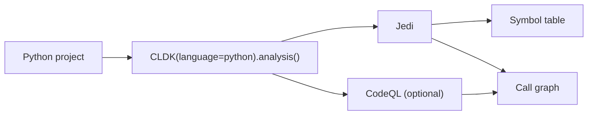

Python is CLDK's second-most complete analyzer. `PythonAnalysis` provides a
typed symbol table, classes and methods, and a call graph through nearly the same
API as [Java](/reference/python-api/java/). [cocoa](/cocoa/) uses these calls for
Python code-context queries.

## Overview

`CLDK(language="python").analysis(...)` returns a `PythonAnalysis` object backed by
the `codeanalyzer-python` backend, which combines two engines:

- **Jedi** (semantic understanding): symbol resolution, type inference, and the
  baseline call graph.
- **CodeQL** (optional, `use_codeql=True`): augments the call graph with more
  accurate inter-procedural edges, at the cost of longer analysis time.



**Project path only.** Python analysis always needs a project directory of valid
Python sources. Pass it as `project_path`:

```python
from cldk import CLDK
from cldk.analysis import AnalysisLevel

analysis = CLDK(language="python").analysis(
    project_path="my_pkg",
    analysis_level=AnalysisLevel.call_graph,
    # use_codeql=True,  # optional: richer inter-procedural edges
)
```

**Analysis levels.** The `analysis_level` argument controls how much is computed.
`AnalysisLevel.symbol_table` (the default) populates classes, methods, and
imports. `AnalysisLevel.call_graph` additionally builds the call graph that
`get_call_graph`, `get_callers`, and `get_callees` depend on. Set it when you
need call relationships, as shown above.

## Worked example

Using a generic package, `my_pkg`, as the project under analysis.

### Get the symbol table

```python
# Every file -> its PyModule (classes, functions, imports).
symbol_table = analysis.get_symbol_table()
print(len(analysis.get_classes()), "classes")
# 12 classes
```

`get_symbol_table()` returns `Dict[str, PyModule]` keyed by file path; reach for
`get_classes()` when you want a flat `Dict[str, PyClass]` keyed by qualified name.

### Build a call graph

```python
# Requires analysis_level=AnalysisLevel.call_graph (set during construction).
cg = analysis.get_call_graph()      # networkx.DiGraph, caller -> callee
print(cg)                           # DiGraph with N nodes / M edges
```

The graph is a standard `networkx.DiGraph`, so you can traverse it with networkx
directly. Node identity is backend- and version-dependent, so inspect one node
once to learn its shape before matching on metadata:

```python
node, attrs = next(iter(cg.nodes(data=True)))
print(node, attrs)                  # learn the node id + attribute keys
```

### Find who calls a method

```python
callers = analysis.get_callers(
    target_class_name="my_pkg.models.User",
    target_method_declaration="save",
)
# -> dict of caller signatures + call-site locations
```

For module-level functions, pass an empty string or the module name as
`target_class_name`. Use `get_callees(...)` for the reverse direction (what a
method calls), and `get_class_call_graph(...)` for a class-scoped slice.

See the [common tasks](/guides/common-tasks/) guide for more snippets, the
[concepts](/guides/concepts/) page for how the pieces fit together, and the
[cocoa](/cocoa/), the Code Context Agent plugin, for exposing these calls to an agent.

## API reference

The full generated reference for the Python analysis API and data models
follows.

<!-- CLDK:API:START -->

<!-- AUTO-GENERATED by scripts/gen_api_docs.py, do not edit by hand. -->

[](https://github.com/codellm-devkit/python-sdk)

## Analysis

Python module

### `PythonAnalysis`

```python
class PythonAnalysis
```

Python Analysis Class

#### Attributes

| Name | Type | Description |
| ---- | ---- | ----------- |
| `project_dir` | `` |  |
| `source_code` | `` |  |
| `analysis_backend` | `TreesitterPython` |  |

#### Methods

##### `PythonAnalysis.get_methods`

```python
get_methods() -> List[PyMethod]
```

Given an application or a source code, get all the methods

##### `PythonAnalysis.get_functions`

```python
get_functions() -> List[PyMethod]
```

Given an application or a source code, get all the methods

##### `PythonAnalysis.get_modules`

```python
get_modules() -> List[PyModule]
```

Given the project directory, get all the modules

##### `PythonAnalysis.get_method_details`

```python
get_method_details(method_signature: str) -> PyMethod
```

Given the code body and the method signature, returns the method details related to that method
Parameters
----------
method_signature: method signature

Returns
-------
    PyMethod: Returns the method details related to that method

##### `PythonAnalysis.is_parsable`

```python
is_parsable(source_code: str) -> bool
```

Check if the code is parsable
Args:
    source_code: source code

**Returns:**

- `bool`: True if the code is parsable, False otherwise

##### `PythonAnalysis.get_raw_ast`

```python
get_raw_ast(source_code: str) -> str
```

Get the raw AST
Args:
    code: source code

**Returns:**

- `str`: the raw AST

##### `PythonAnalysis.get_imports`

```python
get_imports() -> List[PyImport]
```

Given an application or a source code, get all the imports

##### `PythonAnalysis.get_variables`

```python
get_variables(**kwargs)
```

Given an application or a source code, get all the variables

##### `PythonAnalysis.get_classes`

```python
get_classes() -> List[PyClass]
```

Given an application or a source code, get all the classes

##### `PythonAnalysis.get_classes_by_criteria`

```python
get_classes_by_criteria(**kwargs)
```

Given an application or a source code, get all the classes given the inclusion and exclution criteria

##### `PythonAnalysis.get_sub_classes`

```python
get_sub_classes(**kwargs)
```

Given an application or a source code, get all the sub-classes

##### `PythonAnalysis.get_nested_classes`

```python
get_nested_classes(**kwargs)
```

Given an application or a source code, get all the nested classes

##### `PythonAnalysis.get_constructors`

```python
get_constructors(**kwargs)
```

Given an application or a source code, get all the constructors

##### `PythonAnalysis.get_methods_in_class`

```python
get_methods_in_class(**kwargs)
```

Given an application or a source code, get all the methods within the given class

##### `PythonAnalysis.get_fields`

```python
get_fields(**kwargs)
```

Given an application or a source code, get all the fields

## Schema

Python package

_No public symbols are exposed by this module._

<!-- CLDK:API:END -->
