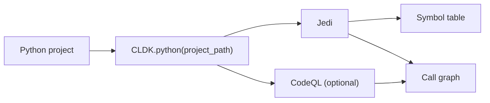

Python is CLDK's second-most complete analyzer. `PythonAnalysis` provides a
typed symbol table, classes and methods, and a call graph through nearly the same
API as [Java](/reference/python-api/java/). [cocoa](/cocoa/) uses these calls for
Python code-context queries.

## Overview

`CLDK.python(project_path=...)` returns a `PythonAnalysis` object backed by
the `codeanalyzer-python` backend, which combines two engines:

- **Jedi** (semantic understanding): symbol resolution, type inference, and the
  baseline call graph.
- **CodeQL** (optional): augments the call graph with more accurate
  inter-procedural edges, at the cost of longer analysis time. Enable it through
  `PyCodeAnalyzerConfig(use_codeql=True)`.



**Project path only.** Python analysis always needs a project directory of valid
Python sources. Pass it as `project_path`:

```python
from cldk import CLDK
from cldk.analysis import AnalysisLevel

analysis = CLDK.python(
    project_path="my_pkg",
    analysis_level=AnalysisLevel.call_graph,
)
```

To tune the in-process backend, pass a `PyCodeAnalyzerConfig` as `backend=`. It
adds `use_codeql` (richer inter-procedural edges) and `use_ray` (parallelism):

```python
from cldk import CLDK
from cldk.analysis import AnalysisLevel
from cldk.analysis.commons.backend_config import PyCodeAnalyzerConfig

analysis = CLDK.python(
    project_path="my_pkg",
    analysis_level=AnalysisLevel.call_graph,
    backend=PyCodeAnalyzerConfig(use_codeql=True),
)
```

**Analysis levels.** The `analysis_level` argument controls how much is computed.
`AnalysisLevel.symbol_table` (the default) populates classes, methods, and
imports. `AnalysisLevel.call_graph` additionally builds the call graph that
`get_call_graph`, `get_callers`, and `get_callees` depend on. Set it when you
need call relationships, as shown above.

## Worked example

Using a generic package, `my_pkg`, as the project under analysis.

### Get the symbol table

```python
# Every file -> its PyModule (classes, functions, imports).
symbol_table = analysis.get_symbol_table()
print(len(analysis.get_classes()), "classes")
# 12 classes
```

`get_symbol_table()` returns `Dict[str, PyModule]` keyed by file path; reach for
`get_classes()` when you want a flat `Dict[str, PyClass]` keyed by qualified name.

### Build a call graph

```python
# Requires analysis_level=AnalysisLevel.call_graph (set during construction).
cg = analysis.get_call_graph()      # networkx.DiGraph, caller -> callee
print(cg)                           # DiGraph with N nodes / M edges
```

The graph is a standard `networkx.DiGraph`, so you can traverse it with networkx
directly. Node identity is backend- and version-dependent, so inspect one node
once to learn its shape before matching on metadata:

```python
node, attrs = next(iter(cg.nodes(data=True)))
print(node, attrs)                  # learn the node id + attribute keys
```

### Find who calls a method

```python
callers = analysis.get_callers(
    target_class_name="my_pkg.models.User",
    target_method_declaration="save",
)
# -> dict of caller signatures + call-site locations
```

For module-level functions, pass an empty string or the module name as
`target_class_name`. Use `get_callees(...)` for the reverse direction (what a
method calls), and `get_class_call_graph(...)` for a class-scoped slice.

See the [common tasks](/guides/common-tasks/) guide for more snippets, the
[concepts](/guides/concepts/) page for how the pieces fit together, and the
[cocoa](/cocoa/), the Code Context Agent plugin, for exposing these calls to an agent.

## API reference

The full generated reference for the Python analysis API and data models
follows.

<!-- CLDK:API:START -->

<!-- AUTO-GENERATED by scripts/gen_api_docs.py, do not edit by hand. -->

[](https://github.com/codellm-devkit/python-sdk)

## Analysis

Python analysis facade module.

This module provides the `PythonAnalysis` class, which serves as the primary
interface for performing static analysis on Python projects. It mirrors the API
surface of `JavaAnalysis` to provide a consistent
experience across languages.

The analysis is powered by the ``codeanalyzer-python`` backend, which uses a
combination of:
    - **Jedi**: For semantic code understanding, symbol resolution, and basic
      call graph construction.
    - **CodeQL** (optional): For enhanced call graph resolution and more
      accurate inter-procedural analysis.
    - **Tree-sitter**: For fast syntactic parsing and AST operations.

> **Key capabilities include**
> - Extracting symbol tables with classes, methods, and imports
> - Building call graphs (both intra- and inter-procedural)
> - Querying class hierarchies and inheritance relationships
> - Analyzing method signatures and parameters

> **Note**
> Unlike the Java analysis facade, Python analysis does not support single-file
> ``source_code`` mode. Analysis always requires a project directory containing
> valid Python source files.

> **See Also**
> - `JavaAnalysis`: Java-specific analysis facade.
> - `PyCodeanalyzer`: Backend implementation.

### `PythonAnalysis`

```python
class PythonAnalysis
```

Analysis facade for Python projects.

This class provides a comprehensive interface for performing static analysis
on Python projects. It wraps the ``codeanalyzer-python`` backend and exposes
methods for extracting code structure, call graphs, and symbol information.

> **The facade provides access to**
> - **Symbol tables**: Classes, methods, functions, and their relationships
> - **Call graphs**: Method invocation relationships as NetworkX graphs
> - **Class hierarchies**: Inheritance and composition relationships
> - **Code structure**: Imports, parameters, fields, and nested elements

The analysis is performed lazily on first access to analysis methods, with
results cached by the backend. Use ``eager_analysis=True`` to force
regeneration of all analysis artifacts.

> **See Also**
> - `JavaAnalysis`: Equivalent facade for Java.
> - `PyCodeanalyzer`: Backend.

#### Attributes

| Name | Type | Description |
| ---- | ---- | ----------- |
| `backend_config` | `PyBackend` |  |
| `project_dir` | `` |  |
| `analysis_level` | `` |  |
| `eager_analysis` | `` |  |
| `target_files` | `` |  |
| `treesitter_python` | `TreesitterPython` |  |
| `backend` | `PythonAnalysisBackend` |  |

#### Methods

##### `PythonAnalysis.is_parsable`

```python
is_parsable(source_code: str) -> bool
```

Check if the given source code is valid Python syntax.

Uses the Tree-sitter Python parser to attempt parsing the source code.
This is useful for validating code snippets before further processing
or for filtering out malformed code.

**Parameters:**

| Name | Type | Description |
| ---- | ---- | ----------- |
| `source_code` | `str` | A string containing Python source code to validate. Can be a complete module, a function definition, or any valid Python code fragment. |

**Returns:**

- `bool`: ``True`` if the source code parses without syntax errors,
- `bool`: ``False`` otherwise. Note that this only checks syntactic validity,
- `bool`: not semantic correctness (e.g., undefined variables won't be caught).

> **See Also**
> `get_raw_ast`: To obtain the full AST for valid code.

##### `PythonAnalysis.get_raw_ast`

```python
get_raw_ast(source_code: str) -> Tree
```

Parse source code and return the Tree-sitter AST.

Parses the provided Python source code using Tree-sitter and returns
the resulting abstract syntax tree. The AST can be traversed to
extract syntactic information about the code structure.

**Parameters:**

| Name | Type | Description |
| ---- | ---- | ----------- |
| `source_code` | `str` | A string containing Python source code to parse. Should be syntactically valid Python code. |

**Returns:**

- `Tree`: A Tree-sitter ``Tree`` object representing the parsed AST. The tree
- `Tree`: contains nodes representing all syntactic elements of the code,
- `Tree`: including functions, classes, statements, and expressions.

> **Note**
> If the source code contains syntax errors, Tree-sitter will still
> return a tree but with ERROR nodes at the locations of parse errors.
> Use `is_parsable` to check for valid syntax first.

> **See Also**
> `is_parsable`: To validate syntax before parsing.

##### `PythonAnalysis.get_application_view`

```python
get_application_view() -> PyApplication
```

Return the complete analyzed application model.

Returns the top-level `PyApplication` object that represents
the entire analyzed Python project. This object contains all modules,
classes, functions, and their relationships discovered during analysis.

**Returns:**

- `PyApplication`: class:`~cldk.models.python.PyApplication` object containing: - All analyzed modules (``modules`` attribute) - Project metadata and configuration - Aggregated statistics about the codebase

> **See Also**
> `get_symbol_table`: For file-keyed access to modules.
> `get_modules`: For a flat list of all modules.

##### `PythonAnalysis.get_symbol_table`

```python
get_symbol_table() -> Dict[str, PyModule]
```

Return the symbol table mapping file paths to module objects.

Returns a dictionary that maps each analyzed file's path to its
corresponding `PyModule` object. This is useful for looking
up module information when you know the file path.

**Returns:**

- `Dict[str, PyModule]`: A dictionary where keys are file paths (as strings) and values are
- `Dict[str, PyModule]`: class:`~cldk.models.python.PyModule` objects containing the
- `Dict[str, PyModule]`: analyzed structure of each file, including classes, functions,
- `Dict[str, PyModule]`: imports, and other symbols.

> **See Also**
> `get_python_module`: For direct lookup by file path.
> `get_modules`: For a flat list without file paths.

##### `PythonAnalysis.get_modules`

```python
get_modules() -> List[PyModule]
```

Return a list of all analyzed modules.

Returns all `PyModule` objects discovered during analysis as
a flat list. Each module represents a single Python file and contains
information about its classes, functions, imports, and other symbols.

**Returns:**

- `List[PyModule]`: A list of `PyModule` objects, one for
- `List[PyModule]`: each Python file analyzed in the project.

> **See Also**
> `get_symbol_table`: For file-path-keyed access.
> `get_application_view`: For the full application model.

##### `PythonAnalysis.get_python_file`

```python
get_python_file(qualified_class_name: str) -> str | None
```

Return the file path containing a class with the given signature.

Given a qualified class name (typically including the module path),
returns the file path where that class is defined. This is useful
for navigating from class references back to source files.

**Parameters:**

| Name | Type | Description |
| ---- | ---- | ----------- |
| `qualified_class_name` | `str` | The fully qualified name of the class to locate. This typically includes the module path and class name (e.g., ``"mypackage.module.MyClass"``). |

**Returns:**

- `str \| None`: The file path (as a string) containing the class definition, or
- `str \| None`: ``None`` if no class with the given name is found in the analyzed
- `str \| None`: project.

> **See Also**
> `get_class`: To get the full class object by name.
> `get_python_module`: To get the module for a file path.

##### `PythonAnalysis.get_python_module`

```python
get_python_module(file_path: str) -> PyModule | None
```

Return the module object for a given file path.

Retrieves the `PyModule` object corresponding to a specific
Python source file in the analyzed project.

**Parameters:**

| Name | Type | Description |
| ---- | ---- | ----------- |
| `file_path` | `str` | The path to the Python file, relative to the project root or as an absolute path. |

**Returns:**

- `PyModule \| None`: class:`~cldk.models.python.PyModule` object for the file,
- `PyModule \| None`: containing all analyzed information about classes, functions,
- `PyModule \| None`: imports, and other symbols. Returns ``None`` if the file is
- `PyModule \| None`: not part of the analyzed project.

> **See Also**
> `get_symbol_table`: For bulk access to all modules.
> `get_python_file`: For reverse lookup (class to file).

##### `PythonAnalysis.get_imports`

```python
get_imports() -> Dict[str, List]
```

Return all import statements for each module in the project.

Collects and returns import statements from all analyzed modules,
organized by file path. This is useful for dependency analysis,
understanding module relationships, and identifying external
dependencies.

**Returns:**

- `Dict[str, List]`: A dictionary mapping file paths (strings) to lists of import
- `Dict[str, List]`: objects. Each import object contains information about the
- `Dict[str, List]`: imported module or symbol, including whether it's an absolute
- `Dict[str, List]`: or relative import.

> **See Also**
> `get_python_module`: For detailed module information.

##### `PythonAnalysis.get_call_graph`

```python
get_call_graph() -> nx.DiGraph
```

Return the project call graph as a NetworkX directed graph.

Constructs and returns a directed graph representing method/function
call relationships across the entire project. Each node represents
a callable (function or method), and each edge represents a call
from one callable to another.

> **The call graph is built using**
> - Jedi for semantic call resolution
> - CodeQL (if enabled) for enhanced inter-procedural analysis

**Returns:**

- `nx.DiGraph`: A ``networkx.DiGraph`` where: - Nodes represent callables (functions/methods) with attributes containing callable metadata - Edges represent call relationships, directed from caller to callee - Edge attributes may include call site information

> **Note**
> The completeness of the call graph depends on the analysis
> configuration. With ``use_codeql=True``, more call relationships
> are typically discovered at the cost of longer analysis time.

> **See Also**
> `get_callers`: For finding callers of a specific method.
> `get_callees`: For finding callees of a specific method.
> `get_class_call_graph`: For call graph subset by class.

##### `PythonAnalysis.get_call_graph_json`

```python
get_call_graph_json() -> str
```

Return the complete analysis results serialized as JSON.

Serializes the full analysis results, including the call graph and
symbol table, to a JSON string. This is useful for persisting
analysis results, sharing with other tools, or debugging.

**Returns:**

- `str`: A JSON-formatted string containing the complete analysis data,
- `str`: including modules, classes, methods, and call relationships.

> **See Also**
> `get_call_graph`: For the graph object directly.

##### `PythonAnalysis.get_callers`

```python
get_callers(target_class_name: str, target_method_declaration: str) -> Dict
```

Return all methods that call the specified target method.

Finds and returns information about all callables (functions and
methods) that invoke the specified target method. This is useful
for impact analysis and understanding how a method is used.

**Parameters:**

| Name | Type | Description |
| ---- | ---- | ----------- |
| `target_class_name` | `str` | The fully qualified name of the class containing the target method. Use an empty string or module name for module-level functions. |
| `target_method_declaration` | `str` | The method/function name or signature to find callers for. |

**Returns:**

- `Dict`: A dictionary containing information about all callers, including: - Caller method signatures - Call site locations (file and line) - Caller class information (if applicable)

> **See Also**
> `get_callees`: For the reverse direction (what a method calls).
> `get_call_graph`: For the complete call relationship graph.

##### `PythonAnalysis.get_callees`

```python
get_callees(source_class_name: str, source_method_declaration: str) -> Dict
```

Return all methods called by the specified source method.

Finds and returns information about all callables (functions and
methods) that are invoked by the specified source method. This is
useful for understanding method dependencies and tracing execution
paths.

**Parameters:**

| Name | Type | Description |
| ---- | ---- | ----------- |
| `source_class_name` | `str` | The fully qualified name of the class containing the source method. Use an empty string or module name for module-level functions. |
| `source_method_declaration` | `str` | The method/function name or signature to find callees for. |

**Returns:**

- `Dict`: A dictionary containing information about all callees, including: - Callee method signatures - Target class information (if applicable) - Call site locations within the source method

> **See Also**
> `get_callers`: For the reverse direction (who calls a method).
> `get_call_graph`: For the complete call relationship graph.

##### `PythonAnalysis.get_class_call_graph`

```python
get_class_call_graph(qualified_class_name: str, method_signature: str | None = None) -> List[Tuple[str, str]]
```

Return call graph edges reachable from a class or method.

Extracts a subset of the call graph containing only edges reachable
from the specified class (and optionally a specific method within
that class). This is useful for understanding the call structure
of a specific component without the noise of the full project graph.

**Parameters:**

| Name | Type | Description |
| ---- | ---- | ----------- |
| `qualified_class_name` | `str` | The fully qualified name of the class to start traversal from (e.g., ``"mypackage.models.User"``). |
| `method_signature` | `str \| None` | Optional method name or signature to further constrain the starting point. If provided, only edges reachable from that specific method are included. If ``None``, edges from all methods in the class are included. |

**Returns:**

- `List[Tuple[str, str]]`: A list of tuples, where each tuple ``(caller, callee)`` represents
- `List[Tuple[str, str]]`: a directed edge in the call graph. The caller and callee are
- `List[Tuple[str, str]]`: string representations of the callable signatures.

> **See Also**
> `get_call_graph`: For the complete project call graph.
> `get_callees`: For direct callees of a single method.

##### `PythonAnalysis.get_methods`

```python
get_methods() -> Dict[str, Dict[str, PyCallable]]
```

Return all methods in the project grouped by class.

Retrieves all methods (including static methods and class methods)
from all classes in the analyzed project, organized in a nested
dictionary structure by class name and then method name.

**Returns:**

- `Dict[str, Dict[str, PyCallable]]`: A nested dictionary with structure:: { "qualified.class.Name": { "method_name": PyCallable, "another_method": PyCallable, ... }, ... }
- `Dict[str, Dict[str, PyCallable]]`: class:`~cldk.models.python.PyCallable` contains the method's
- `Dict[str, Dict[str, PyCallable]]`: signature, parameters, return type, body, and other metadata.

> **See Also**
> `get_methods_in_class`: For methods of a specific class.
> `get_method`: For a single method by name.

##### `PythonAnalysis.get_methods_in_class`

```python
get_methods_in_class(qualified_class_name: str) -> Dict[str, PyCallable]
```

Return all methods defined in a specific class.

Retrieves all methods belonging to the specified class, including
instance methods, class methods, static methods, and special
methods (like ``__init__``, ``__str__``, etc.).

**Parameters:**

| Name | Type | Description |
| ---- | ---- | ----------- |
| `qualified_class_name` | `str` | The fully qualified name of the class (e.g., ``"mypackage.models.User"``). |

**Returns:**

- `Dict[str, PyCallable]`: A dictionary mapping method names (strings) to
- `Dict[str, PyCallable]`: class:`~cldk.models.python.PyCallable` objects. Returns an
- `Dict[str, PyCallable]`: empty dictionary if the class is not found or has no methods.

> **See Also**
> `get_method`: For a single method by name.
> `get_constructors`: For ``__init__`` methods specifically.

##### `PythonAnalysis.get_method`

```python
get_method(qualified_class_name: str, qualified_method_name: str) -> PyCallable | None
```

Return a specific method by class and method name.

Retrieves detailed information about a single method, including
its signature, parameters, return type, decorators, and body.

**Parameters:**

| Name | Type | Description |
| ---- | ---- | ----------- |
| `qualified_class_name` | `str` | The fully qualified name of the class containing the method (e.g., ``"mypackage.models.User"``). |
| `qualified_method_name` | `str` | The name of the method to retrieve (e.g., ``"save"`` or ``"__init__"``). |

**Returns:**

- `PyCallable \| None`: class:`~cldk.models.python.PyCallable` object containing
- `PyCallable \| None`: all analyzed information about the method, or ``None`` if
- `PyCallable \| None`: the method is not found.

> **See Also**
> `get_methods_in_class`: For all methods of a class.
> `get_method_parameters`: For just the parameter names.

##### `PythonAnalysis.get_method_parameters`

```python
get_method_parameters(qualified_class_name: str, qualified_method_name: str) -> List[str]
```

Return the parameter names for a specific method.

Retrieves the list of parameter names (excluding ``self`` for
instance methods) defined in the method signature.

**Parameters:**

| Name | Type | Description |
| ---- | ---- | ----------- |
| `qualified_class_name` | `str` | The fully qualified name of the class containing the method. |
| `qualified_method_name` | `str` | The name of the method to get parameters for. |

**Returns:**

- `List[str]`: A list of parameter names as strings, in the order they appear
- `List[str]`: in the method signature. Returns an empty list if the method
- `List[str]`: is not found or has no parameters.

> **Note**
> This returns only parameter names, not types or default values.
> Use `get_method` for full parameter information.

> **See Also**
> `get_method`: For complete method information.

##### `PythonAnalysis.get_constructors`

```python
get_constructors(qualified_class_name: str) -> Dict[str, PyCallable]
```

Return the constructor(s) of a specific class.

Retrieves the ``__init__`` method(s) defined in the specified class.
In Python, a class typically has at most one ``__init__`` method,
but this returns a dictionary for API consistency.

**Parameters:**

| Name | Type | Description |
| ---- | ---- | ----------- |
| `qualified_class_name` | `str` | The fully qualified name of the class (e.g., ``"mypackage.models.User"``). |

**Returns:**

- `Dict[str, PyCallable]`: A dictionary mapping constructor names (typically ``"__init__"``)
- `Dict[str, PyCallable]`: class:`~cldk.models.python.PyCallable` objects. Returns an
- `Dict[str, PyCallable]`: empty dictionary if the class has no explicit constructor.

> **See Also**
> `get_method`: For any method by name.
> `get_methods_in_class`: For all methods including constructors.

##### `PythonAnalysis.get_classes`

```python
get_classes() -> Dict[str, PyClass]
```

Return all classes in the project.

Retrieves all class definitions discovered during analysis, organized
by their fully qualified names. This includes regular classes,
dataclasses, abstract base classes, and nested classes.

**Returns:**

- `Dict[str, PyClass]`: A dictionary mapping fully qualified class names (strings) to
- `Dict[str, PyClass]`: class:`~cldk.models.python.PyClass` objects containing class
- `Dict[str, PyClass]`: metadata, methods, attributes, and inheritance information.

> **See Also**
> `get_class`: For a single class by name.
> `get_classes_by_criteria`: For filtered class retrieval.

##### `PythonAnalysis.get_class`

```python
get_class(qualified_class_name: str) -> PyClass | None
```

Return a specific class by its qualified name.

Retrieves detailed information about a single class, including
its methods, attributes, base classes, and decorators.

**Parameters:**

| Name | Type | Description |
| ---- | ---- | ----------- |
| `qualified_class_name` | `str` | The fully qualified name of the class (e.g., ``"mypackage.models.User"``). |

**Returns:**

- `PyClass \| None`: class:`~cldk.models.python.PyClass` object containing all
- `PyClass \| None`: analyzed information about the class, or ``None`` if the class
- `PyClass \| None`: is not found in the analyzed project.

> **See Also**
> `get_classes`: For all classes in the project.
> `get_python_file`: To find which file contains a class.

##### `PythonAnalysis.get_classes_by_criteria`

```python
get_classes_by_criteria(inclusions: List[str] | None = None, exclusions: List[str] | None = None) -> Dict[str, PyClass]
```

Return classes matching inclusion/exclusion filter criteria.

Filters the project's classes based on substring matching against
their qualified names. Classes are included if their name contains
any inclusion substring AND does not contain any exclusion substring.

**Parameters:**

| Name | Type | Description |
| ---- | ---- | ----------- |
| `inclusions` | `List[str] \| None` | List of substrings that class names must contain to be included. If ``None`` or empty, no inclusion filtering is applied (effectively includes nothing unless you have at least one inclusion pattern). |
| `exclusions` | `List[str] \| None` | List of substrings that class names must NOT contain. Classes matching any exclusion pattern are filtered out, even if they match an inclusion pattern. |

**Returns:**

- `Dict[str, PyClass]`: A dictionary mapping qualified class names to
- `Dict[str, PyClass]`: class:`~cldk.models.python.PyClass` objects for classes
- `Dict[str, PyClass]`: matching the criteria.

> **Note**
> The filtering uses substring matching (``in`` operator), not
> regular expressions or glob patterns.

> **See Also**
> `get_classes`: For all classes without filtering.

##### `PythonAnalysis.get_fields`

```python
get_fields(qualified_class_name: str) -> List[PyClassAttribute]
```

Return class-level attributes (fields) for a specific class.

Retrieves all class attributes defined in the specified class,
including instance attributes, class attributes, and properties.

**Parameters:**

| Name | Type | Description |
| ---- | ---- | ----------- |
| `qualified_class_name` | `str` | The fully qualified name of the class (e.g., ``"mypackage.models.User"``). |

**Returns:**

- `List[PyClassAttribute]`: A list of `PyClassAttribute` objects,
- `List[PyClassAttribute]`: each containing information about an attribute's name, type
- `List[PyClassAttribute]`: annotation (if present), and default value.

> **See Also**
> `get_class`: For complete class information.

##### `PythonAnalysis.get_nested_classes`

```python
get_nested_classes(qualified_class_name: str) -> List[PyClass]
```

Return inner/nested classes defined within a class.

Retrieves all classes that are defined inside the specified class
(nested class definitions).

**Parameters:**

| Name | Type | Description |
| ---- | ---- | ----------- |
| `qualified_class_name` | `str` | The fully qualified name of the outer class (e.g., ``"mypackage.models.Container"``). |

**Returns:**

- `List[PyClass]`: A list of `PyClass` objects for each
- `List[PyClass]`: nested class. Returns an empty list if no nested classes exist.

> **See Also**
> `get_class`: For the outer class information.

##### `PythonAnalysis.get_sub_classes`

```python
get_sub_classes(qualified_class_name: str) -> Dict[str, PyClass]
```

Return all classes that inherit from the specified class.

Finds all classes in the project that directly or indirectly extend
the specified base class. This is useful for understanding class
hierarchies and finding implementations of abstract base classes.

**Parameters:**

| Name | Type | Description |
| ---- | ---- | ----------- |
| `qualified_class_name` | `str` | The fully qualified name of the base class to find subclasses of (e.g., ``"mypackage.base.BaseModel"``). |

**Returns:**

- `Dict[str, PyClass]`: A dictionary mapping qualified class names to
- `Dict[str, PyClass]`: class:`~cldk.models.python.PyClass` objects for all classes
- `Dict[str, PyClass]`: that inherit from the specified class.

> **See Also**
> `get_extended_classes`: For the reverse (what a class extends).
> `get_class_hierarchy`: For the full inheritance graph (not implemented).

##### `PythonAnalysis.get_extended_classes`

```python
get_extended_classes(qualified_class_name: str) -> List[str]
```

Return the base class names that a class extends.

Retrieves the list of parent/base classes for the specified class.
This includes direct base classes from the class definition.

**Parameters:**

| Name | Type | Description |
| ---- | ---- | ----------- |
| `qualified_class_name` | `str` | The fully qualified name of the class to get base classes for (e.g., ``"mypackage.models.User"``). |

**Returns:**

- `List[str]`: A list of base class names (as strings). These may be qualified
- `List[str]`: or unqualified names depending on how they appear in the source.

> **Note**
> Python does not distinguish between classes and interfaces,
> so all base types are returned here. Use this method instead
> of `get_implemented_interfaces`.

> **See Also**
> `get_sub_classes`: For finding classes that extend this class.

##### `PythonAnalysis.get_class_hierarchy`

```python
get_class_hierarchy() -> nx.DiGraph
```

Return the complete class inheritance hierarchy as a graph.

This method is intended to return a NetworkX directed graph representing
the full class inheritance relationships in the project.

**Returns:**

- `nx.DiGraph`: Would return a ``networkx.DiGraph`` with classes as nodes and
- `nx.DiGraph`: inheritance edges from subclass to superclass.

**Raises:**

- `NotImplementedError`: This functionality is not yet implemented for Python analysis.

> **See Also**
> `get_sub_classes`: For finding subclasses of a specific class.
> `get_extended_classes`: For finding base classes of a class.

##### `PythonAnalysis.get_service_entry_point_classes`

```python
get_service_entry_point_classes(**kwargs) -> Dict[str, PyClass]
```

Return classes that serve as service entry points.

This method is intended to identify classes that act as entry points
for services, such as Flask views, Django views, FastAPI endpoints,
or other framework-specific entry points.

**Parameters:**

| Name | Type | Description |
| ---- | ---- | ----------- |
| `**kwargs` | `` | Framework-specific filtering options. |

**Returns:**

- `Dict[str, PyClass]`: Would return a dictionary of class names to `PyClass` objects.

**Raises:**

- `NotImplementedError`: This functionality is not yet implemented for Python analysis.

> **See Also**
> `get_entry_point_classes`: Related entry point detection.

##### `PythonAnalysis.get_service_entry_point_methods`

```python
get_service_entry_point_methods(**kwargs) -> Dict[str, Dict[str, PyCallable]]
```

Return methods that serve as service entry points.

This method is intended to identify methods decorated with framework-
specific decorators like ``@app.route``, ``@api_view``, etc.

**Parameters:**

| Name | Type | Description |
| ---- | ---- | ----------- |
| `**kwargs` | `` | Framework-specific filtering options. |

**Returns:**

- `Dict[str, Dict[str, PyCallable]]`: Would return a nested dictionary of class names to method names
- `Dict[str, Dict[str, PyCallable]]`: class:`PyCallable` objects.

**Raises:**

- `NotImplementedError`: This functionality is not yet implemented for Python analysis.

> **See Also**
> `get_methods_with_decorators`: For finding decorated methods.

##### `PythonAnalysis.get_entry_point_classes`

```python
get_entry_point_classes() -> Dict[str, PyClass]
```

Return classes identified as application entry points.

This method is intended to identify main application classes,
CLI entry points, and other classes that serve as program starting
points.

**Returns:**

- `Dict[str, PyClass]`: Would return a dictionary of class names to `PyClass` objects.

**Raises:**

- `NotImplementedError`: This functionality is not yet implemented for Python analysis.

##### `PythonAnalysis.get_entry_point_methods`

```python
get_entry_point_methods() -> Dict[str, Dict[str, PyCallable]]
```

Return methods identified as application entry points.

This method is intended to identify main functions, CLI commands,
and other methods that serve as program starting points.

**Returns:**

- `Dict[str, Dict[str, PyCallable]]`: Would return a nested dictionary of class names to method names
- `Dict[str, Dict[str, PyCallable]]`: class:`PyCallable` objects.

**Raises:**

- `NotImplementedError`: This functionality is not yet implemented for Python analysis.

##### `PythonAnalysis.get_implemented_interfaces`

```python
get_implemented_interfaces(qualified_class_name: str) -> List[str]
```

Return interfaces implemented by a class.

This method exists for API parity with Java analysis. In Python,
there is no syntactic distinction between classes and interfaces;
abstract base classes (ABCs) and protocols serve similar purposes
but are syntactically identical to regular classes.

**Parameters:**

| Name | Type | Description |
| ---- | ---- | ----------- |
| `qualified_class_name` | `str` | The class to query. |

**Raises:**

- `NotImplementedError`: Always raised. Use `get_extended_classes` instead to get all base classes, which may include ABCs or Protocol classes.

> **See Also**
> `get_extended_classes`: The correct method for Python
>     to get parent classes including abstract base classes.

##### `PythonAnalysis.get_methods_with_decorators`

```python
get_methods_with_decorators(decorators: List[str]) -> Dict[str, List[Dict]]
```

Return methods decorated with specific decorators.

This method is intended to find all methods that have any of the
specified decorators applied, such as ``@property``, ``@staticmethod``,
``@classmethod``, or custom decorators.

**Parameters:**

| Name | Type | Description |
| ---- | ---- | ----------- |
| `decorators` | `List[str]` | List of decorator names to search for (e.g., ``["property", "staticmethod", "app.route"]``). |

**Returns:**

- `Dict[str, List[Dict]]`: Would return a dictionary mapping decorator names to lists of
- `Dict[str, List[Dict]]`: method information dictionaries.

**Raises:**

- `NotImplementedError`: This functionality is not yet implemented for Python analysis.

> **See Also**
> `get_methods`: To manually filter methods by decorators.

##### `PythonAnalysis.get_test_methods`

```python
get_test_methods() -> Dict[str, str]
```

Return methods identified as test methods.

This method is intended to find all test methods in the project,
typically methods starting with ``test_`` or decorated with
``@pytest.mark`` or similar test framework decorators.

**Returns:**

- `Dict[str, str]`: Would return a dictionary mapping test method identifiers to
- `Dict[str, str]`: their source code or signatures.

**Raises:**

- `NotImplementedError`: This functionality is not yet implemented for Python analysis.

> **See Also**
> `get_methods_with_decorators`: Alternative approach to
>     find pytest-decorated methods.

##### `PythonAnalysis.get_calling_lines`

```python
get_calling_lines(target_method_name: str) -> List[int]
```

Return line numbers where a method is called.

This method is intended to find all line numbers in the project
where the specified method is invoked.

**Parameters:**

| Name | Type | Description |
| ---- | ---- | ----------- |
| `target_method_name` | `str` | The name of the method to find calls to. |

**Returns:**

- `List[int]`: Would return a list of line numbers (integers).

**Raises:**

- `NotImplementedError`: This functionality is not yet implemented for Python analysis.

> **See Also**
> `get_callers`: For finding caller methods instead of lines.

##### `PythonAnalysis.get_call_targets`

```python
get_call_targets(declared_methods: dict) -> Set[str]
```

Return call targets using simple name resolution.

This method is intended to find all methods that could be called
based on simple name matching, without full semantic analysis.

**Parameters:**

| Name | Type | Description |
| ---- | ---- | ----------- |
| `declared_methods` | `dict` | Dictionary of declared method names and signatures. |

**Returns:**

- `Set[str]`: Would return a set of method names that are call targets.

**Raises:**

- `NotImplementedError`: This functionality is not yet implemented for Python analysis.

> **See Also**
> `get_call_graph`: For full semantic call resolution.

##### `PythonAnalysis.get_all_crud_operations`

```python
get_all_crud_operations() -> Dict
```

Return all CRUD (Create, Read, Update, Delete) operations.

This method is intended for web application analysis to identify
database operations and REST API endpoints.

**Returns:**

- `Dict`: Would return a dictionary of CRUD operations categorized by type.

**Raises:**

- `NotImplementedError`: CRUD analysis is not supported for Python. This feature is primarily designed for Java enterprise applications with JPA/Hibernate.

> **See Also**
> `get_all_create_operations`: For create operations only.
> `get_all_read_operations`: For read operations only.

##### `PythonAnalysis.get_all_create_operations`

```python
get_all_create_operations() -> Dict
```

Return all Create operations from CRUD analysis.

**Returns:**

- `Dict`: Would return a dictionary of create/insert operations.

**Raises:**

- `NotImplementedError`: CRUD analysis is not supported for Python.

##### `PythonAnalysis.get_all_read_operations`

```python
get_all_read_operations() -> Dict
```

Return all Read operations from CRUD analysis.

**Returns:**

- `Dict`: Would return a dictionary of read/select operations.

**Raises:**

- `NotImplementedError`: CRUD analysis is not supported for Python.

##### `PythonAnalysis.get_all_update_operations`

```python
get_all_update_operations() -> Dict
```

Return all Update operations from CRUD analysis.

**Returns:**

- `Dict`: Would return a dictionary of update operations.

**Raises:**

- `NotImplementedError`: CRUD analysis is not supported for Python.

##### `PythonAnalysis.get_all_delete_operations`

```python
get_all_delete_operations() -> Dict
```

Return all Delete operations from CRUD analysis.

**Returns:**

- `Dict`: Would return a dictionary of delete operations.

**Raises:**

- `NotImplementedError`: CRUD analysis is not supported for Python.

## Schema

Python schema models.

Re-exports the canonical Python analysis schema from ``codeanalyzer-python``
so CLDK and the analyzer backend share a single source of truth for the
data model.

### `PyApplication`

```python
class PyApplication(BaseModel)
```

Represents a Python application.

#### Attributes

| Name | Type | Description |
| ---- | ---- | ----------- |
| `symbol_table` | `Dict[str, PyModule]` |  |
| `call_graph` | `List[PyCallEdge]` |  |

### `PyCallEdge`

```python
class PyCallEdge(BaseModel)
```

Identity-only call-graph edge with weight.

Mirrors Java's ``CallDependency``. ``source`` and ``target`` are
``PyCallable.signature`` strings, nodes of the graph are the existing
``PyCallable`` entries in the symbol table, not a separate vertex type.
Rich per-call metadata (receiver, arguments, location, ...) lives on
``PyCallsite`` inside the source ``PyCallable.call_sites``.

#### Attributes

| Name | Type | Description |
| ---- | ---- | ----------- |
| `source` | `str` |  |
| `target` | `str` |  |
| `type` | `Literal['CALL_DEP']` |  |
| `weight` | `int` |  |
| `provenance` | `List[Literal['jedi', 'codeql', 'joern']]` |  |

### `PyCallable`

```python
class PyCallable(BaseModel)
```

Represents a Python callable (function/method).

#### Attributes

| Name | Type | Description |
| ---- | ---- | ----------- |
| `name` | `str` |  |
| `path` | `str` |  |
| `signature` | `str` |  |
| `comments` | `List[PyComment]` |  |
| `decorators` | `List[str]` |  |
| `parameters` | `List[PyCallableParameter]` |  |
| `return_type` | `Optional[str]` |  |
| `code` | `str` |  |
| `start_line` | `int` |  |
| `end_line` | `int` |  |
| `code_start_line` | `int` |  |
| `accessed_symbols` | `List[PySymbol]` |  |
| `call_sites` | `List[PyCallsite]` |  |
| `inner_callables` | `Dict[str, 'PyCallable']` |  |
| `inner_classes` | `Dict[str, 'PyClass']` |  |
| `local_variables` | `List[PyVariableDeclaration]` |  |
| `cyclomatic_complexity` | `int` |  |

### `PyCallableParameter`

```python
class PyCallableParameter(BaseModel)
```

Represents a parameter of a Python callable (function/method).

#### Attributes

| Name | Type | Description |
| ---- | ---- | ----------- |
| `name` | `str` |  |
| `type` | `Optional[str]` |  |
| `default_value` | `Optional[str]` |  |
| `start_line` | `int` |  |
| `end_line` | `int` |  |
| `start_column` | `int` |  |
| `end_column` | `int` |  |

### `PyCallsite`

```python
class PyCallsite(BaseModel)
```

Represents a Python call site (function or method invocation) with contextual metadata.

#### Attributes

| Name | Type | Description |
| ---- | ---- | ----------- |
| `method_name` | `str` |  |
| `receiver_expr` | `Optional[str]` |  |
| `receiver_type` | `Optional[str]` |  |
| `argument_types` | `List[str]` |  |
| `return_type` | `Optional[str]` |  |
| `callee_signature` | `Optional[str]` |  |
| `is_constructor_call` | `bool` |  |
| `start_line` | `int` |  |
| `start_column` | `int` |  |
| `end_line` | `int` |  |
| `end_column` | `int` |  |

### `PyClass`

```python
class PyClass(BaseModel)
```

Represents a Python class.

#### Attributes

| Name | Type | Description |
| ---- | ---- | ----------- |
| `name` | `str` |  |
| `signature` | `str` |  |
| `comments` | `List[PyComment]` |  |
| `code` | `str` |  |
| `base_classes` | `List[str]` |  |
| `methods` | `Dict[str, PyCallable]` |  |
| `attributes` | `Dict[str, PyClassAttribute]` |  |
| `inner_classes` | `Dict[str, 'PyClass']` |  |
| `start_line` | `int` |  |
| `end_line` | `int` |  |

### `PyClassAttribute`

```python
class PyClassAttribute(BaseModel)
```

Represents a Python class attribute.

#### Attributes

| Name | Type | Description |
| ---- | ---- | ----------- |
| `name` | `str` |  |
| `type` | `Optional[str]` |  |
| `comments` | `List[PyComment]` |  |
| `start_line` | `int` |  |
| `end_line` | `int` |  |

### `PyComment`

```python
class PyComment(BaseModel)
```

Represents a Python comment.

#### Attributes

| Name | Type | Description |
| ---- | ---- | ----------- |
| `content` | `str` |  |
| `start_line` | `int` |  |
| `end_line` | `int` |  |
| `start_column` | `int` |  |
| `end_column` | `int` |  |
| `is_docstring` | `bool` |  |

### `PyImport`

```python
class PyImport(BaseModel)
```

Represents a Python import statement.

#### Attributes

| Name | Type | Description |
| ---- | ---- | ----------- |
| `module` | `str` |  |
| `name` | `str` |  |
| `alias` | `Optional[str]` |  |
| `start_line` | `int` |  |
| `end_line` | `int` |  |
| `start_column` | `int` |  |
| `end_column` | `int` |  |

### `PyModule`

```python
class PyModule(BaseModel)
```

Represents a Python module.

#### Attributes

| Name | Type | Description |
| ---- | ---- | ----------- |
| `file_path` | `str` |  |
| `module_name` | `str` |  |
| `imports` | `List[PyImport]` |  |
| `comments` | `List[PyComment]` |  |
| `classes` | `Dict[str, PyClass]` |  |
| `functions` | `Dict[str, PyCallable]` |  |
| `variables` | `List[PyVariableDeclaration]` |  |
| `content_hash` | `Optional[str]` |  |
| `last_modified` | `Optional[float]` |  |
| `file_size` | `Optional[int]` |  |

### `PySymbol`

```python
class PySymbol(BaseModel)
```

Represents a symbol used or declared in Python code.

#### Attributes

| Name | Type | Description |
| ---- | ---- | ----------- |
| `name` | `str` |  |
| `scope` | `Literal['local', 'nonlocal', 'global', 'class', 'module']` |  |
| `kind` | `Literal['variable', 'parameter', 'attribute', 'function', 'class', 'module']` |  |
| `type` | `Optional[str]` |  |
| `qualified_name` | `Optional[str]` |  |
| `is_builtin` | `bool` |  |
| `lineno` | `int` |  |
| `col_offset` | `int` |  |

### `PyVariableDeclaration`

```python
class PyVariableDeclaration(BaseModel)
```

Represents a Python variable declaration.

#### Attributes

| Name | Type | Description |
| ---- | ---- | ----------- |
| `name` | `str` |  |
| `type` | `Optional[str]` |  |
| `initializer` | `Optional[str]` |  |
| `value` | `Optional[Any]` |  |
| `scope` | `Literal['module', 'class', 'function']` |  |
| `start_line` | `int` |  |
| `end_line` | `int` |  |
| `start_column` | `int` |  |
| `end_column` | `int` |  |

<!-- CLDK:API:END -->

