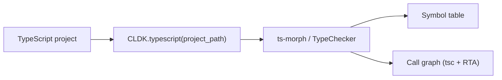

TypeScript analysis is **beta**. `TypeScriptAnalysis` exposes a typed symbol
table, classes, interfaces, enums, decorators, and a call graph through nearly
the same API as [Java](/reference/python-api/java/) and
[Python](/reference/python-api/python/). Its symbol table and call graph are
solid; framework entrypoint detection is the main gap (see the note below).

## Overview

`CLDK.typescript(project_path=...)` returns a `TypeScriptAnalysis` object backed
by the [`codeanalyzer-ts`](/backends/codeanalyzer-ts/) backend, which parses and
resolves a project in a single pass with **ts-morph** (the TypeScript compiler
API). The same `TypeChecker` that builds the symbol table resolves call targets,
so call-graph derivation reuses existing resolution.



**Project path only.** TypeScript analysis needs a project directory of valid
TypeScript/TSX sources (there is no single-string `source_code` mode). Pass it as
`project_path`:

```python
from cldk import CLDK
from cldk.analysis import AnalysisLevel

analysis = CLDK.typescript(
    project_path="/path/to/ts/project",
    analysis_level=AnalysisLevel.call_graph,   # required for the call graph
)

print(analysis.get_classes())      # -> dict[str, TSClass]
graph = analysis.get_call_graph()  # -> networkx.DiGraph
```

> **Not yet implemented**
>
> `get_entry_point_methods()` and `get_service_entry_point_methods()` raise
> `NotImplementedError`: framework entrypoint detection is not implemented in the
> `codeanalyzer-ts` backend yet. To analyze TypeScript at scale through a shared
> Neo4j graph, see [Analysis at scale](/at-scale/).

<!-- CLDK:API:START -->

<!-- AUTO-GENERATED by scripts/gen_api_docs.py, do not edit by hand. -->

[](https://github.com/codellm-devkit/python-sdk) [](https://pypi.org/project/cldk/2.0.0rc4/)

_API reference generated from cldk 2.0.0rc4._

## Analysis

TypeScript analysis facade.

Thin, read-only query layer over the canonical ``TSApplication`` produced by the
codeanalyzer-typescript backend. Mirrors the method vocabulary of ``JavaAnalysis`` /
``PythonAnalysis`` (there is no shared base class, the facades match by convention) and, like
those, delegates all indexing and query work to its backend (`TSCodeanalyzer`).

### `TypeScriptAnalysis`

```python
class TypeScriptAnalysis
```

Analysis facade for TypeScript projects.

Delegates every query to a backend. Two interchangeable backends exist, both exposing the
same method surface:

* `TSCodeanalyzer` (default), walks the in-memory pydantic ``TSApplication`` / a
  NetworkX call graph built from ``analysis.json``;
* `TSNeo4jBackend`, answers the *same* ``get_*`` queries with Cypher over the graph
  ``codeanalyzer-typescript`` emits with ``--emit neo4j``. Selected by passing
  ``neo4j_config``.

#### Attributes

| Name | Type | Description |
| ---- | ---- | ----------- |
| `project_dir` | `` |  |
| `analysis_level` | `` |  |
| `target_files` | `` |  |
| `eager_analysis` | `` |  |
| `backend_config` | `TSBackend` |  |
| `backend` | `TSAnalysisBackend` |  |
| `application` | `TSApplication` |  |
| `has_resolution_edges` | `bool` | Whether :meth:`get_callsites_for` can resolve call sites on this backend right now. |

#### Methods

##### `TypeScriptAnalysis.get_application_view`

```python
get_application_view() -> TSApplication
```

##### `TypeScriptAnalysis.get_symbol_table`

```python
get_symbol_table() -> Dict[str, TSModule]
```

##### `TypeScriptAnalysis.get_modules`

```python
get_modules() -> List[TSModule]
```

##### `TypeScriptAnalysis.get_call_graph`

```python
get_call_graph() -> nx.DiGraph
```

NetworkX DiGraph of the call edges, keyed as every other accessor keys things (module
file key, type/callable signature, ``"<module>.<name>"`` for an external), each node
tagged ``kind`` (``module | class | interface | enum | type_alias | namespace | callable | external``) and ``id``. TypeScript's own
endpoints are kept: a module is the caller of its top-level code and a class the callee of
``new X()``; filter on ``kind == "callable"`` for Python's shape.

##### `TypeScriptAnalysis.get_external_symbols`

```python
get_external_symbols() -> Dict[str, TSExternalSymbol]
```

The phantom (external) call targets, imported/required library members and builtins
the call graph points at, keyed ``"<module>.<name>"`` (e.g. ``node:fs.readFileSync``,
``(builtin).push``) as the call graph keys them, the wire's ``can://`` id on the value.
Useful for source→sink reachability.

##### `TypeScriptAnalysis.get_synthesized_callables`

```python
get_synthesized_callables() -> Dict[str, TSSynthesizedCallable]
```

The synthesized anonymous-callback endpoints the call graph points at, Jelly-resolved
callbacks the symbol table never names (keyed by their ``<host>:<line:col>`` signature).
Empty under the ``tsc``-only resolver. Materialized so anonymous call edges don't dangle.

##### `TypeScriptAnalysis.get_call_graph_json`

```python
get_call_graph_json() -> str
```

##### `TypeScriptAnalysis.get_callers`

```python
get_callers(target_class_name: str, target_method_declaration: str | None = None) -> Dict
```

Callers of a method, with the connecting call-graph edge metadata, ``type``,
``weight`` and ``provenance``, the same three keys `get_call_graph` puts on an edge.
(There is no ``tags``: it was a schema-1.0.0 call-edge field, and schema v2's
``TSCallGraphEdge`` is ``{src, dst, prov, weight}``.) Pass a bare signature as the first
argument for module-level functions or external (phantom) targets.

##### `TypeScriptAnalysis.get_callees`

```python
get_callees(source_class_name: str, source_method_declaration: str | None = None) -> Dict
```

Callees of a method, with the connecting call-graph edge metadata.

##### `TypeScriptAnalysis.get_class_call_graph`

```python
get_class_call_graph(qualified_class_name: str, method_signature: str | None = None) -> List[Tuple[str, str]]
```

Call-graph edges reachable from a class (or one of its methods).

##### `TypeScriptAnalysis.get_class_hierarchy`

```python
get_class_hierarchy() -> nx.DiGraph
```

Inheritance/implementation graph: an edge child → base for every base_class.

##### `TypeScriptAnalysis.get_call_sites`

```python
get_call_sites(qualified_callable_name: str) -> List[TSCallsite]
```

The rich, syntactic call sites *inside* a callable (receiver/argument types, resolved
``callee_signature``, source position).

##### `TypeScriptAnalysis.get_calling_lines`

```python
get_calling_lines(target_signature: str) -> List[int]
```

Sorted source lines anywhere in the project where ``target_signature`` is invoked.

##### `TypeScriptAnalysis.get_call_targets`

```python
get_call_targets(source_signature: str) -> Set[str]
```

The call targets invoked from a callable, derived from its call sites.

##### `TypeScriptAnalysis.get_classes`

```python
get_classes() -> Dict[str, TSClass]
```

##### `TypeScriptAnalysis.get_class`

```python
get_class(qualified_class_name: str) -> TSClass | None
```

##### `TypeScriptAnalysis.get_classes_by_criteria`

```python
get_classes_by_criteria(inclusions: List[str] | None = None, exclusions: List[str] | None = None) -> Dict[str, TSClass]
```

##### `TypeScriptAnalysis.get_interfaces`

```python
get_interfaces() -> Dict[str, TSInterface]
```

##### `TypeScriptAnalysis.get_enums`

```python
get_enums() -> Dict[str, TSEnum]
```

##### `TypeScriptAnalysis.get_enum_members`

```python
get_enum_members(qualified_enum_name: str) -> List[TSEnumMember]
```

##### `TypeScriptAnalysis.get_type_aliases`

```python
get_type_aliases() -> Dict[str, TSTypeAlias]
```

##### `TypeScriptAnalysis.get_functions`

```python
get_functions() -> Dict[str, TSCallable]
```

Top-level (module/namespace) functions.

##### `TypeScriptAnalysis.get_methods`

```python
get_methods() -> Dict[str, Dict[str, TSCallable]]
```

All methods grouped by class/interface signature.

##### `TypeScriptAnalysis.get_methods_in_class`

```python
get_methods_in_class(qualified_class_name: str) -> Dict[str, TSCallable]
```

##### `TypeScriptAnalysis.get_method`

```python
get_method(qualified_class_name: str, qualified_method_name: str) -> TSCallable | None
```

##### `TypeScriptAnalysis.get_method_parameters`

```python
get_method_parameters(qualified_class_name: str, qualified_method_name: str) -> List[str]
```

##### `TypeScriptAnalysis.get_constructors`

```python
get_constructors(qualified_class_name: str) -> Dict[str, TSCallable]
```

##### `TypeScriptAnalysis.get_fields`

```python
get_fields(qualified_class_name: str) -> List[TSClassAttribute]
```

##### `TypeScriptAnalysis.get_interface_properties`

```python
get_interface_properties(qualified_interface_name: str) -> List[TSClassAttribute]
```

##### `TypeScriptAnalysis.get_imports`

```python
get_imports() -> Dict[str, List[TSImport]]
```

##### `TypeScriptAnalysis.get_exports`

```python
get_exports() -> Dict[str, List[TSExport]]
```

##### `TypeScriptAnalysis.get_variables`

```python
get_variables() -> Dict[str, List[TSVariableDeclaration]]
```

Module-level variable declarations per file.

##### `TypeScriptAnalysis.get_typescript_file`

```python
get_typescript_file(qualified_name: str) -> str | None
```

File path declaring the class/interface/enum/callable with the given signature.

##### `TypeScriptAnalysis.get_typescript_module`

```python
get_typescript_module(file_path: str) -> TSModule | None
```

##### `TypeScriptAnalysis.get_nested_classes`

```python
get_nested_classes(qualified_class_name: str) -> List[TSClass]
```

Always ``[]`` on schema v2, on both backends -- permanently, not for want of data. A
v2 class node holds only ``callables`` and ``fields``: the tree gives a class no ``types``
bucket, so no class can nest a class. A class declared inside a *callable* is the surviving
case and reads as ``TSCallable.inner_classes``. Kept because the 1.x surface had it (G3).

##### `TypeScriptAnalysis.get_sub_classes`

```python
get_sub_classes(qualified_class_name: str) -> Dict[str, TSClass]
```

##### `TypeScriptAnalysis.get_extended_classes`

```python
get_extended_classes(qualified_class_name: str) -> List[str]
```

The base types a class extends (base_classes minus the implemented interfaces).

##### `TypeScriptAnalysis.get_implemented_interfaces`

```python
get_implemented_interfaces(qualified_class_name: str) -> List[str]
```

##### `TypeScriptAnalysis.get_decorators`

```python
get_decorators(qualified_callable_name: str) -> List[TSDecorator]
```

Structured decorators (with arguments) applied to a callable.

##### `TypeScriptAnalysis.get_class_decorators`

```python
get_class_decorators(qualified_class_name: str) -> List[TSDecorator]
```

Structured decorators (with arguments) applied to a class.

##### `TypeScriptAnalysis.get_methods_with_decorators`

```python
get_methods_with_decorators(decorators: List[str]) -> Dict[str, List[str]]
```

Map each requested decorator name to the signatures of callables carrying it. TS
decorators are captured structurally, so this is populatable at level 1.

##### `TypeScriptAnalysis.get_classes_with_decorators`

```python
get_classes_with_decorators(decorators: List[str]) -> Dict[str, List[str]]
```

Map each requested decorator name to the signatures of classes carrying it.

##### `TypeScriptAnalysis.get_callables_overview`

```python
get_callables_overview() -> List[TSCallableOverview]
```

Return a lightweight overview of every callable in the project, in one bulk read.

A field-projected alternative to `get_methods` for enumeration: each
`TSCallableOverview` carries the callable's signature,
owning class/interface (if any), native kind, location, and decorators, but not the full
reconstruction (call sites, inner callables, locals). On the Neo4j backend this is a single
Cypher query instead of the per-entity fan-out `get_methods` pays. Body-inspect the
few you need afterwards via `get_method` or `get_method_bodies`.

**Returns:**

- `List[TSCallableOverview]`: A flat list of `TSCallableOverview`, one per callable
- `List[TSCallableOverview]`: (class/interface methods, module- and namespace-level functions, and nested/inner
- `List[TSCallableOverview]`: callables).

> **See Also**
> `get_decorated_callables`: The same projection filtered by decorator.
> `get_method_bodies`: Bulk source-body fetch for chosen signatures.

> **Note**
> A ``get x()``/``set x()`` accessor pair shares one ``signature``, so this projection
> (and the other bulk accessors) can diverge between the local and Neo4j backends on a
> paired accessor, see `#300 <https://github.com/codellm-devkit/python-sdk/issues/300>`_.

##### `TypeScriptAnalysis.get_method_bodies`

```python
get_method_bodies(signatures: List[str]) -> Dict[str, str]
```

Return source bodies for the given callable signatures, in one bulk read.

**Parameters:**

| Name | Type | Description |
| ---- | ---- | ----------- |
| `signatures` | `List[str]` | Callable signatures to fetch bodies for (e.g. from `get_callables_overview`). |

**Returns:**

- `Dict[str, str]`: A dict mapping each signature to its source body. Signatures with no matching callable
- `Dict[str, str]`: are omitted, as are callables whose ``code`` is ``None`` (e.g. implicit constructors
- `Dict[str, str]`: the analyzer synthesizes with no source text), every returned value is a real ``str``.

##### `TypeScriptAnalysis.get_decorated_callables`

```python
get_decorated_callables(markers: List[str]) -> List[TSCallableOverview]
```

Return overviews of callables decorated with any of the given markers, in one bulk read.

**Parameters:**

| Name | Type | Description |
| ---- | ---- | ----------- |
| `markers` | `List[str]` | Decorator names to match (e.g. ``["Get", "Controller"]``). |

**Returns:**

- `List[TSCallableOverview]`: A list of `TSCallableOverview` for every callable
- `List[TSCallableOverview]`: carrying at least one of ``markers`` as a decorator.

> **See Also**
> `get_callables_overview`: The unfiltered projection.

##### `TypeScriptAnalysis.get_callsites_for`

```python
get_callsites_for(signatures: List[str]) -> Dict[str, List[TSCallsite]]
```

Return the call sites of the given callables, keyed by signature, in one bulk read.

Avoids the per-callable reconstruction fan-out when you need call sites for a specific
frontier (e.g. dispatch-edge synthesis or external-reader detection).

**Parameters:**

| Name | Type | Description |
| ---- | ---- | ----------- |
| `signatures` | `List[str]` | Callable signatures to fetch call sites for. |

**Returns:**

- `Dict[str, List[TSCallsite]]`: A dict mapping each existing signature to its list of
- `Dict[str, List[TSCallsite]]`: class:`~cldk.models.typescript.TSCallsite` (empty if the callable has no call sites).
- `Dict[str, List[TSCallsite]]`: Signatures with no matching callable are omitted.

##### `TypeScriptAnalysis.locate`

```python
locate(path: str, line: int) -> LocateResult
```

Resolve a source position to its enclosing callable, with the source in hand.

The single most-needed query for triaging a scanner alert: an alert arrives as
``file:line`` and this resolves it to the enclosing callable in one call, rather than
``get_method``, falling back to ``get_callers``, falling back to scanning the symbol table
by hand. Four outcomes stay distinguishable, see
`LocateResult`: inside a callable (``callable`` set,
plus ``body`` when a body node is that precise), at real module scope (``module_scope``
diagnostic), in the gap between two callables (also module scope, never snapped to the
nearest callable), or in a file the analysis has no module for (``file_not_in_graph``).

There is no ``col`` parameter. Column-level disambiguation would have to be honoured by
both backends to mean anything, and the Neo4j graph projects only ``start_line`` /
``end_line`` on ``:TSCallable`` and ``:TSBodyNode``, so a ``col`` would work in-process and
be silently ignored over Neo4j. Better absent than documented and inert.

**Parameters:**

| Name | Type | Description |
| ---- | ---- | ----------- |
| `path` | `str` | The file path. Normalised against the backend's module keys, so a ``./``-prefixed or absolute path resolves rather than reading back as ``file_not_in_graph``. |
| `line` | `int` | The 1-based line number. |

**Returns:**

- `LocateResult`: class:`~cldk.analysis.commons.results.LocateResult` carrying the innermost body
- `LocateResult`: node, the enclosing callable, its owning class/interface, its module, and the source
- `LocateResult`: slice, never an ambiguous empty.

> **See Also**
> `locate_many`: The bulk form, the point, not an optimisation.

##### `TypeScriptAnalysis.locate_many`

```python
locate_many(positions: Sequence[Tuple[str, int]]) -> List[LocateResult]
```

Resolve many ``(path, line)`` positions in one round trip, in input order.

**Parameters:**

| Name | Type | Description |
| ---- | ---- | ----------- |
| `positions` | `Sequence[Tuple[str, int]]` | The ``(path, line)`` pairs to resolve, e.g. from a scanner's alert list. |

**Returns:**

- `List[LocateResult]`: class:`~cldk.analysis.commons.results.LocateResult` per input position, in the
- `List[LocateResult]`: same order.

> **See Also**
> `locate`: The single-position form.

##### `TypeScriptAnalysis.resolve_callable`

```python
resolve_callable(name: str, in_class: str | None = None, in_module: str | None = None) -> SliceNode
```

Resolve a callable name to the one callable it names, in the caller's vocabulary.

The addressing step every name-taking accessor performs, exposed so a caller can perform it
once and keep the answer::

    node = ts.resolve_callable("show", in_class="UserController")
    node.callable   # the full dotted signature, what every other accessor keys by
    node.file, node.line

``name`` matches whole or as a dotted suffix; ``in_class`` is a dotted suffix of the owning
class or interface, ``in_module`` a module key (``"src/controllers.ts"``) or the dotted form
(``"src.controllers"``). An anonymous callable is addressed by its ``<anon@line:col>``
signature, never by its name, cants calls every one of them ``"(anonymous)"``. Ambiguity
raises with every candidate; nothing is guessed.

**Raises:**

- `AmbiguousName`: More than one callable matched.
- `SelectorNotInGraph`: Nothing matched, naming the argument that missed.

##### `TypeScriptAnalysis.resolve_value`

```python
resolve_value(name: str, within: str) -> SliceNode
```

Resolve a value name inside a callable, in TypeScript, a parameter, to the position
that carries it.

The same resolution the dataflow accessors perform on their ``src``, exposed so a caller can
check what a name means before asking a question of it::

    ts.resolve_value("id", within="UserController.show").kind   # "parameter"

**Raises:**

- `AmbiguousName`: ``within`` named more than one callable, or ``name`` more than one value.
- `SelectorNotInGraph`: No such callable, or no such value in it.

##### `TypeScriptAnalysis.get_source`

```python
get_source(node_id: str) -> str
```

Return the source text named by ``node_id``, a callable, or one of its body nodes.

Generalises `get_method_bodies` below callable granularity: ``node_id`` is a
callable's signature, a callable's opaque id, or the body-node id
`node_id` hands back, so a statement or
call site `locate` found can be re-fetched precisely.

**Parameters:**

| Name | Type | Description |
| ---- | ---- | ----------- |
| `node_id` | `str` | A callable signature, or an id from `locate` / `resolve_callable`, passed back as received, not composed. |

**Returns:**

- `str`: The source text, never an ambiguous empty string.

**Raises:**

- `KeyError`: Nothing matches ``node_id``, or it has no recoverable source.
- `NotImplementedError`: (Neo4j backend only) ``node_id`` names a body node, the attached graph carries no source text below callable granularity.

##### `TypeScriptAnalysis.describe`

```python
describe(nodes: Sequence[object]) -> List[SliceNode]
```

Fill in ``source`` for these positions, in one round trip.

Addressing answers *where*; this answers *what*, and it is a second call because source is
the one field with no size ceiling. Takes anything carrying an address, slice nodes, a
``locate()`` result, and gives back the same
`SliceNode` shape with ``source`` filled.

Afterwards, ``source=None`` means exactly one thing: **this position exists and there is no
text for it.** A ref that names nothing raises instead.

**Parameters:**

| Name | Type | Description |
| ---- | ---- | ----------- |
| `nodes` | `Sequence[object]` | The positions to hydrate. An empty sequence costs no round trip. |

**Returns:**

- `List[SliceNode]`: The same positions, in the same order, with ``source`` filled where the backend has
- `List[SliceNode]`: text for them.

**Raises:**

- `KeyError`: A ref names nothing in this application.
- `TypeError`: An element carries no address to look up.

##### `TypeScriptAnalysis.get_cfg`

```python
get_cfg(callable: str, in_class: str | None = None, page_size: int = DEFAULT_PAGE_SIZE, cursor: str | None = None) -> EdgePage[TSCfgEdge]
```

Return one page of the control flow inside one callable, addressed by name.

The graph the analyzer built, not one re-derived here: a conditional's two successors stay
two edges discriminated by ``kind``. Endpoints are the body nodes' own opaque ids, which
`get_source` and `describe` both accept::

    page = ts.get_cfg("show", in_class="UserController")
    page.total          # the whole graph's size, on every page
    page.complete       # False when there is more, with page.next_cursor to fetch it

**Parameters:**

| Name | Type | Description |
| ---- | ---- | ----------- |
| `callable` | `str` | The callable's name, resolved as by `resolve_callable`. |
| `in_class` | `str \| None` | Disambiguate by owning class or interface. |
| `page_size` | `int` | Most edges to return. |
| `cursor` | `str \| None` | ``next_cursor`` from a previous page; ``None`` starts at the beginning. |

**Returns:**

- `EdgePage[TSCfgEdge]`: class:`~cldk.analysis.commons.results.EdgePage` of
- `EdgePage[TSCfgEdge]`: class:`~cldk.models.typescript.TSCfgEdge`.

**Raises:**

- `AmbiguousName`: More than one callable matched.
- `SelectorNotInGraph`: Nothing matched.
- `ValueError`: ``page_size`` below 1, or a cursor from another page, callable or accessor.
- `CodeanalyzerUsageException`: (local backend) built below ``analysis_level="program_dependency_graph"``.

##### `TypeScriptAnalysis.get_cdg`

```python
get_cdg(callable: str, in_class: str | None = None, page_size: int = DEFAULT_PAGE_SIZE, cursor: str | None = None) -> EdgePage[TSCdgEdge]
```

Return one page of the control *dependence* inside one callable.

``src`` is the branching node ``dst`` is control dependent on. Arguments, paging and
failures are `get_cfg`'s.

##### `TypeScriptAnalysis.get_ddg`

```python
get_ddg(callable: str, in_class: str | None = None, page_size: int = DEFAULT_PAGE_SIZE, cursor: str | None = None) -> EdgePage[TSDdgEdge]
```

Return one page of the data dependence inside one callable.

Each edge carries the variable it flows and the evidence for it. **TypeScript has a single
provenance tier:** every edge's ``prov`` is ``["reaching-defs"]``, where Python distinguishes
``ssa`` / ``reaching-defs`` / ``points-to``. Arguments, paging and failures are
`get_cfg`'s.

##### `TypeScriptAnalysis.slice_backward`

```python
slice_backward(src: str, within: str, depth: int | None = DEFAULT_DEPTH, max_nodes: int = DEFAULT_MAX_NODES) -> Slice
```

Return everything the value ``src`` depends on, reverse reachability over the SDG.

``depth`` defaults to a **finite** bound on purpose: a bounded traversal answers a narrower
question *completely*, and ``total`` says how much was left out. ``depth=None`` asks for the
whole cone::

    s = ts.slice_backward("id", within="UserController.show")
    s.total, s.truncated

**Parameters:**

| Name | Type | Description |
| ---- | ---- | ----------- |
| `src` | `str` | The value's name, in TypeScript, a parameter. |
| `within` | `str` | The callable to look inside. Required: a value name is scoped by its callable. |
| `depth` | `int \| None` | Most hops from the seed; ``None`` for the whole cone. |
| `max_nodes` | `int` | Most nodes in the result; a cap that fires is reported, never silent. |

**Returns:**

- `Slice`: class:`~cldk.analysis.commons.results.Slice`, ordered by node id, with ``source``
- `Slice`: unhydrated (`describe` fills it in).

**Raises:**

- `AmbiguousName`: ``within`` or ``src`` matched more than one thing.
- `SelectorNotInGraph`: No such callable, or no such value in it.
- `ValueError`: ``depth`` is not a positive ``int``, or ``max_nodes`` is below 1.

##### `TypeScriptAnalysis.slice_forward`

```python
slice_forward(src: str, within: str, depth: int | None = DEFAULT_DEPTH, max_nodes: int = DEFAULT_MAX_NODES) -> Slice
```

Return everything the value ``src`` can affect, the same edges read forward.

Usually the interesting direction for a parameter: nothing flows *into* one except from its
callers. Arguments, bounds and failures are `slice_backward`'s.

##### `TypeScriptAnalysis.reaches`

```python
reaches(src: str, dst: str, depth: int | None = None) -> bool
```

Return whether control can get from one callable to another over the call graph.

The cheap check before asking for the paths themselves. **``depth`` is unbounded by
default**, unlike the slices: a bound on a boolean would collapse "there is no path" and
"there is no path within five hops" into the same ``False``.

**Parameters:**

| Name | Type | Description |
| ---- | ---- | ----------- |
| `src` | `str` | The calling callable's name. |
| `dst` | `str` | The called callable's name. |
| `depth` | `int \| None` | Most call hops, or ``None`` for any distance. |

**Raises:**

- `AmbiguousName`: Either name matched more than one callable.
- `SelectorNotInGraph`: Either matched none.
- `ValueError`: ``depth`` is not a positive ``int``.

##### `TypeScriptAnalysis.backward_cone`

```python
backward_cone(sinks: Sequence[str], depth: int | None = DEFAULT_DEPTH, max_nodes: int = DEFAULT_MAX_NODES) -> Slice
```

Return every call-graph vertex that can reach any of ``sinks``, "what could get here".

The accessor to reach for when the sink is a dangerous function and the question is which
entry points lead to it. Its nodes are callables **and modules**: cants makes a module the
caller of its own top-level code, so a cone without them would under-report.

**Parameters:**

| Name | Type | Description |
| ---- | ---- | ----------- |
| `sinks` | `Sequence[str]` | The callables to walk back from; a bare string is refused. |
| `depth` | `int \| None` | Most call hops back; ``None`` for the whole cone. |
| `max_nodes` | `int` | Most nodes in the result. |

**Raises:**

- `AmbiguousName`: A sink matched more than one callable.
- `SelectorNotInGraph`: A sink matched none.
- `TypeError`: ``sinks`` is a bare string.
- `ValueError`: ``sinks`` is empty, or a bound is out of range.

##### `TypeScriptAnalysis.callers_of`

```python
callers_of(name: str, in_class: str | None = None, in_module: str | None = None) -> List[SliceNode]
```

Return who calls this, one hop back over the call graph, addressed by name.

The name-based sibling of `get_callers`, returning
`SliceNode` objects rather than raw dicts. A module is
a legitimate caller (``kind="module"``). ``[]`` is unambiguous: a name matching nothing
raises.

**Raises:**

- `AmbiguousName`: More than one callable matched.
- `SelectorNotInGraph`: Nothing matched.

##### `TypeScriptAnalysis.callees_of`

```python
callees_of(name: str, in_class: str | None = None, in_module: str | None = None) -> List[SliceNode]
```

Return what this calls, one hop forward, externals included (``kind="external"``).

An external was never analysed, so it has no position: ``file=""`` and ``line=0``, with
``kind`` saying why. Its ``callable`` is the readable ``"<module>.<name>"``.

**Raises:**

- `AmbiguousName`: More than one callable matched.
- `SelectorNotInGraph`: Nothing matched.

##### `TypeScriptAnalysis.paths_between`

```python
paths_between(src: str, dst: str, src_within: str, dst_within: str, depth: int | None = None, max_paths: int = DEFAULT_MAX_PATHS) -> FlowPaths
```

Return how one value reaches another, the *sequences*, where a slice is the set.

Each hop says what justified it: the kind of edge (``data`` / ``control`` / ``argument`` /
``return`` / ``summary``), the variable, and the provenance, which in TypeScript is always
``["reaching-defs"]``. Only shortest paths are returned.

**Two scopes, not one**: a value is addressed by a name plus the callable it enters, and a
single scope could never find the cross-callable path this accessor exists for. ``depth`` is
unbounded by default, for `reaches`'s reason.

**Parameters:**

| Name | Type | Description |
| ---- | ---- | ----------- |
| `src` | `str` | The value the flow starts at. |
| `dst` | `str` | The value it must reach. |
| `src_within` | `str` | The callable ``src`` enters. Required. |
| `dst_within` | `str` | The callable ``dst`` enters. Required. |
| `depth` | `int \| None` | Most hops a path may take; ``None`` for no bound. |
| `max_paths` | `int` | Most paths to return; ``complete`` says whether more existed. |

**Raises:**

- `AmbiguousName`: A name matched more than one thing.
- `SelectorNotInGraph`: A name matched nothing.
- `ValueError`: A bound is out of range, or the two endpoints are the same position.

##### `TypeScriptAnalysis.call_paths_between`

```python
call_paths_between(src: str, dst: str, depth: int | None = None, max_paths: int = DEFAULT_MAX_PATHS) -> FlowPaths
```

Return how one callable reaches another, the evidence-carrying form of `reaches`.

Every hop is ``via="call"`` with no variable and no provenance: a call is a syntactic fact,
and saying so is better than inventing a provenance for it. ``depth`` is unbounded by
default.

**Raises:**

- `AmbiguousName`: Either name matched more than one callable.
- `SelectorNotInGraph`: Either matched nothing.
- `ValueError`: A bound is out of range, or ``src`` and ``dst`` name the same callable.

##### `TypeScriptAnalysis.flows_to_call`

```python
flows_to_call(src: str, callee: str, within: str, depth: int | None = None) -> bool
```

Return whether this value reaches **any** argument of a call to ``callee``.

A dataflow claim, not a control one: a value that merely runs before a call site and feeds
none of its arguments is not counted. ``depth`` is unbounded by default, a bare ``False``
carries no signal that a bound fired.

**Parameters:**

| Name | Type | Description |
| ---- | ---- | ----------- |
| `src` | `str` | The value, named as a caller would. |
| `callee` | `str` | The called callable. |
| `within` | `str` | The callable ``src`` enters. Required; it scopes ``src`` only. |
| `depth` | `int \| None` | Most hops; ``None`` for no bound. |

**Raises:**

- `AmbiguousName`: A name matched more than one thing.
- `SelectorNotInGraph`: A name matched nothing.
- `ValueError`: ``depth`` is not a positive ``int``.

##### `TypeScriptAnalysis.flows_to_argument`

```python
flows_to_argument(src: str, callee: str, arg: str, within: str, depth: int | None = None) -> bool
```

Return whether this value reaches the argument ``arg`` of a call to ``callee``.

The narrower question: a tainted value routinely reaches a function without reaching the
parameter that matters. ``arg`` is resolved **by name**, never by position.

**Parameters:**

| Name | Type | Description |
| ---- | ---- | ----------- |
| `src` | `str` | The value the flow starts at. |
| `callee` | `str` | The called callable. |
| `arg` | `str` | The callee's parameter, by name. |
| `within` | `str` | The callable ``src`` enters. Required; ``arg`` is scoped by ``callee``. |
| `depth` | `int \| None` | Most hops; ``None`` for no bound. |

**Raises:**

- `AmbiguousName`: A name matched more than one thing.
- `SelectorNotInGraph`: A name matched nothing, including ``arg`` naming no parameter of ``callee``, which is a caller error and not a ``False``.
- `ValueError`: ``depth`` is not a positive ``int``.

##### `TypeScriptAnalysis.get_entrypoints`

```python
get_entrypoints() -> List[TSCallableOverview]
```

Return overviews of every callable the analyzer marked as an entrypoint.

A CLI command, a route handler, whatever ruleset the entrypoint pass matched. This is
where an agent starts a taint question: the callables reachable from outside.

**Returns:**

- `List[TSCallableOverview]`: One overview per marked callable. Empty means the pass found no entrypoint
- `List[TSCallableOverview]`: *callables*, a real fact about the project, not "cannot tell".

> **See Also**
> `get_entrypoint_classes`: The class-level sibling this walk never sees.
> `get_entrypoint_coverage`: Whether the detection pass itself had gaps.

##### `TypeScriptAnalysis.get_entrypoint_classes`

```python
get_entrypoint_classes() -> List[TSClassOverview]
```

Return overviews of every class the analyzer marked as an entrypoint in its own right.

`get_entrypoints` walks callables only, so a class the rulesets matched with no
individually-marked method is invisible to it.

**Returns:**

- `List[TSClassOverview]`: One overview per marked class. Empty means no class carries the mark.

> **See Also**
> `get_entrypoints`: The callable-level projection.

##### `TypeScriptAnalysis.get_entrypoint_coverage`

```python
get_entrypoint_coverage() -> EntrypointCoverage
```

Return the entrypoint-detection pass's own coverage and failure record.

Entrypoint detection under-approximates by design, so silence is its failure mode:
`get_entrypoints` returning ``[]`` cannot say whether the pass ran clean or gave up.
This is what distinguishes them, the frameworks it recognized, the rulesets it consulted,
the near-misses it could not resolve, and the errors it hit.

**Returns:**

- `EntrypointCoverage`: The coverage record. A non-empty ``diagnostics`` means the source carries no report at
- `EntrypointCoverage`: all, and the other fields are then not "no gaps found" but "nothing to report from".

> **See Also**
> `get_entrypoints`: The accessor whose empty result this disambiguates.

##### `TypeScriptAnalysis.get_artifacts`

```python
get_artifacts() -> Dict[str, PyArtifact]
```

Return every non-code artifact the analyzer indexed, keyed by repo-relative path.

``package.json``, ``tsconfig.json``, a lockfile, a Dockerfile, the files that say what the
project depends on and how it is configured, which the code itself never states.

**Returns:**

- `Dict[str, PyArtifact]`: ``{path: artifact}``. Each artifact carries its roles, its text and the config keys it
- `Dict[str, PyArtifact]`: defines.

> **See Also**
> `get_dependencies`, `get_config_keys`, `get_config_uses`.

##### `TypeScriptAnalysis.get_dependencies`

```python
get_dependencies(direct_only: bool = False, ecosystem: str | None = None, declared_in: str | None = None) -> List[PyDependency]
```

Return every declared dependency, optionally filtered.

**Parameters:**

| Name | Type | Description |
| ---- | ---- | ----------- |
| `direct_only` | `bool` | Keep only dependencies the project declares itself, not transitive ones. |
| `ecosystem` | `str \| None` | Keep only one packaging ecosystem. Every TypeScript dependency is ``npm``. |
| `declared_in` | `str \| None` | Keep only dependencies declared by one artifact (``PyDependency.declared_in``, e.g. from `get_artifacts`). |

**Returns:**

- `List[PyDependency]`: The matching dependencies.

##### `TypeScriptAnalysis.get_config_keys`

```python
get_config_keys() -> Dict[str, PyConfigKey]
```

Return every configuration key the analyzer extracted from the artifacts.

**Returns:**

- `Dict[str, PyConfigKey]`: ``{id: key}``. Each value carries the key's dotted name, its namespace and its literal
- `Dict[str, PyConfigKey]`: value as text.

##### `TypeScriptAnalysis.get_config_uses`

```python
get_config_uses(key: str | None = None) -> List[PyConfigUseEdge]
```

Return the resolved edges from a code read to the configuration key it names.

**Parameters:**

| Name | Type | Description |
| ---- | ---- | ----------- |
| `key` | `str \| None` | Keep only edges naming this key by its dotted name (e.g. ``"compilerOptions.strict"``), matched against `get_config_keys`, since the edge itself carries ids. |

**Returns:**

- `List[PyConfigUseEdge]`: The matching edges.

> **See Also**
> `get_config_readers`: The same edges, resolved to their reading callables.
> `get_unresolved_config_reads`: The reads this cannot show.

##### `TypeScriptAnalysis.get_unresolved_config_reads`

```python
get_unresolved_config_reads() -> List[PyConfigRead]
```

Return every detector-matched configuration read that resolved to no declared key.

`get_config_uses` can only show reads that landed on a key the analyzer extracted. A
read of a key defined somewhere it does not index resolves to nothing, and an empty
`get_config_uses` for some key cannot then distinguish "nothing reads this" from "a
read exists and never resolved". This is that second list.

**Returns:**

- `List[PyConfigRead]`: The unresolved reads, each naming the call site and the callee it went through.

##### `TypeScriptAnalysis.get_config_readers`

```python
get_config_readers(key: str) -> List[TSCallableOverview]
```

Return overviews of every callable that reads configuration key ``key``.

`get_config_uses` hands back opaque body-node ids; this answers the question a caller
actually has, *which code* reads this setting.

**Parameters:**

| Name | Type | Description |
| ---- | ---- | ----------- |
| `key` | `str` | The key's dotted name, exactly as `get_config_uses` matches it. |

**Returns:**

- `List[TSCallableOverview]`: One overview per reading callable. Empty means no callable reads this key, see
- `List[TSCallableOverview]`: meth:`get_unresolved_config_reads` for the read that never resolved to one.

## Schema

TypeScript model package, pydantic mirror of codeanalyzer-typescript ``src/schema/schema.ts`` (schema v2).

``TSCallEdge``, ``TSExternalSymbol``, ``TSSynthesizedCallable``, ``TSClassAttribute``, ``TSEnumMember`` and
``TSVariableDeclaration`` are 1.x names kept as aliases of their v2 classes.

``TSCallsite`` and ``TSSymbol`` are 1.x *shapes* the v2 wire no longer carries, kept importable for
the same reason: ``TSCallsite`` is still the return type of the call-site accessors, rebuilt from a
``body`` node; ``TSSymbol`` has no v2 counterpart at all (accessed symbols left the schema) and no
accessor returns one -- it is an import alias and nothing more.

### `TSAnalysis`

```python
class TSAnalysis(_Base)
```

The envelope ``analysis.json`` IS.

#### Attributes

| Name | Type | Description |
| ---- | ---- | ----------- |
| `schema_version` | `str` |  |
| `language` | `str` |  |
| `max_level` | `int` |  |
| `k_limit` | `Optional[int]` |  |
| `analyzer` | `TSAnalyzer` |  |
| `application` | `TSApplication` |  |

### `TSAnalyzer`

```python
class TSAnalyzer(_Base)
```

#### Attributes

| Name | Type | Description |
| ---- | ---- | ----------- |
| `name` | `str` |  |
| `version` | `str` |  |

### `TSApplication`

```python
class TSApplication(_Base)
```

The application root: the containment tree plus the app-scope overlays.

#### Attributes

| Name | Type | Description |
| ---- | ---- | ----------- |
| `id` | `str` |  |
| `kind` | `Literal['application']` |  |
| `symbol_table` | `Dict[str, TSModule]` |  |
| `call_graph` | `List[TSCallGraphEdge]` |  |
| `param_in` | `List[TSParamEdge]` |  |
| `param_out` | `List[TSParamEdge]` |  |
| `artifacts` | `Dict[str, TSArtifact]` |  |
| `dependencies` | `List[TSDependency]` |  |
| `unresolved_imports` | `List[TSImportBinding]` |  |
| `config_uses` | `List[TSConfigUse]` |  |
| `config_reads` | `List[TSConfigRead]` |  |
| `external_symbols` | `Optional[Dict[str, TSExternalNode]]` |  |
| `synthesized_callables` | `Optional[Dict[str, TSSynthesizedNode]]` |  |
| `entrypoint_report` | `Optional[TSEntrypointReport]` |  |

### `TSArtifact`

```python
class TSArtifact(_Base)
```

A recognized non-code file (config, manifest, CI, container spec).

#### Attributes

| Name | Type | Description |
| ---- | ---- | ----------- |
| `id` | `str` |  |
| `kind` | `Literal['artifact']` |  |
| `path` | `str` |  |
| `format` | `str` |  |
| `roles` | `List[str]` |  |
| `size_bytes` | `int` |  |
| `sha256` | `str` |  |
| `source` | `str` |  |
| `extraction` | `str` |  |
| `config_keys` | `List[TSConfigKey]` |  |

### `TSBodyNode`

```python
class TSBodyNode(_Base)
```

One entry of a callable's ``body{}`` map, keyed by local id (``L:C`` or ``@tag``).

``kind`` is open: L1 emits ``call``/``config_access``, L3 adds ``statement``/``entry``/``exit``,
L4 adds ``formal_in``/``formal_out``/``actual_in``/``actual_out``. ``callee`` is the one
sanctioned ``null`` on the wire (a ``call`` node at L1, refined to an id at L2).

#### Attributes

| Name | Type | Description |
| ---- | ---- | ----------- |
| `id` | `Optional[str]` |  |
| `kind` | `str` |  |
| `span` | `Optional[TSSpan]` |  |
| `callee` | `Optional[str]` |  |
| `of` | `Optional[str]` |  |
| `parent` | `Optional[str]` |  |
| `method_name` | `Optional[str]` |  |
| `receiver_expr` | `Optional[str]` |  |
| `receiver_type` | `Optional[str]` |  |
| `argument_types` | `List[str]` |  |
| `type_arguments` | `List[str]` |  |
| `return_type` | `Optional[str]` |  |
| `is_constructor_call` | `bool` |  |
| `is_optional_chain` | `bool` |  |
| `root` | `Optional[str]` |  |
| `key` | `Optional[str]` |  |

### `TSCallGraphEdge`

```python
class TSCallGraphEdge(_Base)
```

A wire call-graph edge: ``can://`` endpoints, open provenance tokens (``tsc``, ``defuse``,
``import``, …).

#### Attributes

| Name | Type | Description |
| ---- | ---- | ----------- |
| `src` | `str` |  |
| `dst` | `str` |  |
| `prov` | `List[str]` |  |
| `weight` | `int` |  |

### `TSCallable`

```python
class TSCallable(_Spanned)
```

A function / method / constructor / accessor / arrow function.

``cfg``/``cdg``/``ddg`` are present from L3, ``summary`` from L4; ``None`` means the level did
not compute them, ``[]`` means it did and found none.

#### Attributes

| Name | Type | Description |
| ---- | ---- | ----------- |
| `id` | `str` |  |
| `kind` | `str` |  |
| `name` | `str` |  |
| `signature` | `str` |  |
| `comments` | `List[TSComment]` |  |
| `decorators` | `List[TSDecorator]` |  |
| `parameters` | `List[TSCallableParameter]` |  |
| `type_parameters` | `List[TSTypeParameter]` |  |
| `return_type` | `Optional[str]` |  |
| `cyclomatic_complexity` | `int` |  |
| `accessibility` | `Optional[str]` |  |
| `is_static` | `bool` |  |
| `is_abstract` | `bool` |  |
| `is_async` | `bool` |  |
| `is_generator` | `bool` |  |
| `is_optional` | `bool` |  |
| `is_readonly` | `bool` |  |
| `is_exported` | `bool` |  |
| `is_ambient` | `bool` |  |
| `is_implicit` | `bool` |  |
| `accessor_kind` | `Optional[str]` |  |
| `overload_signatures` | `List[TSOverloadSignature]` |  |
| `body` | `Dict[str, TSBodyNode]` |  |
| `callables` | `Dict[str, 'TSCallable']` |  |
| `types` | `Dict[str, 'TSType']` |  |
| `cfg` | `Optional[List[TSCfgEdge]]` |  |
| `cdg` | `Optional[List[TSCdgEdge]]` |  |
| `ddg` | `Optional[List[TSDdgEdge]]` |  |
| `summary` | `Optional[List[TSSummaryEdge]]` |  |
| `entrypoints` | `Optional[List[TSEntrypoint]]` |  |
| `is_entrypoint` | `Optional[bool]` |  |
| `inner_callables` | `Dict[str, 'TSCallable']` |  |
| `inner_classes` | `Dict[str, 'TSClass']` |  |

### `TSCallableOverview`

```python
class TSCallableOverview(BaseModel)
```

A lightweight projection of one callable, enough to enumerate and filter without the full
`TSCallable` reconstruction (call-sites, inner callables,
locals).

Returned set-at-a-time by ``TypescriptAnalysis.get_callables_overview`` /
``TypescriptAnalysis.get_decorated_callables``. Body-inspect only the few you need afterwards
via ``TypescriptAnalysis.get_method``/``TypescriptAnalysis.get_method_bodies``.

#### Attributes

| Name | Type | Description |
| ---- | ---- | ----------- |
| `signature` | `str` |  |
| `name` | `str` |  |
| `owner_signature` | `Optional[str]` |  |
| `owner_kind` | `Optional[str]` |  |
| `kind` | `str` |  |
| `path` | `str` |  |
| `start_line` | `int` |  |
| `end_line` | `int` |  |
| `decorators` | `List[str]` |  |
| `is_exported` | `bool` |  |
| `is_async` | `bool` |  |
| `is_static` | `bool` |  |
| `accessibility` | `Optional[str]` |  |

#### Methods

##### `TSCallableOverview.from_callable`

```python
from_callable(c: TSCallable, owner_signature: Optional[str], owner_kind: Optional[str], path: str) -> TSCallableOverview
```

Project a `TSCallable` into a
`TSCallableOverview`.

**Parameters:**

| Name | Type | Description |
| ---- | ---- | ----------- |
| `c` | `TSCallable` | The callable to project. |
| `owner_signature` | `Optional[str]` | Signature of the declaring class/interface, or ``None`` for a module-level function, arrow, or namespace-owned function. |
| `owner_kind` | `Optional[str]` | The owner's node kind (``"class"`` or ``"interface"``), or ``None`` when ``owner_signature`` is ``None``. |
| `path` | `str` | The declaring module's symbol-table key (repo-relative path). The v2 callable does not carry it; the caller iterating ``symbol_table`` does. |

**Returns:**

- `TSCallableOverview`: The projected overview.

### `TSClassOverview`

```python
class TSClassOverview(BaseModel)
```

A lightweight projection of one class, the class-level counterpart to
`TSCallableOverview`, for classes codeanalyzer-typescript marked as entrypoints in
their own right (``TSClass.is_entrypoint``), independently of any individual method.

Returned by ``TypeScriptAnalysis.get_entrypoint_classes``. It mirrors
`PyClassOverview` field for field, because the accessor that
returns it mirrors ``PythonAnalysis.get_entrypoint_classes``.

**Classes only, on purpose.** ``is_entrypoint`` is declared on all five TypeScript type kinds
(``TSClass``/``TSInterface``/``TSEnum``/``TSTypeAlias``/``TSNamespace`` all inherit it), but
the Neo4j projection stamps it onto ``:TSCallable`` and ``:TSClass`` nodes only, measured on
the 1.3.0 reference graph, where those are the only two labels carrying the property at all.
Widening this accessor past classes would therefore answer differently on the two backends,
which is the one thing the query surface may not do.

#### Attributes

| Name | Type | Description |
| ---- | ---- | ----------- |
| `signature` | `str` |  |
| `name` | `str` |  |
| `path` | `str` |  |
| `start_line` | `int` |  |
| `end_line` | `int` |  |
| `decorators` | `List[str]` |  |

#### Methods

##### `TSClassOverview.from_class`

```python
from_class(c: TSClass, path: str) -> TSClassOverview
```

Project a `TSClass` into a `TSClassOverview`.

**Parameters:**

| Name | Type | Description |
| ---- | ---- | ----------- |
| `c` | `TSClass` | The class to project. |
| `path` | `str` | The declaring module's symbol-table key (repo-relative path). The v2 type does not carry it; the caller iterating ``symbol_table`` does. |

**Returns:**

- `TSClassOverview`: The projected overview.

### `TSCallableParameter`

```python
class TSCallableParameter(_Base)
```

A function / method parameter.

#### Attributes

| Name | Type | Description |
| ---- | ---- | ----------- |
| `id` | `Optional[str]` |  |
| `name` | `str` |  |
| `type` | `Optional[str]` |  |
| `default_value` | `Optional[str]` |  |
| `is_optional` | `bool` |  |
| `is_rest` | `bool` |  |
| `is_readonly` | `bool` |  |
| `accessibility` | `Optional[str]` |  |
| `decorators` | `List[TSDecorator]` |  |
| `start_line` | `int` |  |
| `end_line` | `int` |  |
| `start_column` | `int` |  |
| `end_column` | `int` |  |

### `TSCallsite`

```python
class TSCallsite(_Base)
```

1.x per-call record. Not on the v2 wire (its view is the ``call`` node in ``body{}``);
kept so callers that construct or type-check against it keep importing.

#### Attributes

| Name | Type | Description |
| ---- | ---- | ----------- |
| `method_name` | `str` |  |
| `receiver_expr` | `Optional[str]` |  |
| `receiver_type` | `Optional[str]` |  |
| `argument_types` | `List[str]` |  |
| `type_arguments` | `List[str]` |  |
| `return_type` | `Optional[str]` |  |
| `callee_signature` | `Optional[str]` |  |
| `is_constructor_call` | `bool` |  |
| `is_optional_chain` | `bool` |  |
| `start_line` | `int` |  |
| `start_column` | `int` |  |
| `end_line` | `int` |  |
| `end_column` | `int` |  |

### `TSCdgEdge`

```python
class TSCdgEdge(_Base)
```

#### Attributes

| Name | Type | Description |
| ---- | ---- | ----------- |
| `src` | `str` |  |
| `dst` | `str` |  |

### `TSCfgEdge`

```python
class TSCfgEdge(_Base)
```

#### Attributes

| Name | Type | Description |
| ---- | ---- | ----------- |
| `src` | `str` |  |
| `dst` | `str` |  |
| `kind` | `str` |  |

### `TSClass`

```python
class TSClass(_Type)
```

A class declaration.

#### Attributes

| Name | Type | Description |
| ---- | ---- | ----------- |
| `kind` | `Literal['class']` |  |
| `callables` | `Dict[str, TSCallable]` |  |
| `fields` | `Dict[str, TSField]` |  |
| `decorators` | `List[TSDecorator]` |  |
| `base_classes` | `List[str]` |  |
| `implements_types` | `List[str]` |  |
| `is_abstract` | `bool` |  |
| `type_parameters` | `List[TSTypeParameter]` |  |
| `extends_ids` | `List[str]` |  |
| `implements_ids` | `List[str]` |  |
| `methods` | `Dict[str, TSCallable]` |  |
| `attributes` | `Dict[str, TSField]` |  |

### `TSComment`

```python
class TSComment(_Base)
```

A comment or JSDoc block.

#### Attributes

| Name | Type | Description |
| ---- | ---- | ----------- |
| `content` | `str` |  |
| `is_docstring` | `bool` |  |
| `start_line` | `int` |  |
| `end_line` | `int` |  |
| `start_column` | `int` |  |
| `end_column` | `int` |  |

### `TSConfigKey`

```python
class TSConfigKey(_Base)
```

A configuration key flattened out of a config-bearing artifact.

#### Attributes

| Name | Type | Description |
| ---- | ---- | ----------- |
| `id` | `str` |  |
| `key` | `str` |  |
| `namespace` | `str` |  |
| `value` | `Optional[Union[str, int, float, bool]]` |  |
| `span` | `Optional[TSSpan]` |  |
| `references` | `List[str]` |  |

### `TSConfigRead`

```python
class TSConfigRead(_Base)
```

A recognized config read that resolved to no declared key.

#### Attributes

| Name | Type | Description |
| ---- | ---- | ----------- |
| `site` | `str` |  |
| `callee` | `str` |  |
| `key` | `Optional[str]` |  |
| `reason` | `str` |  |
| `prov` | `List[str]` |  |

### `TSConfigUse`

```python
class TSConfigUse(_Base)
```

A recognized config read (global ordinal ``src``) joined to the ``TSConfigKey`` it names.

#### Attributes

| Name | Type | Description |
| ---- | ---- | ----------- |
| `src` | `str` |  |
| `dst` | `str` |  |
| `prov` | `List[str]` |  |

### `TSDdgEdge`

```python
class TSDdgEdge(_Base)
```

#### Attributes

| Name | Type | Description |
| ---- | ---- | ----------- |
| `src` | `str` |  |
| `dst` | `str` |  |
| `var` | `Optional[str]` |  |
| `prov` | `List[str]` |  |

### `TSDecorator`

```python
class TSDecorator(_Base)
```

A decorator applied to a class / member / parameter (structured, with arguments).

#### Attributes

| Name | Type | Description |
| ---- | ---- | ----------- |
| `name` | `str` |  |
| `qualified_name` | `Optional[str]` |  |
| `positional_arguments` | `List[str]` |  |
| `keyword_arguments` | `Dict[str, str]` |  |
| `start_line` | `int` |  |
| `end_line` | `int` |  |
| `start_column` | `int` |  |
| `end_column` | `int` |  |

### `TSDependency`

```python
class TSDependency(_Base)
```

One third-party dependency, evidence-tagged via ``prov``.

#### Attributes

| Name | Type | Description |
| ---- | ---- | ----------- |
| `name` | `str` |  |
| `spec` | `str` |  |
| `kind` | `str` |  |
| `extras` | `List[str]` |  |
| `declared_in` | `str` |  |
| `direct` | `bool` |  |
| `locked_version` | `Optional[str]` |  |
| `provides_imports` | `List[str]` |  |
| `prov` | `List[str]` |  |

### `TSEntrypoint`

```python
class TSEntrypoint(_Base)
```

One way a callable or class is invoked from outside the application.

#### Attributes

| Name | Type | Description |
| ---- | ---- | ----------- |
| `framework` | `str` |  |
| `confidence` | `str` |  |
| `rule` | `str` |  |
| `ruleset` | `str` |  |
| `evidence` | `Optional[str]` |  |
| `route` | `Optional[str]` |  |
| `http_methods` | `List[str]` |  |
| `via` | `Optional[str]` |  |

### `TSEntrypointReport`

```python
class TSEntrypointReport(_Base)
```

Coverage and failure record for the entrypoint pass.

#### Attributes

| Name | Type | Description |
| ---- | ---- | ----------- |
| `frameworks_detected` | `List[str]` |  |
| `rulesets` | `List[str]` |  |
| `unresolved` | `Dict[str, int]` |  |
| `errors` | `List[str]` |  |

### `TSEnum`

```python
class TSEnum(_Type)
```

An enum declaration; its members are ``fields`` carrying ``value``.

#### Attributes

| Name | Type | Description |
| ---- | ---- | ----------- |
| `kind` | `Literal['enum']` |  |
| `fields` | `Dict[str, TSField]` |  |
| `is_const` | `bool` |  |
| `members` | `List[TSField]` |  |

### `TSExport`

```python
class TSExport(_Base)
```

A TypeScript export / re-export binding.

#### Attributes

| Name | Type | Description |
| ---- | ---- | ----------- |
| `module` | `Optional[str]` |  |
| `resolved_module` | `Optional[str]` |  |
| `name` | `str` |  |
| `alias` | `Optional[str]` |  |
| `is_type_only` | `bool` |  |
| `export_kind` | `str` |  |
| `start_line` | `int` |  |
| `end_line` | `int` |  |
| `start_column` | `int` |  |
| `end_column` | `int` |  |

### `TSExternalNode`

```python
class TSExternalNode(_Base)
```

A call target outside the project (library member / builtin), homed on the application
as ``<appId>/@external/<module>/<name>``, keyed by that id.

#### Attributes

| Name | Type | Description |
| ---- | ---- | ----------- |
| `id` | `str` |  |
| `kind` | `str` |  |
| `module` | `str` |  |
| `name` | `str` |  |

### `TSField`

```python
class TSField(_Base)
```

One open shape for a module variable, a class attribute / interface property, a
constructor parameter property and an enum member; each origin sets its own subset.
``span`` is absent for constructor parameter properties, in which case the 1.x line/column
properties return ``-1``.

#### Attributes

| Name | Type | Description |
| ---- | ---- | ----------- |
| `id` | `str` |  |
| `kind` | `Literal['field']` |  |
| `span` | `Optional[TSSpan]` |  |
| `name` | `str` |  |
| `type` | `Optional[str]` |  |
| `initializer` | `Optional[str]` |  |
| `scope` | `Optional[str]` |  |
| `declaration_kind` | `Optional[str]` |  |
| `is_exported` | `bool` |  |
| `comments` | `List[TSComment]` |  |
| `decorators` | `List[TSDecorator]` |  |
| `accessibility` | `Optional[str]` |  |
| `is_static` | `bool` |  |
| `is_readonly` | `bool` |  |
| `is_optional` | `bool` |  |
| `is_abstract` | `bool` |  |
| `value` | `Optional[str]` |  |
| `start_line` | `int` |  |
| `end_line` | `int` |  |
| `start_column` | `int` |  |
| `end_column` | `int` |  |

### `TSImport`

```python
class TSImport(_Base)
```

A TypeScript import binding (one entry per imported name).

#### Attributes

| Name | Type | Description |
| ---- | ---- | ----------- |
| `module` | `str` |  |
| `resolved_module` | `Optional[str]` |  |
| `name` | `str` |  |
| `alias` | `Optional[str]` |  |
| `is_type_only` | `bool` |  |
| `import_kind` | `str` |  |
| `start_line` | `int` |  |
| `end_line` | `int` |  |
| `start_column` | `int` |  |
| `end_column` | `int` |  |

### `TSImportBinding`

```python
class TSImportBinding(_Base)
```

A non-relative import no declared dependency accounts for.

#### Attributes

| Name | Type | Description |
| ---- | ---- | ----------- |
| `module` | `str` |  |
| `bound_to` | `Optional[str]` |  |
| `prov` | `List[str]` |  |

### `TSInterface`

```python
class TSInterface(_Type)
```

An interface declaration.

#### Attributes

| Name | Type | Description |
| ---- | ---- | ----------- |
| `kind` | `Literal['interface']` |  |
| `callables` | `Dict[str, TSCallable]` |  |
| `fields` | `Dict[str, TSField]` |  |
| `base_classes` | `List[str]` |  |
| `type_parameters` | `List[TSTypeParameter]` |  |
| `call_signatures` | `List[str]` |  |
| `index_signatures` | `List[str]` |  |
| `extends_ids` | `List[str]` |  |
| `methods` | `Dict[str, TSCallable]` |  |
| `properties` | `Dict[str, TSField]` |  |

### `TSModule`

```python
class TSModule(_Base)
```

A compilation unit (one ``.ts``/``.tsx``/``.js`` file). The symbol-table key is its
repo-relative path; the wire carries no ``file_path``/``module_name``.

#### Attributes

| Name | Type | Description |
| ---- | ---- | ----------- |
| `id` | `str` |  |
| `kind` | `Literal['module']` |  |
| `span` | `TSSpan` |  |
| `source` | `str` |  |
| `imports` | `List[TSImport]` |  |
| `exports` | `List[TSExport]` |  |
| `comments` | `List[TSComment]` |  |
| `types` | `Dict[str, TSType]` |  |
| `functions` | `Dict[str, TSCallable]` |  |
| `fields` | `Dict[str, TSField]` |  |
| `is_tsx` | `bool` |  |
| `is_declaration_file` | `bool` |  |
| `content_hash` | `Optional[str]` |  |
| `classes` | `Dict[str, TSClass]` |  |
| `interfaces` | `Dict[str, TSInterface]` |  |
| `enums` | `Dict[str, TSEnum]` |  |
| `type_aliases` | `Dict[str, TSTypeAlias]` |  |
| `namespaces` | `Dict[str, TSNamespace]` |  |
| `variables` | `List[TSField]` |  |

### `TSNamespace`

```python
class TSNamespace(_Type)
```

A namespace / module block, a nested scope with the same buckets as a module.

#### Attributes

| Name | Type | Description |
| ---- | ---- | ----------- |
| `kind` | `Literal['namespace']` |  |
| `types` | `Dict[str, 'TSType']` |  |
| `functions` | `Dict[str, TSCallable]` |  |
| `fields` | `Dict[str, TSField]` |  |
| `classes` | `Dict[str, TSClass]` |  |
| `interfaces` | `Dict[str, TSInterface]` |  |
| `enums` | `Dict[str, TSEnum]` |  |
| `type_aliases` | `Dict[str, TSTypeAlias]` |  |
| `namespaces` | `Dict[str, 'TSNamespace']` |  |
| `variables` | `List[TSField]` |  |

### `TSOverloadSignature`

```python
class TSOverloadSignature(_Base)
```

An overload signature attached to the implementation callable.

#### Attributes

| Name | Type | Description |
| ---- | ---- | ----------- |
| `parameters` | `List[TSCallableParameter]` |  |
| `return_type` | `Optional[str]` |  |
| `type_parameters` | `List[TSTypeParameter]` |  |
| `start_line` | `int` |  |
| `end_line` | `int` |  |

### `TSParamEdge`

```python
class TSParamEdge(_Base)
```

An L4 ``param_in``/``param_out`` edge with **global** ordinal endpoints.

#### Attributes

| Name | Type | Description |
| ---- | ---- | ----------- |
| `src` | `str` |  |
| `dst` | `str` |  |
| `var` | `Optional[str]` |  |

### `TSSpan`

```python
class TSSpan(_Base)
```

``start``/``end`` are ``[line, column]`` (1-based); ``bytes`` are ``[from, to]`` offsets into
the owning module's ``source``.

#### Attributes

| Name | Type | Description |
| ---- | ---- | ----------- |
| `start` | `Tuple[int, int]` |  |
| `end` | `Tuple[int, int]` |  |
| `bytes` | `Tuple[int, int]` |  |

### `TSSummaryEdge`

```python
class TSSummaryEdge(_Base)
```

#### Attributes

| Name | Type | Description |
| ---- | ---- | ----------- |
| `src` | `str` |  |
| `dst` | `str` |  |
| `var` | `Optional[str]` |  |

### `TSSymbol`

```python
class TSSymbol(_Base)
```

1.x accessed-symbol record. Not on the v2 wire; kept importable.

#### Attributes

| Name | Type | Description |
| ---- | ---- | ----------- |
| `name` | `str` |  |
| `scope` | `str` |  |
| `kind` | `str` |  |
| `type` | `Optional[str]` |  |
| `qualified_name` | `Optional[str]` |  |
| `is_builtin` | `bool` |  |
| `lineno` | `int` |  |
| `col_offset` | `int` |  |

### `TSSynthesizedNode`

```python
class TSSynthesizedNode(_Base)
```

An entry of the anonymous-callable compatibility index: the map key is the **older** id
(``<enclosing>@<line>:<col>``) and ``id`` the tree id that replaced it; a residual fallback
node (no tree home) has key == ``id`` and carries ``name``/``path``/``span``.

#### Attributes

| Name | Type | Description |
| ---- | ---- | ----------- |
| `id` | `str` |  |
| `kind` | `str` |  |
| `name` | `Optional[str]` |  |
| `path` | `Optional[str]` |  |
| `span` | `Optional[TSSpan]` |  |

### `TSTypeAlias`

```python
class TSTypeAlias(_Type)
```

A type-alias declaration.

#### Attributes

| Name | Type | Description |
| ---- | ---- | ----------- |
| `kind` | `Literal['type_alias']` |  |
| `aliased_type` | `str` |  |
| `type_parameters` | `List[TSTypeParameter]` |  |

### `TSTypeParameter`

```python
class TSTypeParameter(_Base)
```

A generic type parameter, e.g. ``T extends Base = Default``.

#### Attributes

| Name | Type | Description |
| ---- | ---- | ----------- |
| `name` | `str` |  |
| `constraint` | `Optional[str]` |  |
| `default` | `Optional[str]` |  |

<!-- CLDK:API:END -->

