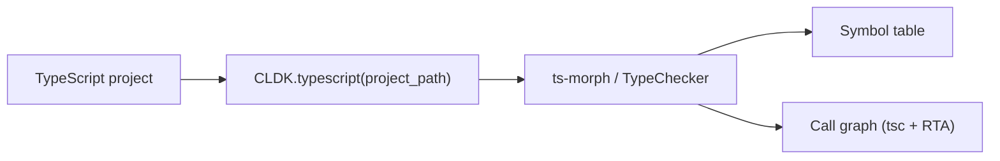

TypeScript analysis is **beta**. `TypeScriptAnalysis` exposes a typed symbol
table, classes, interfaces, enums, decorators, and a call graph through nearly
the same API as [Java](/reference/python-api/java/) and
[Python](/reference/python-api/python/). Its symbol table and call graph are
solid; framework entrypoint detection is the main gap (see the note below).

## Overview

`CLDK.typescript(project_path=...)` returns a `TypeScriptAnalysis` object backed
by the [`codeanalyzer-ts`](/backends/codeanalyzer-ts/) backend, which parses and
resolves a project in a single pass with **ts-morph** (the TypeScript compiler
API). The same `TypeChecker` that builds the symbol table resolves call targets,
so call-graph derivation reuses existing resolution.



**Project path only.** TypeScript analysis needs a project directory of valid
TypeScript/TSX sources (there is no single-string `source_code` mode). Pass it as
`project_path`:

```python
from cldk import CLDK
from cldk.analysis import AnalysisLevel

analysis = CLDK.typescript(
    project_path="/path/to/ts/project",
    analysis_level=AnalysisLevel.call_graph,   # required for the call graph
)

print(analysis.get_classes())      # -> dict[str, TSClass]
graph = analysis.get_call_graph()  # -> networkx.DiGraph
```

> **Not yet implemented**
>
> `get_entry_point_methods()` and `get_service_entry_point_methods()` raise
> `NotImplementedError`: framework entrypoint detection is not implemented in the
> `codeanalyzer-ts` backend yet. To analyze TypeScript at scale through a shared
> Neo4j graph, see [Analysis at scale](/at-scale/).

<!-- CLDK:API:START -->

<!-- AUTO-GENERATED by scripts/gen_api_docs.py, do not edit by hand. -->

[](https://github.com/codellm-devkit/python-sdk)

## Analysis

TypeScript analysis facade.

Thin, read-only query layer over the canonical ``TSApplication`` produced by the
codeanalyzer-typescript backend. Mirrors the method vocabulary of ``JavaAnalysis`` /
``PythonAnalysis`` (there is no shared base class, the facades match by convention) and, like
those, delegates all indexing and query work to its backend (`TSCodeanalyzer`).

### `TypeScriptAnalysis`

```python
class TypeScriptAnalysis
```

Analysis facade for TypeScript projects.

Delegates every query to a backend. Two interchangeable backends exist, both exposing the
same method surface:

* `TSCodeanalyzer` (default), walks the in-memory pydantic ``TSApplication`` / a
  NetworkX call graph built from ``analysis.json``;
* `TSNeo4jBackend`, answers the *same* ``get_*`` queries with Cypher over the graph
  ``codeanalyzer-typescript`` emits with ``--emit neo4j``. Selected by passing
  ``neo4j_config``.

#### Attributes

| Name | Type | Description |
| ---- | ---- | ----------- |
| `project_dir` | `` |  |
| `analysis_level` | `` |  |
| `target_files` | `` |  |
| `eager_analysis` | `` |  |
| `backend_config` | `TSBackend` |  |
| `backend` | `TSAnalysisBackend` |  |
| `application` | `TSApplication` |  |

#### Methods

##### `TypeScriptAnalysis.get_application_view`

```python
get_application_view() -> TSApplication
```

##### `TypeScriptAnalysis.get_symbol_table`

```python
get_symbol_table() -> Dict[str, TSModule]
```

##### `TypeScriptAnalysis.get_modules`

```python
get_modules() -> List[TSModule]
```

##### `TypeScriptAnalysis.get_call_graph`

```python
get_call_graph() -> nx.DiGraph
```

NetworkX DiGraph of callable signatures (and phantom external symbols) connected by the
identity-only call edges.

##### `TypeScriptAnalysis.get_external_symbols`

```python
get_external_symbols() -> Dict[str, TSExternalSymbol]
```

The phantom (external) call targets, imported/required library members the call graph
points at (e.g. ``node:fs.readFileSync``, ``js-yaml.load``). Useful for source→sink
reachability.

##### `TypeScriptAnalysis.get_call_graph_json`

```python
get_call_graph_json() -> str
```

##### `TypeScriptAnalysis.get_callers`

```python
get_callers(target_class_name: str, target_method_declaration: str | None = None) -> Dict
```

Callers of a method, with the connecting call-graph edge metadata (``provenance`` /
``tags``). Pass a bare signature as the first argument for module-level functions or
external (phantom) targets.

##### `TypeScriptAnalysis.get_callees`

```python
get_callees(source_class_name: str, source_method_declaration: str | None = None) -> Dict
```

Callees of a method, with the connecting call-graph edge metadata.

##### `TypeScriptAnalysis.get_class_call_graph`

```python
get_class_call_graph(qualified_class_name: str, method_signature: str | None = None) -> List[Tuple[str, str]]
```

Call-graph edges reachable from a class (or one of its methods).

##### `TypeScriptAnalysis.get_class_hierarchy`

```python
get_class_hierarchy() -> nx.DiGraph
```

Inheritance/implementation graph: an edge child → base for every base_class.

##### `TypeScriptAnalysis.get_call_sites`

```python
get_call_sites(qualified_callable_name: str) -> List[TSCallsite]
```

The rich, syntactic call sites *inside* a callable (receiver/argument types, resolved
``callee_signature``, source position).

##### `TypeScriptAnalysis.get_calling_lines`

```python
get_calling_lines(target_signature: str) -> List[int]
```

Sorted source lines anywhere in the project where ``target_signature`` is invoked.

##### `TypeScriptAnalysis.get_call_targets`

```python
get_call_targets(source_signature: str) -> Set[str]
```

The call targets invoked from a callable, derived from its call sites.

##### `TypeScriptAnalysis.get_entry_point_methods`

```python
get_entry_point_methods() -> Dict[str, Dict[str, TSCallable]]
```

Return methods identified as application entry points.

Not yet supported: the codeanalyzer-typescript backend's entrypoint detection is a stub
placeholder, the ``entrypoints`` list on each ``TSCallable``/``TSClass`` is always empty
(level-2 finders are not implemented), so this method exists for API parity with
`PythonAnalysis` / `JavaAnalysis` but raises.

**Raises:**

- `NotImplementedError`: Always.

##### `TypeScriptAnalysis.get_service_entry_point_methods`

```python
get_service_entry_point_methods(**kwargs) -> Dict[str, Dict[str, TSCallable]]
```

Return methods that serve as service entry points (e.g. Express/NestJS routes).

Not yet supported; see `get_entry_point_methods`.

**Raises:**

- `NotImplementedError`: Always.

##### `TypeScriptAnalysis.get_classes`

```python
get_classes() -> Dict[str, TSClass]
```

##### `TypeScriptAnalysis.get_class`

```python
get_class(qualified_class_name: str) -> TSClass | None
```

##### `TypeScriptAnalysis.get_classes_by_criteria`

```python
get_classes_by_criteria(inclusions: List[str] | None = None, exclusions: List[str] | None = None) -> Dict[str, TSClass]
```

##### `TypeScriptAnalysis.get_interfaces`

```python
get_interfaces() -> Dict[str, TSInterface]
```

##### `TypeScriptAnalysis.get_enums`

```python
get_enums() -> Dict[str, TSEnum]
```

##### `TypeScriptAnalysis.get_enum_members`

```python
get_enum_members(qualified_enum_name: str) -> List[TSEnumMember]
```

##### `TypeScriptAnalysis.get_type_aliases`

```python
get_type_aliases() -> Dict[str, TSTypeAlias]
```

##### `TypeScriptAnalysis.get_functions`

```python
get_functions() -> Dict[str, TSCallable]
```

Top-level (module/namespace) functions.

##### `TypeScriptAnalysis.get_methods`

```python
get_methods() -> Dict[str, Dict[str, TSCallable]]
```

All methods grouped by class/interface signature.

##### `TypeScriptAnalysis.get_methods_in_class`

```python
get_methods_in_class(qualified_class_name: str) -> Dict[str, TSCallable]
```

##### `TypeScriptAnalysis.get_method`

```python
get_method(qualified_class_name: str, qualified_method_name: str) -> TSCallable | None
```

##### `TypeScriptAnalysis.get_method_parameters`

```python
get_method_parameters(qualified_class_name: str, qualified_method_name: str) -> List[str]
```

##### `TypeScriptAnalysis.get_constructors`

```python
get_constructors(qualified_class_name: str) -> Dict[str, TSCallable]
```

##### `TypeScriptAnalysis.get_fields`

```python
get_fields(qualified_class_name: str) -> List[TSClassAttribute]
```

##### `TypeScriptAnalysis.get_interface_properties`

```python
get_interface_properties(qualified_interface_name: str) -> List[TSClassAttribute]
```

##### `TypeScriptAnalysis.get_imports`

```python
get_imports() -> Dict[str, List[TSImport]]
```

##### `TypeScriptAnalysis.get_exports`

```python
get_exports() -> Dict[str, List[TSExport]]
```

##### `TypeScriptAnalysis.get_variables`

```python
get_variables() -> Dict[str, List[TSVariableDeclaration]]
```

Module-level variable declarations per file.

##### `TypeScriptAnalysis.get_typescript_file`

```python
get_typescript_file(qualified_name: str) -> str | None
```

File path declaring the class/interface/enum/callable with the given signature.

##### `TypeScriptAnalysis.get_typescript_module`

```python
get_typescript_module(file_path: str) -> TSModule | None
```

##### `TypeScriptAnalysis.get_nested_classes`

```python
get_nested_classes(qualified_class_name: str) -> List[TSClass]
```

##### `TypeScriptAnalysis.get_sub_classes`

```python
get_sub_classes(qualified_class_name: str) -> Dict[str, TSClass]
```

##### `TypeScriptAnalysis.get_extended_classes`

```python
get_extended_classes(qualified_class_name: str) -> List[str]
```

The base types a class extends (base_classes minus the implemented interfaces).

##### `TypeScriptAnalysis.get_implemented_interfaces`

```python
get_implemented_interfaces(qualified_class_name: str) -> List[str]
```

##### `TypeScriptAnalysis.get_decorators`

```python
get_decorators(qualified_callable_name: str) -> List[TSDecorator]
```

Structured decorators (with arguments) applied to a callable.

##### `TypeScriptAnalysis.get_class_decorators`

```python
get_class_decorators(qualified_class_name: str) -> List[TSDecorator]
```

Structured decorators (with arguments) applied to a class.

##### `TypeScriptAnalysis.get_methods_with_decorators`

```python
get_methods_with_decorators(decorators: List[str]) -> Dict[str, List[str]]
```

Map each requested decorator name to the signatures of callables carrying it. TS
decorators are captured structurally, so this is populatable at level 1.

##### `TypeScriptAnalysis.get_classes_with_decorators`

```python
get_classes_with_decorators(decorators: List[str]) -> Dict[str, List[str]]
```

Map each requested decorator name to the signatures of classes carrying it.

## Schema

TypeScript model package, identity-only schema mirror of codeanalyzer-ts/src/schema.ts.

### `TSApplication`

```python
class TSApplication(_Base)
```

The root analysis object emitted as analysis.json.

#### Attributes

| Name | Type | Description |
| ---- | ---- | ----------- |
| `symbol_table` | `Dict[str, TSModule]` |  |
| `call_graph` | `List[TSCallEdge]` |  |
| `external_symbols` | `Dict[str, TSExternalSymbol]` |  |

### `TSCallEdge`

```python
class TSCallEdge(_Base)
```

Identity-only call-graph edge. ``source``/``target`` are ``TSCallable.signature`` strings.

#### Attributes

| Name | Type | Description |
| ---- | ---- | ----------- |
| `source` | `str` |  |
| `target` | `str` |  |
| `type` | `Literal['CALL_DEP']` |  |
| `weight` | `int` |  |
| `provenance` | `List[str]` |  |
| `tags` | `Dict[str, str]` |  |

### `TSCallable`

```python
class TSCallable(_Base)
```

A function / method / constructor / accessor / arrow function.

#### Attributes

| Name | Type | Description |
| ---- | ---- | ----------- |
| `name` | `str` |  |
| `path` | `str` |  |
| `signature` | `str` |  |
| `comments` | `List[TSComment]` |  |
| `decorators` | `List[TSDecorator]` |  |
| `parameters` | `List[TSCallableParameter]` |  |
| `type_parameters` | `List[TSTypeParameter]` |  |
| `return_type` | `Optional[str]` |  |
| `code` | `Optional[str]` |  |
| `start_line` | `int` |  |
| `end_line` | `int` |  |
| `code_start_line` | `int` |  |
| `accessed_symbols` | `List[TSSymbol]` |  |
| `call_sites` | `List[TSCallsite]` |  |
| `inner_callables` | `Dict[str, 'TSCallable']` |  |
| `inner_classes` | `Dict[str, 'TSClass']` |  |
| `local_variables` | `List[TSVariableDeclaration]` |  |
| `cyclomatic_complexity` | `int` |  |
| `entrypoints` | `List['TSEntrypoint']` |  |
| `kind` | `str` |  |
| `accessibility` | `Optional[str]` |  |
| `is_static` | `bool` |  |
| `is_abstract` | `bool` |  |
| `is_async` | `bool` |  |
| `is_generator` | `bool` |  |
| `is_optional` | `bool` |  |
| `is_readonly` | `bool` |  |
| `is_exported` | `bool` |  |
| `is_ambient` | `bool` |  |
| `is_implicit` | `bool` |  |
| `accessor_kind` | `Optional[str]` |  |
| `overload_signatures` | `List[TSOverloadSignature]` |  |

### `TSCallableParameter`

```python
class TSCallableParameter(_Base)
```

A function / method parameter.

#### Attributes

| Name | Type | Description |
| ---- | ---- | ----------- |
| `name` | `str` |  |
| `type` | `Optional[str]` |  |
| `default_value` | `Optional[str]` |  |
| `is_optional` | `bool` |  |
| `is_rest` | `bool` |  |
| `is_readonly` | `bool` |  |
| `accessibility` | `Optional[str]` |  |
| `decorators` | `List[TSDecorator]` |  |
| `start_line` | `int` |  |
| `end_line` | `int` |  |
| `start_column` | `int` |  |
| `end_column` | `int` |  |

### `TSCallsite`

```python
class TSCallsite(_Base)
```

Rich per-call metadata, attached to the caller. ``callee_signature`` is backfilled by the
resolver call graph.

#### Attributes

| Name | Type | Description |
| ---- | ---- | ----------- |
| `method_name` | `str` |  |
| `receiver_expr` | `Optional[str]` |  |
| `receiver_type` | `Optional[str]` |  |
| `argument_types` | `List[str]` |  |
| `type_arguments` | `List[str]` |  |
| `return_type` | `Optional[str]` |  |
| `callee_signature` | `Optional[str]` |  |
| `is_constructor_call` | `bool` |  |
| `is_optional_chain` | `bool` |  |
| `start_line` | `int` |  |
| `start_column` | `int` |  |
| `end_line` | `int` |  |
| `end_column` | `int` |  |

### `TSClass`

```python
class TSClass(_Base)
```

A class declaration.

#### Attributes

| Name | Type | Description |
| ---- | ---- | ----------- |
| `name` | `str` |  |
| `signature` | `str` |  |
| `comments` | `List[TSComment]` |  |
| `code` | `Optional[str]` |  |
| `decorators` | `List[TSDecorator]` |  |
| `base_classes` | `List[str]` |  |
| `implements_types` | `List[str]` |  |
| `type_parameters` | `List[TSTypeParameter]` |  |
| `methods` | `Dict[str, TSCallable]` |  |
| `attributes` | `Dict[str, TSClassAttribute]` |  |
| `inner_classes` | `Dict[str, 'TSClass']` |  |
| `entrypoints` | `List['TSEntrypoint']` |  |
| `is_abstract` | `bool` |  |
| `is_exported` | `bool` |  |
| `is_ambient` | `bool` |  |
| `start_line` | `int` |  |
| `end_line` | `int` |  |

### `TSClassAttribute`

```python
class TSClassAttribute(_Base)
```

A class property / field (also covers constructor parameter-properties).

#### Attributes

| Name | Type | Description |
| ---- | ---- | ----------- |
| `name` | `str` |  |
| `type` | `Optional[str]` |  |
| `comments` | `List[TSComment]` |  |
| `decorators` | `List[TSDecorator]` |  |
| `initializer` | `Optional[str]` |  |
| `accessibility` | `Optional[str]` |  |
| `is_static` | `bool` |  |
| `is_readonly` | `bool` |  |
| `is_optional` | `bool` |  |
| `is_abstract` | `bool` |  |
| `start_line` | `int` |  |
| `end_line` | `int` |  |

### `TSComment`

```python
class TSComment(_Base)
```

A comment or JSDoc block.

#### Attributes

| Name | Type | Description |
| ---- | ---- | ----------- |
| `content` | `str` |  |
| `is_docstring` | `bool` |  |
| `start_line` | `int` |  |
| `end_line` | `int` |  |
| `start_column` | `int` |  |
| `end_column` | `int` |  |

### `TSDecorator`

```python
class TSDecorator(_Base)
```

A decorator applied to a class / member / parameter (structured, with arguments).

#### Attributes

| Name | Type | Description |
| ---- | ---- | ----------- |
| `name` | `str` |  |
| `qualified_name` | `Optional[str]` |  |
| `positional_arguments` | `List[str]` |  |
| `keyword_arguments` | `Dict[str, str]` |  |
| `start_line` | `int` |  |
| `end_line` | `int` |  |
| `start_column` | `int` |  |
| `end_column` | `int` |  |

### `TSEntrypoint`

```python
class TSEntrypoint(_Base)
```

A framework entrypoint (populated by level-2 finders; empty for level 1). Embedded on the
owning ``TSCallable``/``TSClass``, so it carries no signature/source_file of its own.

#### Attributes

| Name | Type | Description |
| ---- | ---- | ----------- |
| `framework` | `str` |  |
| `detection_source` | `str` |  |
| `route_path` | `Optional[str]` |  |
| `http_methods` | `List[str]` |  |
| `tags` | `Dict[str, str]` |  |

### `TSEnum`

```python
class TSEnum(_Base)
```

An enum declaration (TS node kind).

#### Attributes

| Name | Type | Description |
| ---- | ---- | ----------- |
| `name` | `str` |  |
| `signature` | `str` |  |
| `comments` | `List[TSComment]` |  |
| `code` | `Optional[str]` |  |
| `members` | `List[TSEnumMember]` |  |
| `is_const` | `bool` |  |
| `is_exported` | `bool` |  |
| `is_ambient` | `bool` |  |
| `start_line` | `int` |  |
| `end_line` | `int` |  |

### `TSEnumMember`

```python
class TSEnumMember(_Base)
```

A member of an enum.

#### Attributes

| Name | Type | Description |
| ---- | ---- | ----------- |
| `name` | `str` |  |
| `value` | `Optional[str]` |  |
| `start_line` | `int` |  |
| `end_line` | `int` |  |

### `TSExport`

```python
class TSExport(_Base)
```

A TypeScript export / re-export binding.

#### Attributes

| Name | Type | Description |
| ---- | ---- | ----------- |
| `module` | `Optional[str]` |  |
| `name` | `str` |  |
| `alias` | `Optional[str]` |  |
| `is_type_only` | `bool` |  |
| `export_kind` | `str` |  |
| `start_line` | `int` |  |
| `end_line` | `int` |  |
| `start_column` | `int` |  |
| `end_column` | `int` |  |

### `TSExternalSymbol`

```python
class TSExternalSymbol(_Base)
```

A WALA-style phantom node: a synthetic stub for a call target OUTSIDE the project (an
imported/required library member). An edge's ``target`` byte-matches either a real
``TSCallable.signature`` or a ``TSExternalSymbol.signature``, so the call graph stays
dangling-free while still recording external (e.g. sink) calls.

Slim: the map key in ``TSApplication.external_symbols`` IS the signature (e.g.
``commander.parse``), and membership already means external, so neither is repeated here.

#### Attributes

| Name | Type | Description |
| ---- | ---- | ----------- |
| `name` | `str` |  |
| `module` | `str` |  |

### `TSImport`

```python
class TSImport(_Base)
```

A TypeScript import binding (one entry per imported name).

#### Attributes

| Name | Type | Description |
| ---- | ---- | ----------- |
| `module` | `str` |  |
| `name` | `str` |  |
| `alias` | `Optional[str]` |  |
| `is_type_only` | `bool` |  |
| `import_kind` | `str` |  |
| `start_line` | `int` |  |
| `end_line` | `int` |  |
| `start_column` | `int` |  |
| `end_column` | `int` |  |

### `TSInterface`

```python
class TSInterface(_Base)
```

An interface declaration (TS node kind).

#### Attributes

| Name | Type | Description |
| ---- | ---- | ----------- |
| `name` | `str` |  |
| `signature` | `str` |  |
| `comments` | `List[TSComment]` |  |
| `code` | `Optional[str]` |  |
| `base_classes` | `List[str]` |  |
| `type_parameters` | `List[TSTypeParameter]` |  |
| `methods` | `Dict[str, TSCallable]` |  |
| `properties` | `Dict[str, TSClassAttribute]` |  |
| `call_signatures` | `List[str]` |  |
| `index_signatures` | `List[str]` |  |
| `is_exported` | `bool` |  |
| `is_ambient` | `bool` |  |
| `start_line` | `int` |  |
| `end_line` | `int` |  |

### `TSModule`

```python
class TSModule(_Base)
```

A compilation unit (a .ts/.tsx file).

#### Attributes

| Name | Type | Description |
| ---- | ---- | ----------- |
| `file_path` | `str` |  |
| `module_name` | `str` |  |
| `imports` | `List[TSImport]` |  |
| `exports` | `List[TSExport]` |  |
| `comments` | `List[TSComment]` |  |
| `classes` | `Dict[str, TSClass]` |  |
| `interfaces` | `Dict[str, TSInterface]` |  |
| `enums` | `Dict[str, TSEnum]` |  |
| `type_aliases` | `Dict[str, TSTypeAlias]` |  |
| `functions` | `Dict[str, TSCallable]` |  |
| `namespaces` | `Dict[str, TSNamespace]` |  |
| `variables` | `List[TSVariableDeclaration]` |  |
| `is_tsx` | `bool` |  |
| `is_declaration_file` | `bool` |  |
| `content_hash` | `Optional[str]` |  |
| `last_modified` | `Optional[float]` |  |
| `file_size` | `Optional[int]` |  |

### `TSNamespace`

```python
class TSNamespace(_Base)
```

A namespace / module block (TS node kind), recursive container.

#### Attributes

| Name | Type | Description |
| ---- | ---- | ----------- |
| `name` | `str` |  |
| `signature` | `str` |  |
| `comments` | `List[TSComment]` |  |
| `classes` | `Dict[str, TSClass]` |  |
| `interfaces` | `Dict[str, TSInterface]` |  |
| `enums` | `Dict[str, TSEnum]` |  |
| `type_aliases` | `Dict[str, TSTypeAlias]` |  |
| `functions` | `Dict[str, TSCallable]` |  |
| `variables` | `List[TSVariableDeclaration]` |  |
| `namespaces` | `Dict[str, 'TSNamespace']` |  |
| `is_exported` | `bool` |  |
| `is_ambient` | `bool` |  |
| `start_line` | `int` |  |
| `end_line` | `int` |  |

### `TSOverloadSignature`

```python
class TSOverloadSignature(_Base)
```

An overload signature attached to the implementation callable.

#### Attributes

| Name | Type | Description |
| ---- | ---- | ----------- |
| `parameters` | `List[TSCallableParameter]` |  |
| `return_type` | `Optional[str]` |  |
| `type_parameters` | `List[TSTypeParameter]` |  |
| `start_line` | `int` |  |
| `end_line` | `int` |  |

### `TSSymbol`

```python
class TSSymbol(_Base)
```

A symbol referenced or declared in code.

#### Attributes

| Name | Type | Description |
| ---- | ---- | ----------- |
| `name` | `str` |  |
| `scope` | `str` |  |
| `kind` | `str` |  |
| `type` | `Optional[str]` |  |
| `qualified_name` | `Optional[str]` |  |
| `is_builtin` | `bool` |  |
| `lineno` | `int` |  |
| `col_offset` | `int` |  |

### `TSTypeAlias`

```python
class TSTypeAlias(_Base)
```

A type-alias declaration (TS node kind).

#### Attributes

| Name | Type | Description |
| ---- | ---- | ----------- |
| `name` | `str` |  |
| `signature` | `str` |  |
| `comments` | `List[TSComment]` |  |
| `code` | `Optional[str]` |  |
| `aliased_type` | `str` |  |
| `type_parameters` | `List[TSTypeParameter]` |  |
| `is_exported` | `bool` |  |
| `is_ambient` | `bool` |  |
| `start_line` | `int` |  |
| `end_line` | `int` |  |

### `TSTypeParameter`

```python
class TSTypeParameter(_Base)
```

A generic type parameter, e.g. ``T extends Base = Default``.

#### Attributes

| Name | Type | Description |
| ---- | ---- | ----------- |
| `name` | `str` |  |
| `constraint` | `Optional[str]` |  |
| `default` | `Optional[str]` |  |

### `TSVariableDeclaration`

```python
class TSVariableDeclaration(_Base)
```

A variable / const / let declaration.

#### Attributes

| Name | Type | Description |
| ---- | ---- | ----------- |
| `name` | `str` |  |
| `type` | `Optional[str]` |  |
| `initializer` | `Optional[str]` |  |
| `value` | `Optional[Any]` |  |
| `scope` | `str` |  |
| `declaration_kind` | `str` |  |
| `is_readonly` | `bool` |  |
| `is_exported` | `bool` |  |
| `start_line` | `int` |  |
| `end_line` | `int` |  |
| `start_column` | `int` |  |
| `end_column` | `int` |  |

<!-- CLDK:API:END -->
