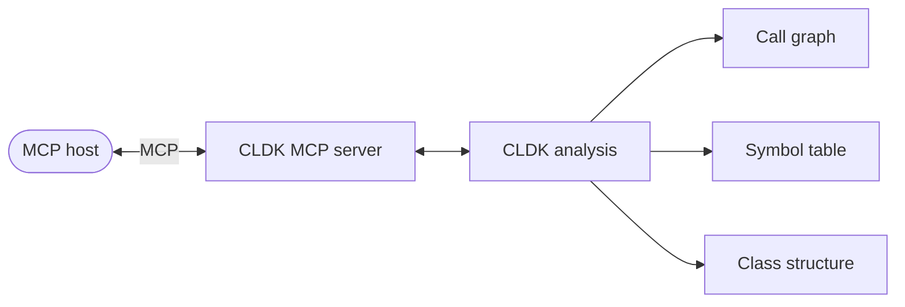

import { Tabs, TabItem, Steps, Aside, LinkCard, CardGrid } from "@astrojs/starlight/components";

The [cocoa](/cocoa/) plugin drives CLDK in-process: a coding agent shells out to it via Bash heredocs. That works when the analysis lives inside your agent, but it doesn't have to. Wrap the same CLDK calls as fixed **tools** and publish them over the [Model Context Protocol](https://modelcontextprotocol.io), and **any** MCP host (Claude Desktop, an MCP-aware IDE, or a different agent framework entirely) can consume `get_callers`, `get_callees`, and reachability over a standard wire protocol (no code execution required on the host side).

The mental model is unchanged: one `analysis` facade over your code, exposed across the wire. Callers become a tool call and reachability a `networkx` graph query, each backed by real static analysis.



<Aside type="caution" title="This is a reference pattern, not a shipped server">
CLDK does not currently publish an official MCP server. Everything below is a **stub you wire up yourself**: the same CLDK analysis cocoa uses, exposed as fixed tools over [FastMCP](https://github.com/modelcontextprotocol/python-sdk). Treat it as a starting point: it builds one analysis object at startup and exposes a handful of read-only tools over it.
</Aside>

## What you'll need

`pip install cldk mcp networkx` and a project to analyze. We use [Apache Commons CLI](https://commons.apache.org/proper/commons-cli/) (`project_path="commons-cli"`), the recurring sample across these docs. The server is Java-first because Java has the richest call-graph support; the same shape works for Python.

## The server, end to end

<Steps>

1. **Build one analysis object at startup.** Callers, callees, and reachability all require the project analyzed at `call_graph` level (the default `symbol_table` level won't populate call edges). Build it once, outside any tool, so every request reuses it.

2. **Decorate plain functions with `@mcp.tool()`.** FastMCP reads each function's type hints and docstring to generate the tool's input schema and description automatically, so you never hand-write a JSON schema.

3. **Run the server over stdio** so an MCP host can launch and talk to it.

</Steps>

### 1. Build the analysis facade

```python title="cldk_mcp_server.py" showLineNumbers
import os
import networkx as nx
from mcp.server.fastmcp import FastMCP
from cldk import CLDK
from cldk.analysis import AnalysisLevel

mcp = FastMCP("cldk")

APP = os.environ.get("JAVA_APP_PATH", "commons-cli")

# Java facade at call-graph depth so callers/callees/reachability work.
# Built once at import time and reused across every tool call.
analysis = CLDK(language="java").analysis(
    project_path=APP,
    analysis_level=AnalysisLevel.call_graph,
)

# The call graph is a networkx.DiGraph (edges point caller -> callee).
CALL_GRAPH = analysis.get_call_graph()
```

<Aside type="caution" title="Call-graph analysis level">
`get_call_graph`, `get_callers`, and `get_callees` need the project analyzed at the `call_graph` level. Build the facade with `analysis_level=AnalysisLevel.call_graph`: the default is `symbol_table`, which won't populate call edges.
</Aside>

### 2. Define the tools

Each tool is a normal function. FastMCP turns its signature and docstring into the MCP tool schema, so the host knows exactly which arguments to fill in.

```python title="cldk_mcp_server.py" showLineNumbers startLineNumber=21
@mcp.tool()
def get_method_body(qualified_class_name: str, qualified_method_name: str) -> str:
    """Return the source code of a method, given its fully qualified class
    name and method signature (e.g. 'create(String)')."""
    method = analysis.get_method(qualified_class_name, qualified_method_name)
    return method.code if method else "method not found"


@mcp.tool()
def get_callers(target_class_name: str, target_method_declaration: str) -> dict:
    """Return every method that calls the target method
    (impact analysis / 'who calls this?')."""
    return analysis.get_callers(target_class_name, target_method_declaration)


@mcp.tool()
def get_callees(source_class_name: str, source_method_declaration: str) -> dict:
    """Return every method invoked by the source method
    (what this method depends on)."""
    return analysis.get_callees(source_class_name, source_method_declaration)
```

### 3. The reachability tool

Reachability is a deterministic graph query over the call graph CLDK hands you. **That is the whole point:** the host doesn't reason about whether a sink is reachable, it *looks it up* with `networkx.has_path`.

```python title="cldk_mcp_server.py" showLineNumbers startLineNumber=42
def _find_node(class_name: str, method_decl: str):
    """Locate a method's node in the call graph by matching its metadata."""
    for node, data in CALL_GRAPH.nodes(data=True):
        if class_name in str(data) and method_decl in str(data):
            return node
    return None


@mcp.tool()
def is_reachable(
    source_class_name: str,
    source_method_declaration: str,
    sink_class_name: str,
    sink_method_declaration: str,
) -> dict:
    """Return whether the sink method is reachable from the source method
    along call-graph edges. Use to confirm or refute whether vulnerable code
    can actually be invoked."""
    src = _find_node(source_class_name, source_method_declaration)
    sink = _find_node(sink_class_name, sink_method_declaration)
    if src is None or sink is None:
        return {"reachable": False, "reason": "endpoint not found in call graph"}
    return {"reachable": nx.has_path(CALL_GRAPH, src, sink)}


if __name__ == "__main__":
    # Speak MCP over stdio so a host can launch this server.
    mcp.run(transport="stdio")
```

<Aside type="tip" title="Return JSON-friendly results">
MCP serializes every tool result to JSON, so make sure what you return is JSON-friendly: `get_callers`/`get_callees` return plain dictionaries, and `is_reachable` returns a small dict here. Wrap richer objects (or a `networkx` graph) in a serializable summary before returning them.
</Aside>

## Register it with a host

An MCP host launches the server as a subprocess and discovers its tools. For a Claude Desktop-style config, point the host at the script and pass the project path through the environment:

```json title="mcp config (illustrative)"
{
  "mcpServers": {
    "cldk": {
      "command": "python",
      "args": ["cldk_mcp_server.py"],
      "env": { "JAVA_APP_PATH": "commons-cli" }
    }
  }
}
```

Once connected, the host sees four tools (`get_method_body`, `get_callers`, `get_callees`, `is_reachable`) and a model on that host can chain them exactly like cocoa does. A reachability question, for instance, resolves to a single tool call:

```text frame="terminal"
is_reachable(
  source_class_name="org.apache.commons.cli.CLI",
  source_method_declaration="main(String[])",
  sink_class_name="org.apache.commons.cli.CommandLine",
  sink_method_declaration="execute(String)")
# -> {"reachable": false, "reason": "no path in call graph"}
```

Ground truth in, no hallucinated taint path out: the same value proposition as the in-process loop, now available to any MCP host.

## Language coverage

The server above is Java. Swapping languages is a one-line change to the facade: the tools stay identical.

<Tabs syncKey="lang">
  <TabItem label="Java">
```python
analysis = CLDK(language="java").analysis(
    project_path="commons-cli",
    analysis_level=AnalysisLevel.call_graph,
)
```
  </TabItem>
  <TabItem label="Python">
```python
analysis = CLDK(language="python").analysis(
    project_path="my_pkg",
    analysis_level=AnalysisLevel.call_graph,
)
```
  </TabItem>
</Tabs>

## Where to go next

<CardGrid>
  <LinkCard title="cocoa" description="The in-process version: a Claude Code plugin that runs CLDK via Bash." href="/cocoa/" />
  <LinkCard title="Core concepts" description="What call graphs, reachability, and analysis levels actually mean." href="/guides/concepts/" />
  <LinkCard title="Common tasks" description="Copy-paste snippets for the individual analysis calls these tools wrap." href="/guides/common-tasks/" />
  <LinkCard title="Java API reference" description="Every method on the Java analysis facade you can expose as a tool." href="/reference/python-api/java/" />
</CardGrid>
