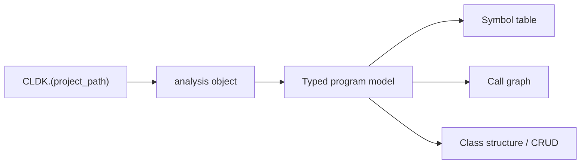

import { Tabs, TabItem, Steps, Aside, LinkCard, CardGrid } from "@astrojs/starlight/components";

CLDK (CodeLLM-DevKit) is a Python library that loads a codebase. It gives you typed models of the classes, methods, fields, and call graph.

You send every query through one `analysis` object. The object answers questions about structure: which methods call a given method, or which methods that method calls. You do not parse files yourself. You do not join external tools together.

## The programming model

Every CLDK program follows the same three steps: select a language, analyze a project, and query the resulting typed models.

<Steps>

1. **Select the factory for your language**, for example `CLDK.java`. This factory selects the backend.

2. **Call the factory with a project path** to build the `analysis` object: `CLDK.java(project_path="commons-cli")`. The backend runs at this step and builds the program model.

3. **Query the typed models** with `get_classes()`, `get_method(...)`, `get_call_graph()`, and related methods. You can read these objects, walk them, serialize them, or send them to other tools.

</Steps>

<Tabs syncKey="lang">
  <TabItem label="Java">
```python
from cldk import CLDK
from cldk.analysis import AnalysisLevel

# 1. select the language  2. analyze the project  3. query
analysis = CLDK.java(
    project_path="commons-cli",
    analysis_level=AnalysisLevel.call_graph,
)

print(len(analysis.get_classes()), "classes")
print(analysis.get_call_graph())          # -> networkx.DiGraph
# 23 classes
# DiGraph with caller -> callee edges
```
  </TabItem>
  <TabItem label="Python">
```python
from cldk import CLDK
from cldk.analysis import AnalysisLevel

# Python requires a project_path (no single-file mode)
analysis = CLDK.python(
    project_path="my_pkg",
    analysis_level=AnalysisLevel.call_graph,
)

print(len(analysis.get_classes()), "classes")
print(analysis.get_call_graph())          # -> networkx.DiGraph
```
  </TabItem>
</Tabs>

<Aside type="note" title="Analysis levels">
  `analysis_level` defaults to `AnalysisLevel.symbol_table`, which resolves classes, methods, and fields. Call graphs, callers, and callees need `AnalysisLevel.call_graph`. If you want call relationships, you must set this level.

  CLDK 2.0 adds two deeper levels, `program_dependency_graph` and `system_dependency_graph`, which build dataflow. See [Dataflow graphs](/guides/dataflow/).
</Aside>

A language-specific backend sits behind the same API:



The language selects the backend. Java uses [codeanalyzer-java](/backends/codeanalyzer-java/) over WALA. Python uses [codeanalyzer-python](/backends/codeanalyzer-python/) over Jedi. TypeScript uses [codeanalyzer-ts](/backends/codeanalyzer-ts/) over the TypeScript compiler. Your query code stays the same for each language. Only the backend changes.

## Language coverage

You query every language through the same `analysis` API. A different backend answers for each one. CLDK supports Java and Python. Java goes deepest, because it adds class-hierarchy analysis and CRUD extraction.

TypeScript is in beta. Its symbol table and call graph work through `CLDK.typescript(...)`. The backend does not detect all framework entrypoints yet. Go and Rust backends are not started. Contributors are welcome.

| Language   | Status         | Symbol table | Call graph / callers / callees |
| ---------- | -------------- | ------------ | ------------------------------ |
| Java       | Supported      | Yes          | Yes                            |
| Python     | Supported      | Yes          | Yes                            |
| TypeScript | Beta           | Yes          | Yes                            |
| Go         | Not started    | Planned      | Planned                        |
| Rust       | Not started    | Planned      | Planned                        |

Infrastructure-as-code (Helm) has a beta backend, [codeanalyzer-iac](/backends/codeanalyzer-iac/), with no `CLDK.iac(...)` factory yet. See [The codeanalyzer backends](/backends/) for every backend and its maturity.

## Next steps

<CardGrid>
  <LinkCard title="Quickstart" description="Install CLDK and run your first analysis in three steps." href="/quickstart/" />
  <LinkCard title="Installation" description="The JDK, Maven, and backend packages that each language needs." href="/installing/" />
  <LinkCard title="Core concepts" description="Symbol tables, call graphs, and analysis levels." href="/guides/concepts/" />
  <LinkCard title="Common tasks" description="Task-oriented snippets: get methods, build a call graph, find callers." href="/guides/common-tasks/" />
  <LinkCard title="API reference" description="Per-language analysis APIs and the typed data models." href="/reference/python-api/" />
</CardGrid>
