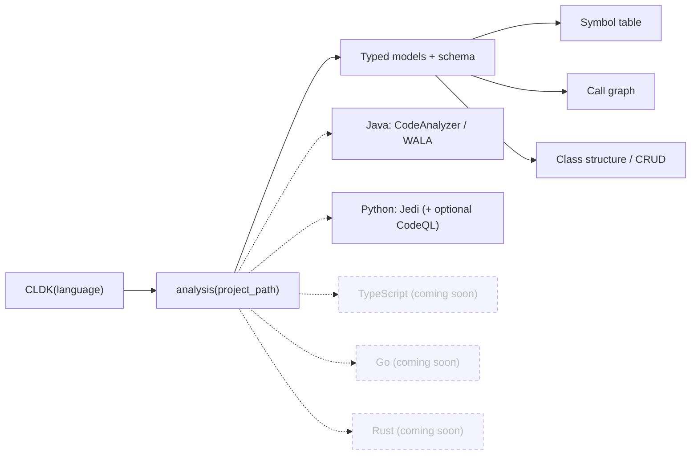

import { Tabs, TabItem, Steps, Aside, LinkCard, CardGrid } from "@astrojs/starlight/components";

CLDK (CodeLLM-DevKit) is a Python library that loads a codebase and hands you back a typed object model of it (classes, methods, fields, and call graphs) through **one consistent `analysis` object**. The interface is the same whether the code is Python or Java: the same methods, the same typed results. You stop parsing files by hand and start asking questions like "what calls this method?" or "is this sink reachable from that entry point?" and getting real answers.

## The mental model

Every CLDK program follows the same three-step shape: pick a language, build an analysis facade, then query typed models.

<Steps>

1. **Construct a `CLDK` object** for your language: `CLDK(language="java")`. This selects the analysis backend but does no work yet.

2. **Build the analysis facade** by pointing it at a project: `.analysis(project_path="commons-cli")`. This is where the backend engine runs and produces the program model.

3. **Query typed models** off that facade: `get_classes()`, `get_method(...)`, `get_call_graph()`. Everything you get back is a typed object you can read, walk, and feed to an LLM.

</Steps>

<Tabs syncKey="lang">
  <TabItem label="Java">
```python
from cldk import CLDK
from cldk.analysis import AnalysisLevel

# 1. pick the language  2. build the facade  3. query
analysis = CLDK(language="java").analysis(
    project_path="commons-cli",
    analysis_level=AnalysisLevel.call_graph,
)

print(len(analysis.get_classes()), "classes")
print(analysis.get_call_graph())          # -> networkx.DiGraph
# 23 classes
# DiGraph with caller -> callee edges
```
  </TabItem>
  <TabItem label="Python">
```python
from cldk import CLDK
from cldk.analysis import AnalysisLevel

# Python requires a project_path (no single-file mode)
analysis = CLDK(language="python").analysis(
    project_path="my_pkg",
    analysis_level=AnalysisLevel.call_graph,
)

print(len(analysis.get_classes()), "classes")
print(analysis.get_call_graph())          # -> networkx.DiGraph
```
  </TabItem>
</Tabs>

<Aside type="note" title="Analysis levels">
  `analysis_level` defaults to `AnalysisLevel.symbol_table`, which gives you classes, methods, and fields. Call graphs, callers, and callees require `AnalysisLevel.call_graph`: pass it explicitly when you need who-calls-whom.
</Aside>

The flow is the same regardless of language; only the engine behind the facade changes:



Each language plugs in its own analysis engine (Java uses CodeAnalyzer over WALA, Python uses Jedi with optional CodeQL), but you query them through the **same facade**, so your code barely changes when you switch languages.

## Why it matters for agents

An agent asked "what calls this method?" without CLDK has to *crawl*: reading and grepping file after file, spending tokens to approximate an answer it still can't guarantee. CLDK turns that into a single deterministic lookup against the real program. Give the agent a way to run CLDK (like the [cocoa](/cocoa/) plugin) and it stops crawling and starts querying: reachability is a `networkx` graph query, callers are `get_callers`, and every claim is grounded in ground truth. That difference (one precise call versus a token-heavy crawl) is why agents reach for CLDK.

[Build cocoa →](/cocoa/)

## Language coverage

You query every language through the same `analysis` facade; only the engine behind it changes. Python and Java are both first-class today (Java's backend currently goes deepest, with class hierarchy and CRUD analysis). More languages (Go, TypeScript, Rust, and C) are on the way.

| Language | Status | Symbol table | Call graph / callers / callees |
| -------- | ------ | ------------ | ------------------------------ |
| Java     | Full   | Yes          | Yes                            |
| Python   | Strong | Yes          | Yes                            |

## Next steps

<CardGrid>
  <LinkCard title="Quickstart" description="Install CLDK and run your first analysis in a couple of minutes." href="/quickstart/" />
  <LinkCard title="Core concepts" description="Symbol tables, call graphs, reachability, and analysis levels in depth." href="/guides/concepts/" />
  <LinkCard title="Common tasks" description="Task-oriented snippets: get methods, build a call graph, find callers." href="/guides/common-tasks/" />
  <LinkCard title="API reference" description="Per-language analysis facades and the typed data models." href="/reference/python-api/" />
</CardGrid>
