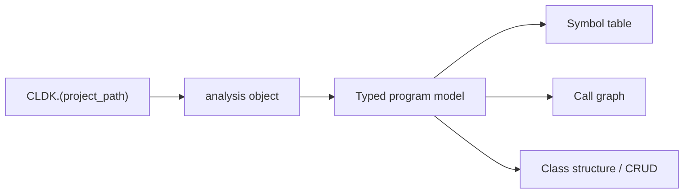

import { Tabs, TabItem, Steps, Aside, LinkCard, CardGrid } from "@astrojs/starlight/components";

CLDK (CodeLLM-DevKit) is a Python library that loads a codebase and exposes typed models of its classes, methods, fields, and call graph. All queries are issued through a single `analysis` object, which answers structural questions (such as which methods call a given method, or which methods it invokes) without manual file parsing or ad hoc composition of external tools.

## The programming model

Every CLDK program follows the same three steps: select a language, analyze a project, and query the resulting typed models.

<Steps>

1. **Call the per-language factory** for the target language, for example `CLDK.java(...)`. This selects the analysis backend.

2. **Build the `analysis` object** by pointing it at a project: `CLDK.java(project_path="commons-cli")`. The backend runs at this step and produces the program model.

3. **Query the typed models** with `get_classes()`, `get_method(...)`, `get_call_graph()`, and related methods. The returned objects can be read, traversed, serialized, or passed to other tools.

</Steps>

<Tabs syncKey="lang">
  <TabItem label="Java">
```python
from cldk import CLDK
from cldk.analysis import AnalysisLevel

# 1. select the language  2. analyze the project  3. query
analysis = CLDK.java(
    project_path="commons-cli",
    analysis_level=AnalysisLevel.call_graph,
)

print(len(analysis.get_classes()), "classes")
print(analysis.get_call_graph())          # -> networkx.DiGraph
# 23 classes
# DiGraph with caller -> callee edges
```
  </TabItem>
  <TabItem label="Python">
```python
from cldk import CLDK
from cldk.analysis import AnalysisLevel

# Python requires a project_path (no single-file mode)
analysis = CLDK.python(
    project_path="my_pkg",
    analysis_level=AnalysisLevel.call_graph,
)

print(len(analysis.get_classes()), "classes")
print(analysis.get_call_graph())          # -> networkx.DiGraph
```
  </TabItem>
</Tabs>

<Aside type="note" title="Analysis levels">
  `analysis_level` defaults to `AnalysisLevel.symbol_table`, which resolves classes, methods, and fields. Call graphs, callers, and callees require `AnalysisLevel.call_graph`; pass it explicitly when call relationships are needed.
</Aside>

A language-specific backend sits behind the same API:



The backend is selected by language: Java uses CodeAnalyzer over WALA, and Python uses its own static-analysis engine. The query code is largely identical across languages; only the backend differs.

## Language coverage

Every supported language is queried through the same `analysis` API, backed by a language-specific engine. Java and Python are both supported today, with Java offering the deepest analysis, including class-hierarchy and CRUD extraction. Additional languages (TypeScript, Go, and Rust) are under active development.

| Language   | Status         | Symbol table | Call graph / callers / callees |
| ---------- | -------------- | ------------ | ------------------------------ |
| Java       | Supported      | Yes          | Yes                            |
| Python     | Supported      | Yes          | Yes                            |
| TypeScript | In development | Planned      | Planned                        |
| Go         | In development | Planned      | Planned                        |
| Rust       | In development | Planned      | Planned                        |

## Next steps

<CardGrid>
  <LinkCard title="Quickstart" description="Install CLDK and run your first analysis in a couple of minutes." href="/quickstart/" />
  <LinkCard title="Core concepts" description="Symbol tables, call graphs, and analysis levels." href="/guides/concepts/" />
  <LinkCard title="Common tasks" description="Task-oriented snippets: get methods, build a call graph, find callers." href="/guides/common-tasks/" />
  <LinkCard title="API reference" description="Per-language analysis APIs and the typed data models." href="/reference/python-api/" />
</CardGrid>
